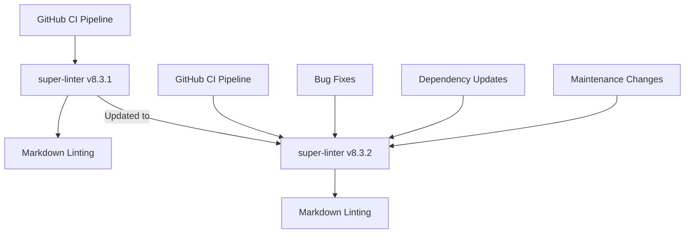

+++
title = "#22270 Bump super-linter/super-linter from 8.3.1 to 8.3.2"
date = "2026-01-05T00:00:00"
draft = false
template = "pull_request_page.html"
in_search_index = true

[taxonomies]
list_display = ["show"]

[extra]
current_language = "en"
available_languages = {"en" = { name = "English", url = "/pull_request/bevy/2026-01/pr-22270-en-20260105" }, "zh-cn" = { name = "中文", url = "/pull_request/bevy/2026-01/pr-22270-zh-cn-20260105" }}
labels = ["A-Build-System", "C-Dependencies"]
+++

# Title: Bump super-linter/super-linter from 8.3.1 to 8.3.2

## Basic Information
- **Title**: Bump super-linter/super-linter from 8.3.1 to 8.3.2
- **PR Link**: https://github.com/bevyengine/bevy/pull/22270
- **Author**: app/dependabot
- **Status**: MERGED
- **Labels**: A-Build-System, C-Dependencies, S-Ready-For-Final-Review
- **Created**: 2025-12-25T23:10:31Z
- **Merged**: 2026-01-05T02:31:38Z
- **Merged By**: alice-i-cecile

## Description Translation

Bumps [super-linter/super-linter](https://github.com/super-linter/super-linter) from 8.3.1 to 8.3.2.
<details>
<summary>Release notes</summary>
<p><em>Sourced from <a href="https://github.com/super-linter/super-linter/releases">super-linter/super-linter's releases</a>.</em></p>
<blockquote>
<h2>v8.3.2</h2>
<h2><a href="https://github.com/super-linter/super-linter/compare/v8.3.1...v8.3.2">8.3.2</a> (2025-12-24)</h2>
<h3>🐛 Bugfixes</h3>
<ul>
<li>centralize file array additions and fix type (<a href="https://redirect.github.com/super-linter/super-linter/issues/7323">#7323</a>) (<a href="https://github.com/super-linter/super-linter/commit/ce80cf6842c49618adb1eef1c4a455fb7a32f51c">ce80cf6</a>), closes <a href="https://redirect.github.com/super-linter/super-linter/issues/7302">#7302</a></li>
<li>create log groups for enabled languages only (<a href="https://redirect.github.com/super-linter/super-linter/issues/7329">#7329</a>) (<a href="https://github.com/super-linter/super-linter/commit/7c85bf3695efa7784c55c760b591a26994eb1538">7c85bf3</a>), closes <a href="https://redirect.github.com/super-linter/super-linter/issues/7307">#7307</a></li>
<li>initialize github_before_sha (<a href="https://redirect.github.com/super-linter/super-linter/issues/7120">#7120</a>) (<a href="https://github.com/super-linter/super-linter/commit/a93b722492ae64610b681733132b03316b5a3f1a">a93b722</a>), closes <a href="https://redirect.github.com/super-linter/super-linter/issues/7118">#7118</a> <a href="https://redirect.github.com/super-linter/super-linter/issues/7275">#7275</a></li>
</ul>
<h3>⬆️ Dependency updates</h3>
<ul>
<li><strong>bundler:</strong> bump rubocop in /dependencies in the rubocop group (<a href="https://redirect.github.com/super-linter/super-linter/issues/7313">#7313</a>) (<a href="https://github.com/super-linter/super-linter/commit/7fab96c232891c27aa68d1ccb78a4df73fc8d845">7fab96c</a>)</li>
<li><strong>docker:</strong> bump clj-kondo/clj-kondo in the docker group (<a href="https://redirect.github.com/super-linter/super-linter/issues/7325">#7325</a>) (<a href="https://github.com/super-linter/super-linter/commit/fa23c5433efb749f5fb300cbec569e2c0874a335">fa23c54</a>)</li>
<li><strong>docker:</strong> bump the docker group with 4 updates (<a href="https://redirect.github.com/super-linter/super-linter/issues/7318">#7318</a>) (<a href="https://github.com/super-linter/super-linter/commit/dc49a6d6bdd54b017a4b5a246f6f74cdd7a39b99">dc49a6d</a>)</li>
<li><strong>java:</strong> bump com.puppycrawl.tools:checkstyle (<a href="https://redirect.github.com/super-linter/super-linter/issues/7312">#7312</a>) (<a href="https://github.com/super-linter/super-linter/commit/ab584378be9a17bc1544a55d48a6daf69bf119bc">ab58437</a>)</li>
<li><strong>npm:</strong> bump next from 16.0.10 to 16.1.0 in /dependencies (<a href="https://redirect.github.com/super-linter/super-linter/issues/7316">#7316</a>) (<a href="https://github.com/super-linter/super-linter/commit/a8572e292ba5ca18ef118b066eb3d1570b8de902">a8572e2</a>)</li>
<li><strong>npm:</strong> bump renovate (<a href="https://redirect.github.com/super-linter/super-linter/issues/7300">#7300</a>) (<a href="https://github.com/super-linter/super-linter/commit/191338acc8928b9e523533a22c8cea7f83daefec">191338a</a>)</li>
<li><strong>npm:</strong> bump the npm group across 1 directory with 10 updates (<a href="https://redirect.github.com/super-linter/super-linter/issues/7322">#7322</a>) (<a href="https://github.com/super-linter/super-linter/commit/24d9e00de99a2a9056c1717e69163f832d18756e">24d9e00</a>)</li>
<li><strong>npm:</strong> bump the npm group across 1 directory with 2 updates (<a href="https://redirect.github.com/super-linter/super-linter/issues/7296">#7296</a>) (<a href="https://github.com/super-linter/super-linter/commit/069748517af0b1ddbfae6ed6545a636162b99aa9">0697485</a>)</li>
<li><strong>npm:</strong> bump the npm group across 1 directory with 2 updates (<a href="https://redirect.github.com/super-linter/super-linter/issues/7301">#7301</a>) (<a href="https://github.com/super-linter/super-linter/commit/4b2bf76ed4965f51047c2f8825b7f2181fd4591e">4b2bf76</a>)</li>
<li><strong>npm:</strong> bump the npm group across 1 directory with 4 updates (<a href="https://redirect.github.com/super-linter/super-linter/issues/7327">#7327</a>) (<a href="https://github.com/super-linter/super-linter/commit/07e73d60033bef44a0c4224fb7f0ce1389714002">07e73d6</a>)</li>
<li><strong>python:</strong> bump ansible-lint (<a href="https://redirect.github.com/super-linter/super-linter/issues/7326">#7326</a>) (<a href="https://github.com/super-linter/super-linter/commit/47962eae72ffee1ebc038c4b719d6394178658ee">47962ea</a>)</li>
<li><strong>python:</strong> bump snakemake (<a href="https://redirect.github.com/super-linter/super-linter/issues/7295">#7295</a>) (<a href="https://github.com/super-linter/super-linter/commit/3f925892e7f0f6020a698a69caef86eb3277cd9c">3f92589</a>)</li>
<li><strong>python:</strong> bump the pip group across 1 directory with 2 updates (<a href="https://redirect.github.com/super-linter/super-linter/issues/7299">#7299</a>) (<a href="https://github.com/super-linter/super-linter/commit/0ca0315180d0039872dd5c0828f50530a2747722">0ca0315</a>)</li>
<li><strong>python:</strong> bump the pip group across 1 directory with 6 updates (<a href="https://redirect.github.com/super-linter/super-linter/issues/7317">#7317</a>) (<a href="https://github.com/super-linter/super-linter/commit/ae7e8d8e5c32255e2bc335540e2c92c49a095d6f">ae7e8d8</a>)</li>
</ul>
<h3>🧰 Maintenance</h3>
<ul>
<li>disable dependabot cooldown (<a href="https://redirect.github.com/super-linter/super-linter/issues/7311">#7311</a>) (<a href="https://github.com/super-linter/super-linter/commit/e98f7d3c79423480207804b55cf282c76156bbac">e98f7d3</a>)</li>
<li><strong>docs:</strong> mention conflicting tools in upgrades (<a href="https://redirect.github.com/super-linter/super-linter/issues/7324">#7324</a>) (<a href="https://github.com/super-linter/super-linter/commit/7afe608fff92093619af9fe2aacf61a093419551">7afe608</a>), closes <a href="https://redirect.github.com/super-linter/super-linter/issues/7298">#7298</a></li>
<li><strong>github-actions:</strong> bump the dev-ci-tools group with 2 updates (<a href="https://redirect.github.com/super-linter/super-linter/issues/7315">#7315</a>) (<a href="https://github.com/super-linter/super-linter/commit/4b07868ae26255da8c0d8a69d7c0a4aff02e1b04">4b07868</a>)</li>
<li>group eslint updates (<a href="https://redirect.github.com/super-linter/super-linter/issues/7321">#7321</a>) (<a href="https://github.com/super-linter/super-linter/commit/20f25a369053b8067ccfedf04e3ed98e7df71ff6">20f25a3</a>)</li>
</ul>
</blockquote>
</details>
<details>
<summary>Changelog</summary>
<p><em>Sourced from <a href="https://github.com/super-linter/super-linter/blob/main/CHANGELOG.md">super-linter/super-linter's changelog</a>.</em></p>
<blockquote>
<h2><a href="https://github.com/super-linter/super-linter/compare/v8.3.1...v8.3.2">8.3.2</a> (2025-12-24)</h2>
<h3>🐛 Bugfixes</h3>
<ul>
<li>centralize file array additions and fix type (<a href="https://redirect.github.com/super-linter/super-linter/issues/7323">#7323</a>) (<a href="https://github.com/super-linter/super-linter/commit/ce80cf6842c49618adb1eef1c4a455fb7a32f51c">ce80cf6</a>), closes <a href="https://redirect.github.com/super-linter/super-linter/issues/7302">#7302</a></li>
<li>create log groups for enabled languages only (<a href="https://redirect.github.com/super-linter/super-linter/issues/7329">#7329</a>) (<a href="https://github.com/super-linter/super-linter/commit/7c85bf3695efa7784c55c760b591a26994eb1538">7c85bf3</a>), closes <a href="https://redirect.github.com/super-linter/super-linter/issues/7307">#7307</a></li>
<li>initialize github_before_sha (<a href="https://redirect.github.com/super-linter/super-linter/issues/7120">#7120</a>) (<a href="https://github.com/super-linter/super-linter/commit/a93b722492ae64610b681733132b03316b5a3f1a">a93b722</a>), closes <a href="https://redirect.github.com/super-linter/super-linter/issues/7118">#7118</a> <a href="https://redirect.github.com/super-linter/super-linter/issues/7275">#7275</a></li>
</ul>
<h3>⬆️ Dependency updates</h3>
<ul>
<li><strong>bundler:</strong> bump rubocop in /dependencies in the rubocop group (<a href="https://redirect.github.com/super-linter/super-linter/issues/7313">#7313</a>) (<a href="https://github.com/super-linter/super-linter/commit/7fab96c232891c27aa68d1ccb78a4df73fc8d845">7fab96c</a>)</li>
<li><strong>docker:</strong> bump clj-kondo/clj-kondo in the docker group (<a href="https://redirect.github.com/super-linter/super-linter/issues/7325">#7325</a>) (<a href="https://github.com/super-linter/super-linter/commit/fa23c5433efb749f5fb300cbec569e2c0874a335">fa23c54</a>)</li>
<li><strong>docker:</strong> bump the docker group with 4 updates (<a href="https://redirect.github.com/super-linter/super-linter/issues/7318">#7318</a>) (<a href="https://github.com/super-linter/super-linter/commit/dc49a6d6bdd54b017a4b5a246f6f74cdd7a39b99">dc49a6d</a>)</li>
<li><strong>java:</strong> bump com.puppycrawl.tools:checkstyle (<a href="https://redirect.github.com/super-linter/super-linter/issues/7312">#7312</a>) (<a href="https://github.com/super-linter/super-linter/commit/ab584378be9a17bc1544a55d48a6daf69bf119bc">ab58437</a>)</li>
<li><strong>npm:</strong> bump next from 16.0.10 to 16.1.0 in /dependencies (<a href="https://redirect.github.com/super-linter/super-linter/issues/7316">#7316</a>) (<a href="https://github.com/super-linter/super-linter/commit/a8572e292ba5ca18ef118b066eb3d1570b8de902">a8572e2</a>)</li>
<li><strong>npm:</strong> bump renovate (<a href="https://redirect.github.com/super-linter/super-linter/issues/7300">#7300</a>) (<a href="https://github.com/super-linter/super-linter/commit/191338acc8928b9e523533a22c8cea7f83daefec">191338a</a>)</li>
<li><strong>npm:</strong> bump the npm group across 1 directory with 10 updates (<a href="https://redirect.github.com/super-linter/super-linter/issues/7322">#7322</a>) (<a href="https://github.com/super-linter/super-linter/commit/24d9e00de99a2a9056c1717e69163f832d18756e">24d9e00</a>)</li>
<li><strong>npm:</strong> bump the npm group across 1 directory with 2 updates (<a href="https://redirect.github.com/super-linter/super-linter/issues/7296">#7296</a>) (<a href="https://github.com/super-linter/super-linter/commit/069748517af0b1ddbfae6ed6545a636162b99aa9">0697485</a>)</li>
<li><strong>npm:</strong> bump the npm group across 1 directory with 2 updates (<a href="https://redirect.github.com/super-linter/super-linter/issues/7301">#7301</a>) (<a href="https://github.com/super-linter/super-linter/commit/4b2bf76ed4965f51047c2f8825b7f2181fd4591e">4b2bf76</a>)</li>
<li><strong>npm:</strong> bump the npm group across 1 directory with 4 updates (<a href="https://redirect.github.com/super-linter/super-linter/issues/7327">#7327</a>) (<a href="https://github.com/super-linter/super-linter/commit/07e73d60033bef44a0c4224fb7f0ce1389714002">07e73d6</a>)</li>
<li><strong>python:</strong> bump ansible-lint (<a href="https://redirect.github.com/super-linter/super-linter/issues/7326">#7326</a>) (<a href="https://github.com/super-linter/super-linter/commit/47962eae72ffee1ebc038c4b719d6394178658ee">47962ea</a>)</li>
<li><strong>python:</strong> bump snakemake (<a href="https://redirect.github.com/super-linter/super-linter/issues/7295">#7295</a>) (<a href="https://github.com/super-linter/super-linter/commit/3f925892e7f0f6020a698a69caef86eb3277cd9c">3f92589</a>)</li>
<li><strong>python:</strong> bump the pip group across 1 directory with 2 updates (<a href="https://redirect.github.com/super-linter/super-linter/issues/7299">#7299</a>) (<a href="https://github.com/super-linter/super-linter/commit/0ca0315180d0039872dd5c0828f50530a2747722">0ca0315</a>)</li>
<li><strong>python:</strong> bump the pip group across 1 directory with 6 updates (<a href="https://redirect.github.com/super-linter/super-linter/issues/7317">#7317</a>) (<a href="https://github.com/super-linter/super-linter/commit/ae7e8d8e5c32255e2bc335540e2c92c49a095d6f">ae7e8d8</a>)</li>
</ul>
<h3>🧰 Maintenance</h3>
<ul>
<li>disable dependabot cooldown (<a href="https://redirect.github.com/super-linter/super-linter/issues/7311">#7311</a>) (<a href="https://github.com/super-linter/super-linter/commit/e98f7d3c79423480207804b55cf282c76156bbac">e98f7d3</a>)</li>
<li><strong>docs:</strong> mention conflicting tools in upgrades (<a href="https://redirect.github.com/super-linter/super-linter/issues/7324">#7324</a>) (<a href="https://github.com/super-linter/super-linter/commit/7afe608fff92093619af9fe2aacf61a093419551">7afe608</a>), closes <a href="https://redirect.github.com/super-linter/super-linter/issues/7298">#7298</a></li>
<li><strong>github-actions:</strong> bump the dev-ci-tools group with 2 updates (<a href="https://redirect.github.com/super-linter/super-linter/issues/7315">#7315</a>) (<a href="https://github.com/super-linter/super-linter/commit/4b07868ae26255da8c0d8a69d7c0a4aff02e1b04">4b07868</a>)</li>
<li>group eslint updates (<a href="https://redirect.github.com/super-linter/super-linter/issues/7321">#7321</a>) (<a href="https://github.com/super-linter/super-linter/commit/20f25a369053b8067ccfedf04e3ed98e7df71ff6">20f25a3</a>)</li>
</ul>
</blockquote>
</details>
<details>
<summary>Commits</summary>
<ul>
<li><a href="https://github.com/super-linter/super-linter/commit/d5b0a2ab116623730dd094f15ddc1b6b25bf7b99"><code>d5b0a2a</code></a> chore(main): release 8.3.2 (<a href="https://redirect.github.com/super-linter/super-linter/issues/7297">#7297</a>)</li>
<li><a href="https://github.com/super-linter/super-linter/commit/fa23c5433efb749f5fb300cbec569e2c0874a335"><code>fa23c54</code></a> deps(docker): bump clj-kondo/clj-kondo in the docker group (<a href="https://redirect.github.com/super-linter/super-linter/issues/7325">#7325</a>)</li>
<li><a href="https://github.com/super-linter/super-linter/commit/07e73d60033bef44a0c4224fb7f0ce1389714002"><code>07e73d6</code></a> deps(npm): bump the npm group across 1 directory with 4 updates (<a href="https://redirect.github.com/super-linter/super-linter/issues/7327">#7327</a>)</li>
<li><a href="https://github.com/super-linter/super-linter/commit/47962eae72ffee1ebc038c4b719d6394178658ee"><code>47962ea</code></a> deps(python): bump ansible-lint (<a href="https://redirect.github.com/super-linter/super-linter/issues/7326">#7326</a>)</li>
<li><a href="https://github.com/super-linter/super-linter/commit/7c85bf3695efa7784c55c760b591a26994eb1538"><code>7c85bf3</code></a> fix: create log groups for enabled languages only (<a href="https://redirect.github.com/super-linter/super-linter/issues/7329">#7329</a>)</li>
<li><a href="https://github.com/super-linter/super-linter/commit/7afe608fff92093619af9fe2aacf61a093419551"><code>7afe608</code></a> chore(docs): mention conflicting tools in upgrades (<a href="https://redirect.github.com/super-linter/super-linter/issues/7324">#7324</a>)</li>
<li><a href="https://github.com/super-linter/super-linter/commit/ce80cf6842c49618adb1eef1c4a455fb7a32f51c"><code>ce80cf6</code></a> fix: centralize file array additions and fix type (<a href="https://redirect.github.com/super-linter/super-linter/issues/7323">#7323</a>)</li>
<li><a href="https://github.com/super-linter/super-linter/commit/ab584378be9a17bc1544a55d48a6daf69bf119bc"><code>ab58437</code></a> deps(java): bump com.puppycrawl.tools:checkstyle (<a href="https://redirect.github.com/super-linter/super-linter/issues/7312">#7312</a>)</li>
<li><a href="https://github.com/super-linter/super-linter/commit/24d9e00de99a2a9056c1717e69163f832d18756e"><code>24d9e00</code></a> deps(npm): bump the npm group across 1 directory with 10 updates (<a href="https://redirect.github.com/super-linter/super-linter/issues/7322">#7322</a>)</li>
<li><a href="https://github.com/super-linter/super-linter/commit/dc49a6d6bdd54b017a4b5a246f6f74cdd7a39b99"><code>dc49a6d</code></a> deps(docker): bump the docker group with 4 updates (<a href="https://redirect.github.com/super-linter/super-linter/issues/7318">#7318</a>)</li>
<li>Additional commits viewable in <a href="https://github.com/super-linter/super-linter/compare/v8.3.1...v8.3.2">compare view</a></li>
</ul>
</details>
<br />


[](https://docs.github.com/en/github/managing-security-vulnerabilities/about-dependabot-security-updates#about-compatibility-scores)

Dependabot will resolve any conflicts with this PR as long as you don't alter it yourself. You can also trigger a rebase manually by commenting `@dependabot rebase`.

[//]: # (dependabot-automerge-start)
[//]: # (dependabot-automerge-end)

---

<details>
<summary>Dependabot commands and options</summary>
<br />

You can trigger Dependabot actions by commenting on this PR:
- `@dependabot rebase` will rebase this PR
- `@dependabot recreate` will recreate this PR, overwriting any edits that have been made to it
- `@dependabot merge` will merge this PR after your CI passes on it
- `@dependabot squash and merge` will squash and merge this PR after your CI passes on it
- `@dependabot cancel merge` will cancel a previously requested merge and block automerging
- `@dependabot reopen` will reopen this PR if it is closed
- `@dependabot close` will close this PR and stop Dependabot recreating it. You can achieve the same result by closing it manually
- `@dependabot show <dependency name> ignore conditions` will show all of the ignore conditions of the specified dependency
- `@dependabot ignore this major version` will close this PR and stop Dependabot creating any more for this major version (unless you reopen the PR or upgrade to it yourself)
- `@dependabot ignore this minor version` will close this PR and stop Dependabot creating any more for this minor version (unless you reopen the PR or upgrade to it yourself)
- `@dependabot ignore this dependency` will close this PR and stop Dependabot creating any more for this dependency (unless you reopen the PR or upgrade to it yourself)


</details>

## The Story of This Pull Request

This is a straightforward dependency update PR created automatically by Dependabot. The PR updates the version of the super-linter GitHub Action used in Bevy's CI pipeline from v8.3.1 to v8.3.2.

The super-linter is a tool that runs multiple linters in parallel during CI to ensure code quality across various programming languages and file types. In Bevy's case, it's specifically configured to lint Markdown files only, as seen in the CI configuration.

The update was triggered because a new version of super-linter was released on December 24, 2025. Version 8.3.2 includes several important fixes and dependency updates:

1. **Bug fixes**: Three main issues were addressed in this release:
   - A fix for centralizing file array additions and type issues (related to #7302)
   - Creation of log groups only for enabled languages (related to #7307) 
   - Initialization of the `github_before_sha` variable (related to issues #7118 and #7275)

2. **Dependency updates**: The release updates numerous internal dependencies including Ruby, Docker, Java, npm, and Python packages that the super-linter uses internally. These updates ensure the linters have the latest security patches and bug fixes.

3. **Maintenance changes**: The release also includes documentation updates and disables Dependabot cooldown periods.

From an engineering perspective, this update is important because it keeps the CI pipeline's tooling current. The bug fixes in particular address potential issues with how the linter processes files and organizes its output, which could affect the reliability of the linting process in Bevy's CI.

The compatibility score of 0.68 (as shown in the Dependabot badge) indicates that while there are some breaking changes, they are minor enough that they shouldn't affect Bevy's specific usage of the tool, which is limited to Markdown linting with a specific configuration.

The PR was automatically created by Dependabot and then reviewed and merged by a human maintainer (alice-i-cecile). This demonstrates the value of automated dependency management in modern software projects - it keeps dependencies current with minimal manual effort while still requiring human oversight for the final merge decision.

## Visual Representation



## Key Files Changed

### `.github/workflows/ci.yml` (+1/-1)

This is the only file modified in the PR. The change updates the version of the super-linter GitHub Action used in the CI pipeline.

**Before:**
```yaml
- name: Run Markdown Lint
  uses: super-linter/super-linter/slim@47984f49b4e87383eed97890fe2dca6063bbd9c3 # v8.3.1
```

**After:**
```yaml
- name: Run Markdown Lint
  uses: super-linter/super-linter/slim@d5b0a2ab116623730dd094f15ddc1b6b25bf7b99 # v8.3.2
```

The change updates both the Git SHA reference (`@d5b0a2ab116623730dd094f15ddc1b6b25bf7b99`) and the version comment (`# v8.3.2`). Note that the "slim" variant of the super-linter is used, which is a smaller Docker image containing only the linters needed for the project's configured languages.

The CI job is configured to only validate Markdown files (`VALIDATE_MARKDOWN: true` and `VALIDATE_ALL_CODEBASE: false`), so the update focuses on ensuring Markdown linting remains reliable while potentially benefiting from the bug fixes in the new version.

## Further Reading

1. [Super-linter GitHub repository](https://github.com/super-linter/super-linter) - The main repository for the super-linter tool
2. [GitHub Actions documentation](https://docs.github.com/en/actions) - Official documentation for GitHub Actions
3. [Dependabot documentation](https://docs.github.com/en/code-security/dependabot) - How Dependabot automates dependency updates
4. [Markdown linting rules](https://github.com/DavidAnson/markdownlint) - Documentation for the markdownlint tool used by super-linter

# Full Code Diff

```
diff --git a/.github/workflows/ci.yml b/.github/workflows/ci.yml
index d7f3bc4fc5a36..3988c138f5cea 100644
--- a/.github/workflows/ci.yml
+++ b/.github/workflows/ci.yml
@@ -331,7 +331,7 @@ jobs:
           fetch-depth: 0
           persist-credentials: false
       - name: Run Markdown Lint
-        uses: super-linter/super-linter/slim@47984f49b4e87383eed97890fe2dca6063bbd9c3 # v8.3.1
+        uses: super-linter/super-linter/slim@d5b0a2ab116623730dd094f15ddc1b6b25bf7b99 # v8.3.2
         env:
           MULTI_STATUS: false
           VALIDATE_ALL_CODEBASE: false
```