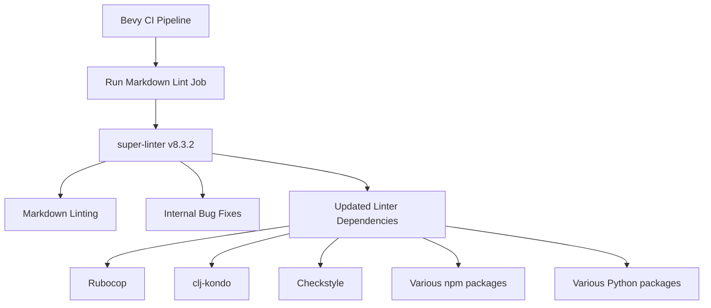

+++
title = "#22270 Bump super-linter/super-linter from 8.3.1 to 8.3.2"
date = "2026-01-05T00:00:00"
draft = false
template = "pull_request_page.html"
in_search_index = false

[extra]
current_language = "zh-cn"
available_languages = {"en" = { name = "English", url = "/pull_request/bevy/2026-01/pr-22270-en-20260105" }, "zh-cn" = { name = "中文", url = "/pull_request/bevy/2026-01/pr-22270-zh-cn-20260105" }}
labels = ["A-Build-System", "C-Dependencies"]
+++

# Title: Bump super-linter/super-linter from 8.3.1 to 8.3.2

## Basic Information
- **Title**: Bump super-linter/super-linter from 8.3.1 to 8.3.2
- **PR Link**: https://github.com/bevyengine/bevy/pull/22270
- **Author**: app/dependabot
- **Status**: MERGED
- **Labels**: A-Build-System, C-Dependencies, S-Ready-For-Final-Review
- **Created**: 2025-12-25T23:10:31Z
- **Merged**: 2026-01-05T02:31:38Z
- **Merged By**: alice-i-cecile

## Description Translation
更新 super-linter/super-linter 从 8.3.1 到 8.3.2。
<details>
<summary>Release notes</summary>
<p><em>Sourced from <a href="https://github.com/super-linter/super-linter/releases">super-linter/super-linter's releases</a>.</em></p>
<blockquote>
<h2>v8.3.2</h2>
<h2><a href="https://github.com/super-linter/super-linter/compare/v8.3.1...v8.3.2">8.3.2</a> (2025-12-24)</h2>
<h3>🐛 Bugfixes</h3>
<ul>
<li>centralize file array additions and fix type (<a href="https://redirect.github.com/super-linter/super-linter/issues/7323">#7323</a>) (<a href="https://github.com/super-linter/super-linter/commit/ce80cf6842c49618adb1eef1c4a455fb7a32f51c">ce80cf6</a>), closes <a href="https://redirect.github.com/super-linter/super-linter/issues/7302">#7302</a></li>
<li>create log groups for enabled languages only (<a href="https://redirect.github.com/super-linter/super-linter/issues/7329">#7329</a>) (<a href="https://github.com/super-linter/super-linter/commit/7c85bf3695efa7784c55c760b591a26994eb1538">7c85bf3</a>), closes <a href="https://redirect.github.com/super-linter/super-linter/issues/7307">#7307</a></li>
<li>initialize github_before_sha (<a href="https://redirect.github.com/super-linter/super-linter/issues/7120">#7120</a>) (<a href="https://github.com/super-linter/super-linter/commit/a93b722492ae64610b681733132b03316b5a3f1a">a93b722</a>), closes <a href="https://redirect.github.com/super-linter/super-linter/issues/7118">#7118</a> <a href="https://redirect.github.com/super-linter/super-linter/issues/7275">#7275</a></li>
</ul>
<h3>⬆️ Dependency updates</h3>
<ul>
<li><strong>bundler:</strong> bump rubocop in /dependencies in the rubocop group (<a href="https://redirect.github.com/super-linter/super-linter/issues/7313">#7313</a>) (<a href="https://github.com/super-linter/super-linter/commit/7fab96c232891c27aa68d1ccb78a4df73fc8d845">7fab96c</a>)</li>
<li><strong>docker:</strong> bump clj-kondo/clj-kondo in the docker group (<a href="https://redirect.github.com/super-linter/super-linter/issues/7325">#7325</a>) (<a href="https://github.com/super-linter/super-linter/commit/fa23c5433efb749f5fb300cbec569e2c0874a335">fa23c54</a>)</li>
<li><strong>docker:</strong> bump the docker group with 4 updates (<a href="https://redirect.github.com/super-linter/super-linter/issues/7318">#7318</a>) (<a href="https://github.com/super-linter/super-linter/commit/dc49a6d6bdd54b017a4b5a246f6f74cdd7a39b99">dc49a6d</a>)</li>
<li><strong>java:</strong> bump com.puppycrawl.tools:checkstyle (<a href="https://redirect.github.com/super-linter/super-linter/issues/7312">#7312</a>) (<a href="https://github.com/super-linter/super-linter/commit/ab584378be9a17bc1544a55d48a6daf69bf119bc">ab58437</a>)</li>
<li><strong>npm:</strong> bump next from 16.0.10 to 16.1.0 in /dependencies (<a href="https://redirect.github.com/super-linter/super-linter/issues/7316">#7316</a>) (<a href="https://github.com/super-linter/super-linter/commit/a8572e292ba5ca18ef118b066eb3d1570b8de902">a8572e2</a>)</li>
<li><strong>npm:</strong> bump renovate (<a href="https://redirect.github.com/super-linter/super-linter/issues/7300">#7300</a>) (<a href="https://github.com/super-linter/super-linter/commit/191338acc8928b9e523533a22c8cea7f83daefec">191338a</a>)</li>
<li><strong>npm:</strong> bump the npm group across 1 directory with 10 updates (<a href="https://redirect.github.com/super-linter/super-linter/issues/7322">#7322</a>) (<a href="https://github.com/super-linter/super-linter/commit/24d9e00de99a2a9056c1717e69163f832d18756e">24d9e00</a>)</li>
<li><strong>npm:</strong> bump the npm group across 1 directory with 2 updates (<a href="https://redirect.github.com/super-linter/super-linter/issues/7296">#7296</a>) (<a href="https://github.com/super-linter/super-linter/commit/069748517af0b1ddbfae6ed6545a636162b99aa9">0697485</a>)</li>
<li><strong>npm:</strong> bump the npm group across 1 directory with 2 updates (<a href="https://redirect.github.com/super-linter/super-linter/issues/7301">#7300</a>) (<a href="https://github.com/super-linter/super-linter/commit/4b2bf76ed4965f51047c2f8825b7f2181fd4591e">4b2bf76</a>)</li>
<li><strong>npm:</strong> bump the npm group across 1 directory with 4 updates (<a href="https://redirect.github.com/super-linter/super-linter/issues/7327">#7327</a>) (<a href="https://github.com/super-linter/super-linter/commit/07e73d60033bef44a0c4224fb7f0ce1389714002">07e73d6</a>)</li>
<li><strong>python:</strong> bump ansible-lint (<a href="https://redirect.github.com/super-linter/super-linter/issues/7326">#7326</a>) (<a href="https://github.com/super-linter/super-linter/commit/47962eae72ffee1ebc038c4b719d6394178658ee">47962ea</a>)</li>
<li><strong>python:</strong> bump snakemake (<a href="https://redirect.github.com/super-linter/super-linter/issues/7295">#7295</a>) (<a href="https://github.com/super-linter/super-linter/commit/3f925892e7f0f6020a698a69caef86eb3277cd9c">3f92589</a>)</li>
<li><strong>python:</strong> bump the pip group across 1 directory with 2 updates (<a href="https://redirect.github.com/super-linter/super-linter/issues/7299">#7299</a>) (<a href="https://github.com/super-linter/super-linter/commit/0ca0315180d0039872dd5c0828f50530a2747722">0ca0315</a>)</li>
<li><strong>python:</strong> bump the pip group across 1 directory with 6 updates (<a href="https://redirect.github.com/super-linter/super-linter/issues/7317">#7317</a>) (<a href="https://github.com/super-linter/super-linter/commit/ae7e8d8e5c32255e2bc335540e2c92c49a095d6f">ae7e8d8</a>)</li>
</ul>
<h3>🧰 Maintenance</h3>
<ul>
<li>disable dependabot cooldown (<a href="https://redirect.github.com/super-linter/super-linter/issues/7311">#7311</a>) (<a href="https://github.com/super-linter/super-linter/commit/e98f7d3c79423480207804b55cf282c76156bbac">e98f7d3</a>)</li>
<li><strong>docs:</strong> mention conflicting tools in upgrades (<a href="https://redirect.github.com/super-linter/super-linter/issues/7324">#7324</a>) (<a href="https://github.com/super-linter/super-linter/commit/7afe608fff92093619af9fe2aacf61a093419551">7afe608</a>), closes <a href="https://redirect.github.com/super-linter/super-linter/issues/7298">#7298</a></li>
<li><strong>github-actions:</strong> bump the dev-ci-tools group with 2 updates (<a href="https://redirect.github.com/super-linter/super-linter/issues/7315">#7315</a>) (<a href="https://github.com/super-linter/super-linter/commit/4b07868ae26255da8c0d8a69d7c0a4aff02e1b04">4b07868</a>)</li>
<li>group eslint updates (<a href="https://redirect.github.com/super-linter/super-linter/issues/7321">#7321</a>) (<a href="https://github.com/super-linter/super-linter/commit/20f25a369053b8067ccfedf04e3ed98e7df71ff6">20f25a3</a>)</li>
</ul>
</blockquote>
</details>
<details>
<summary>Changelog</summary>
<p><em>Sourced from <a href="https://github.com/super-linter/super-linter/blob/main/CHANGELOG.md">super-linter/super-linter's changelog</a>.</em></p>
<blockquote>
<h2><a href="https://github.com/super-linter/super-linter/compare/v8.3.1...v8.3.2">8.3.2</a> (2025-12-24)</h2>
<h3>🐛 Bugfixes</h3>
<ul>
<li>centralize file array additions and fix type (<a href="https://redirect.github.com/super-linter/super-linter/issues/7323">#7323</a>) (<a href="https://github.com/super-linter/super-linter/commit/ce80cf6842c49618adb1eef1c4a455fb7a32f51c">ce80cf6</a>), closes <a href="https://redirect.github.com/super-linter/super-linter/issues/7302">#7302</a></li>
<li>create log groups for enabled languages only (<a href="https://redirect.github.com/super-linter/super-linter/issues/7329">#7329</a>) (<a href="https://github.com/super-linter/super-linter/commit/7c85bf3695efa7784c55c760b591a26994eb1538">7c85bf3</a>), closes <a href="https://redirect.github.com/super-linter/super-linter/issues/7307">#7307</a></li>
<li>initialize github_before_sha (<a href="https://redirect.github.com/super-linter/super-linter/issues/7120">#7120</a>) (<a href="https://github.com/super-linter/super-linter/commit/a93b722492ae64610b681733132b03316b5a3f1a">a93b722</a>), closes <a href="https://redirect.github.com/super-linter/super-linter/issues/7118">#7118</a> <a href="https://redirect.github.com/super-linter/super-linter/issues/7275">#7275</a></li>
</ul>
<h3>⬆️ Dependency updates</h3>
<ul>
<li><strong>bundler:</strong> bump rubocop in /dependencies in the rubocop group (<a href="https://redirect.github.com/super-linter/super-linter/issues/7313">#7313</a>) (<a href="https://github.com/super-linter/super-linter/commit/7fab96c232891c27aa68d1ccb78a4df73fc8d845">7fab96c</a>)</li>
<li><strong>docker:</strong> bump clj-kondo/clj-kondo in the docker group (<a href="https://redirect.github.com/super-linter/super-linter/issues/7325">#7325</a>) (<a href="https://github.com/super-linter/super-linter/commit/fa23c5433efb749f5fb300cbec569e2c0874a335">fa23c54</a>)</li>
<li><strong>docker:</strong> bump the docker group with 4 updates (<a href="https://redirect.github.com/super-linter/super-linter/issues/7318">#7318</a>) (<a href="https://github.com/super-linter/super-linter/commit/dc49a6d6bdd54b017a4b5a246f6f74cdd7a39b99">dc49a6d</a>)</li>
<li><strong>java:</strong> bump com.puppycrawl.tools:checkstyle (<a href="https://redirect.github.com/super-linter/super-linter/issues/7312">#7312</a>) (<a href="https://github.com/super-linter/super-linter/commit/ab584378be9a17bc1544a55d48a6daf69bf119bc">ab58437</a>)</li>
<li><strong>npm:</strong> bump next from 16.0.10 to 16.1.0 in /dependencies (<a href="https://redirect.github.com/super-linter/super-linter/issues/7316">#7316</a>) (<a href="https://github.com/super-linter/super-linter/commit/a8572e292ba5ca18ef118b066eb3d1570b8de902">a8572e2</a>)</li>
<li><strong>npm:</strong> bump renovate (<a href="https://redirect.github.com/super-linter/super-linter/issues/7300">#7300</a>) (<a href="https://github.com/super-linter/super-linter/commit/191338acc8928b9e523533a22c8cea7f83daefec">191338a</a>)</li>
<li><strong>npm:</strong> bump the npm group across 1 directory with 10 updates (<a href="https://redirect.github.com/super-linter/super-linter/issues/7322">#7322</a>) (<a href="https://github.com/super-linter/super-linter/commit/24d9e00de99a2a9056c1717e69163f832d18756e">24d9e00</a>)</li>
<li><strong>npm:</strong> bump the npm group across 1 directory with 2 updates (<a href="https://redirect.github.com/super-linter/super-linter/issues/7296">#7296</a>) (<a href="https://github.com/super-linter/super-linter/commit/069748517af0b1ddbfae6ed6545a636162b99aa9">0697485</a>)</li>
<li><strong>npm:</strong> bump the npm group across 1 directory with 2 updates (<a href="https://redirect.github.com/super-linter/super-linter/issues/7301">#7300</a>) (<a href="https://github.com/super-linter/super-linter/commit/4b2bf76ed4965f51047c2f8825b7f2181fd4591e">4b2bf76</a>)</li>
<li><strong>npm:</strong> bump the npm group across 1 directory with 4 updates (<a href="https://redirect.github.com/super-linter/super-linter/issues/7327">#7327</a>) (<a href="https://github.com/super-linter/super-linter/commit/07e73d60033bef44a0c4224fb7f0ce1389714002">07e73d6</a>)</li>
<li><strong>python:</strong> bump ansible-lint (<a href="https://redirect.github.com/super-linter/super-linter/issues/7326">#7326</a>) (<a href="https://github.com/super-linter/super-linter/commit/47962eae72ffee1ebc038c4b719d6394178658ee">47962ea</a>)</li>
<li><strong>python:</strong> bump snakemake (<a href="https://redirect.github.com/super-linter/super-linter/issues/7295">#7295</a>) (<a href="https://github.com/super-linter/super-linter/commit/3f925892e7f0f6020a698a69caef86eb3277cd9c">3f92589</a>)</li>
<li><strong>python:</strong> bump the pip group across 1 directory with 2 updates (<a href="https://redirect.github.com/super-linter/super-linter/issues/7299">#7299</a>) (<a href="https://github.com/super-linter/super-linter/commit/0ca0315180d0039872dd5c0828f50530a2747722">0ca0315</a>)</li>
<li><strong>python:</strong> bump the pip group across 1 directory with 6 updates (<a href="https://redirect.github.com/super-linter/super-linter/issues/7317">#7317</a>) (<a href="https://github.com/super-linter/super-linter/commit/ae7e8d8e5c32255e2bc335540e2c92c49a095d6f">ae7e8d8</a>)</li>
</ul>
<h3>🧰 Maintenance</h3>
<ul>
<li>disable dependabot cooldown (<a href="https://redirect.github.com/super-linter/super-linter/issues/7311">#7311</a>) (<a href="https://github.com/super-linter/super-linter/commit/e98f7d3c79423480207804b55cf282c76156bbac">e98f7d3</a>)</li>
<li><strong>docs:</strong> mention conflicting tools in upgrades (<a href="https://redirect.github.com/super-linter/super-linter/issues/7324">#7324</a>) (<a href="https://github.com/super-linter/super-linter/commit/7afe608fff92093619af9fe2aacf61a093419551">7afe608</a>), closes <a href="https://redirect.github.com/super-linter/super-linter/issues/7298">#7298</a></li>
<li><strong>github-actions:</strong> bump the dev-ci-tools group with 2 updates (<a href="https://redirect.github.com/super-linter/super-linter/issues/7315">#7315</a>) (<a href="https://github.com/super-linter/super-linter/commit/4b07868ae26255da8c0d8a69d7c0a4aff02e1b04">4b07868</a>)</li>
<li>group eslint updates (<a href="https://redirect.github.com/super-linter/super-linter/issues/7321">#7321</a>) (<a href="https://github.com/super-linter/super-linter/commit/20f25a369053b8067ccfedf04e3ed98e7df71ff6">20f25a3</a>)</li>
</ul>
</blockquote>
</details>
<details>
<summary>Commits</summary>
<ul>
<li><a href="https://github.com/super-linter/super-linter/commit/d5b0a2ab116623730dd094f15ddc1b6b25bf7b99"><code>d5b0a2a</code></a> chore(main): release 8.3.2 (<a href="https://redirect.github.com/super-linter/super-linter/issues/7297">#7297</a>)</li>
<li><a href="https://github.com/super-linter/super-linter/commit/fa23c5433efb749f5fb300cbec569e2c0874a335"><code>fa23c54</code></a> deps(docker): bump clj-kondo/clj-kondo in the docker group (<a href="https://redirect.github.com/super-linter/super-linter/issues/7325">#7325</a>)</li>
<li><a href="https://github.com/super-linter/super-linter/commit/07e73d60033bef44a0c4224fb7f0ce1389714002"><code>07e73d6</code></a> deps(npm): bump the npm group across 1 directory with 4 updates (<a href="https://redirect.github.com/super-linter/super-linter/issues/7327">#7327</a>)</li>
<li><a href="https://github.com/super-linter/super-linter/commit/47962eae72ffee1ebc038c4b719d6394178658ee"><code>47962ea</code></a> deps(python): bump ansible-lint (<a href="https://redirect.github.com/super-linter/super-linter/issues/7326">#7326</a>)</li>
<li><a href="https://github.com/super-linter/super-linter/commit/7c85bf3695efa7784c55c760b591a26994eb1538"><code>7c85bf3</code></a> fix: create log groups for enabled languages only (<a href="https://redirect.github.com/super-linter/super-linter/issues/7329">#7329</a>)</li>
<li><a href="https://github.com/super-linter/super-linter/commit/7afe608fff92093619af9fe2aacf61a093419551"><code>7afe608</code></a> chore(docs): mention conflicting tools in upgrades (<a href="https://redirect.github.com/super-linter/super-linter/issues/7324">#7324</a>)</li>
<li><a href="https://github.com/super-linter/super-linter/commit/ce80cf6842c49618adb1eef1c4a455fb7a32f51c"><code>ce80cf6</code></a> fix: centralize file array additions and fix type (<a href="https://redirect.github.com/super-linter/super-linter/issues/7323">#7323</a>)</li>
<li><a href="https://github.com/super-linter/super-linter/commit/ab584378be9a17bc1544a55d48a6daf69bf119bc"><code>ab58437</code></a> deps(java): bump com.puppycrawl.tools:checkstyle (<a href="https://redirect.github.com/super-linter/super-linter/issues/7312">#7312</a>)</li>
<li><a href="https://github.com/super-linter/super-linter/commit/24d9e00de99a2a9056c1717e69163f832d18756e"><code>24d9e00</code></a> deps(npm): bump the npm group across 1 directory with 10 updates (<a href="https://redirect.github.com/super-linter/super-linter/issues/7322">#7322</a>)</li>
<li><a href="https://github.com/super-linter/super-linter/commit/dc49a6d6bdd54b017a4b5a246f6f74cdd7a39b99"><code>dc49a6d</code></a> deps(docker): bump the docker group with 4 updates (<a href="https://redirect.github.com/super-linter/super-linter/issues/7318">#7318</a>)</li>
<li>Additional commits viewable in <a href="https://github.com/super-linter/super-linter/compare/v8.3.1...v8.3.2">compare view</a></li>
</ul>
</details>
<br />


[](https://docs.github.com/en/github/managing-security-vulnerabilities/about-dependabot-security-updates#about-compatibility-scores)

Dependabot will resolve any conflicts with this PR as long as you don't alter it yourself. You can also trigger a rebase manually by commenting `@dependabot rebase`.

[//]: # (dependabot-automerge-start)
[//]: # (dependabot-automerge-end)

---

<details>
<summary>Dependabot commands and options</summary>
<br />

You can trigger Dependabot actions by commenting on this PR:
- `@dependabot rebase` will rebase this PR
- `@dependabot recreate` will recreate this PR, overwriting any edits that have been made to it
- `@dependabot merge` will merge this PR after your CI passes on it
- `@dependabot squash and merge` will squash and merge this PR after your CI passes on it
- `@dependabot cancel merge` will cancel a previously requested merge and block automerging
- `@dependabot reopen` will reopen this PR if it is closed
- `@dependabot close` will close this PR and stop Dependabot recreating it. You can achieve the same result by closing it manually
- `@dependabot show <dependency name> ignore conditions` will show all of the ignore conditions of the specified dependency
- `@dependabot ignore this major version` will close this PR and stop Dependabot creating any more for this major version (unless you reopen the PR or upgrade to it yourself)
- `@dependabot ignore this minor version` will close this PR and stop Dependabot creating any more for this minor version (unless you reopen the PR or upgrade to it yourself)
- `@dependabot ignore this dependency` will close this PR and stop Dependabot creating any more for this dependency (unless you reopen the PR or upgrade to it yourself)


</details>

## The Story of This Pull Request

这是一个标准的依赖更新PR，由Dependabot自动生成。虽然变更看似简单，但涉及项目构建系统的重要维护工作。

**背景和需求**
Bevy项目使用super-linter作为CI流程中的代码检查工具，这是一个集成了多种语言linting工具的统一解决方案。在GitHub Actions工作流中，有一个专门的job用于运行Markdown格式检查。依赖管理是软件开发中的关键环节，保持工具链的最新版本可以获得bug修复、性能改进和安全更新。super-linter从8.3.1升级到8.3.2，这是一个次要版本更新，通常意味着向后兼容的改进和修复。

**技术分析**
从release notes可以看出，8.3.2版本主要包含三类变更：

1. **Bug修复**：有三个关键修复：
   - 集中文件数组添加并修复类型问题 - 这可能是内部实现的优化
   - 只为启用语言创建日志组 - 这能减少不必要的日志输出，优化CI日志的可读性
   - 初始化github_before_sha变量 - 这解决了在特定情况下可能出现的变量未初始化问题

2. **依赖更新**：更新了多个子工具，包括：
   - rubocop（Ruby代码检查）
   - clj-kondo（Clojure代码检查）
   - checkstyle（Java代码检查）
   - 多个npm包和Python包
   这些更新确保底层的各语言linting工具也保持最新。

3. **维护任务**：包括禁用dependabot冷却期、文档更新等。

**变更实现**
这个PR的代码变更非常简单，只修改了一行：

```yaml
# Before:
uses: super-linter/super-linter/slim@47984f49b4e87383eed97890fe2dca6063bbd9c3 # v8.3.1

# After:
uses: super-linter/super-linter/slim@d5b0a2ab116623730dd094f15ddc1b6b25bf7b99 # v8.3.2
```

这里使用`slim`版本，这是一个精简版的super-linter，体积更小，启动更快，适合只需要特定语言检查的场景。在Bevy的配置中，只启用了Markdown检查（`VALIDATE_MARKDOWN: true`），所以使用slim版本是合理的选择。

**工程实践**
这个PR展示了几个良好的工程实践：

1. **自动化依赖管理**：通过Dependabot自动发现并创建更新PR
2. **精确版本控制**：使用具体的commit hash而不是版本标签，确保可重现的构建
3. **最小化影响**：使用slim版本减少CI时间和资源消耗
4. **测试保障**：合并前需要CI通过，确保更新不会破坏现有功能

**实际影响**
对于Bevy项目，这次更新带来的直接好处包括：
- 获得super-linter的bug修复，特别是日志组的优化可以减少CI日志的噪音
- 底层linting工具的更新可能带来更准确的代码检查规则
- 保持工具链的安全性和稳定性

虽然这个变更看起来很微小，但它是维护健康代码库的重要组成部分。定期更新依赖可以避免技术债的积累，确保项目能够及时获得工具链的改进。

## Visual Representation



## Key Files Changed

### 1. `.github/workflows/ci.yml`
这是GitHub Actions的CI配置文件，定义了项目的持续集成流程。

**变更内容**：
```yaml
# 变更前第331行：
- uses: super-linter/super-linter/slim@47984f49b4e87383eed97890fe2dca6063bbd9c3 # v8.3.1

# 变更后第331行：
+ uses: super-linter/super-linter/slim@d5b0a2ab116623730dd094f15ddc1b6b25bf7b99 # v8.3.2
```

**技术细节**：
- 这个job是"Run Markdown Lint"，专门检查Markdown文件的格式
- 使用`slim`版本，只包含必要的linting工具，减少镜像大小和启动时间
- 配置中设置了`VALIDATE_ALL_CODEBASE: false`和`VALIDATE_MARKDOWN: true`，说明只检查Markdown文件
- 使用commit hash而不是版本标签，确保精确的版本控制

**上下文配置**：
```yaml
- name: Run Markdown Lint
  uses: super-linter/super-linter/slim@d5b0a2ab116623730dd094f15ddc1b6b