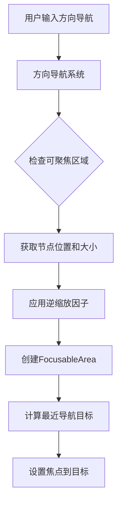

+++
title = "#22278 AutoNavigationConfig::max_search_distance` 修复"
date = "2026-01-01T00:00:00"
draft = false
template = "pull_request_page.html"
in_search_index = false

[extra]
current_language = "zh-cn"
available_languages = {"en" = { name = "English", url = "/pull_request/bevy/2026-01/pr-22278-en-20260101" }, "zh-cn" = { name = "中文", url = "/pull_request/bevy/2026-01/pr-22278-zh-cn-20260101" }}
+++

# Title

## 基本信息
- **标题**: `AutoNavigationConfig::max_search_distance` 修复
- **PR 链接**: https://github.com/bevyengine/bevy/pull/22278
- **作者**: ickshonpe
- **状态**: 已合并
- **标签**: C-Bug, A-UI, S-Ready-For-Final-Review, D-Straightforward
- **创建时间**: 2025-12-26T16:00:54Z
- **合并时间**: 2025-12-31T23:18:03Z
- **合并者**: alice-i-cecile

## 描述翻译
**目标**

自动方向导航忽略缩放因子。

修复 #22277

**解决方案**

将每个 `FocusableArea` 的大小和平移乘以逆缩放因子。

## 这个 PR 的技术分析

这个 PR 解决了一个 UI 导航系统中的 bug。问题出现在自动方向导航（automatic directional navigation）功能中，当 UI 元素应用了缩放因子（scale factor）时，导航系统没有正确考虑这个缩放，导致导航距离计算错误。

问题的核心在于 `directional_navigation.rs` 文件中的 `FocusableArea` 计算逻辑。在计算可聚焦区域的位置和大小时，代码直接使用了节点的平移（translation）和计算大小（computed size），而没有考虑节点的缩放因子。这导致导航系统使用物理像素坐标进行计算，而不是逻辑坐标，从而在缩放后的 UI 中产生不正确的导航行为。

解决方案很直接：在创建 `FocusableArea` 结构体时，将其 `position` 和 `size` 字段都乘以逆缩放因子（inverse scale factor）。这样可以将物理坐标转换回逻辑坐标，确保导航系统在统一的坐标系中工作。

具体来说，修改涉及两处相同的代码模式。在两个不同的代码路径中，当创建 `FocusableArea` 时，都应用了相同的修正：

1. 对于具有目标相机的节点
2. 对于在同一目标相机中的节点

两处修改都使用了 `computed.inverse_scale_factor()` 方法来获取逆缩放因子，然后将其应用于位置和大小。这种对称的修改确保了所有情况下的行为一致性。

这个修复的重要性在于，现代 UI 系统经常需要处理不同的显示密度和缩放设置。特别是在支持高 DPI 显示器的环境中，UI 缩放是常见需求。如果导航系统不考虑缩放因子，用户在高缩放设置下可能会遇到导航距离过短或过长的问题，导致导航体验不一致。

从技术实现角度看，这个修复展示了几个重要的软件工程原则：

1. **坐标系统一致性**：UI 系统需要明确区分物理像素和逻辑像素。导航系统应该在逻辑坐标空间中工作，以确保在不同显示设置下的一致行为。

2. **关注点分离**：缩放处理应该集中在专门的组件中（这里是 `ComputedNodeSize`），其他系统通过其提供的接口获取正确的缩放后值，而不是自己处理缩放逻辑。

3. **最小化变更**：修复只修改了两行代码的核心逻辑，保持了代码的简洁性和可维护性。

这个 bug 修复后，自动方向导航功能现在能正确处理缩放后的 UI 元素，确保导航距离计算基于正确的逻辑坐标，提供更一致的用户体验。

## 可视化表示



## 关键文件变更

### `crates/bevy_input_focus/src/directional_navigation.rs` (+4/-4)

这个文件包含了方向导航系统的核心逻辑。修改涉及 `FocusableArea` 结构的创建过程，确保其位置和大小值考虑了节点的缩放因子。

**修改前:**
```rust
Some(FocusableArea {
    entity,
    position: translation,
    size: computed.size(),
})

// 和

FocusableArea {
    entity,
    position: translation,
    size: computed.size(),
}
```

**修改后:**
```rust
Some(FocusableArea {
    entity,
    position: translation * computed.inverse_scale_factor(),
    size: computed.size() * computed.inverse_scale_factor(),
})

// 和

FocusableArea {
    entity,
    position: translation * computed.inverse_scale_factor(),
    size: computed.size() * computed.inverse_scale_factor(),
}
```

**关键变化分析:**
1. 在创建 `FocusableArea` 时，`position`（位置）现在乘以 `computed.inverse_scale_factor()`
2. 同样，`size`（大小）也乘以相同的逆缩放因子
3. 这个修改确保导航系统在逻辑坐标空间而不是物理像素空间工作
4. 修复应用于两个代码路径，确保所有情况的一致性

## 进一步阅读

1. **Bevy UI 系统文档**: 了解 Bevy 的 UI 系统和坐标空间处理
2. **高 DPI 和缩放处理**: 现代 GUI 框架中处理不同显示密度的最佳实践
3. **坐标系变换**: 计算机图形学中不同坐标系统的转换原理
4. **Bevy 输入系统**: Bevy 如何处理用户输入和焦点管理

# 完整代码差异
```diff
diff --git a/crates/bevy_input_focus/src/directional_navigation.rs b/crates/bevy_input_focus/src/directional_navigation.rs
index 79dc20680084a..bc1bd91d14bd4 100644
--- a/crates/bevy_input_focus/src/directional_navigation.rs
+++ b/crates/bevy_input_focus/src/directional_navigation.rs
@@ -496,8 +496,8 @@ impl<'w, 's> DirectionalNavigation<'w, 's> {
                             transform.to_scale_angle_translation();
                         Some(FocusableArea {
                             entity,
-                            position: translation,
-                            size: computed.size(),
+                            position: translation * computed.inverse_scale_factor(),
+                            size: computed.size() * computed.inverse_scale_factor(),
                         })
                     } else {
                         // The node either does not have a target camera or it is not the same as the desired one.
@@ -525,8 +525,8 @@ impl<'w, 's> DirectionalNavigation<'w, 's> {
                         target_camera,
                         FocusableArea {
                             entity,
-                            position: translation,
-                            size: computed.size(),
+                            position: translation * computed.inverse_scale_factor(),
+                            size: computed.size() * computed.inverse_scale_factor(),
                         },
                     ))
                 } else {
```