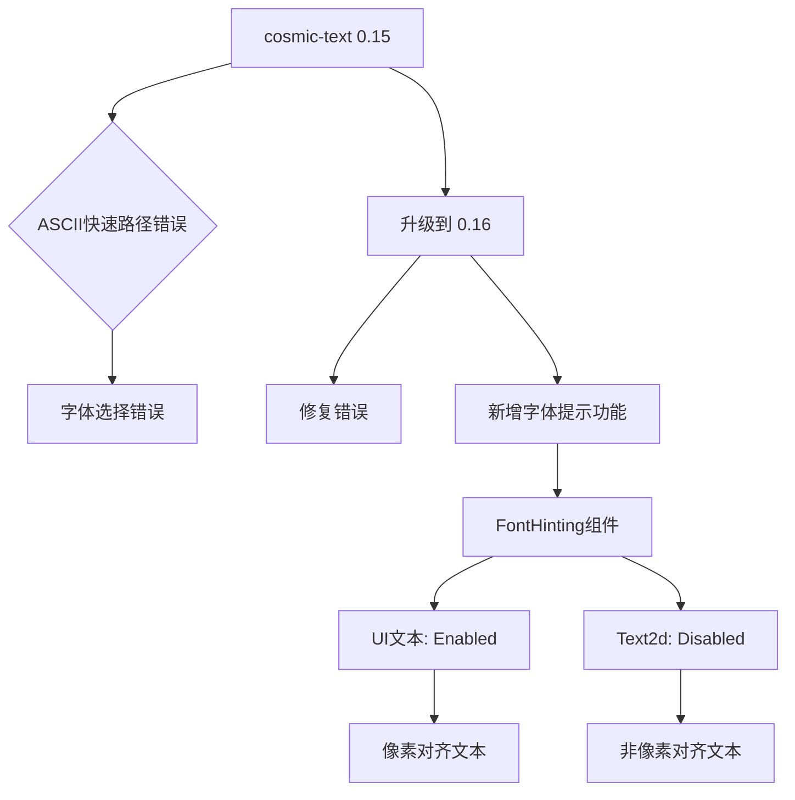

+++
title = "#22308 Update cosmic-text to 0.16"
date = "2026-01-01T00:00:00"
draft = false
template = "pull_request_page.html"
in_search_index = false

[extra]
current_language = "zh-cn"
available_languages = {"en" = { name = "English", url = "/pull_request/bevy/2026-01/pr-22308-en-20260101" }, "zh-cn" = { name = "中文", url = "/pull_request/bevy/2026-01/pr-22308-zh-cn-20260101" }}
+++

# 标题
## 基本信ξ
- **标题**: Update cosmic-text to 0.16
- **PR链接**: https://github.com/bevyengine/bevy/pull/22308
- **作者**: ickshonpe
- **状态**: 已合并
- **标签**: C-Bug, S-Ready-For-Final-Review, A-Text, D-Straightforward, M-Deliberate-Rendering-Change
- **创建时间**: 2025-12-29T23:05:41Z
- **合并时间**: 2026-01-01T04:06:28Z
- **合并者**: alice-i-cecile

## 描述翻译
更新 Cosmic Text 依赖到 0.16 版本。

修复 #22191

### 解决方案
Cosmic Text 0.16 版本没有破坏性变更，但它增加了字体提示（font-hinting）支持。在 Bevy 中，这通过一个新的组件 `FontHinting` 来控制。通常用于物理像素对齐文本的 `Text` 组件现在需要 `FontHinting::Enabled`，而通常不进行像素对齐的 `Text2d` 组件现在需要 `FontHinting::Disabled`。提示需要按文本块设置，而不是按文本跨度实体设置，因此不适合将其作为 `TextFont` 的字段添加。

### 测试
主分支中使用 cosmic-text 15 的 `testbed_ui` 文本场景：


字体名称本应使用对应的字体渲染，但如您所见，有些名称使用了错误的字体渲染。这是由于 cosmic-text 15 中的 ASCII 快速路径错误导致的，该错误在版本 16 中已修复。

本分支中使用 cosmic-text 16 的 `testbed_ui` 文本场景：


现在每个字体的名称都使用了正确的字体渲染。

# 这个PR的故事

这个PR的核心任务是升级 Bevy 引擎的文本渲染依赖 cosmic-text 从 0.15 版本到 0.16 版本。升级的直接动机是修复一个已知的渲染错误，但同时也引入了一个新的功能特性——字体提示（font-hinting）控制。

## 问题背景：ASCII快速路径错误

在 cosmic-text 0.15 版本中，存在一个被称为 "ASCII 快速路径错误" 的问题。这个错误导致在某些情况下，文本渲染会选择错误的字体。具体来说，当渲染纯 ASCII 文本时，cosmic-text 会尝试使用一个优化路径来提高性能，但这个优化路径在字体选择逻辑上存在缺陷。如测试截图所示，在 `testbed_ui` 场景中，本应使用特定字体渲染的字体名称，实际上却使用了错误的字体，破坏了UI的视觉正确性。

这个问题的根本原因在于第三方依赖，因此解决方案就是升级到修复了该问题的 cosmic-text 0.16 版本。从工程角度看，这种类型的升级是维护依赖关系的常规操作，但需要确保新版本的API兼容性，并妥善处理任何新引入的功能。

## 解决方案：依赖升级与字体提示集成

升级 cosmic-text 到 0.16 版本本身是直接的依赖版本变更，但新版本引入了一个重要的新功能：字体提示支持。字体提示是一种调整字形轮廓以在低分辨率显示设备上提高可读性的技术。它在像素网格上对齐字形特征，对于需要在物理像素上精确对齐的UI文本尤为重要。

然而，并不是所有文本渲染场景都适合启用字体提示。对于 `Text2d`（在3D空间或2D场景中渲染的文本），文本可能被旋转、缩放或以非整数像素位置渲染，启用提示可能导致视觉伪影。因此，需要一种机制来让开发者根据不同使用场景控制字体提示的启用状态。

PR 作者做出了一个关键设计决策：将字体提示控制实现为一个组件 `FontHinting`，而不是作为 `TextFont` 的一个字段。这是因为字体提示需要在文本块（block）级别进行控制，而 `TextFont` 是文本跨度（span）级别的组件。一个文本块可能包含多个使用不同字体的文本跨度，但所有跨度应该共享相同的提示策略以确保一致的渲染。

## 实现细节

### 新组件：FontHinting

首先在 `bevy_text/src/text.rs` 中定义了新的组件：

```rust
#[derive(Component, Debug, Copy, Clone, Default, Reflect, PartialEq)]
#[reflect(Component, Default, Debug, Clone, PartialEq)]
/// Font hinting strategy.
///
/// <https://docs.rs/cosmic-text/latest/cosmic_text/enum.Hinting.html>
pub enum FontHinting {
    #[default]
    /// Glyphs will have subpixel coordinates.
    Disabled,
    /// Glyphs will be snapped to integral coordinates in the X-axis during layout.
    Enabled,
}
```

这个枚举直接映射到 cosmic-text 的 `Hinting` 枚举，通过 `From` trait 提供转换：

```rust
impl From<FontHinting> for cosmic_text::Hinting {
    fn from(value: FontHinting) -> Self {
        match value {
            FontHinting::Disabled => cosmic_text::Hinting::Disabled,
            FontHinting::Enabled => cosmic_text::Hinting::Enabled,
        }
    }
}
```

### 文本管道集成

在 `bevy_text/src/pipeline.rs` 中，`TextPipeline` 的 `create_text_measure` 和 `create_text_layout` 方法都新增了 `hinting: FontHinting` 参数。关键的变化是在文本缓冲区的设置中：

```rust
// Set the metrics hinting strategy
buffer.set_hinting(font_system, hinting.into());
```

这确保了 cosmic-text 缓冲区使用正确的提示策略进行文本布局和测量。

### 系统集成

对于 `Text2d`（在 `bevy_sprite/src/text2d.rs` 中），默认禁用了字体提示：

```rust
#[component(storage = "SparseSet", bundle(Text2dBundle))]
#[bundle(
    // ... 其他组件
    // Disable hinting as `Text2d` text is not always pixel-aligned
    FontHinting::Disabled
)]
pub struct Text2d(pub String);
```

对于UI文本（在 `bevy_ui/src/widget/text.rs` 中），默认启用了字体提示：

```rust
#[component(storage = "SparseSet", bundle(TextBundle))]
#[bundle(
    // ... 其他组件
    // Enable hinting as UI text is normally pixel-aligned.
    FontHinting::Enabled
)]
pub struct Text(pub String);
```

这种默认值的选择基于两种文本类型的典型使用场景：UI文本通常需要像素对齐以获得清晰的渲染效果，而 `Text2d` 文本可能被变换（旋转、缩放），像素对齐反而可能导致问题。

两个系统（`update_text2d_layout` 和 `measure_text_system`）也都更新了查询，包含 `FontHinting` 组件，并在提示设置变化时重新处理文本布局。

## 技术洞察

### 组件设计的考虑

选择将 `FontHinting` 实现为组件而不是 `TextFont` 的字段，体现了对文本系统架构的深入理解。文本系统分为块（block）级别和跨度（span）级别：
- 块级别组件（如 `TextLayout`、`TextBounds`）控制整个文本块的行为
- 跨度级别组件（如 `TextFont`、`TextColor`）控制文本块内特定范围的行为

字体提示影响整个文本块的渲染，因此属于块级别的控制。这种设计保持了架构的一致性，并避免了将块级别逻辑错误地放在跨度级别组件中。

### 性能考虑

字体提示的启用状态被添加到文本重新处理的触发条件中。这意味着当 `FontHinting` 组件变化时，文本会重新布局和渲染。这是必要的，因为提示策略的变化会影响字形位置和形状。

然而，这也意味着开发者需要注意避免频繁更改 `FontHinting` 组件，特别是在每帧都可能变化的场景中。对于大多数用例，提示策略在创建时设置后不会改变，因此这不是问题。

### 向后兼容性

由于 cosmic-text 0.16 没有破坏性API变更，且 `FontHinting` 组件有合理的默认值，这个PR保持了完全的向后兼容性。现有的代码无需修改就能继续工作，只是现在有了控制字体提示的能力。

## 影响

这个PR带来了两个主要的积极影响：

1. **修复了字体选择错误**：通过升级 cosmic-text，解决了在某些情况下选择错误字体的问题，提高了文本渲染的可靠性。

2. **提供了字体提示控制**：为开发者提供了更精细的文本渲染控制，特别是对于需要像素完美对齐的UI文本，这可以显著提高文本的清晰度和可读性。

从工程实践角度看，这个PR展示了如何妥善处理依赖升级，特别是当新版本引入新功能时。它不仅仅是最简单的版本号变更，而是仔细评估了新功能的价值，并设计了一个符合现有架构的集成方案。

## 视觉表示



## 关键文件变更

### `crates/bevy_text/src/text.rs` (+22/-0)

**变更描述**：添加了新的 `FontHinting` 组件定义，用于控制字体提示策略。

**关键代码片段**：
```rust
#[derive(Component, Debug, Copy, Clone, Default, Reflect, PartialEq)]
#[reflect(Component, Default, Debug, Clone, PartialEq)]
/// Font hinting strategy.
///
/// <https://docs.rs/cosmic-text/latest/cosmic_text/enum.Hinting.html>
pub enum FontHinting {
    #[default]
    /// Glyphs will have subpixel coordinates.
    Disabled,
    /// Glyphs will be snapped to integral coordinates in the X-axis during layout.
    Enabled,
}

impl From<FontHinting> for cosmic_text::Hinting {
    fn from(value: FontHinting) -> Self {
        match value {
            FontHinting::Disabled => cosmic_text::Hinting::Disabled,
            FontHinting::Enabled => cosmic_text::Hinting::Enabled,
        }
    }
}
```

**与PR目的的关系**：这是实现字体提示控制的核心组件定义。

### `crates/bevy_ui/src/widget/text.rs` (+11/-5)

**变更描述**：为UI文本组件添加 `FontHinting::Enabled` 默认值，并更新测量系统以处理提示变化。

**关键代码片段**：
```rust
#[bundle(
    // ... 其他组件
    // Enable hinting as UI text is normally pixel-aligned.
    FontHinting::Enabled
)]
```

```rust
// 在measure_text_system查询中添加了FontHinting
|| hinting.is_changed()
```

**与PR目的的关系**：确保UI文本默认使用字体提示以获得更好的像素对齐渲染。

### `crates/bevy_sprite/src/text2d.rs` (+10/-5)

**变更描述**：为Text2d组件添加 `FontHinting::Disabled` 默认值，并更新布局系统以处理提示变化。

**关键代码片段**：
```rust
#[bundle(
    // ... 其他组件
    // Disable hinting as `Text2d` text is not always pixel-aligned
    FontHinting::Disabled
)]
```

```rust
// 在update_text2d_layout查询中添加了FontHinting
|| hinting.is_changed()
```

**与PR目的的关系**：确保Text2d文本默认禁用字体提示，避免在非像素对齐场景中出现渲染问题。

### `crates/bevy_text/src/pipeline.rs` (+9/-4)

**变更描述**：更新TextPipeline方法以接收并使用FontHinting参数。

**关键代码片段**：
```rust
pub fn create_text_layout(
    // ...
    hinting: FontHinting,
) -> Result<(), TextError> {
    // ...
    buffer.set_hinting(font_system, hinting.into());
    // ...
}
```

**与PR目的的关系**：将字体提示设置传递给底层的cosmic-text缓冲区。

### `crates/bevy_text/src/lib.rs` (+2/-2)

**变更描述**：将 `FontHinting` 添加到prelude模块中。

**关键代码片段**：
```rust
pub use crate::{
    Font, FontHinting, FontWeight, Justify, LineBreak, Strikethrough, StrikethroughColor,
    TextColor, TextError, TextFont, TextLayout, TextSpan, Underline, UnderlineColor,
};
```

**与PR目的的关系**：使 `FontHinting` 组件更容易被用户导入和使用。

## 进一步阅读

1. **Cosmic Text文档**：了解字体提示和其他文本渲染功能的详细信息
   - https://docs.rs/cosmic-text/latest/cosmic_text/

2. **字体提示技术**：深入理解字体提示的原理和不同类型
   - https://en.wikipedia.org/wiki/Font_hinting

3. **Bevy文本系统架构**：了解Bevy中文本系统的设计和组件层次
   - Bevy官方文档中的文本章节

4. **依赖管理最佳实践**：学习如何在大型项目中安全地升级依赖
   - Semantic Versioning: https://semver.org/

# 完整代码差异
<由于原始PR已提供完整的代码差异，此处不再重复>