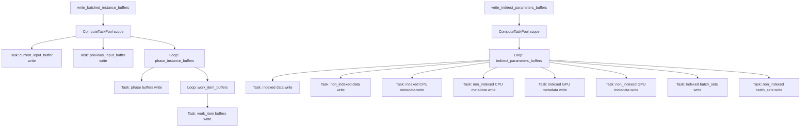

+++
title = "#22314 Parallel GPU buffer writes"
date = "2026-01-05T00:00:00"
draft = false
template = "pull_request_page.html"
in_search_index = true

[taxonomies]
list_display = ["show"]

[extra]
current_language = "en"
available_languages = {"en" = { name = "English", url = "/pull_request/bevy/2026-01/pr-22314-en-20260105" }, "zh-cn" = { name = "中文", url = "/pull_request/bevy/2026-01/pr-22314-zh-cn-20260105" }}
labels = ["A-Rendering", "C-Performance"]
+++

# Title: Parallel GPU buffer writes

## Basic Information
- **Title**: Parallel GPU buffer writes
- **PR Link**: https://github.com/bevyengine/bevy/pull/22314
- **Author**: aevyrie
- **Status**: MERGED
- **Labels**: A-Rendering, C-Performance, S-Ready-For-Final-Review
- **Created**: 2025-12-30T05:22:13Z
- **Merged**: 2026-01-05T02:56:13Z
- **Merged By**: alice-i-cecile

## Description Translation

# Objective

- After a series of optimizations making render and postupdate more parallel, `write_batched_instance_buffers` was regularly one of the largest spans with very low thread use, sitting at 4ms in 1 4ms frame. This makes it an ideal target to improve throughput. Note this screenshot doesn't include some visibility system optimizations:


## Solution

- Spawn tasks for writing buffers to the GPU. This is especially helpful for `current_input_buffer` and `previous_input_buffer`, which take about the same time and are the longest buffer writes - moving these to tasks effectively halves the time spent in the system.


- In the 250k bevymark_3d stress test, this saves 1.7ms in the system, and 2.8ms in frame time

frametime


system


## Testing

- `cargo rer bevymark_3d --features=debug,trace_tracy -- --benchmark --waves 250 --per-wave 1000`

## The Story of This Pull Request

This pull request addresses a performance bottleneck in Bevy's rendering pipeline. After previous optimizations had parallelized other parts of the render and postupdate systems, the `write_batched_instance_buffers` function emerged as a significant performance issue. Tracy profiling showed this function taking approximately 4ms per frame with very low thread utilization, making it a prime candidate for optimization.

The core problem was sequential GPU buffer writes. The original implementation performed all buffer write operations one after another, which failed to leverage available CPU parallelism. This was particularly noticeable for two large buffers: `current_input_buffer` and `previous_input_buffer`, which took roughly equal time to write. Since these operations were independent and could execute concurrently, the sequential execution was wasting potential performance gains.

The solution implements parallel GPU buffer writes using Bevy's task system. The key insight was that writing different buffers to the GPU are independent operations that can safely run in parallel. By spawning these operations as separate tasks, the system can overlap the work and better utilize available CPU cores.

The implementation approach used Bevy's `ComputeTaskPool` to create a scope for parallel execution. Within this scope, individual buffer write operations are spawned as async tasks. This allows the system to execute multiple buffer writes simultaneously, reducing the overall time spent in the function.

For `write_batched_instance_buffers`, the implementation creates tasks for:
1. Writing the current input buffer
2. Writing the previous input buffer  
3. Writing phase instance buffers for each render phase
4. Writing work item buffers for each render phase

Similarly, `write_indirect_parameters_buffers` was refactored to parallelize writes of indexed and non-indexed buffer components. Each buffer component (data, CPU metadata, GPU metadata, batch sets) gets its own task, allowing for parallel execution across all render phases.

The implementation includes tracing spans for each task to maintain profiling visibility. This was important for verifying the parallelization worked correctly and for future performance analysis.

The performance impact was significant. In the 250k bevymark_3d stress test, this optimization saved 1.7ms in the system execution time and 2.8ms in overall frame time. The parallel execution effectively halved the time spent writing the two largest buffers by allowing them to write concurrently.

This optimization follows a pattern seen in high-performance rendering engines: parallelizing independent GPU operations to hide latency and better utilize multi-core CPUs. The approach is particularly effective because GPU buffer writes often involve memory transfers that can be CPU-bound, making parallel execution beneficial even when the GPU itself might be busy with other work.

One important implementation detail is the use of `&*render_device` and `&*render_queue` to create references that can be moved into the async tasks. This avoids borrowing issues and ensures each task has the necessary resources to perform the write operations.

The changes maintain the same safety guarantees as the original code. Each buffer write operation remains independent, and the task scope ensures all writes complete before the function returns. This preserves the existing synchronization behavior while improving performance through parallel execution.

This optimization demonstrates an important principle in game engine development: after optimizing the high-level algorithms, it's often necessary to look at low-level operations like memory transfers for further performance gains. The parallelization approach used here can serve as a template for optimizing other sequential GPU operations in the rendering pipeline.

## Visual Representation



## Key Files Changed

### `crates/bevy_render/src/batching/gpu_preprocessing.rs` (+129/-82)

This file contains the main changes that parallelize GPU buffer writes. The modifications transform two functions from sequential execution to parallel execution using Bevy's task system.

**Before - Sequential execution in `write_batched_instance_buffers`:**
```rust
current_input_buffer
    .buffer
    .write_buffer(&render_device, &render_queue);
previous_input_buffer
    .buffer
    .write_buffer(&render_device, &render_queue);

for phase_instance_buffers in phase_instance_buffers.values_mut() {
    // ... sequential writes for each phase
    data_buffer.write_buffer(&render_device);
    late_indexed_indirect_parameters_buffer.write_buffer(&render_device, &render_queue);
    
    for phase_work_item_buffers in work_item_buffers.values_mut() {
        // ... sequential writes for each work item buffer
        match *phase_work_item_buffers {
            PreprocessWorkItemBuffers::Direct(ref mut buffer_vec) => {
                buffer_vec.write_buffer(&render_device, &render_queue);
            }
            // ... other cases
        }
    }
}
```

**After - Parallel execution using tasks:**
```rust
ComputeTaskPool::get().scope(|scope| {
    scope.spawn(async {
        let _span = tracing::info_span!("write_current_input_buffers").entered();
        current_input_buffer
            .buffer
            .write_buffer(render_device, render_queue);
    });
    scope.spawn(async {
        let _span = tracing::info_span!("write_previous_input_buffers").entered();
        previous_input_buffer
            .buffer
            .write_buffer(render_device, render_queue);
    });

    for phase_instance_buffers in phase_instance_buffers.values_mut() {
        // ... spawn tasks for phase buffers
        scope.spawn(async {
            let _span = tracing::info_span!("write_phase_instance_buffers").entered();
            data_buffer.write_buffer(render_device);
            // ... other buffer writes
        });
        
        for phase_work_item_buffers in work_item_buffers.values_mut() {
            scope.spawn(async {
                let _span = tracing::info_span!("write_work_item_buffers").entered();
                match *phase_work_item_buffers {
                    PreprocessWorkItemBuffers::Direct(ref mut buffer_vec) => {
                        buffer_vec.write_buffer(render_device, render_queue);
                    }
                    // ... other cases
                }
            });
        }
    }
});
```

Similar changes were made to `write_indirect_parameters_buffers`, where each buffer component write was moved into its own task within a `ComputeTaskPool` scope.

## Further Reading

1. **Bevy Task System**: Understanding Bevy's task system and `ComputeTaskPool` is essential for similar optimizations. The Bevy documentation on parallel programming patterns provides relevant context.

2. **GPU Buffer Management**: For background on GPU buffer operations and why they benefit from parallelization, resources on modern graphics API usage (Vulkan/DirectX 12/Metal) explain the CPU-GPU interaction patterns.

3. **Tracy Profiler**: The profiling screenshots in the PR description come from Tracy, a real-time telemetry profiler. Learning to use profiling tools effectively is crucial for identifying performance bottlenecks like this one.

4. **Amdahl's Law**: This optimization demonstrates Amdahl's Law in practice - after parallelizing other parts of the system, the sequential buffer writes became the limiting factor for overall performance improvement.

5. **Async Rust Patterns**: The implementation uses async/await patterns within the task system. Resources on Rust's async programming model help understand the scoping and lifetime management techniques used in this PR.