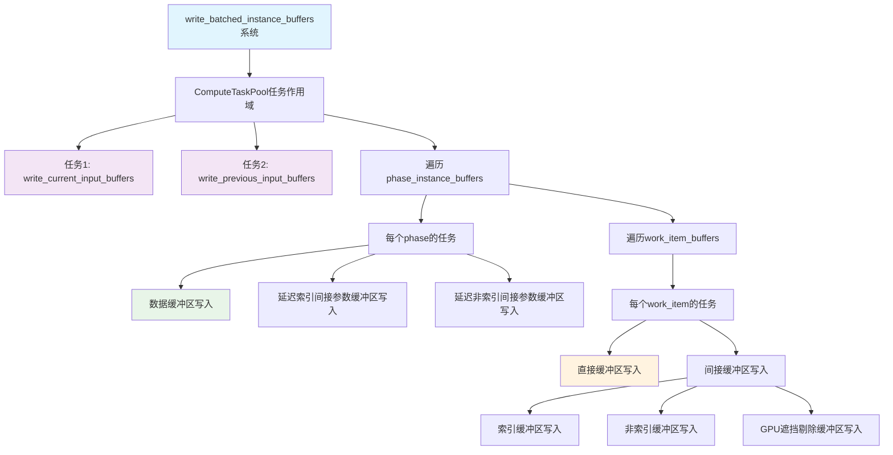

+++
title = "#22314 Parallel GPU buffer writes"
date = "2026-01-05T00:00:00"
draft = false
template = "pull_request_page.html"
in_search_index = false

[extra]
current_language = "zh-cn"
available_languages = {"en" = { name = "English", url = "/pull_request/bevy/2026-01/pr-22314-en-20260105" }, "zh-cn" = { name = "中文", url = "/pull_request/bevy/2026-01/pr-22314-zh-cn-20260105" }}
+++

# Parallel GPU buffer writes

## 基本信息
- **标题**: Parallel GPU buffer writes
- **PR链接**: https://github.com/bevyengine/bevy/pull/22314
- **作者**: aevyrie
- **状态**: 已合并
- **标签**: A-Rendering, C-Performance, S-Ready-For-Final-Review
- **创建时间**: 2025-12-30T05:22:13Z
- **合并时间**: 2026-01-05T02:56:13Z
- **合并者**: alice-i-cecile

## 描述翻译

### 目标
- 经过一系列优化使渲染和postupdate更加并行化后，`write_batched_instance_buffers`经常成为最大的span之一，但线程利用率非常低，在1个4ms帧中耗时4ms。这使其成为提高吞吐量的理想目标。请注意，此截图不包含一些可见性系统优化：


### 解决方案
- 为将缓冲区写入GPU的任务创建任务。这对于`current_input_buffer`和`previous_input_buffer`特别有帮助，这两个缓冲区耗时大致相同，且是写入时间最长的缓冲区 - 将它们移至任务中实际上将系统花费的时间减半。


- 在250k bevymark_3d压力测试中，这为系统节省了1.7ms，帧时间节省了2.8ms

帧时间


系统


### 测试
- `cargo rer bevymark_3d --features=debug,trace_tracy -- --benchmark --waves 250 --per-wave 1000`

## 本次PR的技术分析

### 问题背景和性能瓶颈
在Bevy渲染流水线的性能优化过程中，开发团队已经实施了一系列并行化改进，使得渲染和postupdate阶段的并行度得到提升。然而，在性能分析中发现了`write_batched_instance_buffers`系统存在明显的性能瓶颈。该系统负责将实例缓冲区数据写入GPU，但在之前的实现中是顺序执行的，导致即使在其他部分已经并行化的情况下，这个系统仍然消耗大量时间且线程利用率低。

从性能分析截图可以看出，在4ms的帧时间内，`write_batched_instance_buffers`占据了大约4ms的时间，这意味着它实际上是单线程执行的，没有充分利用现代CPU的多核心架构。这种情况在GPU渲染中特别值得关注，因为CPU和GPU之间的数据传输往往是性能关键路径。

### 解决方案：任务并行化
开发者选择了使用Bevy的任务系统来并行化GPU缓冲区写入操作。核心思路是将原本顺序执行的缓冲区写入操作分解为多个独立任务，这些任务可以并行执行，从而充分利用多核CPU的计算能力。

解决方案的关键技术点包括：
1. 使用`ComputeTaskPool::get().scope`创建任务作用域
2. 为每个主要的缓冲区写入操作创建独立的任务
3. 为每个任务添加追踪span以便性能分析
4. 确保资源在任务间正确共享

### 实现细节
在`write_batched_instance_buffers`函数中，主要进行了以下改造：

首先，从同步模式转变为异步任务模式：
```rust
// 修改前：顺序执行
current_input_buffer.buffer.write_buffer(&render_device, &render_queue);
previous_input_buffer.buffer.write_buffer(&render_device, &render_queue);

// 修改后：任务并行化
ComputeTaskPool::get().scope(|scope| {
    scope.spawn(async {
        let _span = tracing::info_span!("write_current_input_buffers").entered();
        current_input_buffer.buffer.write_buffer(render_device, render_queue);
    });
    scope.spawn(async {
        let _span = tracing::info_span!("write_previous_input_buffers").entered();
        previous_input_buffer.buffer.write_buffer(render_device, render_queue);
    });
    // ... 更多任务
});
```

这里有几个重要的技术细节：
1. **资源预处理**：将`render_device`和`render_queue`从`Res`资源中解引用并获取引用，避免在每个任务中重复解引用：
   ```rust
   let render_device = &*render_device;
   let render_queue = &*render_queue;
   ```

2. **嵌套任务结构**：对于多级嵌套的缓冲区结构，开发者创建了相应层级的任务。例如，对于每个`phase_instance_buffers`，都创建了一个单独的任务来写入其数据缓冲区和间接参数缓冲区。

3. **条件写入的保留**：在`PreprocessWorkItemBuffers::Indirect`分支中，条件写入逻辑（如`if !late_indexed.is_empty()`）被完整保留，确保只有在缓冲区非空时才执行写入操作。

同样地，`write_indirect_parameters_buffers`函数也进行了类似的并行化改造，为每个缓冲区的不同部分（数据、CPU元数据、GPU元数据、批处理集）创建了独立的任务。

### 技术挑战和考量
在实现并行化时，开发者需要处理几个技术挑战：

1. **借用检查器**：由于多个任务需要访问相同的资源，开发者需要确保所有任务都只持有共享资源的不可变引用。通过提前获取资源引用并传递给任务，避免了借用冲突。

2. **任务粒度**：任务划分需要平衡并行度和任务开销。过细的任务划分会增加任务调度开销，而过粗的任务划分则无法充分利用多核。从实现看，开发者选择了按照缓冲区类型和阶段来划分任务，这是一个合理的权衡。

3. **性能追踪**：每个任务都添加了追踪span，这在调试和性能分析中非常有用，可以帮助识别哪个具体任务成为新的瓶颈。

### 性能提升和影响
根据PR描述中的性能数据，这个优化带来了显著的性能提升：

1. **系统时间减少**：`write_batched_instance_buffers`系统本身的时间减少了1.7ms
2. **帧时间减少**：整体帧时间减少了2.8ms
3. **线程利用率提升**：从单线程顺序执行转变为多任务并行执行

特别值得注意的是，`current_input_buffer`和`previous_input_buffer`的写入时间大致相同，将它们并行化后，理论上可以将这两个操作的执行时间从`t1 + t2`减少到`max(t1, t2)`，这正是实现中提到的"时间减半"效果。

### 架构影响和扩展性
这个修改对Bevy的渲染架构有几个积极影响：

1. **更好的可扩展性**：随着场景复杂度的增加和缓冲区数量的增长，并行化方案能够更好地利用更多CPU核心。

2. **为未来优化奠定基础**：这种任务并行化的模式可以应用到其他类似的GPU数据上传操作中。

3. **与现有系统的兼容性**：修改保持了原有API的兼容性，不需要改变其他系统如何使用这些缓冲区。

### 潜在风险和注意事项
虽然这个优化带来了显著的性能提升，但也有一些需要注意的地方：

1. **任务调度开销**：对于非常小的缓冲区，创建任务的成本可能超过并行执行带来的收益。
2. **内存一致性**：并行写入操作需要确保GPU能够正确接收所有数据，但Bevy的底层图形API抽象已经处理了这些同步问题。
3. **调试复杂性**：并行执行使得调试更加复杂，但添加的追踪span有助于缓解这个问题。

## 可视化表示



## 关键文件修改

### `crates/bevy_render/src/batching/gpu_preprocessing.rs`
**修改说明**: 将GPU缓冲区写入操作从顺序执行改为并行任务执行，显著提高了多核CPU利用率。

**主要修改**:
1. 引入`bevy_tasks::ComputeTaskPool`用于创建并行任务
2. 重构`write_batched_instance_buffers`函数，使用任务作用域并行执行缓冲区写入
3. 重构`write_indirect_parameters_buffers`函数，同样实现并行化
4. 为每个任务添加追踪span以便性能分析

**代码示例 - 修改前的关键部分**:
```rust
// 顺序执行缓冲区写入
current_input_buffer
    .buffer
    .write_buffer(&render_device, &render_queue);
previous_input_buffer
    .buffer
    .write_buffer(&render_device, &render_queue);

for phase_instance_buffers in phase_instance_buffers.values_mut() {
    // ... 顺序处理每个phase
    data_buffer.write_buffer(&render_device);
    // ... 更多顺序写入
}
```

**代码示例 - 修改后的关键部分**:
```rust
// 并行执行缓冲区写入
let render_device = &*render_device;
let render_queue = &*render_queue;

ComputeTaskPool::get().scope(|scope| {
    scope.spawn(async {
        let _span = tracing::info_span!("write_current_input_buffers").entered();
        current_input_buffer
            .buffer
            .write_buffer(render_device, render_queue);
    });
    scope.spawn(async {
        let _span = tracing::info_span!("write_previous_input_buffers").entered();
        previous_input_buffer
            .buffer
            .write_buffer(render_device, render_queue);
    });
    
    // 并行处理每个phase
    for phase_instance_buffers in phase_instance_buffers.values_mut() {
        scope.spawn(async {
            let _span = tracing::info_span!("write_phase_instance_buffers").entered();
            // 并行写入
            data_buffer.write_buffer(render_device);
            // ...
        });
    }
});
```

## 进一步阅读

1. **Bevy任务系统文档**: 了解`ComputeTaskPool`和其他任务原语的使用
2. **GPU缓冲区管理**: 理解现代图形API中的缓冲区上传最佳实践
3. **并行编程模式**: 学习任务并行化和数据并行化的不同方法
4. **性能分析技术**: 如何使用tracing等工具识别和解决性能瓶颈

# 完整代码差异
```diff
diff --git a/crates/bevy_render/src/batching/gpu_preprocessing.rs b/crates/bevy_render/src/batching/gpu_preprocessing.rs
index 21780b222797d..71ba6a82872d8 100644
--- a/crates/bevy_render/src/batching/gpu_preprocessing.rs
+++ b/crates/bevy_render/src/batching/gpu_preprocessing.rs
@@ -15,6 +15,7 @@ use bevy_ecs::{
 use bevy_encase_derive::ShaderType;
 use bevy_math::UVec4;
 use bevy_platform::collections::{hash_map::Entry, HashMap, HashSet};
+use bevy_tasks::ComputeTaskPool;
 use bevy_utils::{default, TypeIdMap};
 use bytemuck::{Pod, Zeroable};
 use encase::{internal::WriteInto, ShaderSize};
@@ -2017,56 +2018,74 @@ pub fn write_batched_instance_buffers<GFBD>(
         phase_instance_buffers,
     } = gpu_array_buffer.into_inner();
 
-    current_input_buffer
-        .buffer
-        .write_buffer(&render_device, &render_queue);
-    previous_input_buffer
-        .buffer
-        .write_buffer(&render_device, &render_queue);
-
-    for phase_instance_buffers in phase_instance_buffers.values_mut() {
-        let UntypedPhaseBatchedInstanceBuffers {
-            ref mut data_buffer,
-            ref mut work_item_buffers,
-            ref mut late_indexed_indirect_parameters_buffer,
-            ref mut late_non_indexed_indirect_parameters_buffer,
-        } = *phase_instance_buffers;
-
-        data_buffer.write_buffer(&render_device);
-        late_indexed_indirect_parameters_buffer.write_buffer(&render_device, &render_queue);
-        late_non_indexed_indirect_parameters_buffer.write_buffer(&render_device, &render_queue);
-
-        for phase_work_item_buffers in work_item_buffers.values_mut() {
-            match *phase_work_item_buffers {
-                PreprocessWorkItemBuffers::Direct(ref mut buffer_vec) => {
-                    buffer_vec.write_buffer(&render_device, &render_queue);
-                }
-                PreprocessWorkItemBuffers::Indirect {
-                    ref mut indexed,
-                    ref mut non_indexed,
-                    ref mut gpu_occlusion_culling,
-                } => {
-                    indexed.write_buffer(&render_device, &render_queue);
-                    non_indexed.write_buffer(&render_device, &render_queue);
-
-                    if let Some(GpuOcclusionCullingWorkItemBuffers {
-                        ref mut late_indexed,
-                        ref mut late_non_indexed,
-                        late_indirect_parameters_indexed_offset: _,
-                        late_indirect_parameters_non_indexed_offset: _,
-                    }) = *gpu_occlusion_culling
-                    {
-                        if !late_indexed.is_empty() {
-                            late_indexed.write_buffer(&render_device);
+    let render_device = &*render_device;
+    let render_queue = &*render_queue;
+
+    ComputeTaskPool::get().scope(|scope| {
+        scope.spawn(async {
+            let _span = tracing::info_span!("write_current_input_buffers").entered();
+            current_input_buffer
+                .buffer
+                .write_buffer(render_device, render_queue);
+        });
+        scope.spawn(async {
+            let _span = tracing::info_span!("write_previous_input_buffers").entered();
+            previous_input_buffer
+                .buffer
+                .write_buffer(render_device, render_queue);
+        });
+
+        for phase_instance_buffers in phase_instance_buffers.values_mut() {
+            let UntypedPhaseBatchedInstanceBuffers {
+                ref mut data_buffer,
+                ref mut work_item_buffers,
+                ref mut late_indexed_indirect_parameters_buffer,
+                ref mut late_non_indexed_indirect_parameters_buffer,
+            } = *phase_instance_buffers;
+
+            scope.spawn(async {
+                let _span = tracing::info_span!("write_phase_instance_buffers").entered();
+                data_buffer.write_buffer(render_device);
+                late_indexed_indirect_parameters_buffer.write_buffer(render_device, render_queue);
+                late_non_indexed_indirect_parameters_buffer
+                    .write_buffer(render_device, render_queue);
+            });
+
+            for phase_work_item_buffers in work_item_buffers.values_mut() {
+                scope.spawn(async {
+                    let _span = tracing::info_span!("write_work_item_buffers").entered();
+                    match *phase_work_item_buffers {
+                        PreprocessWorkItemBuffers::Direct(ref mut buffer_vec) => {
+                            buffer_vec.write_buffer(render_device, render_queue);
                         }
-                        if !late_non_indexed.is_empty() {
-                            late_non_indexed.write_buffer(&render_device);
+                        PreprocessWorkItemBuffers::Indirect {
+                            ref mut indexed,
+                            ref mut non_indexed,
+                            ref mut gpu_occlusion_culling,
+                        } => {
+                            indexed.write_buffer(render_device, render_queue);
+                            non_indexed.write_buffer(render_device, render_queue);
+
+                            if let Some(GpuOcclusionCullingWorkItemBuffers {
+                                ref mut late_indexed,
+                                ref mut late_non_indexed,
+                                late_indirect_parameters_indexed_offset: _,
+                                late_indirect_parameters_non_indexed_offset: _,
+                            }) = *gpu_occlusion_culling
+                            {
+                                if !late_indexed.is_empty() {
+                                    late_indexed.write_buffer(render_device);
+                                }
+                                if !late_non_indexed.is_empty() {
+                                    late_non_indexed.write_buffer(render_device);
+                                }
+                            }
                         }
                     }
-                }
+                });
             }
         }
-    }
+    });
 }
 
 pub fn clear_indirect_parameters_buffers(
@@ -2082,43 +2101,71 @@ pub fn write_indirect_parameters_buffers(
     render_queue: Res<RenderQueue>,
     mut indirect_parameters_buffers: ResMut<IndirectParametersBuffers>,
 ) {
-    for phase_indirect_parameters_buffers in indirect_parameters_buffers.values_mut() {
-        phase_indirect_parameters_buffers
-            .indexed
-            .data
-            .write_buffer(&render_device);
-        phase_indirect_parameters_buffers
-            .non_indexed
-            .data
-            .write_buffer(&render_device);
-
-        phase_indirect_parameters_buffers
-            .indexed
-            .cpu_metadata
-            .write_buffer(&render_device, &render_queue);
-        phase_indirect_parameters_buffers
-            .non_indexed
-            .cpu_metadata
-            .write_buffer(&render_device, &render_queue);
-
-        phase_indirect_parameters_buffers
-            .non_indexed
-            .gpu_metadata
-            .write_buffer(&render_device);
-        phase_indirect_parameters_buffers
-            .indexed
-            .gpu_metadata
-            .write_buffer(&render_device);
-
-        phase_indirect_parameters_buffers
-            .indexed
-            .batch_sets
-            .write_buffer(&render_device, &render_queue);
-        phase_indirect_parameters_buffers
-            .non_indexed
-            .batch_sets
-            .write_buffer(&render_device, &render_queue);
-    }
+    let render_device = &*render_device;
+    let render_queue = &*render_queue;
+    ComputeTaskPool::get().scope(|scope| {
+        for phase_indirect_parameters_buffers in indirect_parameters_buffers.values_mut() {
+            scope.spawn(async {
+                let _span = tracing::info_span!("indexed_data").entered();
+                phase_indirect_parameters_buffers
+                    .indexed
+                    .data
+                    .write_buffer(render_device);
+            });
+            scope.spawn(async {
+                let _span = tracing::info_span!("non_indexed_data").entered();
+                phase_indirect_parameters_buffers
+                    .non_indexed
+                    .data
+                    .write_buffer(render_device);
+            });
+
+            scope.spawn(async {
+                let _span = tracing::info_span!("indexed_cpu_metadata").entered();
+                phase_indirect_parameters_buffers
+                    .indexed
+                    .cpu_metadata
+                    .write_buffer(render_device, render_queue);
+            });
+            scope.spawn(async {
+                let _span = tracing::info_span!("non_indexed_cpu_metadata").entered();
+                phase_indirect_parameters_buffers
+                    .non_indexed
+                    .cpu_metadata
+                    .write_buffer(render_device, render_queue);
+            });
+
+            scope.spawn(async {
+                let _span = tracing::info_span!("non_indexed_gpu_metadata").entered();
+                phase_indirect_parameters_buffers
+                    .non_indexed
+                    .gpu_metadata
+                    .write_buffer(render_device);
+            });
+            scope.spawn(async {
+                let _span = tracing::info_span!("indexed_gpu_metadata").entered();
+                phase_indirect_parameters_buffers
+                    .indexed
+                    .gpu_metadata
+                    .write_buffer(render_device);
+            });
+
+            scope.spawn(async {
+                let _span = tracing::info_span!("indexed_batch_sets").entered();
+                phase_indirect_parameters_buffers
+                    .indexed
+                    .batch_sets
+                    .write_buffer(render_device, render_queue);
+            });
+            scope.spawn(async {
+                let _span = tracing::info_span!("non_indexed_batch_sets").entered();
+                phase_indirect_parameters_buffers
+                    .non_indexed
+                    .batch_sets
+                    .write_buffer(render_device, render_queue);
+            });
+        }
+    });
 }
 
 #[cfg(test)]
```