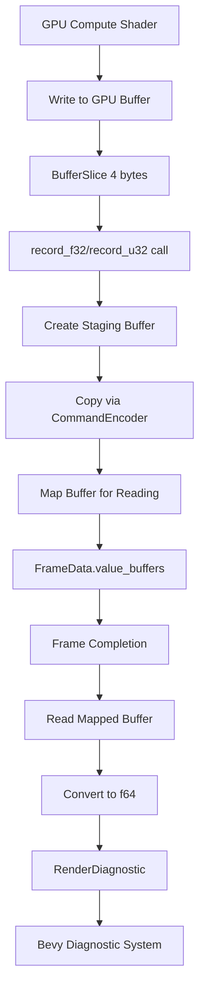

+++
title = "#22326 Add render diagnostic functions for reading from a buffer"
date = "2026-01-07T00:00:00"
draft = false
template = "pull_request_page.html"
in_search_index = true

[taxonomies]
list_display = ["show"]

[extra]
current_language = "en"
available_languages = {"en" = { name = "English", url = "/pull_request/bevy/2026-01/pr-22326-en-20260107" }, "zh-cn" = { name = "中文", url = "/pull_request/bevy/2026-01/pr-22326-zh-cn-20260107" }}
labels = ["C-Feature", "A-Rendering", "A-Diagnostics", "M-Release-Note"]
+++

# Title
## Add render diagnostic functions for reading from a buffer

## Basic Information
- **Title**: Add render diagnostic functions for reading from a buffer
- **PR Link**: https://github.com/bevyengine/bevy/pull/22326
- **Author**: JMS55
- **Status**: MERGED
- **Labels**: C-Feature, A-Rendering, S-Ready-For-Final-Review, A-Diagnostics, M-Release-Note, X-Uncontroversial
- **Created**: 2025-12-31T18:06:58Z
- **Merged**: 2026-01-07T06:19:25Z
- **Merged By**: alice-i-cecile

## Description Translation
See release note file.

Tested locally on a modified copy of Solari.

## The Story of This Pull Request

This PR addresses a specific limitation in Bevy's render diagnostics system. Prior to this change, developers could measure GPU execution times and track performance metrics, but there was no straightforward way to read custom numerical data from GPU buffers and expose it through the diagnostic system. This capability is particularly useful for monitoring GPU-computed values like particle counts, simulation metrics, or custom rendering statistics that are computed on the GPU and stored in buffers.

The core problem was architectural: GPU buffers typically can't be directly read by the CPU without explicit synchronization and data transfer operations. The existing diagnostics system was designed around timing measurements using timestamp queries, but lacked the infrastructure to handle buffer reads.

The solution approach extends the existing `RecordDiagnostics` trait with two new methods: `record_f32` and `record_u32`. These methods accept a buffer slice containing a single 32-bit value and orchestrate its transfer from GPU to CPU memory, then expose it through Bevy's diagnostic system. The implementation follows a pattern consistent with Bevy's existing render diagnostics, using the same async mapping approach already established for timestamp queries.

From an implementation perspective, the changes are relatively contained but require careful handling of GPU-CPU synchronization. When a developer calls `record_f32` or `record_u32`, the system creates a staging buffer with `MAP_READ` usage, copies the data from the source buffer using `copy_buffer_to_buffer`, and schedules the buffer to be mapped after command submission. The actual value extraction happens when the frame completes and the buffer becomes available for CPU reading.

The key technical insight is that this leverages the same deferred processing mechanism already used for timestamp queries. The `FrameData` struct now maintains a `value_buffers` vector that stores buffers awaiting CPU readback, alongside their diagnostic names and type information. When the frame completes, these buffers are processed alongside the timestamp queries, converting the raw bytes to the appropriate numeric type (f32 or u32) and then to f64 for consistency with the existing diagnostic system.

There are important constraints documented in the API: the buffer slice must be exactly 4 bytes, and the source buffer must have `BufferUsages::COPY_SRC`. These requirements ensure correctness and prevent runtime errors. The assertions in the code provide clear error messages when these conditions aren't met.

The impact of this change is straightforward: it enables render graph nodes and GPU compute shaders to expose computed metrics through Bevy's existing diagnostic infrastructure. This is particularly valuable for debugging and performance monitoring of GPU-driven systems where critical data lives in GPU memory. The integration with the existing diagnostic path system means these values appear alongside other render diagnostics with paths like "render/my_diagnostics/foo", maintaining consistency with Bevy's diagnostic conventions.

## Visual Representation



## Key Files Changed

1. **`crates/bevy_render/src/diagnostic/internal.rs`** (+101/-2)
   - Added `record_f32` and `record_u32` methods to `DiagnosticsRecorder` implementation
   - Added `record_value` method to `FrameData` for handling buffer copy and mapping
   - Extended `FrameData` struct to store pending value buffers
   - Added processing logic for value buffers during frame completion

Key code additions:
```rust
// New methods in DiagnosticsRecorder implementation
fn record_f32<N>(&self, command_encoder: &mut CommandEncoder, buffer: &BufferSlice, name: N)
where
    N: Into<Cow<'static, str>>,
{
    assert_eq!(
        buffer.size(),
        BufferSize::new(4).unwrap(),
        "DiagnosticsRecorder::record_f32 buffer slice must be 4 bytes long"
    );
    // ... validation and call to record_value
}

// New field in FrameData struct
value_buffers: Vec<(Buffer, Cow<'static, str>, bool)>,

// New method in FrameData implementation
fn record_value(
    &mut self,
    command_encoder: &mut CommandEncoder,
    buffer: &BufferSlice,
    name: Cow<'static, str>,
    is_f32: bool,
) {
    // Create staging buffer, copy data, and map it
    let dest_buffer = self.device.create_buffer(&BufferDescriptor {
        label: Some(&format!("render_diagnostic_{name}")),
        size: 4,
        usage: BufferUsages::COPY_DST | BufferUsages::MAP_READ,
        mapped_at_creation: false,
    });

    command_encoder.copy_buffer_to_buffer(
        buffer.buffer(),
        buffer.offset(),
        &dest_buffer,
        0,
        Some(buffer.size().into()),
    );

    command_encoder.map_buffer_on_submit(&dest_buffer, MapMode::Read, .., |_| {});

    self.value_buffers.push((dest_buffer, name, is_f32));
}
```

2. **`crates/bevy_render/src/diagnostic/mod.rs`** (+33/-0)
   - Added `record_f32` and `record_u32` to the `RecordDiagnostics` trait
   - Implemented these methods for `Option<Arc<T>>` wrapper
   - Updated documentation with usage instructions

Key code additions:
```rust
/// Reads a f32 from the specified buffer and uploads it as a diagnostic.
///
/// The provided buffer slice must be 4 bytes long, and the buffer must have [`wgpu::BufferUsages::COPY_SRC`];
fn record_f32<N>(&self, command_encoder: &mut CommandEncoder, buffer: &BufferSlice, name: N)
where
    N: Into<Cow<'static, str>>;

impl<T: RecordDiagnostics> RecordDiagnostics for Option<Arc<T>> {
    fn record_f32<N>(&self, command_encoder: &mut CommandEncoder, buffer: &BufferSlice, name: N)
    where
        N: Into<Cow<'static, str>>,
    {
        if let Some(recorder) = &self {
            recorder.record_f32(command_encoder, buffer, name);
        }
    }
    // ... similar for record_u32
}
```

3. **`release-content/release-notes/render_diagnostics_additions.md`** (+35/-0)
   - Created new release note documenting the feature
   - Provided example usage in a `ViewNode` implementation

## Further Reading

- [WebGPU Buffer Mapping](https://gpuweb.github.io/gpuweb/#buffer-mapping) - WebGPU specification on buffer mapping operations
- [Bevy Render Diagnostics Documentation](https://docs.rs/bevy/latest/bevy/render/diagnostic/index.html) - Existing Bevy render diagnostics system
- [GPU Timestamp Queries](https://www.khronos.org/registry/vulkan/specs/1.3-extensions/html/vkspec.html#queries-timestamps) - Background on GPU timestamp queries (similar async pattern)
- [wgpu Buffer Usage Flags](https://docs.rs/wgpu/latest/wgpu/struct.BufferUsages.html) - Documentation on buffer usage constraints