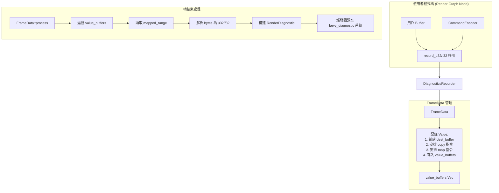

+++
title = "#22326"
date = "2026-01-07T00:00:00"
draft = false
template = "pull_request_page.html"
in_search_index = false

[extra]
current_language = "zh-cn"
available_languages = {"en" = { name = "English", url = "/pull_request/bevy/2026-01/pr-22326-en-20260107" }, "zh-cn" = { name = "中文", url = "/pull_request/bevy/2026-01/pr-22326-zh-cn-20260107" }}
+++

# Title
## 基本資訊
- **標題**: Add render diagnostic functions for reading from a buffer
- **PR 連結**: https://github.com/bevyengine/bevy/pull/22326
- **作者**: JMS55
- **狀態**: 已合併 (MERGED)
- **標籤**: C-Feature, A-Rendering, S-Ready-For-Final-Review, A-Diagnostics, M-Release-Note, X-Uncontroversial
- **創建時間**: 2025-12-31T18:06:58Z
- **合併時間**: 2026-01-07T06:19:25Z
- **合併者**: alice-i-cecile

## 描述翻譯
請參閱 release note 文件。

在 Solari 的修改副本上進行了本地測試。

## 這個 Pull Request 的故事

### 問題與情境
Bevy 引擎的渲染診斷系統（RenderDiagnosticsPlugin）提供了一個強大的框架，用於追蹤和可視化渲染管線的性能與行為。然而，在 PR #22326 之前，這個系統主要專注於記錄時間跨度（time spans）和時間戳（timestamps），例如測量特定渲染階段的耗時。這對於性能分析很有用，但存在一個限制：無法直接從 GPU 計算的結果（儲存在 `wgpu::Buffer` 中）讀取具體的數值並將其作為診斷數據上報。

想像一個場景：開發者寫了一個計算著色器（compute shader）來統計場景中的三角形數量，或計算某個後處理效果的權重總和。這些計算結果會寫入 GPU 緩衝區（GPU buffer）。在之前的系統中，要將這個結果用於診斷（例如在性能分析工具中顯示），開發者必須手動將緩衝區內容讀回 CPU（這涉及到非同步映射和回調），然後再想辦法將其注入到 Bevy 的診斷系統。這個過程繁瑣且與現有的診斷收集流程脫節。

因此，需要一種機制，能夠在渲染圖（Render Graph）的節點（Node）執行過程中，方便地將 GPU 緩衝區中的特定數值（例如一個 `u32` 或 `f32`）標記為診斷數據，並讓系統自動處理數據的讀取與上報。

### 解決方案與方法
這個 PR 採取的方案直接且實用：在現有的 `RecordDiagnostics` trait 和其實現 `DiagnosticsRecorder` 中，新增兩個方法：`record_u32` 和 `record_f32`。這兩個方法允許開發者指定一個命令編碼器（`CommandEncoder`）、一個指向 GPU 緩衝區中特定 4 字節區域的切片（`BufferSlice`），以及一個診斷路徑名稱。

其核心工作流程是：
1.  **提交指令**：在渲染節點的執行過程中，調用 `record_u32` 或 `record_f32`。
2.  **GPU 複製**：在 GPU 端，通過 `copy_buffer_to_buffer` 指令，將源緩衝區（用戶提供的）中的 4 字節數據複製到一個專門創建的、用於映射（map）的目標緩衝區。這個目標緩衝區具有 `COPY_DST | MAP_READ` 用途。
3.  **請求映射**：在同一命令編碼器上，調用 `map_buffer_on_submit` 來安排對目標緩衝區的讀取映射。這是一個非同步操作，將在命令提交後由系統驅動程序在後台處理。
4.  **緩存元數據**：將目標緩衝區、診斷名稱以及數據類型（是否是 `f32`）存入當前幀的 `FrameData` 中。
5.  **異步讀取與上報**：在幀結束、命令被提交並執行後，系統會處理所有已安排映射的緩衝區。它讀取映射後的內存，根據存儲的類型信息將原始字節解析為 `u32` 或 `f32`，然後構造 `RenderDiagnostic` 物件，並通過回調函數將其發送到 Bevy 的診斷系統。

這個設計巧妙地利用了現有的診斷收集架構。`FrameData` 原本就管理著時間戳查詢集和跨度記錄，現在只是擴展其職責，同時管理一組“值緩衝區”（`value_buffers`）。最終的診斷結果處理邏輯（在 `FrameData::process` 和 `FrameData::process_without_queries` 中）被統一更新，以遍歷這些值緩衝區、讀取數據並生成診斷條目。

### 具體實現
主要的實現變更集中在 `crates/bevy_render/src/diagnostic/internal.rs` 檔案中。

首先，`DiagnosticsRecorder` 為 `RecordDiagnostics` trait 實現了新的 `record_f32` 和 `record_u32` 方法。這些方法首先進行防禦性斷言（assertions），確保傳入的緩衝區切片大小為 4 字節，並且源緩衝區具備 `COPY_SRC` 用途，這是執行複製指令所必需的。然後，它們將工作委託給 `FrameData::record_value` 方法。

```rust
// 在 `impl RecordDiagnostics for DiagnosticsRecorder` 中新增的方法
fn record_f32<N>(&self, command_encoder: &mut CommandEncoder, buffer: &BufferSlice, name: N)
where
    N: Into<Cow<'static, str>>,
{
    assert_eq!(
        buffer.size(),
        BufferSize::new(4).unwrap(),
        "DiagnosticsRecorder::record_f32 buffer slice must be 4 bytes long"
    );
    assert!(
        buffer.buffer().usage().contains(BufferUsages::COPY_SRC),
        "DiagnosticsRecorder::record_f32 buffer must have BufferUsages::COPY_SRC"
    );

    self.current_frame_lock()
        .record_value(command_encoder, buffer, name.into(), true);
}
```

`FrameData` 結構體新增了一個字段 `value_buffers`，用於存儲待處理的診斷值緩衝區。關鍵的邏輯在 `record_value` 方法裡：

```rust
fn record_value(
    &mut self,
    command_encoder: &mut CommandEncoder,
    buffer: &BufferSlice,
    name: Cow<'static, str>,
    is_f32: bool,
) {
    // 1. 創建一個用於接收數據和映射的目標緩衝區
    let dest_buffer = self.device.create_buffer(&BufferDescriptor {
        label: Some(&format!("render_diagnostic_{name}")),
        size: 4,
        usage: BufferUsages::COPY_DST | BufferUsages::MAP_READ,
        mapped_at_creation: false,
    });

    // 2. 安排從源緩衝區到目標緩衝區的複製指令
    command_encoder.copy_buffer_to_buffer(
        buffer.buffer(),
        buffer.offset(),
        &dest_buffer,
        0,
        Some(buffer.size().into()),
    );

    // 3. 安排對目標緩衝區的映射（用於後續讀取）
    command_encoder.map_buffer_on_submit(&dest_buffer, MapMode::Read, .., |_| {});

    // 4. 保存元信息以供幀結束時處理
    self.value_buffers.push((dest_buffer, name, is_f32));
}
```

最後，在處理幀數據的兩個函數（`process` 和 `process_without_queries`）末尾，都新增了遍歷 `value_buffers` 的邏輯。它讀取每個緩衝區的映射範圍（`get_mapped_range`），將原始字節按小端序（`from_le_bytes`）解析為對應的類型，並構建 `RenderDiagnostic`。診斷路徑被構造為 `render/<diagnostic_name>` 的形式，與其他渲染診斷保持一致。

```rust
for (buffer, diagnostic_path, is_f32) in self.value_buffers.drain(..) {
    let buffer = buffer.get_mapped_range(..);
    diagnostics.push(RenderDiagnostic {
        path: DiagnosticPath::from_components(
            core::iter::once("render").chain(core::iter::once(diagnostic_path.as_ref())),
        ),
        suffix: "",
        value: if is_f32 {
            f32::from_le_bytes((*buffer).try_into().unwrap()) as f64
        } else {
            u32::from_le_bytes((*buffer).try_into().unwrap()) as f64
        },
    });
}
```

為了讓這個新功能對外可用，在 `crates/bevy_render/src/diagnostic/mod.rs` 中：
1.  在 `RecordDiagnostics` trait 裡聲明了 `record_f32` 和 `record_u32` 方法。
2.  為 `Option<Arc<T>>` 實現了這兩個方法，這使得可選的診斷記錄器使用起來更方便。

### 技術要點與考量
1.  **非同步性與性能**：這個實現完全是非同步的。`map_buffer_on_submit` 只是安排了一個映射請求，實際的數據傳輸發生在 GPU 命令執行之後，由驅動程序和系統在後台處理。這避免了阻塞渲染線程。數據讀取和診斷回調的執行被延遲到幀結束、確保數據可用時才進行。
2.  **緩衝區生命週期與安全性**：目標緩衝區由 `FrameData` 擁有，並在其處理過程中被消耗（`drain`）。`get_mapped_range` 返回的映射視圖在該語句塊結束後會被自動釋放，這確保了資源的正確管理。斷言檢查有助於在開發早期捕獲錯誤的 API 使用方式。
3.  **架構一致性**：新功能無縫集成到現有的診斷收集流程中。它複用了 `FrameData` 的生命週期管理和回調機制，新增的診斷數據與時間跨度診斷一樣，最終都被封裝進 `RenderDiagnostics` 結構體並傳遞給相同的回調接口。
4.  **使用約束**：API 明確要求緩衝區切片必須是 4 字節（對應 `u32`/`f32` 的大小），且源緩衝區必須有 `COPY_SRC` 用途。這是對底層 `wgpu` API 要求的直接反映，也是實現複製操作的必要條件。開發者需要確保他們的計算著色器或其它寫入操作符合這些前提。

### 影響與價值
這個 PR 為 Bevy 渲染引擎的診斷系統增加了重要的靈活性。它解決了一個具體的工程需求：將 GPU 計算的結果便捷地反饋到 CPU 端的監控和調試工具中。現在，開發者無需自行實現繁瑣的緩衝區讀回和數據傳遞邏輯，只需幾行代碼即可將 GPU 端的任何標量值（`u32`/`f32`）註冊為診斷指標。

例如，可以用來：
-   報告每個幀中通過 GPU 驅動裁剪（frustum culling）後可見的實體數量。
-   上報後處理鏈中某個步驟計算出的平均亮度值。
-   監控計算著色器分配的間接調度參數。

這使得性能剖析和行為調試可以深入到由 GPU 計算決定的細節層面，增強了開發者對渲染管線的觀察和控制能力。實現本身是緊湊、高效且符合現有架構模式的，是一個典型的功能增強型 PR。

## 視覺化表示



## 關鍵檔案變更

1.  **`crates/bevy_render/src/diagnostic/internal.rs`** (+101/-2)
    - **變更原因與描述**：這是實現的核心。擴展了 `DiagnosticsRecorder` 和 `FrameData`，以支持從 GPU 緩衝區讀取並記錄 `u32`/`f32` 診斷值。
    - **關鍵程式碼片段**：
      ```rust
      // 新增的 record_value 方法 (在 FrameData 中)
      fn record_value(&mut self, command_encoder: &mut CommandEncoder, buffer: &BufferSlice, name: Cow<'static, str>, is_f32: bool) {
          let dest_buffer = self.device.create_buffer(&BufferDescriptor {
              label: Some(&format!("render_diagnostic_{name}")),
              size: 4,
              usage: BufferUsages::COPY_DST | BufferUsages::MAP_READ,
              mapped_at_creation: false,
          });

          command_encoder.copy_buffer_to_buffer(...);
          command_encoder.map_buffer_on_submit(...);

          self.value_buffers.push((dest_buffer, name, is_f32));
      }

      // 在 process 函數中新增的處理循環
      for (buffer, diagnostic_path, is_f32) in self.value_buffers.drain(..) {
          let buffer = buffer.get_mapped_range(..);
          diagnostics.push(RenderDiagnostic {
              path: DiagnosticPath::from_components(...),
              suffix: "",
              value: if is_f32 { f32::from_le_bytes(...) as f64 } else { u32::from_le_bytes(...) as f64 },
          });
      }
      ```

2.  **`crates/bevy_render/src/diagnostic/mod.rs`** (+33/-0)
    - **變更原因與描述**：更新公共 API。在 `RecordDiagnostics` trait 中聲明新方法，並為 `Option<Arc<T>>` 提供實現，以保證 API 的易用性。
    - **關鍵程式碼片段**：
      ```rust
      // 在 RecordDiagnostics trait 中新增
      fn record_f32<N>(&self, command_encoder: &mut CommandEncoder, buffer: &BufferSlice, name: N)
      where
          N: Into<Cow<'static, str>>;

      // 為 Option<Arc<T>> 提供實現
      impl<T: RecordDiagnostics> RecordDiagnostics for Option<Arc<T>> {
          fn record_f32<N>(&self, command_encoder: &mut CommandEncoder, buffer: &BufferSlice, name: N) where N: Into<Cow<'static, str>>, {
              if let Some(recorder) = &self {
                  recorder.record_f32(command_encoder, buffer, name);
              }
          }
          // ... 省略 record_u32 的類似實現
      }
      ```

3.  **`release-content/release-notes/render_diagnostics_additions.md`** (+35/-0)
    - **變更原因與描述**：新增發布說明檔案，提供新功能的使用範例和說明。
    - **關鍵程式碼片段**：
      ```rust
      // 來自發布說明的範例
      diagnostics.record_u32(
          render_context.command_encoder(),
          &my_buffer1.slice(..), // Buffer slice must be 4 bytes, and buffer must have BufferUsages::COPY_SRC
          "my_diagnostics/foo",
      );
      ```

## 延伸閱讀
- **Bevy 官方文件：RenderDiagnosticsPlugin**: https://docs.rs/bevy/0.19.0/bevy/render/diagnostic/struct.RenderDiagnosticsPlugin.html
- **`wgpu` Buffer 與映射文件**: 了解 `BufferUsages`、`copy_buffer_to_buffer` 和 `map_buffer_on_submit` 的工作原理。
- **Bevy Render Graph 指南**: 理解如何在自定義的 `ViewNode` 或 `Node` 中獲取 `RenderContext` 和 `diagnostic_recorder`。