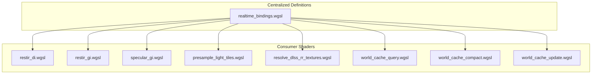

+++
title = "#22328 Deduplicate solari realtime bindings"
date = "2026-01-05T00:00:00"
draft = false
template = "pull_request_page.html"
in_search_index = true

[taxonomies]
list_display = ["show"]

[extra]
current_language = "en"
available_languages = {"en" = { name = "English", url = "/pull_request/bevy/2026-01/pr-22328-en-20260105" }, "zh-cn" = { name = "中文", url = "/pull_request/bevy/2026-01/pr-22328-zh-cn-20260105" }}
labels = ["A-Rendering", "C-Code-Quality"]
+++

# Deduplicate solari realtime bindings

## Basic Information
- **Title**: Deduplicate solari realtime bindings
- **PR Link**: https://github.com/bevyengine/bevy/pull/22328
- **Author**: SparkyPotato
- **Status**: MERGED
- **Labels**: A-Rendering, C-Code-Quality, S-Ready-For-Final-Review
- **Created**: 2025-12-31T21:12:20Z
- **Merged**: 2026-01-05T02:58:29Z
- **Merged By**: alice-i-cecile

## Description Translation
Most solari realtime passes redeclare the same resources in the same bind group. This PR collects all the bindings into one file, along with the struct definitions required for them.

## The Story of This Pull Request

The PR addresses a code duplication issue in the Bevy engine's solari realtime rendering system. Multiple WGSL shader files were independently declaring the same bind group resources and data structures, which created maintenance overhead and increased the risk of inconsistencies.

When examining the solari realtime shaders before this change, it was clear that several passes - including `restir_di.wgsl`, `restir_gi.wgsl`, `specular_gi.wgsl`, and others - were all declaring similar sets of bindings at the top of their files. Each shader was defining its own version of resources like `view_output`, `gbuffer`, `depth_buffer`, `view`, and various world cache buffers. This duplication wasn't just about bindings - even complex data structures like `ResolvedLightSamplePacked` and `Reservoir` were being redefined in multiple places.

The core issue was that any change to these shared resources required modifications across multiple files. For example, if the layout of the `Reservoir` struct needed adjustment, developers would have to find and update every shader file that declared it. This was error-prone and violated the DRY (Don't Repeat Yourself) principle.

The solution implemented in this PR follows a straightforward refactoring approach: create a single shared file (`realtime_bindings.wgsl`) that contains all common bindings and struct definitions, then have individual shaders import from this centralized location. This pattern is already established in Bevy's rendering system with other shared modules.

The implementation creates `realtime_bindings.wgsl` with 24 bindings (0-23) that cover the full set of resources needed by the solari realtime passes. It defines three key structs:
- `ResolvedLightSamplePacked`: Used for packed light sample data
- `Reservoir`: Used for ReSTIR (ReSTIR算法是一种实时光线追踪降噪技术) reservoirs in global illumination
- `WorldCacheGeometryData`: Used for world cache geometry information

Each struct includes important comments warning developers about maintaining structure sizes in sync with corresponding CPU-side code. The bindings file is then loaded as a shader library in the plugin initialization.

The changes to individual shader files follow a consistent pattern: remove local declarations and replace them with imports. For example, in `restir_di.wgsl`:

Before the change, the file had 15 lines of binding declarations and struct definitions. After the change, it imports everything from `realtime_bindings` with a single line: `#import bevy_solari::realtime_bindings::{view_output, light_tile_samples, light_tile_resolved_samples, di_reservoirs_a, di_reservoirs_b, gbuffer, depth_buffer, motion_vectors, previous_gbuffer, previous_depth_buffer, view, previous_view, constants, ResolvedLightSamplePacked}`.

This approach offers several advantages:
1. **Maintainability**: Changes to bindings or struct layouts now only need to be made in one place.
2. **Consistency**: All shaders use the exact same definitions, eliminating potential subtle bugs from mismatched declarations.
3. **Reduced file size**: The shader files become significantly smaller and more focused on their specific algorithms rather than boilerplate declarations.
4. **Clarity**: It's immediately clear which resources a shader uses by examining its imports.

The refactoring also revealed that some shaders were importing more than they needed. For instance, `presample_light_tiles.wgsl` was importing the entire `presample_light_tiles` module just to get the `unpack_resolved_light_sample` function, when it really only needed that specific function. This wasn't changed in this PR, but the clearer structure makes such optimizations more apparent.

One technical consideration is that WGSL's import system works at compile time, so there's no runtime performance impact from this change. The GPU sees the same final shader code after imports are resolved. The main benefit is developer productivity and code quality.

The changes affect 10 files total, with the key transformation being the creation of the new bindings file and the simplification of 5 main shader files that previously contained duplicated declarations. The net result is a cleaner, more maintainable codebase that's easier to extend and debug.

## Visual Representation



## Key Files Changed

### 1. `crates/bevy_solari/src/realtime/realtime_bindings.wgsl` (+63/-0)
This is the new file that centralizes all shared bindings and struct definitions. It contains:
- All 24 bindings (0-23) used by solari realtime passes
- Three critical struct definitions with size warnings
- Push constants definition used across multiple shaders

```wgsl
#define_import_path bevy_solari::realtime_bindings

#import bevy_render::view::View
#import bevy_pbr::prepass_bindings::PreviousViewUniforms
#import bevy_solari::sampling::LightSample

@group(1) @binding(0) var view_output: texture_storage_2d<rgba16float, read_write>;
@group(1) @binding(1) var<storage, read_write> light_tile_samples: array<LightSample>;
// ... (23 total bindings)

struct ResolvedLightSamplePacked {
    world_position_x: f32,
    world_position_y: f32,
    world_position_z: f32,
    world_normal: u32,
    radiance: u32,
    inverse_pdf: f32,
}

struct Reservoir {
    sample_point_world_position: vec3<f32>,
    weight_sum: f32,
    radiance: vec3<f32>,
    confidence_weight: f32,
    sample_point_world_normal: vec3<f32>,
    unbiased_contribution_weight: f32,
}
```

### 2. `crates/bevy_solari/src/realtime/world_cache_query.wgsl` (+12/-22)
This file previously contained its own declarations of world cache buffers and the `WorldCacheGeometryData` struct. Now it imports them from the centralized bindings.

**Before:**
```wgsl
struct WorldCacheGeometryData {
    world_position: vec3<f32>,
    padding_a: u32,
    world_normal: vec3<f32>,
    padding_b: u32
}

@group(1) @binding(14) var<storage, read_write> world_cache_checksums: array<atomic<u32>, #{WORLD_CACHE_SIZE}>;
// ... (9 more buffer declarations)
```

**After:**
```wgsl
#import bevy_solari::realtime_bindings::{
    world_cache_life,
    world_cache_checksums,
    world_cache_radiance,
    world_cache_geometry_data,
    world_cache_luminance_deltas,
    world_cache_a,
    world_cache_b,
    world_cache_active_cell_indices,
    world_cache_active_cells_count,
    WorldCacheGeometryData,
}
```

### 3. `crates/bevy_solari/src/realtime/restir_gi.wgsl` (+1/-23)
This shader for global illumination using ReSTIR previously had its own binding declarations and the `Reservoir` struct definition. Now it imports everything needed.

**Before:**
```wgsl
@group(1) @binding(0) var view_output: texture_storage_2d<rgba16float, read_write>;
@group(1) @binding(5) var<storage, read_write> gi_reservoirs_a: array<Reservoir>;
// ... (12 more lines of bindings)

struct PushConstants { frame_index: u32, reset: u32 }
var<push_constant> constants: PushConstants;

// ... (later in the file)

struct Reservoir {
    sample_point_world_position: vec3<f32>,
    weight_sum: f32,
    radiance: vec3<f32>,
    confidence_weight: f32,
    sample_point_world_normal: vec3<f32>,
    unbiased_contribution_weight: f32,
}
```

**After:**
```wgsl
#import bevy_solari::realtime_bindings::{view_output, gi_reservoirs_a, gi_reservoirs_b, gbuffer, depth_buffer, motion_vectors, previous_gbuffer, previous_depth_buffer, view, previous_view, constants, Reservoir}
```

### 4. `crates/bevy_solari/src/realtime/restir_di.wgsl` (+2/-16)
This direct illumination shader saw similar simplification, removing 16 lines of duplicate bindings.

### 5. `crates/bevy_solari/src/realtime/presample_light_tiles.wgsl` (+1/-15)
This shader for light tile presampling was simplified by importing bindings instead of declaring them locally.

### 6. `crates/bevy_solari/src/realtime/mod.rs` (+1/-0)
The plugin was updated to load the new shader library:
```rust
load_shader_library!(app, "realtime_bindings.wgsl");
```

## Further Reading

- [WGSL Shader Modules Documentation](https://www.w3.org/TR/WGSL/#shader-module-creation)
- [Bevy's Shader Import System](https://github.com/bevyengine/bevy/blob/main/crates/bevy_render/src/render_resource/shader.rs)
- [ReSTIR (Real-time Spatiotemporal Reservoir Resampling) Paper](https://research.nvidia.com/sites/default/files/pubs/2020-07_Spatiotemporal-reservoir-resampling/ReSTIR.pdf)
- [DRY Principle in Software Development](https://en.wikipedia.org/wiki/Don%27t_repeat_yourself)