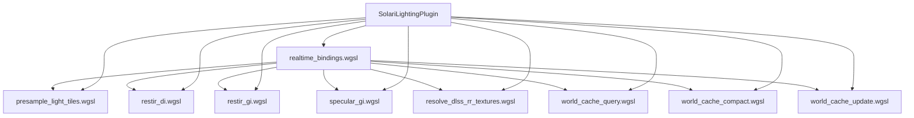

+++
title = "#22328 Deduplicate solari realtime bindings"
date = "2026-01-05T00:00:00"
draft = false
template = "pull_request_page.html"
in_search_index = false

[extra]
current_language = "zh-cn"
available_languages = {"en" = { name = "English", url = "/pull_request/bevy/2026-01/pr-22328-en-20260105" }, "zh-cn" = { name = "中文", url = "/pull_request/bevy/2026-01/pr-22328-zh-cn-20260105" }}
+++

# Deduplicate solari realtime bindings

## 基本信息
- **标题**: Deduplicate solari realtime bindings
- **PR链接**: https://github.com/bevyengine/bevy/pull/22328
- **作者**: SparkyPotato
- **状态**: 已合并
- **标签**: A-Rendering, C-Code-Quality, S-Ready-For-Final-Review
- **创建时间**: 2025-12-31T21:12:20Z
- **合并时间**: 2026-01-05T02:58:29Z
- **合并人**: alice-i-cecile

## 描述翻译
大多数 solari realtime 着色器通道重新声明了相同的资源，位于相同的绑定组中。此 PR 将所有绑定收集到一个文件中，同时包含这些绑定所需的结构体定义。

## 此 Pull Request 的技术分析

### 问题和背景

在 Bevy 引擎的 solari 实时渲染系统中，多个计算着色器（compute shader）需要访问相同的图形资源，如纹理、缓冲区（buffers）和统一变量（uniforms）。这些资源在多个不同的 WGSL 文件中被重复声明，导致代码冗余和维护困难。

具体来说，以下文件都包含大量相同的绑定声明：
- `presample_light_tiles.wgsl`
- `restir_di.wgsl`  
- `restir_gi.wgsl`
- `specular_gi.wgsl`
- `resolve_dlss_rr_textures.wgsl`
- `world_cache_query.wgsl`
- `world_cache_update.wgsl`

每个文件都声明了相同的 `@group(1)` 绑定，包括输出纹理、深度缓冲、GBuffer、运动向量等。此外，一些关键的数据结构（如 `ResolvedLightSamplePacked`、`Reservoir`、`WorldCacheGeometryData`）也在多个文件中重复定义。

### 解决方案

开发者创建了一个新的中央绑定文件 `realtime_bindings.wgsl`，将所有共享的绑定和结构体定义集中管理。然后更新所有相关着色器文件，通过 `#import` 语句导入这些共享定义，而不是重复声明。

这种方法遵循了 DRY（Don't Repeat Yourself）原则，减少了代码重复，提高了可维护性。当一个绑定需要更改时，现在只需修改一个文件，而不是多个文件。

### 实现细节

#### 1. 创建中央绑定文件

首先创建 `realtime_bindings.wgsl` 文件，定义了所有共享资源：

```wgsl
// 文件: crates/bevy_solari/src/realtime/realtime_bindings.wgsl
#define_import_path bevy_solari::realtime_bindings

#import bevy_render::view::View
#import bevy_pbr::prepass_bindings::PreviousViewUniforms
#import bevy_solari::sampling::LightSample

@group(1) @binding(0) var view_output: texture_storage_2d<rgba16float, read_write>;
@group(1) @binding(1) var<storage, read_write> light_tile_samples: array<LightSample>;
@group(1) @binding(2) var<storage, read_write> light_tile_resolved_samples: array<ResolvedLightSamplePacked>;
// ... 更多绑定定义

struct PushConstants { frame_index: u32, reset: u32 }
var<push_constant> constants: PushConstants;

// Don't adjust the size of this struct without also adjusting `prepare::RESOLVED_LIGHT_SAMPLE_STRUCT_SIZE`.
struct ResolvedLightSamplePacked {
    world_position_x: f32,
    world_position_y: f32,
    world_position_z: f32,
    world_normal: u32,
    radiance: u32,
    inverse_pdf: f32,
}

// Don't adjust the size of this struct without also adjusting `prepare::GI_RESERVOIR_STRUCT_SIZE`.
struct Reservoir {
    sample_point_world_position: vec3<f32>,
    weight_sum: f32,
    radiance: vec3<f32>,
    confidence_weight: f32,
    sample_point_world_normal: vec3<f32>,
    unbiased_contribution_weight: f32,
}

struct WorldCacheGeometryData {
    world_position: vec3<f32>,
    padding_a: u32,
    world_normal: vec3<f32>,
    padding_b: u32
}
```

注意文件中的两个重要注释，强调了当结构体大小需要调整时，必须同时更新相应的 Rust 代码中的常量定义。这表明了 WGSL 着色器和 Rust 代码之间的紧密耦合关系。

#### 2. 更新着色器文件

所有相关着色器文件都进行了类似的修改，以导入共享绑定而不是重复声明。以 `presample_light_tiles.wgsl` 为例：

**修改前：**
```wgsl
// 文件: crates/bevy_solari/src/realtime/presample_light_tiles.wgsl
#import bevy_pbr::utils::{octahedral_encode, octahedral_decode}
#import bevy_render::view::View
#import bevy_solari::sampling::{generate_random_light_sample, LightSample, ResolvedLightSample}

@group(1) @binding(1) var<storage, read_write> light_tile_samples: array<LightSample>;
@group(1) @binding(2) var<storage, read_write> light_tile_resolved_samples: array<ResolvedLightSamplePacked>;
@group(1) @binding(12) var<uniform> view: View;
struct PushConstants { frame_index: u32, reset: u32 }
var<push_constant> constants: PushConstants;

// ... ResolvedLightSamplePacked 结构体定义
```

**修改后：**
```wgsl
// 文件: crates/bevy_solari/src/realtime/presample_light_tiles.wgsl
#import bevy_pbr::utils::{octahedral_encode, octahedral_decode}
#import bevy_render::view::View
#import bevy_solari::sampling::{generate_random_light_sample, LightSample, ResolvedLightSample}
#import bevy_solari::realtime_bindings::{light_tile_samples, light_tile_resolved_samples, view, constants, ResolvedLightSamplePacked}

// 移除了重复的绑定和结构体声明
```

#### 3. 插件系统更新

更新 `mod.rs` 以加载新的着色器库：

```rust
// 文件: crates/bevy_solari/src/realtime/mod.rs
impl Plugin for SolariLightingPlugin {
    fn build(&self, app: &mut App) {
        load_shader_library!(app, "gbuffer_utils.wgsl");
        load_shader_library!(app, "realtime_bindings.wgsl");  // 新增
        load_shader_library!(app, "presample_light_tiles.wgsl");
        // ... 其他着色器加载
    }
}
```

### 技术见解

1. **WGSL 模块化系统**：Bevy 的着色器系统支持模块化导入，类似于 Rust 的模块系统。这使得创建共享库文件成为可能。

2. **绑定组织**：所有共享绑定都位于 `@group(1)` 中，这表明它们是统一管理的资源。这种组织方式使得资源绑定更加清晰，便于理解和管理。

3. **原子操作（atomic operations）**：在 `world_cache_life` 缓冲区中使用了条件编译来处理原子操作与非原子操作的区别：
```wgsl
#ifdef WORLD_CACHE_NON_ATOMIC_LIFE_BUFFER
@group(1) @binding(15) var<storage, read_write> world_cache_life: array<u32, #{WORLD_CACHE_SIZE}>;
#else
@group(1) @binding(15) var<storage, read_write> world_cache_life: array<atomic<u32>, #{WORLD_CACHE_SIZE}>;
#endif
```
这显示了 Bevy 着色器系统对不同硬件平台和性能需求的适应能力。

4. **内存布局注意事项**：结构体定义中的注释强调了与 Rust 代码中常量定义的一致性要求，这反映了着色器与主机代码之间需要保持内存布局同步的重要性。

### 影响

1. **代码质量提升**：显著减少了代码重复，使着色器代码更加简洁、易于维护。

2. **减少错误风险**：当绑定或结构体需要更改时，现在只需修改一个地方，减少了遗漏更新某个文件的风险。

3. **提高开发效率**：新开发者更容易理解系统结构，因为所有共享资源都在一个中心位置定义。

4. **潜在的编译时间优化**：虽然可能不是主要目标，但减少重复代码也可能略微改善编译时间。

5. **为未来的重构奠定基础**：这种模块化方法使得将来对绑定系统进行更大规模的重构变得更加容易。

## 视觉表示



## 关键文件变更

### `crates/bevy_solari/src/realtime/realtime_bindings.wgsl` (+63/-0)
**新增文件**，包含所有实时着色器共享的绑定和结构体定义。

**关键代码：**
```wgsl
// 定义导入路径
#define_import_path bevy_solari::realtime_bindings

// 所有共享绑定位于 @group(1)
@group(1) @binding(0) var view_output: texture_storage_2d<rgba16float, read_write>;
@group(1) @binding(1) var<storage, read_write> light_tile_samples: array<LightSample>;
// ... 更多绑定

// 共享结构体定义
struct ResolvedLightSamplePacked {
    world_position_x: f32,
    world_position_y: f32,
    world_position_z: f32,
    world_normal: u32,
    radiance: u32,
    inverse_pdf: f32,
}
```

**关系**：这是此 PR 的核心，集中管理所有共享资源。

### `crates/bevy_solari/src/realtime/presample_light_tiles.wgsl` (+12/-22)
**移除重复绑定和结构体定义**，改用导入。

**修改前：**
```wgsl
@group(1) @binding(1) var<storage, read_write> light_tile_samples: array<LightSample>;
@group(1) @binding(2) var<storage, read_write> light_tile_resolved_samples: array<ResolvedLightSamplePacked>;
@group(1) @binding(12) var<uniform> view: View;
struct PushConstants { frame_index: u32, reset: u32 }
var<push_constant> constants: PushConstants;

struct ResolvedLightSamplePacked {
    world_position_x: f32,
    world_position_y: f32,
    world_position_z: f32,
    world_normal: u32,
    radiance: u32,
    inverse_pdf: f32,
}
```

**修改后：**
```wgsl
#import bevy_solari::realtime_bindings::{light_tile_samples, light_tile_resolved_samples, view, constants, ResolvedLightSamplePacked}
```

**关系**：从中心绑定文件导入所需资源，删除本地重复定义。

### `crates/bevy_solari/src/realtime/restir_gi.wgsl` (+1/-23)
**大幅简化**，移除多个绑定和 `Reservoir` 结构体定义。

**修改前：**
```wgsl
@group(1) @binding(0) var view_output: texture_storage_2d<rgba16float, read_write>;
@group(1) @binding(5) var<storage, read_write> gi_reservoirs_a: array<Reservoir>;
// ... 更多绑定
struct PushConstants { frame_index: u32, reset: u32 }
var<push_constant> constants: PushConstants;

struct Reservoir {
    sample_point_world_position: vec3<f32>,
    weight_sum: f32,
    radiance: vec3<f32>,
    confidence_weight: f32,
    sample_point_world_normal: vec3<f32>,
    unbiased_contribution_weight: f32,
}
```

**修改后：**
```wgsl
#import bevy_solari::realtime_bindings::{view_output, gi_reservoirs_a, gi_reservoirs_b, gbuffer, depth_buffer, motion_vectors, previous_gbuffer, previous_depth_buffer, view, previous_view, constants, Reservoir}
```

**关系**：导入中心绑定文件，显著减少代码量。

### `crates/bevy_solari/src/realtime/restir_di.wgsl` (+2/-16)
**简化绑定声明**，移除重复部分。

**修改前：**
```wgsl
@group(1) @binding(0) var view_output: texture_storage_2d<rgba16float, read_write>;
@group(1) @binding(1) var<storage, read_write> light_tile_samples: array<LightSample>;
@group(1) @binding(2) var<storage, read_write> light_tile_resolved_samples: array<ResolvedLightSamplePacked>;
// ... 更多绑定
struct PushConstants { frame_index: u32, reset: u32 }
var<push_constant> constants: PushConstants;
```

**修改后：**
```wgsl
#import bevy_solari::realtime_bindings::{view_output, light_tile_samples, light_tile_resolved_samples, di_reservoirs_a, di_reservoirs_b, gbuffer, depth_buffer, motion_vectors, previous_gbuffer, previous_depth_buffer, view, previous_view, constants, ResolvedLightSamplePacked}
```

**关系**：导入中心绑定文件，提高代码一致性。

### `crates/bevy_solari/src/realtime/world_cache_query.wgsl` (+12/-22)
**重构世界缓存相关绑定**，将绑定和结构体移至中心文件。

**修改前：**
```wgsl
struct WorldCacheGeometryData {
    world_position: vec3<f32>,
    padding_a: u32,
    world_normal: vec3<f32>,
    padding_b: u32
}

@group(1) @binding(14) var<storage, read_write> world_cache_checksums: array<atomic<u32>, #{WORLD_CACHE_SIZE}>;
// ... 更多世界缓存绑定
```

**修改后：**
```wgsl
#import bevy_solari::realtime_bindings::{
    world_cache_life,
    world_cache_checksums,
    world_cache_radiance,
    world_cache_geometry_data,
    world_cache_luminance_deltas,
    world_cache_a,
    world_cache_b,
    world_cache_active_cell_indices,
    world_cache_active_cells_count,
    WorldCacheGeometryData,
}
```

**关系**：导入所有世界缓存相关的绑定和结构体，保持功能的完整性。

## 进一步阅读

1. **WGSL 语言规范**: https://www.w3.org/TR/WGSL/ - 了解 WGSL 着色语言的详细规范
2. **Bevy 着色器系统**: Bevy 官方文档中关于着色器和材质系统的部分
3. **DRY 原则**: "Don't Repeat Yourself" 软件设计原则在大型代码库中的应用
4. **GPU 资源绑定**: 现代图形 API 中资源绑定的最佳实践和模式
5. **实时全局光照**: 了解 ReSTIR 等实时全局光照技术的基本原理

## 完整代码差异

已包含在分析中，展示了从重复声明到集中管理的转变过程。