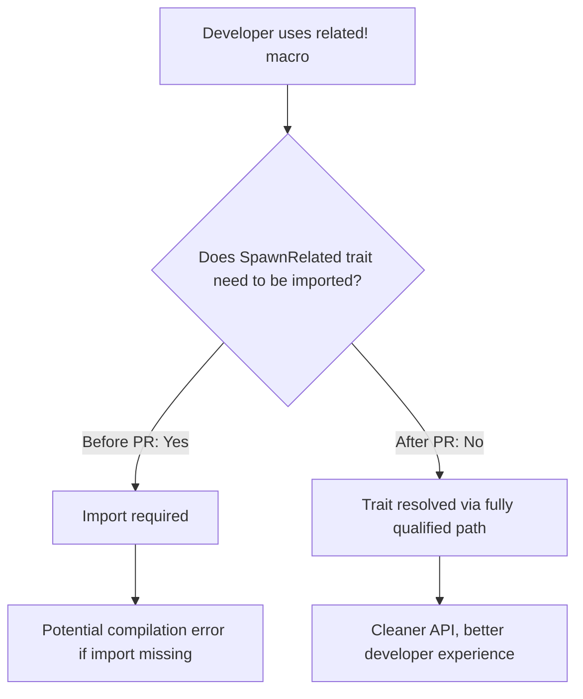

+++
title = "#22331 Remove the need to import `SpawnRelated` to use `related!` macro"
date = "2026-01-01T00:00:00"
draft = false
template = "pull_request_page.html"
in_search_index = true

[taxonomies]
list_display = ["show"]

[extra]
current_language = "en"
available_languages = {"en" = { name = "English", url = "/pull_request/bevy/2026-01/pr-22331-en-20260101" }, "zh-cn" = { name = "中文", url = "/pull_request/bevy/2026-01/pr-22331-zh-cn-20260101" }}
labels = ["D-Trivial", "A-ECS", "C-Usability", "D-Domain-Agnostic"]
+++

# Title

## Basic Information
- **Title**: Remove the need to import `SpawnRelated` to use `related!` macro
- **PR Link**: https://github.com/bevyengine/bevy/pull/22331
- **Author**: ItsDoot
- **Status**: MERGED
- **Labels**: D-Trivial, A-ECS, C-Usability, S-Ready-For-Final-Review, D-Domain-Agnostic
- **Created**: 2026-01-01T04:57:39Z
- **Merged**: 2026-01-01T05:55:50Z
- **Merged By**: alice-i-cecile

## Description Translation
# Objective

Currently in order to use `related!` macro you have to additionally import `SpawnRelated`. We should be able to avoid that.

## Solution

Added an `as SpawnRelated` typecast in the macro expansion.

## Testing

Removed the import from the macro's doctest to prove that it works.

## The Story of This Pull Request

This PR addresses a straightforward usability issue in Bevy's ECS system. The problem was that developers using the `related!` macro had to manually import the `SpawnRelated` trait, which created an unnecessary friction point in the API.

The issue stems from how Rust's trait resolution works. When a macro expands code that calls a trait method, Rust needs to know which trait provides that method. The original implementation of the `related!` macro generated code that called the `spawn` method without fully qualifying the trait path, which meant users had to bring the `SpawnRelated` trait into scope themselves.

The solution is elegantly simple: modify the macro expansion to use a fully qualified trait path. By adding `as $crate::spawn::SpawnRelated` in the macro's expansion, the macro now generates code that explicitly tells Rust which trait provides the `spawn` method. This allows the trait method to be resolved without requiring an explicit import.

Here's the technical implementation: the macro originally expanded to `<relationship_target>::spawn(...)`, which relies on trait inference. The changed version expands to `<relationship_target as $crate::spawn::SpawnRelated>::spawn(...)`, which provides an explicit path to the trait. The `$crate` macro variable ensures the path is correctly resolved relative to the crate root, making the macro work properly even when used from different modules.

The change demonstrates a common pattern in Rust macro design: when macros generate code that calls trait methods, they should use fully qualified paths to avoid requiring users to import traits. This follows the principle of making macros as self-contained as possible, reducing cognitive overhead for developers.

The testing approach was straightforward and effective: the PR author updated the macro's doctest to remove the `SpawnRelated` import, demonstrating that the macro now works without it. This serves as both documentation and verification of the fix.

From an architectural perspective, this change improves the developer experience without affecting runtime performance or requiring changes to the underlying ECS system. It's a pure ergonomics improvement that makes the API more intuitive and reduces the chance of compilation errors due to missing imports.

The PR also shows good attention to detail by removing the unnecessary import of the `Spawn` trait from the doctest, though this wasn't strictly required since `Spawn` is typically in the prelude. This cleanup makes the example cleaner and reinforces that only the essential imports are needed.

## Visual Representation



## Key Files Changed

**crates/bevy_ecs/src/spawn.rs** (+1/-2)

This file contains the implementation of the `related!` macro and its associated traits. The changes are minimal but significant for API usability.

1. **Macro Definition Update**: The core change modifies how the macro resolves the `spawn` method call.

Before:
```rust
#[macro_export]
macro_rules! related {
    ($relationship_target:ty [$($child:expr),*$(,)?]) => {
       <$relationship_target>::spawn($crate::recursive_spawn!($($child),*))
    };
}
```

After:
```rust
#[macro_export]
macro_rules! related {
    ($relationship_target:ty [$($child:expr),*$(,)?]) => {
       <$relationship_target as $crate::spawn::SpawnRelated>::spawn($crate::recursive_spawn!($($child),*))
    };
}
```

The key difference is the addition of `as $crate::spawn::SpawnRelated`, which provides a fully qualified path to the trait.

2. **Doctest Cleanup**: The PR also updates the macro's documentation test to reflect the improved API.

Before:
```rust
/// # use bevy_ecs::name::Name;
/// # use bevy_ecs::world::World;
/// # use bevy_ecs::related;
/// # use bevy_ecs::spawn::{Spawn, SpawnRelated};
```

After:
```rust
/// # use bevy_ecs::name::Name;
/// # use bevy_ecs::world::World;
/// # use bevy_ecs::related;
```

The removal of `use bevy_ecs::spawn::{Spawn, SpawnRelated};` demonstrates that the macro now works without these explicit imports.

## Further Reading

1. **Rust Trait System**: Understanding how Rust resolves trait methods is essential for macro design. The Rust Book's chapter on traits provides a solid foundation: https://doc.rust-lang.org/book/ch10-02-traits.html

2. **Macros in Rust**: For more on Rust macros and how to design them for good ergonomics, the Rust Reference has a comprehensive section on macros: https://doc.rust-lang.org/reference/macros.html

3. **Bevy ECS Documentation**: To understand the broader context of the `related!` macro and entity relationships in Bevy, see the Bevy ECS documentation: https://bevyengine.org/learn/book/ecs/

4. **Fully Qualified Syntax**: The pattern used in this PR (`<Type as Trait>::method`) is known as "fully qualified syntax" in Rust. The Rust Reference covers this: https://doc.rust-lang.org/reference/expressions/call-expr.html#disambiguating-function-calls