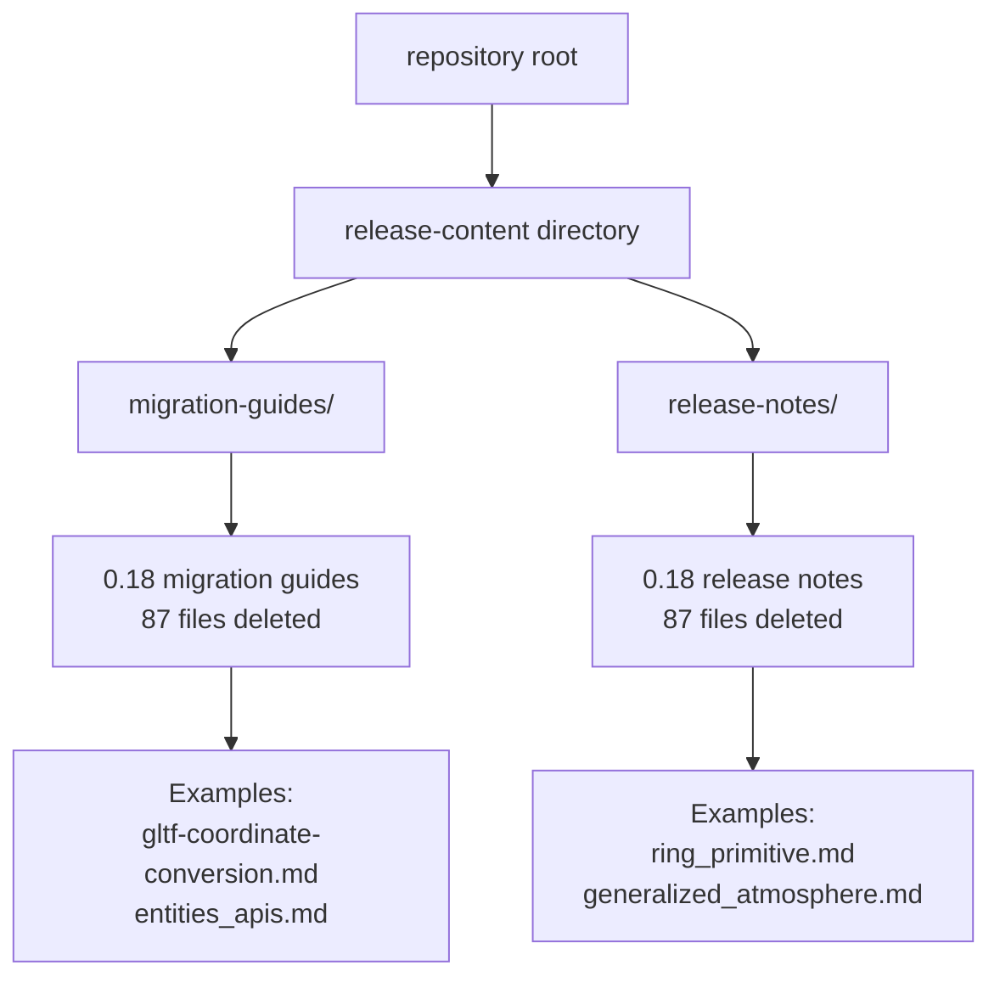

+++
title = "#22338 remove 0.18 release content"
date = "2026-01-01T00:00:00"
draft = false
template = "pull_request_page.html"
in_search_index = true

[taxonomies]
list_display = ["show"]

[extra]
current_language = "en"
available_languages = {"en" = { name = "English", url = "/pull_request/bevy/2026-01/pr-22338-en-20260101" }, "zh-cn" = { name = "中文", url = "/pull_request/bevy/2026-01/pr-22338-zh-cn-20260101" }}
labels = ["A-Meta"]
+++

# remove 0.18 release content

## Basic Information
- **Title**: remove 0.18 release content
- **PR Link**: https://github.com/bevyengine/bevy/pull/22338
- **Author**: mockersf
- **Status**: MERGED
- **Labels**: A-Meta, S-Ready-For-Final-Review
- **Created**: 2026-01-01T17:43:32Z
- **Merged**: 2026-01-01T18:35:43Z
- **Merged By**: alice-i-cecile

## Description Translation
# Objective

- We started merging PRs with 0.19 release content without cleaning the 0.18 first

## Solution

- Do it now

## The Story of This Pull Request

This PR is a straightforward maintenance operation that addresses a version control housekeeping issue. During the Bevy development cycle, each major release generates two categories of documentation files: migration guides (for developers upgrading between versions) and release notes (for users to understand new features). These files live in the `release-content` directory and are version-specific.

The problem emerged when the development team began preparing for the 0.19 release. New PRs started adding 0.19 release content to the repository while the 0.18 release content remained in place. This created a situation where outdated documentation coexisted with current documentation, which could lead to confusion for contributors browsing the main branch. Outdated files might be mistaken for current information, and the repository accumulated unnecessary historical documentation that should instead be accessed through release tags.

The solution was direct and mechanical: delete all 87 files related to the 0.18 release. This includes migration guides like `gltf-coordinate-conversion.md` and `entities_apis.md`, and release notes like `ring_primitive.md` and `generalized_atmosphere.md`. These files served their purpose during the 0.18 release cycle but are no longer needed in the main development branch.

From an engineering perspective, this change carries minimal risk. The removed files are static documentation that remains accessible through Git history and the 0.18 release tag. No code functionality is affected. The operation demonstrates good repository hygiene—keeping the main branch focused on current development reduces cognitive overhead for contributors and maintainers.

The PR was reviewed and merged quickly (within about an hour), indicating consensus on its necessity. The "A-Meta" label correctly categorizes it as a project maintenance task, while "S-Ready-For-Review" suggests it passed initial checks. The rapid merge by a core maintainer reflects the straightforward nature of the change and alignment with project maintenance practices.

This type of cleanup is essential in large projects with regular release cycles. It prevents documentation sprawl and ensures that developers working from the main branch encounter only relevant, current information. The PR exemplifies the practical, no-nonsense maintenance required to keep a large codebase manageable.

## Visual Representation

## Key Files Changed

The PR removes 87 files total. The most significant deletions by line count:

1. **`release-content/release-notes/ring_primitive.md`** (+0/-110)
   - Release note describing the new ring primitive system for creating hollow 2D shapes and 3D extrusions
   - Removed as part of cleaning up 0.18 release documentation

2. **`release-content/migration-guides/gltf-coordinate-conversion.md`** (+0/-96)
   - Migration guide explaining changes to glTF coordinate system handling in 0.18
   - Provided instructions for the new `GltfConvertCoordinates` struct replacing the boolean `use_model_forward_direction`

3. **`release-content/release-notes/automatic_directional_navigation.md`** (+0/-91)
   - Release note for automatic UI navigation graph generation based on spatial positioning
   - Described the `AutoDirectionalNavigation` component that automatically computes navigation connections

4. **`release-content/release-notes/generalized_atmosphere.md`** (+0/-74)
   - Release note for the new `ScatteringMedium` asset system replacing hardcoded atmospheric parameters
   - Explained how to create customizable atmospheric effects beyond Earth-like atmospheres

5. **`release-content/migration-guides/entities_apis.md`** (+0/-71)
   - Comprehensive migration guide for the ECS entity system overhaul in 0.18
   - Detailed changes to entity allocation, spawning, and error handling with the new `EntitiesAllocator`

Since all changes are deletions, there are no before/after code snippets. The files are removed entirely from the repository.

## Further Reading

- [Bevy Release Process](https://github.com/bevyengine/bevy/wiki/Release-Process) - Understanding how Bevy manages versioned documentation
- [Git Maintenance Best Practices](https://git-scm.com/book/en/v2/Distributed-Git-Maintaining-a-Project) - Techniques for keeping repositories clean
- [Semantic Versioning](https://semver.org/) - Background on version numbering that drives release documentation needs
- [Bevy Migration Guides Archive](https://bevyengine.org/learn/migration-guides/) - Official archive of past migration guides (0.18 guides available here)