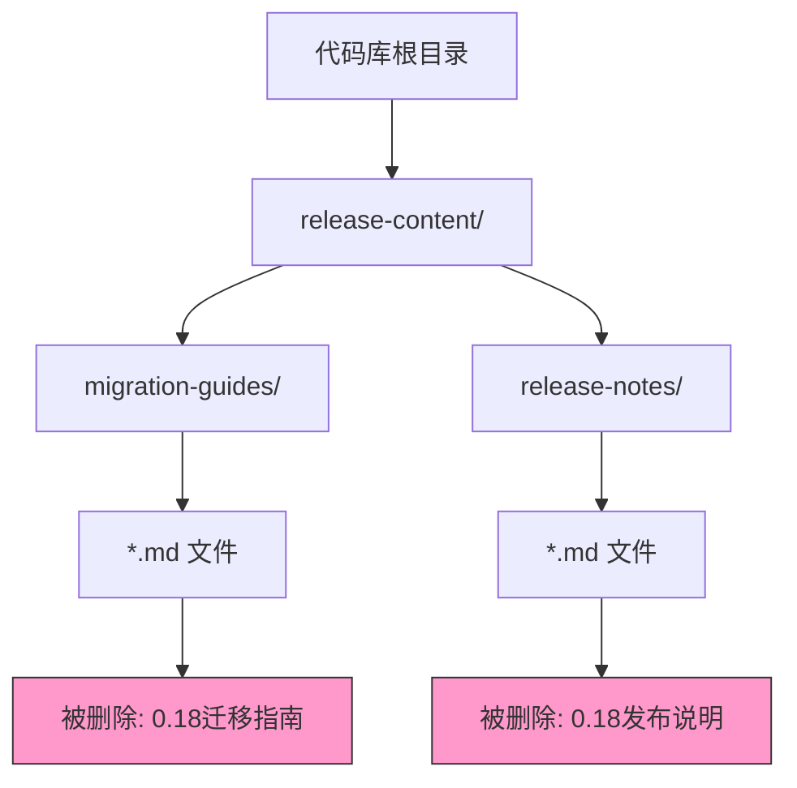

+++
title = "#22338 remove 0.18 release content"
date = "2026-01-01T00:00:00"
draft = false
template = "pull_request_page.html"
in_search_index = false

[extra]
current_language = "zh-cn"
available_languages = {"en" = { name = "English", url = "/pull_request/bevy/2026-01/pr-22338-en-20260101" }, "zh-cn" = { name = "中文", url = "/pull_request/bevy/2026-01/pr-22338-zh-cn-20260101" }}
+++

# remove 0.18 release content

## 基本信息
- **标题**: remove 0.18 release content
- **PR 链接**: https://github.com/bevyengine/bevy/pull/22338
- **作者**: mockersf
- **状态**: 已合并
- **标签**: A-Meta, S-Ready-For-Final-Review
- **创建时间**: 2026-01-01T17:43:32Z
- **合并时间**: 2026-01-01T18:35:43Z
- **合并者**: alice-i-cecile

## 描述翻译

### 目标
- 我们在没有先清理 0.18 版本发布内容的情况下，已经开始合并包含 0.19 版本发布内容的 PR。

### 解决方案
- 现在就进行清理。

## 本次 Pull Request 的技术分析

### 问题与背景
这是一个关于项目维护流程和版本管理的 PR。开发团队在合并针对即将发布的 Bevy 0.19 版本的发布说明（release notes）和迁移指南（migration guides）时，发现了一个流程问题：在添加新版本内容之前，没有先将旧的、已过时的版本内容从代码库中移除。`release-content/` 目录包含了为每个版本准备的文档，例如迁移指南（指导用户如何从上一个版本升级）和发布说明（介绍新版本的重要特性）。保留旧的版本内容会带来几个问题：
1.  **误导性**：对于阅读文档的用户，过时的 0.18 版本指南与最新的 0.19 版本指南并存，容易造成混淆。
2.  **维护负担**：代码库中遗留的无用文件会增加未来的维护成本，例如在重构时需要额外注意这些文件。
3.  **代码清洁度**：不符合“干净代码库”的原则，应移除不再相关的内容。

因此，在进行 0.19 版本的发布准备过程中，必须先将 0.18 版本的内容清理干净。

### 解决方案与实现
解决方案非常直接和实用：批量删除位于 `release-content/` 目录下的所有 0.18 版本相关文件。这通常不是一个复杂的逻辑变更，而是一次性的维护操作。

PR 的实现方式是在 Git 中执行了 87 个文件的删除操作。这些文件分为两类：
1.  **迁移指南 (`migration-guides/`)**: 为开发者从 0.17 版本升级到 0.18 版本提供具体指导的文档。
2.  **发布说明 (`release-notes/`)**: 介绍 0.18 版本中新增功能和重大变化的文档。

通过执行 `git rm` 命令，这些文件被从工作树和版本历史中标记为删除。在合并 PR 后，主分支的 `release-content/` 目录将只包含与当前和未来开发版本（如 0.19）相关的内容。

### 技术见解
这个 PR 虽然不涉及功能性代码，但体现了几项重要的软件工程实践：

1.  **版本化文档管理**：将发布说明和迁移指南与代码一同进行版本控制，确保了文档与特定代码版本的严格对应。当某个版本的生命周期结束后，其专属文档也随之归档或清理。
2.  **自动化流程整合**：理想情况下，此类清理工作应整合到发布流程的检查清单（checklist）或自动化脚本中。这个 PR 的出现说明团队在手动操作流程中发现了缺口，并立即进行了修补。
3.  **最小化技术债务**：及时移除废弃的资产是控制技术债务的有效手段。尽管文档文件不直接影响运行时性能，但它们属于项目资产，维护它们需要认知开销。

### 影响
1.  **代码库清洁度**：直接移除了约 87 个过时文件，使代码库更精简，更专注于当前和未来的开发工作。
2.  **开发体验**：对于新的贡献者或查阅文档的用户，避免了在 `release-content/` 目录中看到多个旧版本指南的困惑。
3.  **流程改进**：此次操作很可能促使团队审视或加固其发布流程，确保未来的版本发布能更有序地进行“先清理，后添加”的步骤。

## 可视化关系图

以下 Mermaid 图说明了此 PR 所影响的目录结构以及文件类型：



## 关键变更文件

以下列出了在此 PR 中被删除的部分重要文件，它们代表了 0.18 版本中的主要变更和特性：

- `release-content/release-notes/ring_primitive.md` (+0/-110) - 0.18 版本中新增的环形图元特性说明。
- `release-content/migration-guides/gltf-coordinate-conversion.md` (+0/-96) - 从 0.17 升级到 0.18 时，glTF 坐标转换设置的迁移指南。
- `release-content/release-notes/automatic_directional_navigation.md` (+0/-91) - 0.18 版本中为 UI 新增的自动方向导航功能说明。
- `release-content/release-notes/generalized_atmosphere.md` (+0/-74) - 0.18 版本中大气散射系统泛化功能的说明。
- `release-content/migration-guides/entities_apis.md` (+0/-71) - ECS 中 Entities API 重大变更的迁移指南。

对于每个文件，变更非常简单：它们被从代码库中完全删除。

**示例：一个迁移指南文件被删除**
```markdown
<!-- 文件: release-content/migration-guides/entities_apis.md -->
<!-- 之前: 文件存在，包含详细的API变更说明 -->
---
title: Entities APIs
pull_requests: [19350, 19433, 19451]
---

Entities are spawned by allocating their id and then giving that id a location within the world.
In 0.17, this was done in one stroke through `spawn` and `Entities::flush`.
In 0.18, the flushing functionality has been removed in favor of `spawn`ing individual `EntityRow`s instead.
...
<!-- 之后: 文件被删除，路径指向 /dev/null -->
```
这些文件的删除是整个 PR 目的的直接体现：为 0.19 版本的内容腾出空间，并保持代码库的整洁。所有被删除的内容均已随 0.18 版本发布，其历史记录仍保存在 Git 中，可供需要时查阅。

## 延伸阅读

- [Semantic Versioning (SemVer)](https://semver.org/) - 理解语义化版本如何指导软件发布和文档管理。
- [Keep a Changelog](https://keepachangelog.com/en/1.0.0/) - 关于如何维护高质量变更日志的最佳实践，与发布说明的理念相通。
- [Bevy 项目贡献指南](https://github.com/bevyengine/bevy/blob/main/CONTRIBUTING.md) - 了解 Bevy 项目的开发与发布流程。

# 完整代码差异
（此处包含用户提供的完整 diff 内容，由于非常冗长，在分析报告中已做总结，原始内容从略。）