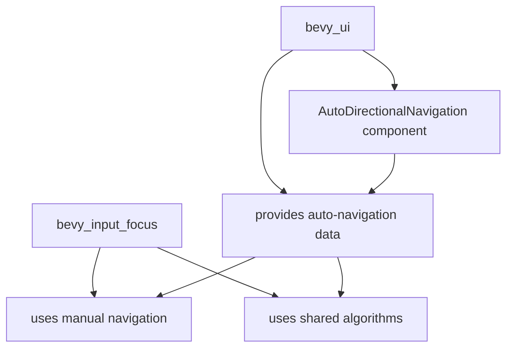

+++
title = "#22340 Remove `bevy_camera` and `bevy_ui` deps from `bevy_input_focus`, no feature flag needed"
date = "2026-01-06T00:00:00"
draft = false
template = "pull_request_page.html"
in_search_index = true

[taxonomies]
list_display = ["show"]

[extra]
current_language = "en"
available_languages = {"en" = { name = "English", url = "/pull_request/bevy/2026-01/pr-22340-en-20260106" }, "zh-cn" = { name = "中文", url = "/pull_request/bevy/2026-01/pr-22340-zh-cn-20260106" }}
labels = ["C-Bug", "A-UI", "C-Code-Quality"]
+++

# Title

## Basic Information
- **Title**: Remove `bevy_camera` and `bevy_ui` deps from `bevy_input_focus`, no feature flag needed
- **PR Link**: https://github.com/bevyengine/bevy/pull/22340
- **Author**: kfc35
- **Status**: MERGED
- **Labels**: C-Bug, A-UI, C-Code-Quality, S-Ready-For-Final-Review
- **Created**: 2026-01-01T18:04:11Z
- **Merged**: 2026-01-06T20:37:48Z
- **Merged By**: alice-i-cecile

## Description Translation
**Objective**

- Fixes #22305
- Avoid feature flagging

**Solution**

Taking inspiration from #22309 and building off of #22333, this moves the auto directional navigation to `bevy_ui` and creates a new system parameter to be used when including automatic navigation.

- directional_navigation.rs of `bevy_input_focus` still contains the `DirectionalNavigation` system parameter, but it now only contains logic to do manual navigation. The `DirectionalNavigationPlugin` is still there, as well as the manual edge map.
- I separated out some code from directional_navigation.rs into two separate files:
1) directional_navigation.rs in `bevy_ui` which contains the automatic navigation code. There is a new system parameter now, `AutoDirectionalNavigator`, that wraps the `DirectionalNavigation` system parameter and does automatic navigation if manual navigation fails.
2) navigator.rs which contains some structs and functions that are used by both the automatic navigation system and the manual navigation code in directional_navigation.rs. This particular refactoring wasn't particularly necessary, but I feel like the code is little more cleaner for it... I can revert this change if desired

If you think a feature is better for this, then let me know whether #22333 should be considered instead.

If this gets merged, I'll open up a pull request against `release-0.18` to update the release notes, basically saying that users who want to leverage `AutoDirectionalNavigation` need to use the `AutoDirectionalNavigator` instead of the existing `DirectionalNavigation` system param.

**Testing**

To ensure no regressions, I tested the directional navigation examples and both work as they did before.
`cargo run --example directional_navigation` - uses the existing `DirectionalNavigation` system parameter
`cargo run --example auto_directional_navigation` - uses the new `AutoDirectionalNavigator` system parameter

## The Story of This Pull Request

This PR addresses a dependency issue in the Bevy engine's input focus system. The problem was that `bevy_input_focus` had unnecessary dependencies on `bevy_camera` and `bevy_ui`, which caused compilation bloat for users who only needed manual navigation functionality. The issue #22305 highlighted this problem, and while a previous solution (#22333) proposed using feature flags, this PR takes a different approach by restructuring the codebase to eliminate the dependencies entirely.

The core insight driving this change is that automatic directional navigation - which requires UI-specific components like `ComputedNode` and `UiGlobalTransform` - logically belongs in the `bevy_ui` crate rather than the more general `bevy_input_focus` crate. The `bevy_input_focus` crate should handle the foundational manual navigation logic, while UI-specific automatic navigation should live where the UI components are defined.

The implementation follows a clear separation of concerns. First, the PR removes the `bevy_camera` and `bevy_ui` dependencies from `bevy_input_focus/Cargo.toml`, reducing the crate's footprint. Then, it refactors the directional navigation system into three logical components:

1. **Core manual navigation** remains in `bevy_input_focus/src/directional_navigation.rs`
2. **Shared navigation algorithms** move to a new `bevy_input_focus/src/navigator.rs`
3. **UI-specific automatic navigation** moves to a new `bevy_ui/src/auto_directional_navigation.rs`

The key technical decision was to create a new system parameter `AutoDirectionalNavigator` in `bevy_ui` that wraps the existing `DirectionalNavigation` parameter. This wrapper follows the pattern of first checking for manually defined navigation edges, then falling back to automatic navigation if no manual edge exists. This preserves backward compatibility while clearly separating the concerns.

The refactoring involved extracting the `FocusableArea` struct and navigation scoring algorithms into the shared `navigator.rs` module. This allows both crates to use the same scoring logic without creating circular dependencies. The scoring algorithm itself uses spatial calculations to determine the "best" candidate for navigation based on distance, alignment, and overlap factors.

One notable aspect of this implementation is how it handles the system parameter queries. The original `DirectionalNavigation` parameter had complex queries that depended on UI components. By moving these queries to the UI crate, we eliminate the dependency chain. The new `AutoDirectionalNavigator` has access to UI-specific queries while the base `DirectionalNavigation` remains UI-agnostic.

The example updates demonstrate the migration path: users who previously used `DirectionalNavigation` for automatic navigation now need to use `AutoDirectionalNavigator` from the `bevy_ui` crate. This is a breaking change but one that improves the overall architecture.

## Visual Representation



## Key Files Changed

1. **`crates/bevy_input_focus/src/directional_navigation.rs`** (+13/-498)
   - Removed all automatic navigation logic and UI-specific queries
   - Simplified `DirectionalNavigation` system parameter to handle only manual navigation
   - Updated documentation to direct users to `bevy_ui` for automatic navigation
   
   Before:
   ```rust
   pub struct DirectionalNavigation<'w, 's> {
       pub focus: ResMut<'w, InputFocus>,
       pub map: Res<'w, DirectionalNavigationMap>,
       pub config: Res<'w, AutoNavigationConfig>,
       navigable_entities_query: Query<...>,
       camera_and_focusable_area_query: Query<...>,
   }
   ```
   
   After:
   ```rust
   pub struct DirectionalNavigation<'w> {
       pub focus: ResMut<'w, InputFocus>,
       pub map: Res<'w, DirectionalNavigationMap>,
   }
   ```

2. **`crates/bevy_input_focus/src/navigator.rs`** (+302/-0)
   - New file containing shared navigation algorithms
   - Includes `find_best_candidate`, `score_candidate`, and helper functions
   - Used by both `bevy_input_focus` and `bevy_ui`
   
   Key function:
   ```rust
   pub fn find_best_candidate(
       origin: &FocusableArea,
       direction: CompassOctant,
       candidates: &[FocusableArea],
       config: &AutoNavigationConfig,
   ) -> Option<Entity> {
       // Scoring logic to find best navigation target
   }
   ```

3. **`crates/bevy_ui/src/auto_directional_navigation.rs`** (+230/-0)
   - New module containing automatic navigation logic
   - Defines `AutoDirectionalNavigation` component and `AutoDirectionalNavigator` system parameter
   - Wraps manual navigation and adds automatic fallback
   
   Key structure:
   ```rust
   pub struct AutoDirectionalNavigator<'w, 's> {
       pub manual_directional_navigation: DirectionalNavigation<'w>,
       pub config: Res<'w, AutoNavigationConfig>,
       navigable_entities_query: Query<...>,
       camera_and_focusable_area_query: Query<...>,
   }
   ```

4. **`examples/ui/auto_directional_navigation.rs`** (+7/-6)
   - Updated to use `AutoDirectionalNavigator` from `bevy_ui` instead of `DirectionalNavigation`
   
   Before:
   ```rust
   use bevy_input_focus::directional_navigation::DirectionalNavigation;
   
   fn navigate(action_state: Res<ActionState>, mut directional_navigation: DirectionalNavigation) {
       // ...
   }
   ```
   
   After:
   ```rust
   use bevy::ui::auto_directional_navigation::AutoDirectionalNavigator;
   
   fn navigate(action_state: Res<ActionState>, mut auto_directional_navigator: AutoDirectionalNavigator) {
       // ...
   }
   ```

5. **`crates/bevy_input_focus/Cargo.toml`** (+0/-2)
   - Removed `bevy_camera` and `bevy_ui` dependencies
   - Reduced crate footprint and compilation dependencies

## Further Reading

- **Bevy ECS System Parameters**: The PR demonstrates advanced use of Bevy's system parameters for dependency injection
- **Crate Dependency Management**: Shows techniques for reducing crate dependencies through architectural refactoring
- **Navigation Algorithms**: The scoring functions implement spatial navigation algorithms similar to those used in accessibility tools and game UI systems
- **Component-Based Architecture**: Illustrates Bevy's component-based design and how to separate concerns between crates