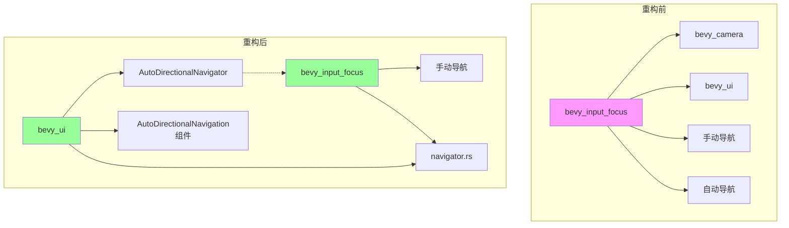

+++
title = "#22340 Remove `bevy_camera` and `bevy_ui` deps from `bevy_input_focus`, no feature flag needed"
date = "2026-01-06T00:00:00"
draft = false
template = "pull_request_page.html"
in_search_index = false

[extra]
current_language = "zh-cn"
available_languages = {"en" = { name = "English", url = "/pull_request/bevy/2026-01/pr-22340-en-20260106" }, "zh-cn" = { name = "中文", url = "/pull_request/bevy/2026-01/pr-22340-zh-cn-20260106" }}
+++

# Title: Remove `bevy_camera` and `bevy_ui` deps from `bevy_input_focus`, no feature flag needed

## Basic Information
- **标题**: 从 `bevy_input_focus` 中移除 `bevy_camera` 和 `bevy_ui` 依赖，无需特性标志
- **PR链接**: https://github.com/bevyengine/bevy/pull/22340
- **作者**: kfc35
- **状态**: 已合并
- **标签**: C-Bug, A-UI, C-Code-Quality, S-Ready-For-Final-Review
- **创建时间**: 2026-01-01T18:04:11Z
- **合并时间**: 2026-01-06T20:37:48Z
- **合并者**: alice-i-cecile

## 描述翻译
### 目标

- 修复 #22305
- 避免使用特性标志

### 解决方案

受到 #22309 的启发并基于 #22333，这个PR将自动方向导航移动到 `bevy_ui` 中，并创建一个新的系统参数来包含自动导航功能。

- `bevy_input_focus` 中的 directional_navigation.rs 仍然包含 `DirectionalNavigation` 系统参数，但现在只包含手动导航逻辑。`DirectionalNavigationPlugin` 以及手动边缘映射仍然存在。
- 我将代码从 directional_navigation.rs 分离到两个独立的文件中：
1) `bevy_ui` 中的 directional_navigation.rs，包含自动导航代码。现在有一个新的系统参数 `AutoDirectionalNavigator`，它包装了 `DirectionalNavigation` 系统参数，并在手动导航失败时执行自动导航。
2) navigator.rs，包含一些同时被自动导航系统和 directional_navigation.rs 中的手动导航代码使用的结构体和函数。这个重构并不是特别必要，但我觉得代码因此更清晰了一些……如果需要的话我可以撤销这个更改

如果您认为这里更适合使用特性标志，请告诉我是否应该考虑 #22333 来代替。

如果这个PR被合并，我将针对 `release-0.18` 开启一个PR来更新发布说明，基本上就是说想要利用 `AutoDirectionalNavigation` 的用户需要使用新的 `AutoDirectionalNavigator` 而不是现有的 `DirectionalNavigation` 系统参数。

### 测试

为了确保没有回归问题，我测试了方向导航示例，两个都能像以前一样正常工作。
`cargo run --example directional_navigation` - 使用现有的 `DirectionalNavigation` 系统参数
`cargo run --example auto_directional_navigation` - 使用新的 `AutoDirectionalNavigator` 系统参数

## 本次PR的故事

### 问题和背景

这个问题源于 #22305，核心问题在于 `bevy_input_focus` 模块包含了不应有的依赖。具体来说，`bevy_input_focus` 是一个处理输入焦点的通用模块，但它依赖了 `bevy_camera` 和 `bevy_ui` 这两个特定于渲染和UI的模块。这造成了不必要的耦合，也增加了编译依赖。

更具体地说，`bevy_input_focus` 中的 `directional_navigation.rs` 文件包含了两种导航逻辑：
1. **手动导航**：通过 `DirectionalNavigationMap` 显式定义导航边缘
2. **自动导航**：基于UI元素的位置和大小自动计算导航关系

自动导航功能依赖于UI特定的组件（如 `ComputedNode`、`UiGlobalTransform`）和相机组件（`InheritedVisibility`），这正是问题的根源。作为一个通用的输入焦点管理模块，它不应该强制所有用户都包含UI和相机的依赖。

之前的解决方案考虑使用特性标志来可选地包含这些依赖，但这不是最优雅的方法，因为它增加了构建配置的复杂性。更好的解决方案是根据功能职责进行合理的模块划分。

### 解决方案

开发者采取了一个清晰的架构重构方案：将自动导航功能从通用模块移动到专门的UI模块中。这种分离遵循了"关注点分离"原则，让每个模块只包含它真正需要的功能。

具体来说：
1. **保留通用逻辑**：`bevy_input_focus` 继续提供通用的输入焦点管理和手动导航功能
2. **移动UI相关功能**：将自动导航功能（依赖UI组件）移动到 `bevy_ui` 模块中
3. **共享核心算法**：提取导航算法到共享模块，避免代码重复

### 实现细节

这次重构采用了分层架构设计：

1. **依赖清理**：首先从 `bevy_input_focus` 的 `Cargo.toml` 中移除了对 `bevy_camera` 和 `bevy_ui` 的依赖：
```toml
# 修改前：
bevy_camera = { path = "../bevy_camera", version = "0.18.0-dev", default-features = false }
bevy_ui = { path = "../bevy_ui", version = "0.18.0-dev", default-features = false }

# 修改后：
# 这两行被完全移除
```

2. **核心导航算法提取**：创建了新的 `navigator.rs` 文件，包含了自动导航的核心算法：
```rust
// 这个函数被从原 directional_navigation.rs 移动到 navigator.rs
pub fn find_best_candidate(
    origin: &FocusableArea,
    direction: CompassOctant,
    candidates: &[FocusableArea],
    config: &AutoNavigationConfig,
) -> Option<Entity> {
    // ... 实现保持不变
}
```

这个模块不依赖任何UI特定的组件，只包含纯算法逻辑，可以在不同模块间共享。

3. **系统参数重构**：`DirectionalNavigation` 系统参数被简化，只保留手动导航功能：
```rust
// 修改前：包含自动导航逻辑的复杂系统参数
pub struct DirectionalNavigation<'w, 's> {
    pub focus: ResMut<'w, InputFocus>,
    pub map: Res<'w, DirectionalNavigationMap>,
    pub config: Res<'w, AutoNavigationConfig>,
    navigable_entities_query: Query<...>,
    camera_and_focusable_area_query: Query<...>,
}

// 修改后：只包含手动导航的简洁系统参数
pub struct DirectionalNavigation<'w> {
    pub focus: ResMut<'w, InputFocus>,
    pub map: Res<'w, DirectionalNavigationMap>,
}
```

4. **新的自动导航系统**：在 `bevy_ui` 中创建了 `AutoDirectionalNavigator` 系统参数，它包装了基础的 `DirectionalNavigation` 并添加了自动导航功能：
```rust
pub struct AutoDirectionalNavigator<'w, 's> {
    pub manual_directional_navigation: DirectionalNavigation<'w>,
    pub config: Res<'w, AutoNavigationConfig>,
    navigable_entities_query: Query<...>,
    camera_and_focusable_area_query: Query<...>,
}
```

这个设计模式很有趣：`AutoDirectionalNavigator` 通过组合（composition）而不是继承来扩展功能。它首先尝试手动导航，如果失败则回退到自动导航。

5. **组件移动**：`AutoDirectionalNavigation` 组件被移动到 `bevy_ui` 模块中，因为它主要与UI元素配合使用。

### 技术洞察

这个重构展示了几个重要的软件工程原则：

**依赖倒置原则**：高层模块（`bevy_input_focus`）不再依赖低层细节（UI组件），而是通过抽象（`FocusableArea` trait）来交互。具体的UI实现在 `bevy_ui` 中完成。

**单一职责原则**：每个模块现在都有明确的职责：
- `bevy_input_focus`：通用的焦点管理和手动导航
- `bevy_ui::auto_directional_navigation`：UI特定的自动导航
- `navigator`：共享的导航算法

**开闭原则**：系统对扩展开放（可以添加新的导航策略），对修改关闭（不需要修改核心算法）。

**组合优于继承**：`AutoDirectionalNavigator` 通过包装 `DirectionalNavigation` 来添加功能，而不是通过继承修改它的行为。

### 影响

这个重构带来了几个重要的改进：

1. **减少编译依赖**：使用 `bevy_input_focus` 但不使用UI功能的项目不再需要编译UI和相机相关的代码。

2. **更清晰的架构**：功能按照职责进行了合理的划分，代码更容易理解和维护。

3. **更好的可测试性**：核心导航算法现在在独立的模块中，可以更容易进行单元测试。

4. **向后兼容性**：现有的手动导航API保持不变，自动导航用户只需要从 `bevy_ui` 导入新的系统参数。

5. **为未来扩展做准备**：这种架构可以更容易地添加新的导航策略（如3D空间导航、自定义布局导航等）。

需要注意的是，这个改变需要用户更新他们的代码：使用自动导航的用户需要从 `bevy_ui::auto_directional_navigation` 导入 `AutoDirectionalNavigator` 而不是原来的 `DirectionalNavigation`。这是API演进中常见的权衡。

## 视觉表示



## 关键文件更改

### `crates/bevy_input_focus/src/directional_navigation.rs` (+13/-498)

这个文件被大幅简化，移除了所有自动导航相关的代码，只保留手动导航功能。核心变化包括：

1. **移除自动导航逻辑**：移除了 `AutoDirectionalNavigation` 组件定义和相关查询
2. **简化系统参数**：`DirectionalNavigation` 系统参数只包含手动导航逻辑
3. **更新文档**：更新文档以反映新的架构

```rust
// 简化后的 DirectionalNavigation 系统参数
pub struct DirectionalNavigation<'w> {
    pub focus: ResMut<'w, InputFocus>,
    pub map: Res<'w, DirectionalNavigationMap>,
}
```

### `crates/bevy_input_focus/src/navigator.rs` (+302/-0)

新创建的文件，包含了原来在 `directional_navigation.rs` 中的自动导航算法：

```rust
pub fn find_best_candidate(
    origin: &FocusableArea,
    direction: CompassOctant,
    candidates: &[FocusableArea],
    config: &AutoNavigationConfig,
) -> Option<Entity> {
    // 导航评分算法实现
}
```

这个文件提供了纯算法的导航功能，不依赖具体的UI组件。

### `crates/bevy_ui/src/auto_directional_navigation.rs` (+230/-0)

新创建的文件，包含了自动导航的完整实现：

```rust
// UI特定的自动导航组件
#[derive(Component, Default, Debug, Clone, Copy, PartialEq, Reflect)]
pub struct AutoDirectionalNavigation {
    pub respect_tab_order: bool,
}

// 组合了手动和自动导航的系统参数
pub struct AutoDirectionalNavigator<'w, 's> {
    pub manual_directional_navigation: DirectionalNavigation<'w>,
    pub config: Res<'w, AutoNavigationConfig>,
    navigable_entities_query: Query<...>,
    camera_and_focusable_area_query: Query<...>,
}
```

### `examples/ui/auto_directional_navigation.rs` (+7/-6)

更新示例以使用新的API：

```rust
// 修改前：
use bevy_input_focus::directional_navigation::{
    AutoDirectionalNavigation, DirectionalNavigation
};

fn navigate(action_state: Res<ActionState>, mut directional_navigation: DirectionalNavigation) {
    // ...
}

// 修改后：
use bevy::ui::auto_directional_navigation::{AutoDirectionalNavigation, AutoDirectionalNavigator};

fn navigate(
    action_state: Res<ActionState>,
    mut auto_directional_navigator: AutoDirectionalNavigator,
) {
    // ...
}
```

### `crates/bevy_input_focus/Cargo.toml` (+0/-2)

移除了对 `bevy_camera` 和 `bevy_ui` 的依赖。

## 进一步阅读

1. **组合优于继承**：这个PR展示了如何使用组合模式来扩展功能而不修改原有代码
2. **关注点分离**：将通用逻辑与特定实现分离的架构设计模式
3. **Rust模块系统**：如何在大型Rust项目中组织模块和依赖关系
4. **Bevy ECS架构**：了解Bevy的实体组件系统如何支持这种模块化设计
5. **系统参数模式**：Bevy中系统参数的设计和使用模式