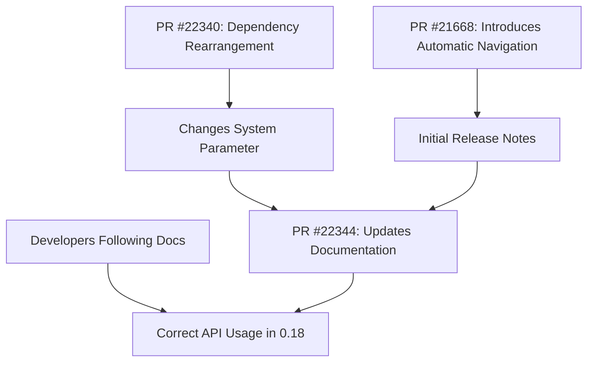

+++
title = "#22344 Update Automatic Directional Navigation Release Notes (due to dependency rearrangement)"
date = "2026-01-07T00:00:00"
draft = false
template = "pull_request_page.html"
in_search_index = true

[taxonomies]
list_display = ["show"]

[extra]
current_language = "en"
available_languages = {"en" = { name = "English", url = "/pull_request/bevy/2026-01/pr-22344-en-20260107" }, "zh-cn" = { name = "中文", url = "/pull_request/bevy/2026-01/pr-22344-zh-cn-20260107" }}
labels = ["C-Docs", "A-UI"]
+++

# Title: Update Automatic Directional Navigation Release Notes (due to dependency rearrangement)

## Basic Information
- **Title**: Update Automatic Directional Navigation Release Notes (due to dependency rearrangement)
- **PR Link**: https://github.com/bevyengine/bevy/pull/22344
- **Author**: kfc35
- **Status**: MERGED
- **Labels**: C-Docs, A-UI, S-Needs-Review
- **Created**: 2026-01-01T23:33:47Z
- **Merged**: 2026-01-07T21:38:00Z
- **Merged By**: cart

## Description Translation

# Objective

- Documenting changes to resolve #22305 
- Update the release notes as a result of #22340

This is dependent on merging #22340 into 0.18!

**This is pointing to merge into release-0.18.0**, not main

@jbuehler23 FYI

## The Story of This Pull Request

This pull request is a documentation update that fixes release notes for Bevy 0.18's automatic directional navigation feature. The story begins with PR #21668, which introduced automatic directional navigation to eliminate the need for manually wiring UI navigation connections. This feature automatically computes navigation paths between focusable UI elements based on their spatial positioning.

After the initial implementation, PR #22340 introduced a dependency rearrangement that changed how developers interact with the automatic navigation system. Specifically, it replaced the `DirectionalNavigation` system parameter with `AutoDirectionalNavigator` for systems using automatic navigation. This architectural change required corresponding updates to the documentation to prevent confusion and ensure developers use the correct API.

The problem was straightforward: the existing release notes documented the old API, which would cause developers following the documentation to use deprecated or incorrect patterns. The solution involved updating the release notes to reflect the new system parameter while maintaining clarity about the migration path from 0.17 to 0.18.

The implementation changes are minimal but important. The PR updates the `automatic_directional_navigation.md` file to:
1. Reference both relevant PRs (#21668 and #22340)
2. Clarify that the system parameter (not just "the system") finds nearest neighbors
3. Provide code examples using the new `AutoDirectionalNavigator` system parameter
4. Update the migration guide with clear before/after examples showing both the 0.17 manual approach and the 0.18 automatic approach

From a technical perspective, this change highlights how Bevy's architectural decisions around system parameters evolve. The introduction of `AutoDirectionalNavigator` as a separate system parameter from `DirectionalNavigation` suggests a design pattern where different navigation strategies (manual vs automatic) are represented by distinct system parameters, providing clearer API boundaries and potentially better compile-time guarantees.

The impact is primarily on developer experience. Without this update, developers upgrading to 0.18 would encounter confusing documentation that doesn't match the actual API. The migration guide section is particularly valuable as it shows both the old manual approach (using `DirectionalNavigation` system parameter with manual edge definitions) and the new approach (using `AutoDirectionalNavigator` with automatic navigation components).

The technical lesson here is about maintaining documentation in sync with API changes, especially when those changes involve dependency rearrangements that aren't immediately obvious from the feature itself. The PR author correctly identifies that this change must target the release-0.18.0 branch, not main, ensuring the documentation is ready for the upcoming release.

## Visual Representation



## Key Files Changed

**File**: `release-content/release-notes/automatic_directional_navigation.md`

**Summary**: This file contains the release notes for the automatic directional navigation feature introduced in Bevy 0.18. The updates reflect API changes from PR #22340, which replaced the `DirectionalNavigation` system parameter with `AutoDirectionalNavigator` for automatic navigation.

**Key Changes**:

1. **Updated PR references**: Added PR #22340 to the list of related pull requests.
2. **Clarified terminology**: Changed "system" to "system parameter" for technical accuracy.
3. **Added new code example**: Showed how to use `AutoDirectionalNavigator` instead of `DirectionalNavigation`.
4. **Updated migration guide**: Provided clear 0.17 vs 0.18 comparison with proper system parameter usage.

**Code Snippets**:

```markdown
# Before (partial):
Bevy now supports **automatic directional navigation graph generation** for UI elements!

Now, you can simply add the `AutoDirectionalNavigation` component to your UI entities, and Bevy will automatically compute navigation connections based on spatial positioning. The system intelligently finds the nearest neighbor...

# After (partial):
Bevy now supports **automatic directional navigation** for UI elements!

Now, you can simply add the `AutoDirectionalNavigation` component to your UI entities, and Bevy will automatically compute navigation connections based on spatial positioning. The system parameter intelligently finds the nearest neighbor...
```

```markdown
# Before migration guide (partial):
**Before:**

```rust
// Manually define all edges
directional_nav_map.add_looping_edges(&row_entities, CompassOctant::East);
directional_nav_map.add_edges(&column_entities, CompassOctant::South);
// ... repeat for all rows and columns
```

**After:**

```rust
// Just add the component to your UI entities
commands.spawn((
    Button,
    Node { /* ... */ },
    AutoDirectionalNavigation::default(),
));
```

# After migration guide (partial):
```rust
// 0.17
// Manually define all edges
directional_nav_map.add_looping_edges(&row_entities, CompassOctant::East);
directional_nav_map.add_edges(&column_entities, CompassOctant::South);
// ... repeat for all rows and columns

// Use the DirectionalNavigation SystemParam to navigate in your system
fn my_navigation_system(mut directional_navigation: DirectionalNavigation) {
    // ...
    directional_navigation.navigate(CompassOctant::East);
    // ...
}

// 0.18
// Just add the component to your UI entities
commands.spawn((
    Button,
    Node { /* ... */ },
    AutoDirectionalNavigation::default(),
));

// Use the AutoDirectionalNavigator SystemParam to navigate in your system
fn my_navigation_system(mut auto_directional_navigator: AutoDirectionalNavigator) {
    // ...
    auto_directional_navigator.navigate(CompassOctant::East);
    // ...
}
```

## Further Reading

1. **Bevy UI Navigation System**: The official Bevy documentation on UI and navigation systems provides context for how directional navigation works in the engine.

2. **System Parameters in Bevy**: Understanding Bevy's SystemParam trait and how different system parameters are used for different purposes is key to working with the navigation system.

3. **Spatial Algorithms for UI Navigation**: The automatic navigation feature uses spatial algorithms to determine nearest neighbors. Research on spatial partitioning and nearest-neighbor search algorithms provides background on how this feature works under the hood.

4. **API Design Patterns**: The evolution from `DirectionalNavigation` to `AutoDirectionalNavigator` demonstrates API design patterns for separating concerns and providing clear interfaces for different usage patterns.

5. **Documentation-Driven Development**: This PR exemplifies the importance of keeping documentation in sync with code changes, especially when APIs evolve during the release cycle.