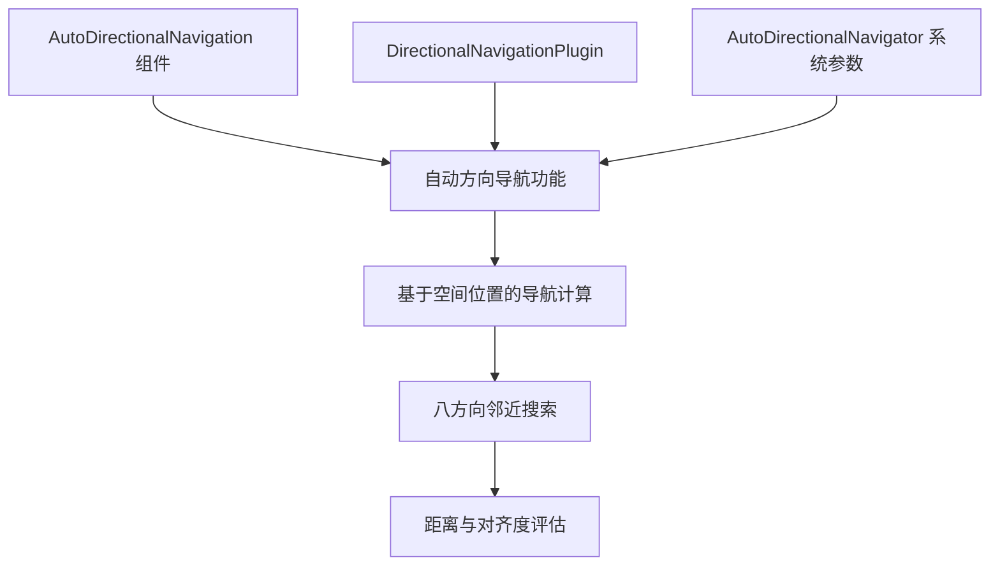

+++
title = "#22344 Update Automatic Directional Navigation Release Notes (due to dependency rearrangement)"
date = "2026-01-07T00:00:00"
draft = false
template = "pull_request_page.html"
in_search_index = false

[extra]
current_language = "zh-cn"
available_languages = {"en" = { name = "English", url = "/pull_request/bevy/2026-01/pr-22344-en-20260107" }, "zh-cn" = { name = "中文", url = "/pull_request/bevy/2026-01/pr-22344-zh-cn-20260107" }}
+++

# 标题

## 基本信息
- **标题**: Update Automatic Directional Navigation Release Notes (due to dependency rearrangement)
- **PR 链接**: https://github.com/bevyengine/bevy/pull/22344
- **作者**: kfc35
- **状态**: 已合并
- **标签**: C-Docs, A-UI, S-Needs-Review
- **创建时间**: 2026-01-01T23:33:47Z
- **合并时间**: 2026-01-07T21:38:00Z
- **合并者**: cart

## 描述翻译
本 PR 旨在更新自动方向导航功能的发布说明，以反映 #22340 带来的依赖项重新安排。

### 目标
- 记录解决 #22305 的更改
- 根据 #22340 的结果更新发布说明

此更新依赖于 #22340 合并到 0.18 版本！

**注意：此 PR 指向合并到 release-0.18.0 分支**，而非 main 分支

@jbuehler23 请知悉

## 本 Pull Request 的技术故事

### 问题背景与上下文
在 Bevy 0.17 版本中，自动方向导航功能通过 PR #21668 引入，为 UI 元素提供了自动生成导航图的能力。然而，在后续的开发中，团队发现原有的实现存在架构上的限制，特别是在依赖管理和系统参数使用方面。

PR #22340 对自动方向导航的实现进行了重构，将核心功能从一个系统（system）移动到了系统参数（SystemParam）中。这种架构变更需要同步更新相关的文档，特别是发布说明，以确保用户了解如何正确使用更新后的 API。

### 解决方案
本 PR 的主要任务是更新发布说明文档，反映 API 的变化。具体来说，需要：
1. 更新功能描述，准确反映新的实现方式
2. 提供新的代码示例，展示如何使用 `AutoDirectionalNavigator` 系统参数
3. 更新迁移指南，清晰展示从 0.17 到 0.18 的变更

### 实现细节
发布说明的更新主要集中在澄清自动方向导航的工作机制。在 0.17 版本中，文档暗示系统会自动维护导航图，但在 0.18 版本中，这实际上是通过 `AutoDirectionalNavigator` 系统参数在需要时动态计算的。

关键的技术变更点包括：
1. **API 变更**：从 `DirectionalNavigation` 系统参数迁移到 `AutoDirectionalNavigator`
2. **工作机制变更**：从持续的图维护转变为按需计算
3. **配置方式不变**：`AutoDirectionalNavigation` 组件的配置方式保持不变

### 技术见解
这种从系统到系统参数的架构重构体现了 Bevy 在 API 设计上的演进思考：
- **按需计算 vs 持续维护**：新的实现避免了在 UI 变化时不断重新计算导航图的开销，改为在导航发生时按需计算
- **系统参数的灵活性**：将功能封装为系统参数提供了更好的模块化和可测试性
- **向后兼容性**：虽然内部实现发生了变化，但用户级别的配置接口保持不变

### 影响
1. **性能优化**：减少了不必要的计算，只在需要导航时才计算相邻元素
2. **API 清晰度**：更准确地反映了功能的工作方式，避免了"自动维护"的误解
3. **迁移指导**：提供了清晰的从旧版本迁移到新版本的代码示例

## 视觉表示



## 关键文件变更

### `release-content/release-notes/automatic_directional_navigation.md` (+30/-10)

这个文件包含了自动方向导航功能的发布说明。主要变更包括：

1. **添加了新的 PR 引用**：在元数据中添加了 #22340
2. **更新了功能描述**：更准确地描述了自动导航的工作机制
3. **添加了新的代码示例**：展示了如何使用 `AutoDirectionalNavigator` 系统参数
4. **更新了迁移指南**：展示了从 0.17 到 0.18 的完整迁移路径

**关键代码变更**：
```markdown
<!-- Before: 原描述暗示系统会自动维护导航图 -->
Bevy now supports **automatic directional navigation graph generation** for UI elements!

<!-- After: 更准确地描述为自动方向导航 -->
Bevy now supports **automatic directional navigation** for UI elements!
```

```markdown
<!-- Before: 简化的使用说明 -->
That's it! The `DirectionalNavigationPlugin` includes a system that automatically maintains the navigation graph as your UI changes.

<!-- After: 明确指出了系统参数的使用 -->
That's it! The `DirectionalNavigationPlugin` will set up the resources that `AutoDirectionalNavigator` uses to function.
```

```markdown
<!-- 添加了新的系统参数使用示例 -->
To leverage automatic navigation, use the `AutoDirectionalNavigator` system parameter instead of the `DirectionalNavigation` system parameter:

```rust
fn my_navigation_system(mut auto_directional_navigator: AutoDirectionalNavigator) {
    // ...
    auto_directional_navigator.navigate(CompassOctant::East);
    // ...
}
```
```

```markdown
<!-- 更新了迁移指南，展示新旧版本对比 -->
// 0.17
// Use the DirectionalNavigation SystemParam to navigate in your system
fn my_navigation_system(mut directional_navigation: DirectionalNavigation) {
    // ...
    directional_navigation.navigate(CompassOctant::East);
    // ...
}

// 0.18
// Use the AutoDirectionalNavigator SystemParam to navigate in your system
fn my_navigation_system(mut auto_directional_navigator: AutoDirectionalNavigator) {
    // ...
    auto_directional_navigator.navigate(CompassOctant::East);
    // ...
}
```

## 完整代码差异
```diff
diff --git a/release-content/release-notes/automatic_directional_navigation.md b/release-content/release-notes/automatic_directional_navigation.md
index 250d113177e39..eb4fb154527ec 100644
--- a/release-content/release-notes/automatic_directional_navigation.md
+++ b/release-content/release-notes/automatic_directional_navigation.md
@@ -1,16 +1,16 @@
 ---
 title: Automatic Directional Navigation
 authors: ["@jbuehler23"]
-pull_requests: [21668]
+pull_requests: [21668, 22340]
 ---
 
-Bevy now supports **automatic directional navigation graph generation** for UI elements! No more tedious manual wiring of navigation connections for your menus and UI screens.
+Bevy now supports **automatic directional navigation** for UI elements! No more tedious manual wiring of navigation connections for your menus and UI screens.
 
 ## What's New?
 
 Previously, creating directional navigation for UI required manually defining every connection between focusable elements using `DirectionalNavigationMap`. For dynamic UIs or complex layouts, this was time-consuming and error-prone.
 
-Now, you can simply add the `AutoDirectionalNavigation` component to your UI entities, and Bevy will automatically compute navigation connections based on spatial positioning. The system intelligently finds the nearest neighbor in each of the 8 compass directions (North, Northeast, East, etc.), considering:
+Now, you can simply add the `AutoDirectionalNavigation` component to your UI entities, and Bevy will automatically compute navigation connections based on spatial positioning. The system parameter intelligently finds the nearest neighbor in each of the 8 compass directions (North, Northeast, East, etc.), considering:
 
 - **Distance**: Closer elements are preferred
 - **Alignment**: Elements that are more directly in line with the navigation direction are favored
@@ -29,7 +29,17 @@ commands.spawn((
 ));
 ```
 
-That's it! The `DirectionalNavigationPlugin` includes a system that automatically maintains the navigation graph as your UI changes.
+To leverage automatic navigation, use the `AutoDirectionalNavigator` system parameter instead of the `DirectionalNavigation` system parameter:
+
+```rust
+fn my_navigation_system(mut auto_directional_navigator: AutoDirectionalNavigator) {
+    // ...
+    auto_directional_navigator.navigate(CompassOctant::East);
+    // ...
+}
+```
+
+That's it! The `DirectionalNavigationPlugin` will set up the resources that `AutoDirectionalNavigator` uses to function.
 
 ### Configuration
 
@@ -68,24 +78,34 @@ This is a non-breaking change. Existing manual navigation setups continue to wor
 
 If you want to convert existing manual navigation to automatic:
 
-**Before:**
-
 ```rust
+// 0.17
 // Manually define all edges
 directional_nav_map.add_looping_edges(&row_entities, CompassOctant::East);
 directional_nav_map.add_edges(&column_entities, CompassOctant::South);
 // ... repeat for all rows and columns
-```
 
-**After:**
+// Use the DirectionalNavigation SystemParam to navigate in your system
+fn my_navigation_system(mut directional_navigation: DirectionalNavigation) {
+    // ...
+    directional_navigation.navigate(CompassOctant::East);
+    // ...
+}
 
-```rust
+// 0.18
 // Just add the component to your UI entities
 commands.spawn((
     Button,
     Node { /* ... */ },
     AutoDirectionalNavigation::default(),
 ));
+
+// Use the AutoDirectionalNavigator SystemParam to navigate in your system
+fn my_navigation_system(mut auto_directional_navigator: AutoDirectionalNavigator) {
+    // ...
+    auto_directional_navigator.navigate(CompassOctant::East);
+    // ...
+}
 ```
 
-Note: The automatic navigation system requires entities to have position and size information (`ComputedNode` and `UiGlobalTransform` for `bevy_ui` entities).
+Note: Automatic navigation requires entities to have position and size information (`ComputedNode` and `UiGlobalTransform` for `bevy_ui` entities).
```

## 扩展阅读
1. **Bevy 系统参数文档**：了解 Bevy 中 SystemParam 的工作原理和最佳实践
2. **UI 导航设计模式**：研究其他游戏引擎中 UI 导航的实现方式
3. **空间算法**：深入了解邻近搜索和空间分区算法，这些是自动导航的基础
4. **Bevy ECS 架构**：理解 Bevy 的实体组件系统如何支持这种按需计算的架构