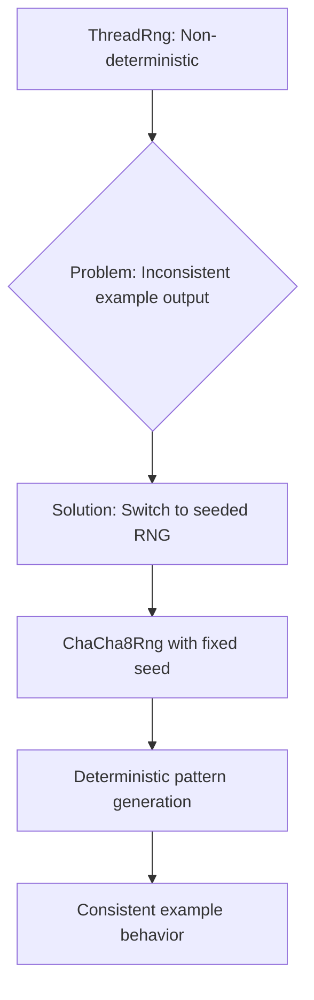

+++
title = "#22346 use seeded rng for dynamic_mip_generation"
date = "2026-01-02T00:00:00"
draft = false
template = "pull_request_page.html"
in_search_index = true

[taxonomies]
list_display = ["show"]

[extra]
current_language = "en"
available_languages = {"en" = { name = "English", url = "/pull_request/bevy/2026-01/pr-22346-en-20260102" }, "zh-cn" = { name = "中文", url = "/pull_request/bevy/2026-01/pr-22346-zh-cn-20260102" }}
labels = ["C-Examples"]
+++

# Title
## Basic Information
- **Title**: use seeded rng for dynamic_mip_generation
- **PR Link**: https://github.com/bevyengine/bevy/pull/22346
- **Author**: mockersf
- **Status**: MERGED
- **Labels**: C-Examples
- **Created**: 2026-01-02T01:01:04Z
- **Merged**: 2026-01-02T20:34:17Z
- **Merged By**: mockersf

## Description Translation

# Objective

- New example `dynamic_mip_generation` use random random

## Solution

- Use seeded random

## The Story of This Pull Request

This pull request addresses a reproducibility issue in the `dynamic_mip_generation` example. The example generates random patterns to demonstrate dynamic mipmap generation, but it was using a non-deterministic random number generator (ThreadRng), which meant that each run of the example would produce different patterns.

The problem was straightforward: the example's randomness made it difficult to test consistently or to demonstrate specific behaviors reliably. When developers run examples, they often expect consistent output to verify that code is working correctly. Non-deterministic behavior in examples can mask bugs or make it harder to understand what the example is supposed to demonstrate.

The solution approach was to replace the non-deterministic ThreadRng with a seeded pseudo-random number generator. This required several changes to the codebase. First, the imports needed updating to bring in the SeedableRng trait and a specific PRNG implementation (ChaCha8Rng from the rand_chacha crate). Then, the AppStatus struct needed to store the RNG instance rather than creating a new one each time.

The implementation details show careful consideration of Rust's ownership and mutability rules. The `AppStatus` struct gained a new field:
```rust
rng: ChaCha8Rng,
```

In the Default implementation, this field is initialized with a specific seed:
```rust
rng: ChaCha8Rng::seed_from_u64(19878367467713),
```

The seed value `19878367467713` appears arbitrary but provides deterministic output. This is a common practice in graphics examples where you want visual patterns to be reproducible across runs.

The technical challenge here was managing mutable access to the RNG. The `generate_image_data` method now takes `&mut self` instead of `&self` because it needs to update the RNG's internal state. This change cascaded through the call chain:

1. `regenerate_mipmap_source_image` also needed to take `&mut self`
2. `regenerate_image_when_requested` needed to take `ResMut<AppStatus>` instead of `Res<AppStatus>`

This is a good example of how Rust's borrow checker ensures proper mutation semantics. The compiler enforced that we couldn't mutate the RNG without properly declaring the mutable borrow.

The key insight from this implementation is that using a seeded RNG provides the best of both worlds: the visual variety of random patterns with the reproducibility needed for testing and demonstration. The ChaCha8Rng was chosen because it's a cryptographically secure PRNG with good performance characteristics, though for this example any seeded PRNG would work.

The impact of this change is subtle but important for the example's utility. Developers can now:
- Run the example multiple times and see the same patterns
- Use the example as a reference for testing mipmap generation logic
- Debug issues with confidence that the random patterns aren't masking problems

This change also demonstrates good practices for examples in general. Examples should be deterministic when possible, especially when they're demonstrating visual features where inconsistent output could confuse users about what they're supposed to see.

## Visual Representation



## Key Files Changed

### `examples/2d/dynamic_mip_generation.rs` (+10/-7)

This file contains the dynamic mipmap generation example that was modified to use a seeded random number generator instead of a non-deterministic one.

**Key Changes:**

1. **Updated imports** to use seeded RNG functionality:
```rust
// Before:
use rand::{rngs::ThreadRng, Rng};

// After:
use rand::{Rng, SeedableRng};
use rand_chacha::ChaCha8Rng;
```

2. **Added RNG field to AppStatus struct** to store the seeded generator:
```rust
// Before:
struct AppStatus {
    enable_mip_generation: EnableMipGeneration,
    image_width: ImageSize,
    image_height: ImageSize,
}

// After:
struct AppStatus {
    enable_mip_generation: EnableMipGeneration,
    image_width: ImageSize,
    image_height: ImageSize,
    /// Seeded random generator.
    rng: ChaCha8Rng,
}
```

3. **Initialized the RNG with a seed** in the Default implementation:
```rust
impl Default for AppStatus {
    fn default() -> Self {
        Self {
            enable_mip_generation: EnableMipGeneration::On,
            image_width: ImageSize::Size640,
            image_height: ImageSize::Size480,
            rng: ChaCha8Rng::seed_from_u64(19878367467713),
        }
    }
}
```

4. **Updated method signatures** to handle mutable access to the RNG:
```rust
// Before:
fn regenerate_image_when_requested(
    // ...
    app_status: Res<AppStatus>,
    // ...
)

// After:
fn regenerate_image_when_requested(
    // ...
    mut app_status: ResMut<AppStatus>,
    // ...
)
```

5. **Modified the image generation** to use the seeded RNG:
```rust
// Before:
fn generate_image_data(&self) -> Vec<u8> {
    let mut rng = ThreadRng::default();
    let outer_color: [u8; 3] = array::from_fn(|_| rng.random());
    let inner_color: [u8; 3] = array::from_fn(|_| rng.random());
    // ...
}

// After:
fn generate_image_data(&mut self) -> Vec<u8> {
    let outer_color: [u8; 3] = array::from_fn(|_| self.rng.random());
    let inner_color: [u8; 3] = array::from_fn(|_| self.rng.random());
    // ...
}
```

These changes ensure that the example generates the same visual patterns every time it runs, making it more useful for testing and demonstration purposes.

## Further Reading

- [Rust Rand crate documentation](https://docs.rs/rand/latest/rand/) - For understanding random number generation in Rust
- [SeedableRng trait documentation](https://docs.rs/rand/latest/rand/trait.SeedableRng.html) - For implementing seeded random number generators
- [ChaCha8Rng implementation details](https://docs.rs/rand_chacha/latest/rand_chacha/struct.ChaCha8Rng.html) - For understanding the specific PRNG used
- [Bevy examples documentation](https://bevyengine.org/learn/quick-start/ec-examples/) - For context on how examples are used in Bevy
- [Mipmapping techniques in computer graphics](https://en.wikipedia.org/wiki/Mipmap) - For background on what this example demonstrates

# Full Code Diff
```
diff --git a/examples/2d/dynamic_mip_generation.rs b/examples/2d/dynamic_mip_generation.rs
index 3d375a3a40668..07107ecf1f8b4 100644
--- a/examples/2d/dynamic_mip_generation.rs
+++ b/examples/2d/dynamic_mip_generation.rs
@@ -28,7 +28,8 @@ use bevy::{
     sprite_render::{AlphaMode2d, Material2d, Material2dPlugin},
     window::{PrimaryWindow, WindowResized},
 };
-use rand::{rngs::ThreadRng, Rng};
+use rand::{Rng, SeedableRng};
+use rand_chacha::ChaCha8Rng;
 
 use crate::widgets::{
     RadioButton, RadioButtonText, WidgetClickEvent, WidgetClickSender, BUTTON_BORDER,
@@ -68,6 +69,8 @@ struct AppStatus {
     image_width: ImageSize,
     /// The height of the image.
     image_height: ImageSize,
+    /// Seeded random generator.
+    rng: ChaCha8Rng,
 }
 
 impl Default for AppStatus {
@@ -76,6 +79,7 @@ impl Default for AppStatus {
             enable_mip_generation: EnableMipGeneration::On,
             image_width: ImageSize::Size640,
             image_height: ImageSize::Size480,
+            rng: ChaCha8Rng::seed_from_u64(19878367467713),
         }
     }
 }
@@ -537,7 +541,7 @@ fn regenerate_image_when_requested(
     image_views_query: Query<Entity, With<ImageView>>,
     windows_query: Query<&Window, With<PrimaryWindow>>,
     app_assets: Res<AppAssets>,
-    app_status: Res<AppStatus>,
+    mut app_status: ResMut<AppStatus>,
     mut images: ResMut<Assets<Image>>,
     mut single_mip_level_materials: ResMut<Assets<SingleMipLevelMaterial>>,
     mut color_materials: ResMut<Assets<ColorMaterial>>,
@@ -750,7 +754,7 @@ impl AppStatus {
 
     /// Regenerates the main image based on the image size selected by the user.
     fn regenerate_mipmap_source_image(
-        &self,
+        &mut self,
         commands: &mut Commands,
         images: &mut Assets<Image>,
     ) -> Handle<Image> {
@@ -779,11 +783,10 @@ impl AppStatus {
     /// Draws the concentric ellipses that make up the image.
     ///
     /// Returns the RGBA8 image data.
-    fn generate_image_data(&self) -> Vec<u8> {
+    fn generate_image_data(&mut self) -> Vec<u8> {
         // Select random colors for the inner and outer ellipses.
-        let mut rng = ThreadRng::default();
-        let outer_color: [u8; 3] = array::from_fn(|_| rng.random());
-        let inner_color: [u8; 3] = array::from_fn(|_| rng.random());
+        let outer_color: [u8; 3] = array::from_fn(|_| self.rng.random());
+        let inner_color: [u8; 3] = array::from_fn(|_| self.rng.random());
 
         let image_byte_size = 4usize
             * MipmapSizeIterator::new(self)
```