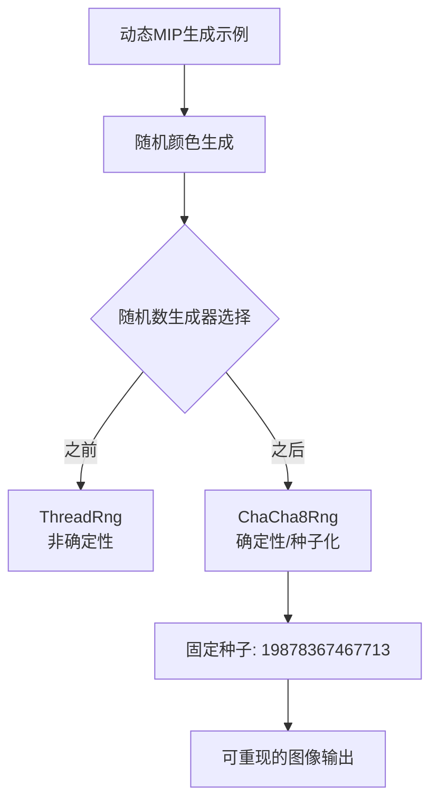

+++
title = "#22346 use seeded rng for dynamic_mip_generation"
date = "2026-01-02T00:00:00"
draft = false
template = "pull_request_page.html"
in_search_index = false

[extra]
current_language = "zh-cn"
available_languages = {"en" = { name = "English", url = "/pull_request/bevy/2026-01/pr-22346-en-20260102" }, "zh-cn" = { name = "中文", url = "/pull_request/bevy/2026-01/pr-22346-zh-cn-20260102" }}
labels = ["C-Examples"]
+++

# Title
use seeded rng for dynamic_mip_generation

## Basic Information
- **Title**: use seeded rng for dynamic_mip_generation
- **PR Link**: https://github.com/bevyengine/bevy/pull/22346
- **Author**: mockersf
- **Status**: MERGED
- **Labels**: C-Examples
- **Created**: 2026-01-02T01:01:04Z
- **Merged**: 2026-01-02T20:34:17Z
- **Merged By**: mockersf

## Description Translation
目标

- 新的示例 `dynamic_mip_generation` 使用随机随机数

解决方案

- 使用种子随机数生成器

## The Story of This Pull Request

这个拉取请求解决了一个看似简单但具有实际意义的问题：确保示例代码的可重现性。在Bevy引擎的`dynamic_mip_generation`示例中，开发者发现图像生成使用了非确定性的随机数生成器，这意味着每次运行示例时都会生成不同的图像。虽然这对于演示动态效果来说没有问题，但它影响了调试和测试的可靠性。

问题的核心在于示例中使用了`rand::ThreadRng`，这是一个基于线程本地状态的随机数生成器，每次运行都会产生不同的随机序列。当开发者在调试或测试中需要可重现的结果时，这种非确定性行为会带来问题。

解决方案采用了确定性的随机数生成方法。开发者将`ThreadRng`替换为`ChaCha8Rng`，这是一种基于种子的确定性伪随机数生成器。具体实现包括以下几个关键步骤：

1. **更新依赖和导入**：将`rand::rngs::ThreadRng`的导入替换为`rand::{Rng, SeedableRng}`和`rand_chacha::ChaCha8Rng`。这确保了代码能够访问到种子随机数生成器的功能。

2. **修改AppStatus结构体**：在存储应用状态的结构体中添加了`rng: ChaCha8Rng`字段，用于保存随机数生成器的状态。这样可以在整个应用生命周期中维护一个确定性的随机序列。

3. **初始化种子**：在`Default`实现中，使用固定的种子值`19878367467713`初始化随机数生成器。这个选择确保了每次运行示例时都生成相同的随机序列，从而产生相同的图像。

4. **更新函数签名**：由于需要修改随机数生成器的内部状态（每次调用随机方法都会更新其内部状态），相关函数必须接受可变的引用。`generate_image_data`和`regenerate_mipmap_source_image`方法现在接受`&mut self`而不是`&self`。

5. **更新调用代码**：系统`regenerate_image_when_requested`现在需要`ResMut<AppStatus>`而不是`Res<AppStatus>`，因为它调用了需要可变访问的方法。

从技术角度来看，这个变化展示了几个重要的编程原则：

- **可重现性**：在科学计算、图形渲染和游戏开发中，能够重现特定结果对于调试和测试至关重要。种子随机数生成器提供了这种能力。

- **状态管理**：将随机数生成器作为应用状态的一部分，而不是每次创建新的实例，这确保了在整个会话中随机序列的连续性。

- **API设计影响**：这个变化说明了为什么某些函数需要可变访问权限——当函数修改内部状态时，即使从外部看似乎是"只读"操作，也需要`&mut`。

实际代码改动很简洁：

```rust
// 之前：每次调用都创建新的随机数生成器
let mut rng = ThreadRng::default();
let outer_color: [u8; 3] = array::from_fn(|_| rng.random());

// 之后：使用存储的随机数生成器
let outer_color: [u8; 3] = array::from_fn(|_| self.rng.random());
```

这种改变确保了`dynamic_mip_generation`示例现在每次运行时都会生成完全相同的图像模式，这对于教学目的、调试和测试都非常有用。开发者可以确切知道某个特定的图像输出应该是什么样子，而不必担心随机变化。

## Visual Representation



## Key Files Changed

- `examples/2d/dynamic_mip_generation.rs` (+10/-7)

这个文件包含了动态MIP映射生成示例的主要逻辑。修改主要集中在随机数生成器的使用方式上。

关键修改包括：

1. **导入语句更新**：
```rust
// 之前：
use rand::{rngs::ThreadRng, Rng};

// 之后：
use rand::{Rng, SeedableRng};
use rand_chacha::ChaCha8Rng;
```

2. **AppStatus结构体添加rng字段**：
```rust
// 在AppStatus结构体中添加：
/// Seeded random generator.
rng: ChaCha8Rng,
```

3. **Default实现初始化rng**：
```rust
// 在Default实现中添加：
rng: ChaCha8Rng::seed_from_u64(19878367467713),
```

4. **函数签名更新**：
```rust
// 之前：
fn regenerate_mipmap_source_image(
    &self,
    commands: &mut Commands,
    images: &mut Assets<Image>,
) -> Handle<Image>

// 之后：
fn regenerate_mipmap_source_image(
    &mut self,
    commands: &mut Commands,
    images: &mut Assets<Image>,
) -> Handle<Image>
```

5. **随机颜色生成更新**：
```rust
// 之前：
let mut rng = ThreadRng::default();
let outer_color: [u8; 3] = array::from_fn(|_| rng.random());
let inner_color: [u8; 3] = array::from_fn(|_| rng.random());

// 之后：
let outer_color: [u8; 3] = array::from_fn(|_| self.rng.random());
let inner_color: [u8; 3] = array::from_fn(|_| self.rng.random());
```

这些修改共同确保了示例代码现在使用确定性的随机数生成器，从而每次运行都会生成相同的图像。

## Further Reading

- [Rust rand crate documentation](https://docs.rs/rand/latest/rand/) - Rust随机数生成库的官方文档
- [Deterministic algorithms](https://en.wikipedia.org/wiki/Deterministic_algorithm) - 关于确定性算法的维基百科页面
- [ChaCha20 and ChaCha8 stream ciphers](https://cr.yp.to/chacha.html) - ChaCha流密码算法的技术细节
- [Reproducible builds and testing](https://reproducible-builds.org/) - 关于可重现构建和测试的讨论

# Full Code Diff
diff --git a/examples/2d/dynamic_mip_generation.rs b/examples/2d/dynamic_mip_generation.rs
index 3d375a3a40668..07107ecf1f8b4 100644
--- a/examples/2d/dynamic_mip_generation.rs
+++ b/examples/2d/dynamic_mip_generation.rs
@@ -28,7 +28,8 @@ use bevy::{
     sprite_render::{AlphaMode2d, Material2d, Material2dPlugin},
     window::{PrimaryWindow, WindowResized},
 };
-use rand::{rngs::ThreadRng, Rng};
+use rand::{Rng, SeedableRng};
+use rand_chacha::ChaCha8Rng;
 
 use crate::widgets::{
     RadioButton, RadioButtonText, WidgetClickEvent, WidgetClickSender, BUTTON_BORDER,
@@ -68,6 +69,8 @@ struct AppStatus {
     image_width: ImageSize,
     /// The height of the image.
     image_height: ImageSize,
+    /// Seeded random generator.
+    rng: ChaCha8Rng,
 }
 
 impl Default for AppStatus {
@@ -76,6 +79,7 @@ impl Default for AppStatus {
             enable_mip_generation: EnableMipGeneration::On,
             image_width: ImageSize::Size640,
             image_height: ImageSize::Size480,
+            rng: ChaCha8Rng::seed_from_u64(19878367467713),
         }
     }
 }
@@ -537,7 +541,7 @@ fn regenerate_image_when_requested(
     image_views_query: Query<Entity, With<ImageView>>,
     windows_query: Query<&Window, With<PrimaryWindow>>,
     app_assets: Res<AppAssets>,
-    app_status: Res<AppStatus>,
+    mut app_status: ResMut<AppStatus>,
     mut images: ResMut<Assets<Image>>,
     mut single_mip_level_materials: ResMut<Assets<SingleMipLevelMaterial>>,
     mut color_materials: ResMut<Assets<ColorMaterial>>,
@@ -750,7 +754,7 @@ impl AppStatus {
 
     /// Regenerates the main image based on the image size selected by the user.
     fn regenerate_mipmap_source_image(
-        &self,
+        &mut self,
         commands: &mut Commands,
         images: &mut Assets<Image>,
     ) -> Handle<Image> {
@@ -779,11 +783,10 @@ impl AppStatus {
     /// Draws the concentric ellipses that make up the image.
     ///
     /// Returns the RGBA8 image data.
-    fn generate_image_data(&self) -> Vec<u8> {
+    fn generate_image_data(&mut self) -> Vec<u8> {
         // Select random colors for the inner and outer ellipses.
-        let mut rng = ThreadRng::default();
-        let outer_color: [u8; 3] = array::from_fn(|_| rng.random());
-        let inner_color: [u8; 3] = array::from_fn(|_| rng.random());
+        let outer_color: [u8; 3] = array::from_fn(|_| self.rng.random());
+        let inner_color: [u8; 3] = array::from_fn(|_| self.rng.random());
 
         let image_byte_size = 4usize
             * MipmapSizeIterator::new(self)