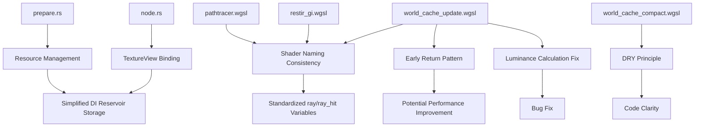

+++
title = "#22347 Misc solari cleanup"
date = "2026-01-04T00:00:00"
draft = false
template = "pull_request_page.html"
in_search_index = true

[taxonomies]
list_display = ["show"]

[extra]
current_language = "en"
available_languages = {"en" = { name = "English", url = "/pull_request/bevy/2026-01/pr-22347-en-20260104" }, "zh-cn" = { name = "中文", url = "/pull_request/bevy/2026-01/pr-22347-zh-cn-20260103" }}
labels = ["D-Trivial", "A-Rendering", "C-Code-Quality"]
+++

# Title

## Basic Information
- **Title**: Misc solari cleanup
- **PR Link**: https://github.com/bevyengine/bevy/pull/22347
- **Author**: JMS55
- **Status**: MERGED
- **Labels**: D-Trivial, A-Rendering, C-Code-Quality, S-Ready-For-Final-Review
- **Created**: 2026-01-02T03:51:20Z
- **Merged**: 2026-01-03T23:02:12Z
- **Merged By**: alice-i-cecile

## Description Translation
Small cleanup PR to prep for a future PR (no functional changes).

Easiest to review if you hide whitespace changes in the diff.

## The Story of This Pull Request

This PR represents a straightforward code cleanup effort in Bevy's Solari rendering module. The developer was preparing the codebase for future changes by addressing several minor inconsistencies and improving code clarity. While the changes don't modify functionality, they demonstrate good engineering practices around code maintenance and preparation.

The work focuses on two main areas: improving variable naming consistency in shader code and simplifying resource management in the Rust code. These changes make the code easier to read and maintain, which is particularly important for complex rendering systems where subtle bugs can have significant visual impact.

In the shader files, the developer noticed inconsistent naming patterns for ray tracing results. The `trace_ray` function was returning results stored in variables with different names across different shaders (`ray_hit` in some places, inconsistent usage in others). This was standardized to use `ray` for the initial ray query result, then `ray_hit` for the resolved hit information. This naming convention better reflects the data flow: first you get a ray intersection query result, then you resolve it to get detailed hit information.

```wgsl
// Before:
let ray_hit = trace_ray(ray_origin, ray_direction, ray_t_min, RAY_T_MAX, RAY_FLAG_NONE);
if ray_hit.kind != RAY_QUERY_INTERSECTION_NONE {
    let ray_hit = resolve_ray_hit_full(ray_hit);

// After:
let ray = trace_ray(ray_origin, ray_direction, ray_t_min, RAY_T_MAX, RAY_FLAG_NONE);
if ray.kind != RAY_QUERY_INTERSECTION_NONE {
    let ray_hit = resolve_ray_hit_full(ray);
```

This change appears in three different shader files (`pathtracer.wgsl`, `restir_gi.wgsl`, and `world_cache_update.wgsl`), showing the developer systematically applied the same improvement across the codebase. Consistency in shader code is especially valuable because shaders are often modified by multiple developers and can be difficult to debug due to their parallel execution model.

In the Rust code, the developer simplified the management of Direct Illumination (DI) reservoir textures. Previously, these resources were stored as tuples containing both a `Texture` and its `TextureView`. The code was changed to store only the `TextureView`, which is what's actually needed for binding in rendering operations. This reduces memory usage slightly and simplifies the code by eliminating unnecessary texture handles.

```rust
// Before:
pub di_reservoirs_a: (Texture, TextureView),
pub di_reservoirs_b: (Texture, TextureView),

// After:
pub di_reservoirs_a: TextureView,
pub di_reservoirs_b: TextureView,
```

The corresponding creation code was also simplified by chaining the texture creation and view creation operations:

```rust
// Before:
let tex = render_device.create_texture(&TextureDescriptor { ... });
let view = tex.create_view(&TextureViewDescriptor::default());
(tex, view)

// After:
render_device
    .create_texture(&TextureDescriptor { ... })
    .create_view(&TextureViewDescriptor::default())
```

This pattern is more idiomatic in Bevy's rendering code and reduces the scope of intermediate variables. The texture object still exists but is now managed internally by the render device rather than being explicitly stored.

The PR also includes a minor bug fix in the `world_cache_update.wgsl` shader. The calculation for blended luminance delta was changed from `luminance(blended_radiance) - luminance(old_radiance.rgb)` to `luminance(blended_radiance - old_radiance.rgb)`. While this might seem like a subtle difference, it's mathematically significant. The original code computed the difference of luminances, while the new code computes the luminance of the difference. The latter is more correct for tracking how much the radiance value itself has changed, rather than how much the perceived brightness has changed.

Another clean-up change in `world_cache_compact.wgsl` improves code clarity by calculating the active cell count once and reusing it, rather than computing it twice with the same expression. This follows the DRY (Don't Repeat Yourself) principle and makes the intent clearer.

```wgsl
// Before:
world_cache_active_cells_count = compacted_index + u32(cell_active);
world_cache_active_cells_dispatch = vec3((world_cache_active_cells_count + 63u) / 64u, 1u, 1u);

// After:
let active_cell_count = compacted_index + u32(cell_active);
world_cache_active_cells_count = active_cell_count;
world_cache_active_cells_dispatch = vec3((active_cell_count + 63u) / 64u, 1u, 1u);
```

Finally, the shader functions in `world_cache_update.wgsl` were refactored to use early returns for boundary checks, which is a common pattern in GPU programming to minimize divergent execution within warp/wavefront. By returning early when `active_cell_id.x >= world_cache_active_cells_count`, threads that don't have work to do exit quickly, potentially improving performance on some GPU architectures.

These changes collectively represent good software engineering practices: improving naming consistency, simplifying data structures, fixing subtle bugs, and optimizing control flow patterns. While individually small, these improvements make the codebase more maintainable and prepare it for future, more substantial changes.

## Visual Representation



## Key Files Changed

### `crates/bevy_solari/src/realtime/prepare.rs`
**What changed:** Simplified the storage of DI reservoir resources from tuples `(Texture, TextureView)` to just `TextureView`.

**Why:** The `Texture` handles weren't being used elsewhere in the code, so storing only the `TextureView` reduces memory usage and simplifies the API.

**Code snippet:**
```rust
// Before:
pub di_reservoirs_a: (Texture, TextureView),
pub di_reservoirs_b: (Texture, TextureView),

// After:
pub di_reservoirs_a: TextureView,
pub di_reservoirs_b: TextureView,
```

### `crates/bevy_solari/src/realtime/node.rs`
**What changed:** Updated texture binding to use the simplified `TextureView` fields.

**Why:** The corresponding fields in `prepare.rs` were changed from tuples to single values, so the binding code needed to be updated accordingly.

**Code snippet:**
```rust
// Before:
&s.di_reservoirs_a.1,
&s.di_reservoirs_b.1,

// After:
&s.di_reservoirs_a,
&s.di_reservoirs_b,
```

### `crates/bevy_solari/src/pathtracer/pathtracer.wgsl`
**What changed:** Standardized variable naming for ray tracing results.

**Why:** Improves consistency across shader files and clarifies the distinction between raw ray query results and resolved hit information.

**Code snippet:**
```wgsl
// Before:
let ray_hit = trace_ray(ray_origin, ray_direction, ray_t_min, RAY_T_MAX, RAY_FLAG_NONE);
if ray_hit.kind != RAY_QUERY_INTERSECTION_NONE {
    let ray_hit = resolve_ray_hit_full(ray_hit);

// After:
let ray = trace_ray(ray_origin, ray_direction, ray_t_min, RAY_T_MAX, RAY_FLAG_NONE);
if ray.kind != RAY_QUERY_INTERSECTION_NONE {
    let ray_hit = resolve_ray_hit_full(ray);
```

### `crates/bevy_solari/src/realtime/world_cache_update.wgsl`
**What changed:** Multiple improvements including early return patterns, fixed luminance calculation, and consistent ray variable naming.

**Why:** Early returns can improve GPU performance by reducing thread divergence. The luminance calculation fix addresses a potential mathematical error. Consistent naming improves code readability.

**Code snippet (luminance fix):**
```wgsl
// Before:
let blended_luminance_delta = mix(luminance_delta, luminance(blended_radiance) - luminance(old_radiance.rgb), 1.0 / 8.0);

// After:
let blended_luminance_delta = mix(luminance_delta, luminance(blended_radiance - old_radiance.rgb), 1.0 / 8.0);
```

### `crates/bevy_solari/src/realtime/world_cache_compact.wgsl`
**What changed:** Applied DRY principle by calculating active cell count once instead of twice.

**Why:** Improves code clarity and eliminates redundant calculations.

**Code snippet:**
```wgsl
// Before:
world_cache_active_cells_count = compacted_index + u32(cell_active);
world_cache_active_cells_dispatch = vec3((world_cache_active_cells_count + 63u) / 64u, 1u, 1u);

// After:
let active_cell_count = compacted_index + u32(cell_active);
world_cache_active_cells_count = active_cell_count;
world_cache_active_cells_dispatch = vec3((active_cell_count + 63u) / 64u, 1u, 1u);
```

## Further Reading

1. **WGSL Specification**: For understanding WebGPU Shading Language syntax and best practices.
2. **Bevy Rendering Architecture**: The Bevy engine's rendering architecture documentation for context on how resources are managed.
3. **ReSTIR GI Algorithm**: Papers on Resampled Importance Sampling for real-time global illumination to understand the context of these changes.
4. **GPU Programming Best Practices**: Resources on optimizing shader code for modern GPU architectures, particularly around thread divergence and memory access patterns.
5. **Code Review Guidelines for GPU Code**: Best practices for reviewing shader code, given its parallel execution model and debugging challenges.