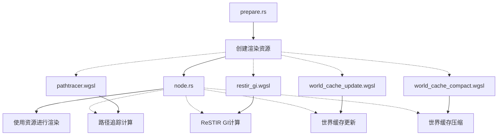

+++
title = "#22347 Misc solari cleanup"
date = "2026-01-03T00:00:00"
draft = false
template = "pull_request_page.html"
in_search_index = false

[extra]
current_language = "zh-cn"
available_languages = {"en" = { name = "English", url = "/pull_request/bevy/2026-01/pr-22347-en-20260104" }, "zh-cn" = { name = "中文", url = "/pull_request/bevy/2026-01/pr-22347-zh-cn-20260103" }}
+++

# Misc solari cleanup

## 基本信息
- **标题**: Misc solari cleanup
- **PR链接**: https://github.com/bevyengine/bevy/pull/22347
- **作者**: JMS55
- **状态**: 已合并
- **标签**: D-Trivial, A-Rendering, C-Code-Quality, S-Ready-For-Final-Review
- **创建时间**: 2026-01-02T03:51:20Z
- **合并时间**: 2026-01-03T23:02:12Z
- **合并者**: alice-i-cecile

## 描述翻译
小型清理PR，为将来的PR做准备（无功能变更）。

如果隐藏差异中的空白变化，审查起来会更简单。

## 这个Pull Request的故事

这个PR是一个典型的代码维护性工作，主要目的是清理Solari模块中的代码，为后续的功能开发做准备。作者明确表示这个PR不包含功能变更，但其中的改进对代码质量和可维护性有重要意义。

### 问题与上下文

在Bevy引擎的Solari模块（一个实时全局光照系统）开发过程中，代码库逐渐积累了一些可以改进的地方。这些问题包括：

1. **命名不一致**：在多个WGSL着色器文件中，变量命名存在不一致的问题，特别是对于射线追踪结果的命名。
2. **数据结构冗余**：资源管理代码中存储了不必要的纹理对象，而实际上只需要纹理视图。
3. **代码可读性问题**：一些WGSL着色器中的条件逻辑采用了较深的嵌套结构，影响可读性。
4. **潜在的计算错误**：有一个光照计算中的亮度差值计算可能存在逻辑问题。

这些问题虽然不影响当前功能，但随着代码库的扩展，会增加维护成本和引入错误的风险。特别是在准备添加新功能之前，清理现有代码是一个明智的做法。

### 解决方案方法

作者采用了直接的代码重构方法，专注于几个关键方面：

1. **统一变量命名**：在射线追踪相关的代码中，使变量命名更加一致和清晰。
2. **简化数据结构**：移除不必要的纹理对象存储，只保留实际需要的纹理视图。
3. **改进控制流**：将条件检查提前返回，减少嵌套深度。
4. **修复计算逻辑**：修正亮度差值计算中的潜在错误。

这些变更都遵循最小修改原则，确保不改变现有功能的行为。

### 具体实现

#### 变量重命名统一化

在多个WGSL文件中，对射线追踪结果的命名进行了统一。原来的代码中，`trace_ray`函数返回的结果有时被命名为`ray_hit`，但这个名称容易引起误解，因为它实际上是一个射线查询结果，需要进一步解析才能得到完整的命中信息。

```wgsl
// 文件: crates/bevy_solari/src/pathtracer/pathtracer.wgsl
// 之前:
let ray_hit = trace_ray(ray_origin, ray_direction, ray_t_min, RAY_T_MAX, RAY_FLAG_NONE);
if ray_hit.kind != RAY_QUERY_INTERSECTION_NONE {
    let ray_hit = resolve_ray_hit_full(ray_hit);

// 之后:
let ray = trace_ray(ray_origin, ray_direction, ray_t_min, RAY_T_MAX, RAY_FLAG_NONE);
if ray.kind != RAY_QUERY_INTERSECTION_NONE {
    let ray_hit = resolve_ray_hit_full(ray);
```

这个变更使代码更清晰：`trace_ray`返回的是射线查询结果`ray`，然后`resolve_ray_hit_full`将其解析为完整的命中信息`ray_hit`。同样的模式也出现在`restir_gi.wgsl`和`world_cache_update.wgsl`中。

#### 资源管理简化

在Rust代码中，`SolariLightingResources`结构体原本存储了纹理和纹理视图的元组，但实际上只需要纹理视图。这个简化减少了内存使用并简化了API。

```rust
// 文件: crates/bevy_solari/src/realtime/prepare.rs
// 之前:
pub struct SolariLightingResources {
    pub di_reservoirs_a: (Texture, TextureView),
    pub di_reservoirs_b: (Texture, TextureView),
}

// 之后:
pub struct SolariLightingResources {
    pub di_reservoirs_a: TextureView,
    pub di_reservoirs_b: TextureView,
}
```

相应的，资源创建函数也进行了简化，直接返回纹理视图：

```rust
// 之前:
let tex = render_device.create_texture(&TextureDescriptor { ... });
let view = tex.create_view(&TextureViewDescriptor::default());
(tex, view)

// 之后:
render_device
    .create_texture(&TextureDescriptor { ... })
    .create_view(&TextureViewDescriptor::default())
```

这种简化使得使用这些资源的代码也变得更简洁：

```rust
// 文件: crates/bevy_solari/src/realtime/node.rs
// 之前:
&s.di_reservoirs_a.1,
&s.di_reservoirs_b.1,

// 之后:
&s.di_reservoirs_a,
&s.di_reservoirs_b,
```

#### 控制流改进

在`world_cache_update.wgsl`中，作者改进了两个计算着色器的控制流结构：

```wgsl
// 之前（嵌套较深）:
if active_cell_id.x < world_cache_active_cells_count {
    // 大量计算代码...
}

// 之后（提前返回）:
if active_cell_id.x >= world_cache_active_cells_count { return; }
// 大量计算代码...
```

这种"保护性条款"（guard clause）模式减少了嵌套层次，使代码更易于阅读和维护。

#### 计算错误修复

在同一个文件中，修复了一个亮度差值计算中的潜在错误：

```wgsl
// 之前:
let blended_luminance_delta = mix(luminance_delta, luminance(blended_radiance - old_radiance.rgb), 1.0 / 8.0);

// 之后:
let blended_luminance_delta = mix(luminance_delta, luminance(blended_radiance) - luminance(old_radiance.rgb), 1.0 / 8.0);
```

原来的代码中`luminance(blended_radiance - old_radiance.rgb)`计算的是差值向量的亮度，而实际上需要的是两个亮度的差值。这是一个细微但重要的区别，特别是在处理颜色向量时。

#### 代码清晰度改进

在`world_cache_compact.wgsl`中，添加了中间变量来提高代码可读性：

```wgsl
// 之前:
world_cache_active_cells_count = compacted_index + u32(cell_active);
world_cache_active_cells_dispatch = vec3((world_cache_active_cells_count + 63u) / 64u, 1u, 1u);

// 之后:
let active_cell_count = compacted_index + u32(cell_active);
world_cache_active_cells_count = active_cell_count;
world_cache_active_cells_dispatch = vec3((active_cell_count + 63u) / 64u, 1u, 1u);
```

通过引入`active_cell_count`这个中间变量，代码的意图变得更加清晰。

### 技术见解

这个PR展示了几个在大型图形代码库中重要的实践：

1. **逐步重构**：在添加新功能之前清理现有代码，可以减少技术债务的积累。
2. **命名的重要性**：一致的命名约定对于理解射线追踪这样的复杂算法至关重要。
3. **最小化资源存储**：在资源管理中，只存储必要的数据可以减少内存使用和简化API。
4. **WGSL优化**：WGSL作为WebGPU的着色语言，其代码质量直接影响性能。减少嵌套和控制流复杂度有助于GPU更高效地执行。

这些变更虽然看似微小，但对于维护一个复杂的实时渲染系统来说非常重要。特别是射线追踪相关的代码，由于其算法复杂性，清晰的代码结构对于调试和扩展至关重要。

### 影响

这个PR的主要影响体现在代码质量方面：

1. **提高可读性**：统一的命名和简化的控制流使代码更易于理解。
2. **减少潜在错误**：修复了亮度计算中的逻辑问题。
3. **简化资源管理**：移除不必要的纹理存储，使资源管理更加清晰。
4. **为未来开发奠定基础**：清理后的代码库更容易进行后续的功能扩展。

从性能角度看，这些变更不会显著影响运行时的性能，但提高了代码的可维护性，间接降低了未来引入性能问题的风险。

## 可视化表示



## 关键文件变更

### `crates/bevy_solari/src/realtime/prepare.rs` (+16/-16)
**变更描述**：简化了资源管理，不再存储纹理对象，只存储纹理视图。
```rust
// 之前:
pub di_reservoirs_a: (Texture, TextureView),
pub di_reservoirs_b: (Texture, TextureView),

// 之后:
pub di_reservoirs_a: TextureView,
pub di_reservoirs_b: TextureView,
```
**关联性**：这个变更是资源管理简化的核心，影响多个其他文件。

### `crates/bevy_solari/src/pathtracer/pathtracer.wgsl` (+3/-3)
**变更描述**：统一射线追踪结果的变量命名。
```wgsl
// 之前:
let ray_hit = trace_ray(ray_origin, ray_direction, ray_t_min, RAY_T_MAX, RAY_FLAG_NONE);
if ray_hit.kind != RAY_QUERY_INTERSECTION_NONE {
    let ray_hit = resolve_ray_hit_full(ray_hit);

// 之后:
let ray = trace_ray(ray_origin, ray_direction, ray_t_min, RAY_T_MAX, RAY_FLAG_NONE);
if ray.kind != RAY_QUERY_INTERSECTION_NONE {
    let ray_hit = resolve_ray_hit_full(ray);
```
**关联性**：提高代码可读性和一致性。

### `crates/bevy_solari/src/realtime/world_cache_update.wgsl` (+29/-30)
**变更描述**：改进控制流结构并修复亮度计算错误。
```wgsl
// 控制流改进:
// 之前: if (condition) { ... } 的深层嵌套
// 之后: if (!condition) { return; } 的提前返回模式

// 计算修复:
// 之前:
let blended_luminance_delta = mix(luminance_delta, luminance(blended_radiance - old_radiance.rgb), 1.0 / 8.0);

// 之后:
let blended_luminance_delta = mix(luminance_delta, luminance(blended_radiance) - luminance(old_radiance.rgb), 1.0 / 8.0);
```
**关联性**：这是本次PR中最重要的功能性修复，修正了潜在的计算错误。

### `crates/bevy_solari/src/realtime/node.rs` (+2/-2)
**变更描述**：更新资源使用方式，反映prepare.rs中的变更。
```rust
// 之前:
&s.di_reservoirs_a.1,
&s.di_reservoirs_b.1,

// 之后:
&s.di_reservoirs_a,
&s.di_reservoirs_b,
```
**关联性**：与prepare.rs的变更配套，简化资源访问。

### `crates/bevy_solari/src/realtime/restir_gi.wgsl` (+3/-3)
**变更描述**：统一射线追踪结果的变量命名。
```wgsl
// 之前:
let ray_hit = trace_ray(world_position, ray_direction, RAY_T_MIN, RAY_T_MAX, RAY_FLAG_NONE);
if ray_hit.kind == RAY_QUERY_INTERSECTION_NONE {

// 之后:
let ray = trace_ray(world_position, ray_direction, RAY_T_MIN, RAY_T_MAX, RAY_FLAG_NONE);
if ray.kind == RAY_QUERY_INTERSECTION_NONE {
```
**关联性**：保持命名一致性。

### `crates/bevy_solari/src/realtime/world_cache_compact.wgsl` (+3/-2)
**变更描述**：添加中间变量提高代码可读性。
```wgsl
// 之前:
world_cache_active_cells_count = compacted_index + u32(cell_active);
world_cache_active_cells_dispatch = vec3((world_cache_active_cells_count + 63u) / 64u, 1u, 1u);

// 之后:
let active_cell_count = compacted_index + u32(cell_active);
world_cache_active_cells_count = active_cell_count;
world_cache_active_cells_dispatch = vec3((active_cell_count + 63u) / 64u, 1u, 1u);
```
**关联性**：提高代码清晰度的小改进。

## 进一步阅读

1. **WebGPU和WGSL**：
   - [WebGPU Specification](https://www.w3.org/TR/webgpu/)
   - [WGSL Language Specification](https://www.w3.org/TR/WGSL/)

2. **实时全局光照技术**：
   - [ReSTIR: Reservoir-based Spatiotemporal Importance Resampling](https://research.nvidia.com/publication/2020-07_restir-reservoir-based-spatiotemporal-importance-resampling)

3. **Bevy引擎**：
   - [Bevy Engine Documentation](https://bevyengine.org/learn/)
   - [Bevy GitHub Repository](https://github.com/bevyengine/bevy)

4. **代码重构技术**：
   - Martin Fowler的《重构：改善既有代码的设计》
   - "Guard Clause"模式在条件处理中的应用