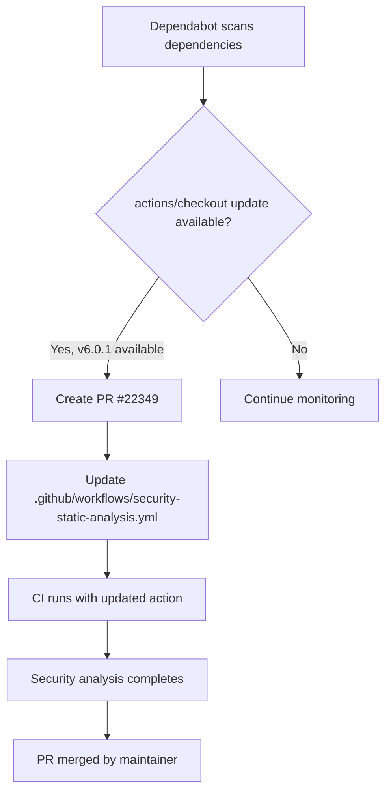

+++
title = "#22349 Bump actions/checkout from 6.0.0 to 6.0.1"
date = "2026-01-04T00:00:00"
draft = false
template = "pull_request_page.html"
in_search_index = true

[taxonomies]
list_display = ["show"]

[extra]
current_language = "en"
available_languages = {"en" = { name = "English", url = "/pull_request/bevy/2026-01/pr-22349-en-20260104" }, "zh-cn" = { name = "中文", url = "/pull_request/bevy/2026-01/pr-22349-zh-cn-20260104" }}
labels = ["D-Trivial", "A-Build-System", "C-Dependencies"]
+++

# Bump actions/checkout from 6.0.0 to 6.0.1

## Basic Information
- **Title**: Bump actions/checkout from 6.0.0 to 6.0.1
- **PR Link**: https://github.com/bevyengine/bevy/pull/22349
- **Author**: app/dependabot
- **Status**: MERGED
- **Labels**: D-Trivial, A-Build-System, C-Dependencies, S-Ready-For-Final-Review
- **Created**: 2026-01-02T06:01:10Z
- **Merged**: 2026-01-03T22:50:44Z
- **Merged By**: mockersf

## Description Translation

Bumps [actions/checkout](https://github.com/actions/checkout) from 6.0.0 to 6.0.1.
<details>
<summary>Release notes</summary>
<p><em>Sourced from <a href="https://github.com/actions/checkout/releases">actions/checkout's releases</a>.</em></p>
<blockquote>
<h2>v6.0.1</h2>
<h2>What's Changed</h2>
<ul>
<li>Update all references from v5 and v4 to v6 by <a href="https://github.com/ericsciple"><code>@​ericsciple</code></a> in <a href="https://redirect.github.com/actions/checkout/pull/2314">actions/checkout#2314</a></li>
<li>Add worktree support for persist-credentials includeIf by <a href="https://github.com/ericsciple"><code>@​ericsciple</code></a> in <a href="https://redirect.github.com/actions/checkout/pull/2327">actions/checkout#2327</a></li>
<li>Clarify v6 README by <a href="https://github.com/ericsciple"><code>@​ericsciple</code></a> in <a href="https://redirect.github.com/actions/checkout/pull/2328">actions/checkout#2328</a></li>
</ul>
<p><strong>Full Changelog</strong>: <a href="https://github.com/actions/checkout/compare/v6...v6.0.1">https://github.com/actions/checkout/compare/v6...v6.0.1</a></p>
</blockquote>
</details>
<details>
<summary>Commits</summary>
<ul>
<li>See full diff in <a href="https://github.com/actions/checkout/compare/v6...8e8c483db84b4bee98b60c0593521ed34d9990e8">compare view</a></li>
</ul>
</details>
<br />


[](https://docs.github.com/en/github/managing-security-vulnerabilities/about-dependabot-security-updates#about-compatibility-scores)

Dependabot will resolve any conflicts with this PR as long as you don't alter it yourself. You can also trigger a rebase manually by commenting `@dependabot rebase`.

[//]: # (dependabot-automerge-start)
[//]: # (dependabot-automerge-end)

---

<details>
<summary>Dependabot commands and options</summary>
<br />

You can trigger Dependabot actions by commenting on this PR:
- `@dependabot rebase` will rebase this PR
- `@dependabot recreate` will recreate this PR, overwriting any edits that have been made to it
- `@dependabot merge` will merge this PR after your CI passes on it
- `@dependabot squash and merge` will squash and merge this PR after your CI passes on it
- `@dependabot cancel merge` will cancel a previously requested merge and block automerging
- `@dependabot reopen` will reopen this PR if it is closed
- `@dependabot close` will close this PR and stop Dependabot recreating it. You can achieve the same result by closing it manually
- `@dependabot show <dependency name> ignore conditions` will show all of the ignore conditions of the specified dependency
- `@dependabot ignore this major version` will close this PR and stop Dependabot creating any more for this major version (unless you reopen the PR or upgrade to it yourself)
- `@dependabot ignore this minor version` will close this PR and stop Dependabot creating any more for this minor version (unless you reopen the PR or upgrade to it yourself)
- `@dependabot ignore this dependency` will close this PR and stop Dependabot creating any more for this dependency (unless you reopen the PR or upgrade to it yourself)

</details>

## The Story of This Pull Request

This pull request represents a routine dependency maintenance update in the Bevy Engine's continuous integration pipeline. The PR updates the `actions/checkout` GitHub Action from version 6.0.0 to 6.0.1 in a single workflow file. This change was automatically generated by Dependabot, GitHub's automated dependency update service.

The core problem being addressed is straightforward: keeping CI/CD dependencies current. In this case, the `actions/checkout` action is a fundamental component of GitHub Actions workflows that handles repository checkout operations. While version 6.0.0 was already in use, version 6.0.1 includes minor but potentially important updates that could affect the security and static analysis workflow.

Looking at the release notes for `actions/checkout@6.0.1`, we see three main changes:
1. Documentation updates to reference v6 consistently (removing outdated references to v4 and v5)
2. Added worktree support for `persist-credentials includeIf` - a feature that could be relevant for credential persistence in certain Git configurations
3. Clarifications to the v6 README for better user understanding

The implementation is minimal: a single-line change in the `.github/workflows/security-static-analysis.yml` file that updates the pinned version reference. The change follows GitHub Actions best practices by using both a specific commit hash (`8e8c483db84b4bee98b60c0593521ed34d9990e8`) and a semantic version tag (`v6.0.1`). This dual referencing approach ensures reproducibility while also making the version intent clear to developers reading the code.

The technical context here is important. The `actions/checkout` action is typically the first step in most GitHub Actions workflows, responsible for checking out the repository code so subsequent steps can operate on it. The security-static-analysis workflow in particular runs security scanning tools that need access to the codebase. Any issues with the checkout process could prevent these security checks from running properly, potentially leaving vulnerabilities undetected.

From an engineering perspective, this update demonstrates the value of automated dependency management in maintaining project hygiene. Dependabot regularly scans project dependencies for updates and creates PRs like this one, reducing the maintenance burden on human maintainers. The PR was appropriately labeled with `D-Trivial` (indicating minimal risk/impact), `A-Build-System` (affecting build/CI systems), and `C-Dependencies` (a dependency update).

The impact of this change is primarily preventive: it ensures the Bevy project benefits from the latest bug fixes and improvements in a core CI dependency. While the specific changes in v6.0.1 may not directly affect Bevy's current usage patterns, maintaining updated dependencies reduces the risk of encountering issues that have already been fixed upstream.

One notable aspect is that this PR follows the standard Dependabot pattern: it includes comprehensive metadata about the update (release notes, compatibility scores), provides clear instructions for maintainers on how to handle the PR, and follows the established convention for dependency updates in the project. The PR was merged quickly (within two days), suggesting that the maintainers have confidence in both Dependabot's update recommendations and the stability of minor version updates to `actions/checkout`.

## Visual Representation



## Key Files Changed

### `.github/workflows/security-static-analysis.yml` (+1/-1)

This file contains the GitHub Actions workflow for security static analysis. The workflow runs security scanning tools on the codebase. The change updates the `actions/checkout` action from version 6.0.0 to 6.0.1 in the checkout step.

**Key modification:**
```yaml
# File: .github/workflows/security-static-analysis.yml
# Before:
- name: Checkout repository
  uses: actions/checkout@1af3b93b6815bc44a9784bd300feb67ff0d1eeb3 # v6.0.0

# After:
- name: Checkout repository
  uses: actions/checkout@8e8c483db84b4bee98b60c0593521ed34d9990e8 # v6.0.1
```

**Why this change matters:**
The `actions/checkout` step is fundamental to GitHub Actions workflows - it retrieves the repository code so subsequent steps can operate on it. Updating to the latest patch version (6.0.1) ensures the workflow benefits from bug fixes and minor improvements while maintaining compatibility with the major version (v6). The specific commit hash update ensures reproducible builds while the comment maintains clarity about the semantic version.

## Further Reading

1. [GitHub Actions documentation for actions/checkout](https://github.com/actions/checkout) - Official repository and documentation for the checkout action
2. [Dependabot documentation](https://docs.github.com/en/code-security/dependabot) - How GitHub's Dependabot works for dependency updates
3. [GitHub Actions workflow syntax](https://docs.github.com/en/actions/using-workflows/workflow-syntax-for-github-actions) - Reference for understanding workflow files
4. [Semantic Versioning](https://semver.org/) - Understanding patch vs minor vs major version updates
5. [Git worktrees](https://git-scm.com/docs/git-worktree) - Background on Git worktrees, which are now better supported in the updated action

# Full Code Diff
```diff
diff --git a/.github/workflows/security-static-analysis.yml b/.github/workflows/security-static-analysis.yml
index f2edfd5ffcd99..7c093b1c7ec27 100644
--- a/.github/workflows/security-static-analysis.yml
+++ b/.github/workflows/security-static-analysis.yml
@@ -82,7 +82,7 @@ jobs:
       actions: read
     steps:
       - name: Checkout repository
-        uses: actions/checkout@1af3b93b6815bc44a9784bd300feb67ff0d1eeb3 # v6.0.0
+        uses: actions/checkout@8e8c483db84b4bee98b60c0593521ed34d9990e8 # v6.0.1
         with:
           persist-credentials: false
```