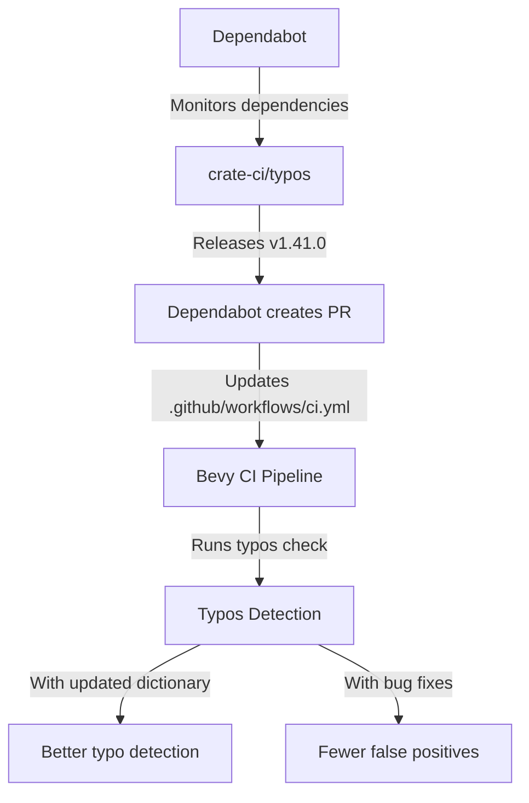

+++
title = "#22350 Bump crate-ci/typos from 1.40.0 to 1.41.0"
date = "2026-01-02T00:00:00"
draft = false
template = "pull_request_page.html"
in_search_index = true

[taxonomies]
list_display = ["show"]

[extra]
current_language = "en"
available_languages = {"en" = { name = "English", url = "/pull_request/bevy/2026-01/pr-22350-en-20260102" }, "zh-cn" = { name = "中文", url = "/pull_request/bevy/2026-01/pr-22350-zh-cn-20260102" }}
labels = ["C-Dependencies"]
+++

# Title
## Bump crate-ci/typos from 1.40.0 to 1.41.0

## Basic Information
- **Title**: Bump crate-ci/typos from 1.40.0 to 1.41.0
- **PR Link**: https://github.com/bevyengine/bevy/pull/22350
- **Author**: app/dependabot
- **Status**: MERGED
- **Labels**: C-Dependencies
- **Created**: 2026-01-02T06:01:20Z
- **Merged**: 2026-01-02T08:23:47Z
- **Merged By**: mockersf

## Description Translation
Bumps [crate-ci/typos](https://github.com/crate-ci/typos) from 1.40.0 to 1.41.0.
<details>
<summary>Release notes</summary>
<p><em>Sourced from <a href="https://github.com/crate-ci/typos/releases">crate-ci/typos's releases</a>.</em></p>
<blockquote>
<h2>v1.41.0</h2>
<h2>[1.41.0] - 2025-12-31</h2>
<h3>Features</h3>
<ul>
<li>Updated the dictionary with the <a href="https://redirect.github.com/crate-ci/typos/issues/1431">December 2025</a> changes</li>
</ul>
<h2>v1.40.1</h2>
<h2>[1.40.1] - 2025-12-29</h2>
<h3>Fixes</h3>
<ul>
<li>Treat <code>incrementer</code> and <code>incrementor</code> the same for now</li>
</ul>
<h3>Fixes</h3>
<ul>
<li>Don't correct ITerm2</li>
</ul>
</blockquote>
</details>
<details>
<summary>Changelog</summary>
<p><em>Sourced from <a href="https://github.com/crate-ci/typos/blob/master/CHANGELOG.md">crate-ci/typos's changelog</a>.</em></p>
<blockquote>
<h1>Change Log</h1>
<p>All notable changes to this project will be documented in this file.</p>
<p>The format is based on <a href="https://keepachangelog.com/">Keep a Changelog</a>
and this project adheres to <a href="https://semver.org/">Semantic Versioning</a>.</p>
<!-- raw HTML omitted -->
<h2>[Unreleased] - ReleaseDate</h2>
<h2>[1.41.0] - 2025-12-31</h2>
<h3>Features</h3>
<ul>
<li>Updated the dictionary with the <a href="https://redirect.github.com/crate-ci/typos/issues/1431">December 2025</a> changes</li>
</ul>
<h2>[1.40.1] - 2025-12-29</h2>
<h3>Fixes</h3>
<ul>
<li>Treat <code>incrementer</code> and <code>incrementor</code> the same for now</li>
</ul>
<h3>Fixes</h3>
<ul>
<li>Don't correct ITerm2</li>
</ul>
<h2>[1.40.0] - 2025-11-26</h2>
<h3>Features</h3>
<ul>
<li>Updated the dictionary with the <a href="https://redirect.github.com/crate-ci/typos/issues/1405">November 2025</a> changes</li>
</ul>
<h2>[1.39.2] - 2025-11-13</h2>
<h3>Fixes</h3>
<ul>
<li>Don't offer <code>entry</code> as a correction for <code>entrys</code></li>
</ul>
<h2>[1.39.1] - 2025-11-12</h2>
<h3>Features</h3>
<ul>
<li>Make <code>--help</code> more vibrant</li>
</ul>
<h2>[1.39.0] - 2025-10-31</h2>
<h3>Features</h3>
<ul>
<li>Updated the dictionary with the <a href="https://redirect.github.com/crate-ci/typos/issues/1383">October 2025</a> changes</li>
</ul>
<h3>Fixes</h3>
<!-- raw HTML omitted -->
</blockquote>
<p>... (truncated)</p>
</details>
<details>
<summary>Commits</summary>
<ul>
<li><a href="https://github.com/crate-ci/typos/commit/5c19779cb52ea50e151f5a10333ccd269227b5ae"><code>5c19779</code></a> chore: Release</li>
<li><a href="https://github.com/crate-ci/typos/commit/cf11fdd0cafeb0313a23b39710f6d8f092be9f68"><code>cf11fdd</code></a> chore: Release</li>
<li><a href="https://github.com/crate-ci/typos/commit/54e83d2a582595554e20dd95c699d56f34ac731c"><code>54e83d2</code></a> docs: Update changelog</li>
<li><a href="https://github.com/crate-ci/typos/commit/fbd7b69944b03639d5030669f39c0e1df86b5595"><code>fbd7b69</code></a> Merge pull request <a href="https://redirect.github.com/crate-ci/typos/issues/1454">#1454</a> from epage/dec</li>
<li><a href="https://github.com/crate-ci/typos/commit/5dc35c7a63a1ab4d35f2a2fb0e444f323fb101d8"><code>5dc35c7</code></a> feat(dict): December additions</li>
<li><a href="https://github.com/crate-ci/typos/commit/1a319b54cc9e3b333fed6a5c88ba1a90324da514"><code>1a319b5</code></a> chore: Release</li>
<li><a href="https://github.com/crate-ci/typos/commit/00852bb03b1cef503e7767e361869382c1c52f8b"><code>00852bb</code></a> docs: Update changelog</li>
<li><a href="https://github.com/crate-ci/typos/commit/1d4327057a112973ec81e1eca7162cec8cb48649"><code>1d43270</code></a> chore: Release</li>
<li><a href="https://github.com/crate-ci/typos/commit/770146db44202a175a71d32da9b15f9c100729d9"><code>770146d</code></a> Merge pull request <a href="https://redirect.github.com/crate-ci/typos/issues/1452">#1452</a> from epage/incrementer</li>
<li><a href="https://github.com/crate-ci/typos/commit/6bf28995c6131a2e3779f84ec1b17719d48f868b"><code>6bf2899</code></a> fix(dict): Be neutral on incrementer vs incrementor</li>
<li>Additional commits viewable in <a href="https://github.com/crate-ci/typos/compare/2d0ce569feab1f8752f1dde43cc2f2aa53236e06...5c19779cb52ea50e151f5a10333ccd269227b5ae">compare view</a></li>
</ul>
</details>
<br />


[](https://docs.github.com/en/github/managing-security-vulnerabilities/about-dependabot-security-updates#about-compatibility-scores)

Dependabot will resolve any conflicts with this PR as long as you don't alter it yourself. You can also trigger a rebase manually by commenting `@dependabot rebase`.

[//]: # (dependabot-automerge-start)
[//]: # (dependabot-automerge-end)

---

<details>
<summary>Dependabot commands and options</summary>
<br />

You can trigger Dependabot actions by commenting on this PR:
- `@dependabot rebase` will rebase this PR
- `@dependabot recreate` will recreate this PR, overwriting any edits that have been made to it
- `@dependabot merge` will merge this PR after your CI passes on it
- `@dependabot squash and merge` will squash and merge this PR after your CI passes on it
- `@dependabot cancel merge` will cancel a previously requested merge and block automerging
- `@dependabot reopen` will reopen this PR if it is closed
- `@dependabot close` will close this PR and stop Dependabot recreating it. You can achieve the same result by closing it manually
- `@dependabot show <dependency name> ignore conditions` will show all of the ignore conditions of the specified dependency
- `@dependabot ignore this major version` will close this PR and stop Dependabot creating any more for this major version (unless you reopen the PR or upgrade to it yourself)
- `@dependabot ignore this minor version` will close this PR and stop Dependabot creating any more for this minor version (unless you reopen the PR or upgrade to it yourself)
- `@dependabot ignore this dependency` will close this PR and stop Dependabot creating any more for this dependency (unless you reopen the PR or upgrade to it yourself)


</details>

## The Story of This Pull Request

This pull request represents a routine but important maintenance task for the Bevy project. At its core, it's a dependency update - specifically for the `typos` tool used in Bevy's continuous integration pipeline. While the change appears simple on the surface, it illustrates the ongoing work required to maintain a healthy, professional codebase.

The `typos` tool is integrated into Bevy's CI workflow to automatically detect spelling mistakes in the codebase. This serves multiple purposes: it improves code readability, ensures consistent terminology, and maintains a professional appearance for the project. The tool runs as a GitHub Action during every CI check, scanning code comments, documentation strings, and other text content for potential spelling errors.

The PR was automatically generated by Dependabot, GitHub's automated dependency management tool. Dependabot monitors the project's dependencies and creates PRs when updates are available. This automation is crucial for maintaining security, fixing bugs, and getting new features without requiring manual tracking of every dependency.

The update from version 1.40.0 to 1.41.0 includes several notable changes according to the release notes. The main feature is an updated dictionary with December 2025 changes, which means the tool now has better coverage of technical terms and recent additions to the English language. Two important fixes are also included: the tool now treats "incrementer" and "incrementor" as equivalent (addressing a common false positive in codebases), and it no longer incorrectly suggests corrections for "ITerm2" (a terminal emulator name that shouldn't be flagged as a typo).

From an engineering perspective, this update demonstrates good dependency management practices. The project pins dependencies to specific versions rather than using floating versions (like `@v1`), which ensures reproducible builds. When updating, the change references a specific commit hash (`5c19779cb52ea50e151f5a10333ccd269227b5ae` for v1.41.0), which provides even stronger reproducibility guarantees than semantic version tags alone.

The compatibility score badge shows a perfect 5/5 compatibility between versions, indicating that this update is low-risk and unlikely to break existing functionality. This high compatibility score is typical for minor version updates that follow semantic versioning properly, where version 1.41.0 should maintain backward compatibility with 1.40.0.

The update process itself is straightforward - a single-line change in the CI configuration file. However, the implications are significant for code quality. With the updated dictionary, the CI checks will be more accurate, catching real typos while reducing false positives. The specific fixes for "incrementer/incrementor" and "ITerm2" directly address pain points that developers might encounter, making the tool less intrusive while maintaining its value.

This type of maintenance work often goes unnoticed but is essential for professional software projects. Regular updates keep tools current with language evolution and bug fixes. The automated nature of the PR generation and the clear changelog information make it easy for maintainers to review and merge these updates with confidence.

## Visual Representation



## Key Files Changed

### `.github/workflows/ci.yml` (+1/-1)

This file contains Bevy's continuous integration configuration. The change updates the version of the `crate-ci/typos` GitHub Action used in the CI pipeline.

**Before the change:**
```yaml
- name: Check for typos
  uses: crate-ci/typos@2d0ce569feab1f8752f1dde43cc2f2aa53236e06 # v1.40.0
```

**After the change:**
```yaml
- name: Check for typos
  uses: crate-ci/typos@5c19779cb52ea50e151f5a10333ccd269227b5ae # v1.41.0
```

The change replaces the commit hash reference for the typos action from the v1.40.0 commit (`2d0ce569feab1f8752f1dde43cc2f2aa53236e06`) to the v1.41.0 commit (`5c19779cb52ea50e151f5a10333ccd269227b5ae`). The comment is updated accordingly to reflect the new version number. This single-line update ensures that future CI runs will use the improved version of the typos checker with its updated dictionary and bug fixes.

## Further Reading

- [GitHub Actions documentation](https://docs.github.com/en/actions) - Learn more about GitHub Actions and workflow configuration
- [Dependabot documentation](https://docs.github.com/en/code-security/dependabot) - Understanding automated dependency updates
- [Typos project repository](https://github.com/crate-ci/typos) - Source code and documentation for the typos checker
- [Semantic Versioning](https://semver.org/) - Understanding version numbering conventions
- [Keep a Changelog](https://keepachangelog.com/) - Best practices for maintaining project changelogs

# Full Code Diff
```diff
diff --git a/.github/workflows/ci.yml b/.github/workflows/ci.yml
index d7f3bc4fc5a36..c814ccc408761 100644
--- a/.github/workflows/ci.yml
+++ b/.github/workflows/ci.yml
@@ -367,7 +367,7 @@ jobs:
         with:
           persist-credentials: false
       - name: Check for typos
-        uses: crate-ci/typos@2d0ce569feab1f8752f1dde43cc2f2aa53236e06 # v1.40.0
+        uses: crate-ci/typos@5c19779cb52ea50e151f5a10333ccd269227b5ae # v1.41.0
       - name: Typos info
         if: failure()
         run: |
```