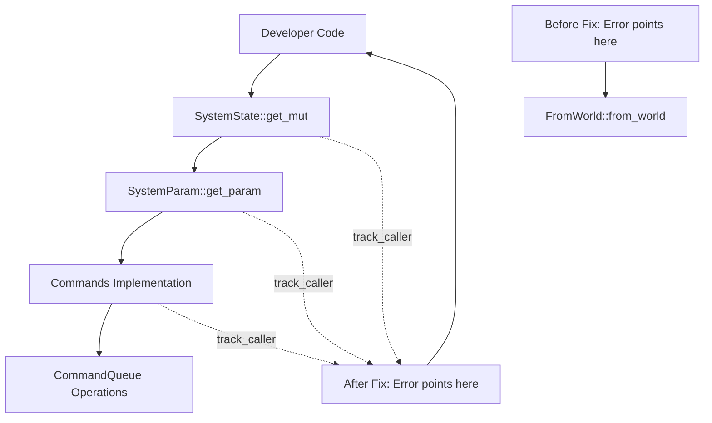

+++
title = "#22353 systemstate support commands track location"
date = "2026-01-08T00:00:00"
draft = false
template = "pull_request_page.html"
in_search_index = true

[taxonomies]
list_display = ["show"]

[extra]
current_language = "en"
available_languages = {"en" = { name = "English", url = "/pull_request/bevy/2026-01/pr-22353-en-20260108" }, "zh-cn" = { name = "中文", url = "/pull_request/bevy/2026-01/pr-22353-zh-cn-20260108" }}
labels = ["C-Bug", "A-ECS", "D-Straightforward"]
+++

# Title

## Basic Information
- **Title**: systemstate support commands track location
- **PR Link**: https://github.com/bevyengine/bevy/pull/22353
- **Author**: MushineLament
- **Status**: MERGED
- **Labels**: C-Bug, A-ECS, S-Ready-For-Final-Review, X-Uncontroversial, D-Straightforward
- **Created**: 2026-01-02T12:28:34Z
- **Merged**: 2026-01-08T20:47:55Z
- **Merged By**: alice-i-cecile

## Description Translation
**Objective**

When acquiring Commands within SystemState, it causes incorrect tracking of MaybeLocation in CommandQueue, mistakenly pointing to the FromWorld trait implementation.

**Solution**

Add track_caller support for the Commands SystemParam.

**Testing**

I only verified whether tracking is present, but did not perform any tests.

## The Story of This Pull Request

This PR addresses a bug in Bevy's Entity Component System (ECS) where error location tracking was incorrectly pointing to the wrong place in the codebase. When developers used `SystemState` to acquire `Commands` and an error occurred, the stack trace would incorrectly point to the `FromWorld` trait implementation instead of the actual calling code. This made debugging significantly more difficult because developers couldn't easily identify which part of their code was causing the issue.

The problem stemmed from how Bevy's system parameters, particularly `Commands`, track their calling location. When `SystemState` is used to manually manage system execution outside the normal scheduler flow, the location tracking mechanism loses context about where the commands are being issued from. Instead of pointing to the developer's code, it defaults to pointing at the `FromWorld::from_world` implementation, which provides default values for types.

The solution implemented in this PR is straightforward but systematic: add the `#[track_caller]` attribute to key methods in the system parameter pipeline. This Rust attribute ensures that when a panic occurs, the location information preserved points to the actual caller of the function rather than the function itself. The PR adds this attribute to four main areas: the `Commands` system parameter implementation, the `Deferred` system parameter, tuple system parameters, and the `SystemState` methods that retrieve parameters.

The implementation required careful consideration of which functions needed the attribute. The developer added `#[track_caller]` to:
1. `init_state` and `get_param` methods for the `Commands` system parameter
2. `init_state` for the `Deferred` system parameter  
3. `init_state` and `get_param` in the macro that generates tuple system parameter implementations
4. Several methods on `SystemState`: `new`, `get_mut`, and the internal `fetch` method
5. The blanket `FromWorld` implementation for default types

This approach ensures that when `SystemState` is used to acquire `Commands` (or any other system parameter), any panic that occurs during parameter initialization or retrieval will correctly point to the developer's code that called `SystemState::get_mut()` or similar methods, rather than the internal implementation details.

The changes are minimal - just adding the `#[track_caller]` attribute - but they significantly improve the debugging experience. Each addition follows the same pattern: identifying functions in the system parameter pipeline that could lose caller context and ensuring they preserve it. The PR maintains consistency with existing code that already uses `#[track_caller]` in similar contexts elsewhere in the codebase.

One technical consideration is performance. The `#[track_caller]` attribute has minimal runtime overhead - it primarily affects compilation by preserving location information that would otherwise be lost. In exchange for this small cost, developers get much better error messages when debugging system state interactions.

The impact of this fix is primarily on developer experience rather than runtime behavior. Developers using `SystemState` for advanced ECS patterns will now get accurate error locations when something goes wrong with command queue operations. This aligns with Rust's philosophy of providing helpful compiler errors and stack traces.

## Visual Representation



## Key Files Changed

### `crates/bevy_ecs/src/system/commands/mod.rs`
This file contains the `SystemParam` implementation for `Commands`. The changes add `#[track_caller]` to the `init_state` and `get_param` methods, ensuring that any panics during command acquisition point to the caller's code.

```rust
// Before:
fn init_state(world: &mut World) -> Self::State {
    // ...
}

unsafe fn get_param<'w, 's>(
    state: &'s mut Self::State,
    system_meta: &bevy_ecs::system::SystemMeta,
    world: bevy_ecs::world::UnsafeWorldCell<'w>,
    change_tick: bevy_ecs::component::Tick,
) -> Self::Item<'w, 's> {
    // ...
}

// After:
#[track_caller]
fn init_state(world: &mut World) -> Self::State {
    // ...
}

#[inline]
#[track_caller]
unsafe fn get_param<'w, 's>(
    state: &'s mut Self::State,
    system_meta: &bevy_ecs::system::SystemMeta,
    world: bevy_ecs::world::UnsafeWorldCell<'w>,
    change_tick: bevy_ecs::component::Tick,
) -> Self::Item<'w, 's> {
    // ...
}
```

### `crates/bevy_ecs/src/system/function_system.rs`
This file manages `SystemState`, which allows systems to be executed manually. The changes add `#[track_caller]` to methods that retrieve system parameters, ensuring error locations point to where `SystemState` is used.

```rust
// Added #[track_caller] to these methods:
#[track_caller]
pub fn new(world: &mut World) -> Self {
    // ...
}

#[inline]
#[track_caller]
pub fn get_mut<'w, 's>(&'s mut self, world: &'w mut World) -> SystemParamItem<'w, 's, Param> {
    // ...
}

#[inline]
#[track_caller]
pub unsafe fn get_unchecked<'w, 's>(
    &'s mut self,
    world: UnsafeWorldCell<'w>,
) -> SystemParamItem<'w, 's, Param> {
    // ...
}

#[inline]
#[track_caller]
unsafe fn fetch<'w, 's>(
    &'s mut self,
    world: UnsafeWorldCell<'w>,
) -> SystemParamItem<'w, 's, Param> {
    // ...
}
```

### `crates/bevy_ecs/src/system/system_param.rs`
This file contains system parameter implementations. The changes add `#[track_caller]` to `Deferred`'s `init_state` and to the tuple system parameter macro, ensuring consistent location tracking across all system parameter types.

```rust
// For Deferred system parameter:
#[track_caller]
fn init_state(world: &mut World) -> Self::State {
    SyncCell::new(T::from_world(world))
}

// In the impl_system_param_tuple macro:
#[inline]
#[track_caller]
fn init_state(world: &mut World) -> Self::State {
    ($($param::init_state(world),)*)
}

#[inline]
#[track_caller]
unsafe fn get_param<'w, 's>(
    state: &'s mut Self::State,
    system_meta: &SystemMeta,
    world: UnsafeWorldCell<'w>,
    change_tick: Tick,
) -> Self::Item<'w, 's> {
    // ...
}
```

### `crates/bevy_ecs/src/world/mod.rs`
This file contains the `FromWorld` trait implementation. The change adds `#[track_caller]` to the blanket implementation for default types, which was previously the incorrect location being reported in error messages.

```rust
// Before:
fn from_world(_world: &mut World) -> Self {
    T::default()
}

// After:
#[track_caller]
fn from_world(_world: &mut World) -> Self {
    T::default()
}
```

## Further Reading

1. **Rust's `#[track_caller]` attribute**: The official Rust documentation explains how this attribute works and when to use it: https://doc.rust-lang.org/std/panic/track_caller/index.html

2. **Bevy ECS SystemParam documentation**: For understanding how system parameters work in Bevy: https://bevyengine.org/learn/quick-start/ecs/system-params/

3. **Bevy's SystemState API**: Documentation on manually managing system execution with SystemState: https://docs.rs/bevy_ecs/latest/bevy_ecs/system/struct.SystemState.html

4. **Error Handling in Bevy**: General patterns for error handling in Bevy systems and how to get useful debug information: https://bevy-cheatbook.github.io/programming/errors.html

5. **Rust's Panic Hook Mechanism**: Understanding how Rust captures and reports panic locations: https://doc.rust-lang.org/std/panic/fn.set_hook.html