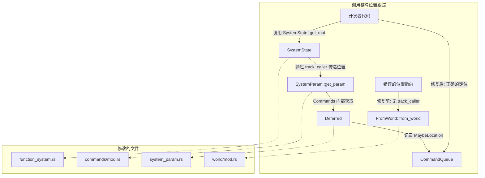

+++
title = "#22353 systemstate support commands track location"
date = "2026-01-08T00:00:00"
draft = false
template = "pull_request_page.html"
in_search_index = false

[extra]
current_language = "zh-cn"
available_languages = {"en" = { name = "English", url = "/pull_request/bevy/2026-01/pr-22353-en-20260108" }, "zh-cn" = { name = "中文", url = "/pull_request/bevy/2026-01/pr-22353-zh-cn-20260108" }}
+++

# systemstate support commands track location

## 基本信息
- **标题**: systemstate support commands track location
- **PR 链接**: https://github.com/bevyengine/bevy/pull/22353
- **作者**: MushineLament
- **状态**: 已合并
- **标签**: C-Bug, A-ECS, S-Ready-For-Final-Review, X-Uncontroversial, D-Straightforward
- **创建时间**: 2026-01-02T12:28:34Z
- **合并时间**: 2026-01-08T20:47:55Z
- **合并者**: alice-i-cecile

## 描述翻译

# 目标

当在 `SystemState` 内部获取 `Commands` 时，会导致 `CommandQueue` 中的 `MaybeLocation` 跟踪错误，错误地指向了 `FromWorld` trait 的实现。

## 解决方案

为 `Commands` 这个 SystemParam 添加 `track_caller` 支持。

## 测试

我只验证了跟踪是否存在，但没有执行任何测试。

## 本 Pull Request 的故事

这个 PR 修复了一个涉及 Bevy 的 ECS（实体组件系统）核心的、相对隐蔽的调试信息跟踪错误。问题的根源在于 `SystemState` 与 `Commands` 系统参数的交互方式，导致错误报告中的位置信息不准确。

### 问题与上下文

在 Bevy 中，`SystemState` 是一个允许你在系统外部手动获取和管理系统参数的工具。`Commands` 是一个特殊的系统参数，它允许你对世界进行延迟更改（例如生成或删除实体）。为了调试目的，Bevy 的 `CommandQueue` 使用 `MaybeLocation` 来跟踪命令是在代码的哪个位置被添加的。当出现错误时，这个位置信息对于开发者定位问题至关重要。

然而，存在一个缺陷：当通过 `SystemState::get_mut()` 等方法获取 `Commands` 时，位置跟踪会错误地指向 `FromWorld::from_world` 这个 trait 方法的默认实现，而不是指向开发者实际调用 `get_mut()` 的那一行代码。这会使调试信息变得误导且无用。

问题的技术原因在于 `SystemParam` 的初始化（`init_state`）和获取（`get_param`）逻辑可能位于调用栈深处。如果没有显式的 `#[track_caller]` 属性，Rust 编译器不会在这些函数的调用点注入用于捕获位置的代码。当 `CommandQueue` 试图记录位置时，它回溯到的最终调用点就是 `FromWorld` 的实现，因为这是初始化 `Commands` 内部状态（一个 `Deferred<CommandQueue>`）的地方。

### 解决方案与实施

解决方案直接且集中：在相关函数上添加 Rust 的 `#[track_caller]` 属性。这个属性指示编译器自动传播调用者的位置信息，使得 `std::panic::Location::caller()` 能在这些函数内部返回正确的位置。

具体实施涉及四个文件，都是对 `#[track_caller]` 属性的增补：

1.  **`commands/mod.rs`**: 这是 `Commands` 系统参数定义的核心。我们在其 `init_state` 和 `get_param` 函数上添加了属性。这确保了无论 `Commands` 是通过 `SystemState` 初始化还是获取，其内部 `CommandQueue` 都能获得正确的调用者位置。
    ```rust
    #[track_caller]
    fn init_state(world: &mut World) -> Self::State { ... }

    #[inline]
    #[track_caller]
    unsafe fn get_param<'w, 's>(...) { ... }
    ```

2.  **`system_param.rs`**: 这里有两处修改。首先，为 `Deferred<'_, T>` 系统参数的 `init_state` 添加了属性。因为 `Commands` 内部包装了一个 `Deferred<CommandQueue>`，所以需要确保它的初始化也能跟踪位置。其次，在实现系统参数元组的宏中，为生成的 `init_state` 和 `get_param` 函数也添加了属性。这使得包含 `Commands` 在内的任何元组参数都能正确传播位置。
    ```rust
    // Deferred 系统参数
    #[track_caller]
    fn init_state(world: &mut World) -> Self::State { ... }

    // 系统参数元组宏
    #[inline]
    #[track_caller]
    fn init_state(world: &mut World) -> Self::State { ... }

    #[inline]
    #[track_caller]
    unsafe fn get_param<'w, 's>(...) { ... }
    ```

3.  **`function_system.rs`**: 这里是 `SystemState` 结构体的定义。我们在其关键方法上添加了 `#[track_caller]`：`new`、`get_mut`、`get_unchecked` 和内部的 `fetch`。这保证了从 `SystemState` 这个入口点开始，调用链就能捕获并向下传递位置信息。
    ```rust
    #[track_caller]
    pub fn new(world: &mut World) -> Self { ... }

    #[inline]
    #[track_caller]
    pub fn get_mut<'w, 's>(&'s mut self, world: &'w mut World) -> ... { ... }

    #[inline]
    #[track_caller]
    pub unsafe fn get_unchecked<'w, 's>(...) { ... }

    #[inline]
    #[track_caller]
    unsafe fn fetch<'w, 's>(...) { ... }
    ```

4.  **`world/mod.rs`**: 最后，作为防御性措施，也为 `FromWorld` trait 的默认实现（`T: Default`）添加了 `#[track_caller]`。虽然主要问题不在它，但这样做可以确保即使在其他路径下，从这里获得的位置也比没有跟踪时更准确。
    ```rust
    #[track_caller]
    fn from_world(_world: &mut World) -> Self { ... }
    ```

### 技术见解与影响

这个修复体现了对 Rust 属性（attribute）和 Bevy 内部调用链的深刻理解。`#[track_caller]` 是一个零成本的抽象（在非 panic 路径下几乎没有运行时开销），它通过编译器注入的隐式参数来工作，完美契合了需要精确调试信息但对性能敏感的游戏引擎场景。

修改的影响非常积极：
- **调试体验提升**：开发者现在可以通过 `SystemState` 使用 `Commands`，并在错误日志中获得准确的代码行号，极大简化了问题排查。
- **架构一致性**：修复了 `SystemState` 与普通系统运行环境中 `Commands` 位置跟踪行为不一致的问题，使 API 的行为更加可预测。
- **最小侵入性**：解决方案没有改变任何公共 API 或数据结构，仅通过添加编译器属性来修正信息流，属于非常优雅的修复。

从工程角度看，这个 PR 也提醒我们，对于提供诊断信息（如位置跟踪）的基础设施，需要仔细审查其在整个框架中的传播路径，确保在所有使用场景下信息都不会丢失或错位。

## 视觉表示



## 关键文件更改

1.  **`crates/bevy_ecs/src/system/function_system.rs`** (+4/-0)
    - **原因**：`SystemState` 是外部代码获取系统参数（包括 `Commands`）的主要入口。为确保调用者位置从最外层就能被捕获并向下传递，需要在其实例化和获取参数的方法上添加 `#[track_caller]`。
    - **关键修改**：
      ```rust
      // 在 SystemState<Param> 的实现中
      #[track_caller]
      pub fn new(world: &mut World) -> Self { ... }
      
      #[inline]
      #[track_caller]
      pub fn get_mut<'w, 's>(&'s mut self, world: &'w mut World) -> ... { ... }
      
      #[inline]
      #[track_caller]
      pub unsafe fn get_unchecked<'w, 's>(...) { ... }
      
      #[inline]
      #[track_caller]
      unsafe fn fetch<'w, 's>(...) { ... }
      ```

2.  **`crates/bevy_ecs/src/system/commands/mod.rs`** (+2/-0)
    - **原因**：这是 `Commands` 系统参数的定义处。其 `init_state` 和 `get_param` 方法是 `SystemParam` trait 的实现，直接负责创建和返回 `Commands` 实例。添加 `#[track_caller]` 确保了位置信息能传递到 `Commands` 内部。
    - **关键修改**：
      ```rust
      // 在 `Commands` 的 SystemParam 实现中
      #[track_caller]
      fn init_state(world: &mut World) -> Self::State { ... }
      
      #[inline]
      #[track_caller]
      unsafe fn get_param<'w, 's>(...) { ... }
      ```

3.  **`crates/bevy_ecs/src/system/system_param.rs`** (+3/-0)
    - **原因**：`Commands` 内部使用 `Deferred<CommandQueue>` 来延迟执行命令。因此需要确保 `Deferred` 系统参数本身也能跟踪位置。同时，系统参数经常以元组形式出现，修改元组的实现宏能保证组合后的参数依然保有位置跟踪能力。
    - **关键修改**：
      ```rust
      // 1. 为 Deferred<'_, T> 系统参数
      #[track_caller]
      fn init_state(world: &mut World) -> Self::State { ... }
      
      // 2. 在 impl_system_param_tuple! 宏内部
      #[inline]
      #[track_caller]
      fn init_state(world: &mut World) -> Self::State { ... }
      
      #[inline]
      #[track_caller]
      unsafe fn get_param<'w, 's>(...) { ... }
      ```

4.  **`crates/bevy_ecs/src/world/mod.rs`** (+1/-0)
    - **原因**：虽然主要问题路径不直接经过这里，但 `FromWorld::from_world` 是 `Deferred` 等类型状态初始化的一个后备实现。为其默认实现添加 `#[track_caller]` 是一种防御性编程，确保即使在其他未预料到的路径中，获得的位置信息也相对更接近源头，避免再次出现“位置指向默认实现”这种无用的调试信息。
    - **关键修改**：
      ```rust
      // 在 FromWorld for T: Default 的实现中
      #[track_caller]
      fn from_world(_world: &mut World) -> Self {
          T::default()
      }
      ```

## 完整代码 Diff
```diff
diff --git a/crates/bevy_ecs/src/system/commands/mod.rs b/crates/bevy_ecs/src/system/commands/mod.rs
index 6df15e84c7492..58859fd88eef7 100644
--- a/crates/bevy_ecs/src/system/commands/mod.rs
+++ b/crates/bevy_ecs/src/system/commands/mod.rs
@@ -130,6 +130,7 @@ const _: () = {
 
         type Item<'w, 's> = Commands<'w, 's>;
 
+        #[track_caller]
         fn init_state(world: &mut World) -> Self::State {
             FetchState {
                 state: <__StructFieldsAlias<'_, '_> as bevy_ecs::system::SystemParam>::init_state(
@@ -193,6 +194,7 @@ const _: () = {
         }
 
         #[inline]
+        #[track_caller]
         unsafe fn get_param<'w, 's>(
             state: &'s mut Self::State,
             system_meta: &bevy_ecs::system::SystemMeta,
diff --git a/crates/bevy_ecs/src/system/function_system.rs b/crates/bevy_ecs/src/system/function_system.rs
index cc7009c1759b8..ab753eb9a4d54 100644
--- a/crates/bevy_ecs/src/system/function_system.rs
+++ b/crates/bevy_ecs/src/system/function_system.rs
@@ -286,6 +286,7 @@ all_tuples!(
 
 impl<Param: SystemParam> SystemState<Param> {
     /// Creates a new [`SystemState`] with default state.
+    #[track_caller]
     pub fn new(world: &mut World) -> Self {
         let mut meta = SystemMeta::new::<Param>();
         meta.last_run = world.change_tick().relative_to(Tick::MAX);
@@ -362,6 +363,7 @@ impl<Param: SystemParam> SystemState<Param> {
 
     /// Retrieve the mutable [`SystemParam`] values.
     #[inline]
+    #[track_caller]
     pub fn get_mut<'w, 's>(&'s mut self, world: &'w mut World) -> SystemParamItem<'w, 's, Param> {
         self.validate_world(world.id());
         // SAFETY: World is uniquely borrowed and matches the World this SystemState was created with.
@@ -421,6 +423,7 @@ impl<Param: SystemParam> SystemState<Param> {
     /// access is safe in the context of global [`World`] access. The passed-in [`World`] _must_ be the [`World`] the [`SystemState`] was
     /// created with.
     #[inline]
+    #[track_caller]
     pub unsafe fn get_unchecked<'w, 's>(
         &'s mut self,
         world: UnsafeWorldCell<'w>,
@@ -435,6 +438,7 @@ impl<Param: SystemParam> SystemState<Param> {
     /// access is safe in the context of global [`World`] access. The passed-in [`World`] _must_ be the [`World`] the [`SystemState`] was
     /// created with.
     #[inline]
+    #[track_caller]
     unsafe fn fetch<'w, 's>(
         &'s mut self,
         world: UnsafeWorldCell<'w>,
diff --git a/crates/bevy_ecs/src/system/system_param.rs b/crates/bevy_ecs/src/system/system_param.rs
index 2a0498ffdcfdc..b59698651a9b7 100644
--- a/crates/bevy_ecs/src/system/system_param.rs
+++ b/crates/bevy_ecs/src/system/system_param.rs
@@ -1336,6 +1336,7 @@ unsafe impl<T: SystemBuffer> SystemParam for Deferred<'_, T> {
     type State = SyncCell<T>;
     type Item<'w, 's> = Deferred<'s, T>;
 
+    #[track_caller]
     fn init_state(world: &mut World) -> Self::State {
         SyncCell::new(T::from_world(world))
     }
@@ -2171,6 +2172,7 @@ macro_rules! impl_system_param_tuple {
             type Item<'w, 's> = ($($param::Item::<'w, 's>,)*);
 
             #[inline]
+            #[track_caller]
             fn init_state(world: &mut World) -> Self::State {
                 ($($param::init_state(world),)*)
             }
@@ -2216,6 +2218,7 @@ macro_rules! impl_system_param_tuple {
             }
 
             #[inline]
+            #[track_caller]
             unsafe fn get_param<'w, 's>(
                 state: &'s mut Self::State,
                 system_meta: &SystemMeta,
diff --git a/crates/bevy_ecs/src/world/mod.rs b/crates/bevy_ecs/src/world/mod.rs
index efd33e6de3e82..8157b03a61afc 100644
--- a/crates/bevy_ecs/src/world/mod.rs
+++ b/crates/bevy_ecs/src/world/mod.rs
@@ -3829,6 +3829,7 @@ pub trait FromWorld {
 
 impl<T: Default> FromWorld for T {
     /// Creates `Self` using [`default()`](`Default::default`).
+    #[track_caller]
     fn from_world(_world: &mut World) -> Self {
         T::default()
     }
```

## 延伸阅读

- **[Rust 文档：`#[track_caller]` 属性](https://doc.rust-lang.org/reference/attributes/codegen.html#the-track_caller-attribute)**: 详细了解这个属性的工作原理和使用场景。
- **Bevy 官方文档：[SystemParam](https://docs.rs/bevy_ecs/latest/bevy_ecs/system/trait.SystemParam.html)**: 理解 Bevy 中系统参数的设计模式。
- **Bevy 官方文档：[Commands](https://docs.rs/bevy_ecs/latest/bevy_ecs/system/struct.Commands.html)**: 学习如何使用 `Commands` 来修改游戏世界。
- **Bevy 官方文档：[SystemState](https://docs.rs/bevy_ecs/latest/bevy_ecs/system/struct.SystemState.html)**: 掌握如何在系统外部手动管理系统状态和参数。