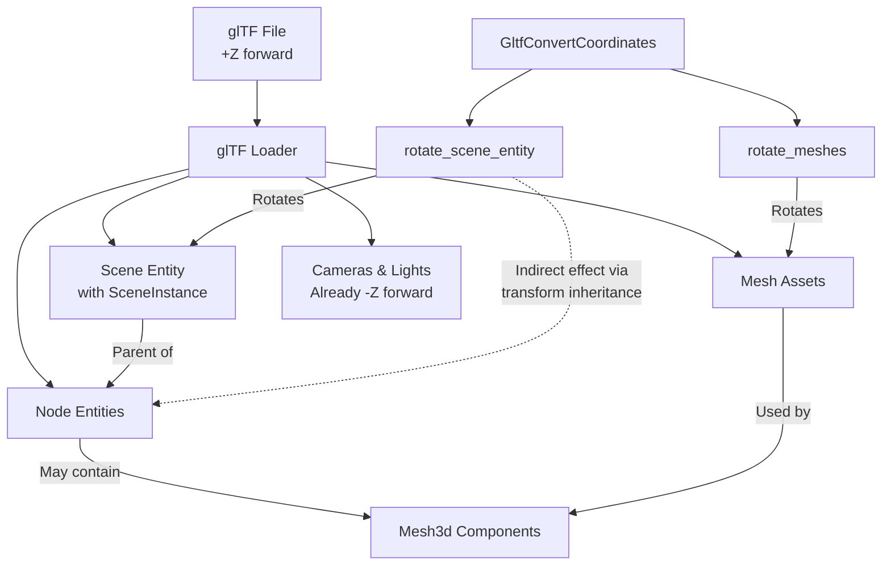

+++
title = "#22355 Clarify glTF coordinate conversion documentation"
date = "2026-01-05T00:00:00"
draft = false
template = "pull_request_page.html"
in_search_index = true

[taxonomies]
list_display = ["show"]

[extra]
current_language = "en"
available_languages = {"en" = { name = "English", url = "/pull_request/bevy/2026-01/pr-22355-en-20260105" }, "zh-cn" = { name = "中文", url = "/pull_request/bevy/2026-01/pr-22355-zh-cn-20260105" }}
labels = ["C-Docs", "A-glTF"]
+++

# Title

## Basic Information
- **Title**: Clarify glTF coordinate conversion documentation
- **PR Link**: https://github.com/bevyengine/bevy/pull/22355
- **Author**: greeble-dev
- **Status**: MERGED
- **Labels**: C-Docs, S-Ready-For-Final-Review, A-glTF
- **Created**: 2026-01-02T13:50:14Z
- **Merged**: 2026-01-05T02:31:22Z
- **Merged By**: alice-i-cecile

## Description Translation
**Objective**

Add more information to the documentation for glTF coordinate conversion. This tries to address the issues raised in #22209.

**Solution**

The new docs cover exactly which entities will have a correct `Transform::forward`, assuming the glTF file consistently uses the standard glTF coordinate system for both scenes and nodes.

I've also restored the warning that was in the 0.17 documentation:

> _CAUTION: This is an experimental feature. Behavior may change in future versions._

This is because:

1. I want to [add node conversion](https://github.com/bevyengine/bevy/issues/22354) in 0.19, and that might involve changing how scene conversion works.
2. Cart has mentioned that [BSN might restructure scenes](https://github.com/bevyengine/bevy/pull/20394#discussion_r2586861990), which could also change how scene conversion works.

Screenshot:


If this PR lands then I might do another PR to update the migration guide - I can't update it in this PR as the guides are only in the 0.18 branch.

## The Story of This Pull Request

This PR addresses a documentation clarity issue around glTF coordinate conversion. The problem surfaced in issue #22209 where users were confused about which entities in a loaded glTF scene would have a correct `Transform::forward` direction after applying coordinate conversion. This confusion stemmed from incomplete documentation about the scope and limitations of the existing conversion system.

The developer's approach was straightforward: improve the existing documentation with precise technical details about what the conversion options actually affect. The solution doesn't change any functional code - it only clarifies the behavior that already exists. This is a common pattern in mature codebases where documentation often lags behind implementation complexity.

The core issue was that the previous documentation didn't clearly explain which entities would have their forward direction corrected. Users needed to understand that:
1. The `rotate_scene_entity` option only affects the scene entity itself (the one with the `SceneInstance` component), not the individual node entities
2. The `rotate_meshes` option affects mesh assets and entities with `Mesh3d` components, but not node entities
3. Cameras and lights are exceptions because they already use Bevy's coordinate system in glTF files

The developer made an important decision to restore the experimental feature warning that was present in version 0.17. This warning serves two purposes: it signals to users that the API might change in future versions (specifically mentioning planned node conversion in 0.19 and potential BSN restructuring), and it manages expectations about long-term stability of the coordinate conversion feature.

From a technical perspective, this PR demonstrates good documentation practices. The developer clarified the exact coordinate system transformations (glTF's +Z forward to Bevy's -Z forward), specified which entities are affected by each option, and explained the relationship between scene entities and node entities. This precision helps users understand why they might see unexpected behavior when working with glTF files.

The impact of these changes is primarily educational. Users who were previously confused about coordinate conversion behavior will now have clearer documentation to reference. This reduces support burden and helps users make informed decisions about when to enable each conversion option. The restored experimental warning also properly sets expectations about future changes to the API.

## Visual Representation



## Key Files Changed

### `crates/bevy_gltf/src/convert_coordinates.rs` (+20/-14)

This file contains the documentation improvements for the `GltfConvertCoordinates` struct and its options. The changes clarify which entities are affected by coordinate conversion and restore the experimental feature warning.

**Key changes:**

1. **Added experimental feature warning**:
```rust
/// Options for converting scenes and assets from glTF's [standard coordinate system](https://registry.khronos.org/glTF/specs/2.0/glTF-2.0.html#coordinate-system-and-units)
/// (+Z forward) to Bevy's coordinate system (-Z forward).
///
/// _CAUTION: This is an experimental feature. Behavior may change in future versions._
```

2. **Clarified which entities get correct Transform::forward**:
```rust
/// If a glTF file uses the standard coordinate system, then the conversion
/// options will behave like so:
///
/// - `rotate_scene_entity` will make the glTF's scene forward align with the [`Transform::forward`]
///   of the entity with the [`SceneInstance`](bevy_scene::SceneInstance) component.
/// - `rotate_meshes` will do the same for entities with a `Mesh3d` component.
///
/// Other entities in the scene are not converted, so their forward may not
/// match `Transform::forward`. In particular, the entities that correspond to
/// glTF nodes are not converted.
```

3. **Improved field documentation clarity**:
```rust
/// If true, convert scenes by rotating the top-level transform of the scene entity.
/// 
/// This will ensure that [`Transform::forward`] of the "root" entity (the one with [`SceneInstance`](bevy_scene::SceneInstance))
/// aligns with the "forward" of the glTF scene.
///
/// The scene entity is created by the glTF loader. Its parent is the entity
/// with the `SceneInstance` component, and its children are the root nodes
/// of the glTF scene.
///
/// This option only changes the transform of the scene entity. It does not
/// directly change the transforms of node entities - it only changes them
/// indirectly through transform inheritance.
pub rotate_scene_entity: bool,
```

## Further Reading

1. [glTF 2.0 Specification - Coordinate System](https://registry.khronos.org/glTF/specs/2.0/glTF-2.0.html#coordinate-system-and-units) - Official specification for glTF coordinate system
2. [Bevy Transform Documentation](https://docs.rs/bevy/latest/bevy/transform/components/struct.Transform.html) - Details on Bevy's Transform component and forward direction
3. [Issue #22209](https://github.com/bevyengine/bevy/issues/22209) - Original issue that prompted this documentation improvement
4. [Issue #22354](https://github.com/bevyengine/bevy/issues/22354) - Planned node conversion feature mentioned in the warning
5. [PR #20394 Discussion](https://github.com/bevyengine/bevy/pull/20394#discussion_r2586861990) - Discussion about potential BSN restructuring that might affect scene conversion