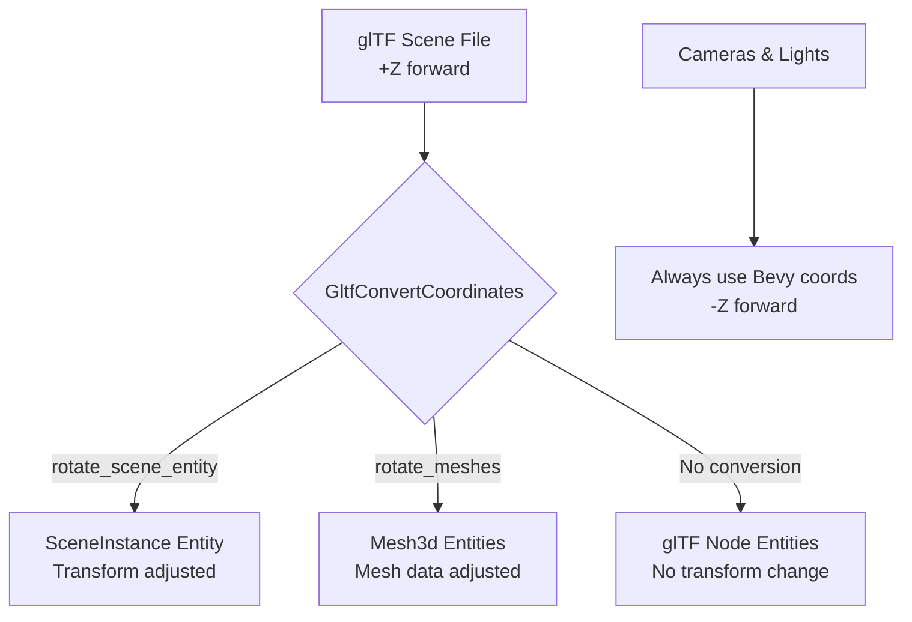

+++
title = "#22355 Clarify glTF coordinate conversion documentation"
date = "2026-01-05T00:00:00"
draft = false
template = "pull_request_page.html"
in_search_index = false

[extra]
current_language = "zh-cn"
available_languages = {"en" = { name = "English", url = "/pull_request/bevy/2026-01/pr-22355-en-20260105" }, "zh-cn" = { name = "中文", url = "/pull_request/bevy/2026-01/pr-22355-zh-cn-20260105" }}
labels = ["C-Docs", "A-glTF"]
+++

# Title
Clarify glTF coordinate conversion documentation

## Basic Information
- **Title**: Clarify glTF coordinate conversion documentation
- **PR Link**: https://github.com/bevyengine/bevy/pull/22355
- **Author**: greeble-dev
- **Status**: MERGED
- **Labels**: C-Docs, S-Ready-For-Final-Review, A-glTF
- **Created**: 2026-01-02T13:50:14Z
- **Merged**: 2026-01-05T02:31:22Z
- **Merged By**: alice-i-cecile

## Description Translation
# 目标

为glTF坐标转换的文档添加更多信息。这试图解决在 #22209 中提出的问题。

## 解决方案

新的文档精确覆盖了哪些实体会拥有正确的`Transform::forward`，假设glTF文件在场景和节点中都一致地使用了标准的glTF坐标系。

我还恢复了0.17文档中存在的警告：

> _警告：这是一个实验性功能。行为可能在未来的版本中改变。_

这是因为：

1. 我想在0.19中[添加节点转换](https://github.com/bevyengine/bevy/issues/22354)，这可能会涉及改变场景转换的工作方式。
2. Cart提到过[BSN可能会重组场景](https://github.com/bevyengine/bevy/pull/20394#discussion_r2586861990)，这也可能改变场景转换的工作方式。

截图：


如果这个PR被合并，我可能会做另一个PR来更新迁移指南——我无法在这个PR中更新它，因为指南只存在于0.18分支中。

## The Story of This Pull Request

这个PR始于issue #22209中用户对glTF坐标转换行为的困惑。具体来说，开发者在使用`GltfConvertCoordinates`选项时，不清楚哪些实体会受到转换影响，以及它们的`Transform::forward`方向会如何变化。

在分析问题时，作者发现现有的文档没有明确说明转换行为的确切范围。用户需要知道：启用转换选项后，场景中哪些实体的前向向量会与Bevy的标准（-Z）对齐，哪些不会。这种不确定性导致了使用错误和困惑。

问题的核心在于Bevy的glTF加载器处理坐标系统转换的方式。glTF的标准坐标系是+Y向上，+Z向前，而Bevy使用+Y向上，-Z向前。为了解决这个差异，Bevy提供了`GltfConvertCoordinates`配置选项，但文档没有清晰说明转换的应用边界。

作者采用了直接明了的解决方案：更新文档字符串以提供精确的行为说明。主要的改进包括：

1. **恢复实验性警告**：重新添加了"CAUTION: This is an experimental feature. Behavior may change in future versions."的警告。这是必要的，因为作者计划在未来的0.19版本中添加节点转换功能，而且Bevy的场景系统（BSN）可能会进行重构，这两者都可能改变当前的转换行为。

2. **明确转换范围**：文档现在明确指出转换只影响特定类型的实体：
   - `rotate_scene_entity`选项只影响带有`SceneInstance`组件的实体
   - `rotate_meshes`选项只影响带有`Mesh3d`组件的实体
   - 对应glTF节点的实体不会被转换

3. **提供行为预测**：文档现在明确说明了在标准glTF文件（遵循glTF坐标系规范）中，哪些实体的`Transform::forward`会正确对齐。这对于开发者调试和设计场景至关重要。

技术实现上，这个PR只修改了文档注释，没有改变任何代码逻辑。然而，这种文档改进对于用户体验的影响是显著的。它通过准确描述系统行为来管理用户期望，并预先警告了未来可能的变化，这有助于避免因API变更导致的代码破坏。

一个关键的技术细节是：相机和灯光已经是例外情况，它们默认使用Bevy的坐标系。这意味着无论是否启用转换，相机和灯光的`Transform::forward`都会与Bevy的标准对齐。文档现在明确指出了这一点，解决了用户可能存在的误解。

从工程角度看，这个PR展示了良好文档实践的几个原则：
- 明确说明功能的边界条件
- 提前警告潜在的破坏性变更
- 使用具体的示例说明行为
- 区分不同选项的精确影响范围

这些改进将帮助开发者更有效地使用glTF坐标转换功能，减少调试时间，并为未来的API变更做好准备。文档现在准确地反映了当前实现的行为，同时为即将到来的功能变更设置了适当的期望。

## Visual Representation



## Key Files Changed

### `crates/bevy_gltf/src/convert_coordinates.rs` (+20/-14)

这个文件包含了`GltfConvertCoordinates`结构体的定义及其文档注释。所有的修改都是文档改进，没有改变代码逻辑。

**主要修改包括：**

1. **恢复实验性警告**：在文档开头添加了警告，表明这是实验性功能，行为可能在将来改变。

2. **澄清转换行为**：更详细地说明了哪些实体会受到转换影响，哪些不会。特别明确了对应glTF节点的实体不会被转换。

3. **改进选项描述**：使`rotate_scene_entity`和`rotate_meshes`的文档更精确，说明它们各自影响哪些实体。

**关键代码片段：**

```rust
// 在结构体文档中添加的警告和更详细的行为说明
/// Options for converting scenes and assets from glTF's [standard coordinate system](https://registry.khronos.org/glTF/specs/2.0/glTF-2.0.html#coordinate-system-and-units)
/// (+Z forward) to Bevy's coordinate system (-Z forward).
///
/// _CAUTION: This is an experimental feature. Behavior may change in future versions._
///
/// The exact coordinate system conversion is as follows:
///
/// - glTF:
///   - forward: +Z
///   - up: +Y
///   - right: +X
/// - Bevy:
///   - forward: -Z
///   - up: +Y
///   - right: +X
///
/// Cameras and lights are an exception - they already use Bevy's coordinate
/// system. This means cameras and lights will match Bevy's forward even if
/// conversion is disabled.
///
/// If a glTF file uses the standard coordinate system, then the conversion
/// options will behave like so:
///
/// - `rotate_scene_entity` will make the glTF's scene forward align with the [`Transform::forward`]
///   of the entity with the [`SceneInstance`](bevy_scene::SceneInstance) component.
/// - `rotate_meshes` will do the same for entities with a `Mesh3d` component.
///
/// Other entities in the scene are not converted, so their forward may not
/// match `Transform::forward`. In particular, the entities that correspond to
/// glTF nodes are not converted.
```

```rust
// rotate_scene_entity 字段的文档改进
/// If true, convert scenes by rotating the top-level transform of the scene entity.
/// This will ensure that [`Transform::forward`] of the "root" entity (the one with [`SceneInstance`](bevy_scene::SceneInstance))
/// aligns with the "forward" of the glTF scene.
///
/// The scene entity is created by the glTF loader. Its parent is the entity
/// with the `SceneInstance` component, and its children are the root nodes
/// of the glTF scene.
///
/// This option only changes the transform of the scene entity. It does not
/// directly change the transforms of node entities - it only changes them
/// indirectly through transform inheritance.
pub rotate_scene_entity: bool,
```

```rust
// rotate_meshes 字段的文档改进  
/// If true, convert mesh assets and skinned mesh bind poses.
///
/// This option only changes mesh assets and the transforms of entities that
/// instance meshes through [`Mesh3d`](bevy_mesh::Mesh3d).
pub rotate_meshes: bool,
```

这些修改直接解决了issue #22209中提出的困惑，通过明确文档来帮助用户理解glTF坐标转换的确切行为。

## Further Reading

1. **glTF 2.0规范** - 了解glTF标准坐标系：[Khronos glTF Specification](https://registry.khronos.org/glTF/specs/2.0/glTF-2.0.html#coordinate-system-and-units)
2. **Bevy场景系统** - 了解Bevy如何管理场景和实体：[Bevy Scene Documentation](https://docs.rs/bevy_scene/latest/bevy_scene/)
3. **坐标系统转换** - 3D图形中坐标系统转换的基础知识：[3D Coordinate System Transformations](https://en.wikipedia.org/wiki/Transformation_matrix)
4. **相关Issue** - 这个问题起源的讨论：[Issue #22209](https://github.com/bevyengine/bevy/issues/22209)
5. **未来计划** - 计划中的节点转换功能：[Issue #22354](https://github.com/bevyengine/bevy/issues/22354)

# Full Code Diff
diff --git a/crates/bevy_gltf/src/convert_coordinates.rs b/crates/bevy_gltf/src/convert_coordinates.rs
index 3ccb52e95ef7e..eaecbd3aeaca8 100644
--- a/crates/bevy_gltf/src/convert_coordinates.rs
+++ b/crates/bevy_gltf/src/convert_coordinates.rs
@@ -33,7 +33,10 @@ impl ConvertCoordinates for [f32; 4] {
 /// Options for converting scenes and assets from glTF's [standard coordinate system](https://registry.khronos.org/glTF/specs/2.0/glTF-2.0.html#coordinate-system-and-units)
 /// (+Z forward) to Bevy's coordinate system (-Z forward).
 ///
+/// _CAUTION: This is an experimental feature. Behavior may change in future versions._
+///
 /// The exact coordinate system conversion is as follows:
+///
 /// - glTF:
 ///   - forward: +Z
 ///   - up: +Y
@@ -43,36 +46,39 @@ impl ConvertCoordinates for [f32; 4] {
 ///   - up: +Y
 ///   - right: +X
 ///
-/// Note that some glTF files may not follow the glTF standard.
+/// Cameras and lights are an exception - they already use Bevy's coordinate
+/// system. This means cameras and lights will match Bevy's forward even if
+/// conversion is disabled.
 ///
-/// If your glTF scene is +Z forward and you want it converted to match Bevy's
-/// `Transform::forward`, enable the `rotate_scene_entity` option. If you also want `Mesh`
-/// assets to be converted, enable the `rotate_meshes` option.
+/// If a glTF file uses the standard coordinate system, then the conversion
+/// options will behave like so:
 ///
-/// Cameras and lights in glTF files are an exception - they already use Bevy's
-/// coordinate system. This means cameras and lights will match
-/// `Transform::forward` even if conversion is disabled.
+/// - `rotate_scene_entity` will make the glTF's scene forward align with the [`Transform::forward`]
+///   of the entity with the [`SceneInstance`](bevy_scene::SceneInstance) component.
+/// - `rotate_meshes` will do the same for entities with a `Mesh3d` component.
+///
+/// Other entities in the scene are not converted, so their forward may not
+/// match `Transform::forward`. In particular, the entities that correspond to
+/// glTF nodes are not converted.
 #[derive(Copy, Clone, Default, Debug, Serialize, Deserialize)]
 pub struct GltfConvertCoordinates {
     /// If true, convert scenes by rotating the top-level transform of the scene entity.
-    ///
     /// This will ensure that [`Transform::forward`] of the "root" entity (the one with [`SceneInstance`](bevy_scene::SceneInstance))
     /// aligns with the "forward" of the glTF scene.
     ///
-    /// The glTF loader creates an entity for each glTF scene. Entities are
-    /// then created for each node within the glTF scene. Nodes without a
-    /// parent in the glTF scene become children of the scene entity.
+    /// The scene entity is created by the glTF loader. Its parent is the entity
+    /// with the `SceneInstance` component, and its children are the root nodes
+    /// of the glTF scene.
     ///
     /// This option only changes the transform of the scene entity. It does not
     /// directly change the transforms of node entities - it only changes them
     /// indirectly through transform inheritance.
     pub rotate_scene_entity: bool,
 
-    /// If true, convert mesh assets. This includes skinned mesh bind poses.
+    /// If true, convert mesh assets and skinned mesh bind poses.
     ///
     /// This option only changes mesh assets and the transforms of entities that
-    /// instance meshes. It does not change the transforms of entities that
-    /// correspond to glTF nodes.
+    /// instance meshes through [`Mesh3d`](bevy_mesh::Mesh3d).
     pub rotate_meshes: bool,
 }
```