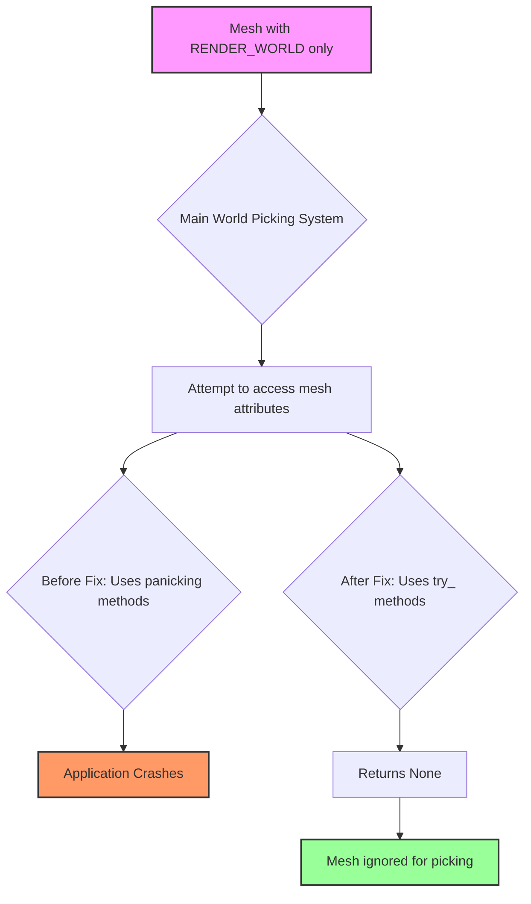

+++
title = "#22356 Fix panic in mesh picking when a mesh is `RENDER_WORLD` only"
date = "2026-01-05T00:00:00"
draft = false
template = "pull_request_page.html"
in_search_index = true

[taxonomies]
list_display = ["show"]

[extra]
current_language = "en"
available_languages = {"en" = { name = "English", url = "/pull_request/bevy/2026-01/pr-22356-en-20260105" }, "zh-cn" = { name = "中文", url = "/pull_request/bevy/2026-01/pr-22356-zh-cn-20260105" }}
labels = ["C-Bug", "P-Crash", "P-Regression", "A-Picking"]
+++

# Title

## Basic Information
- **Title**: Fix panic in mesh picking when a mesh is `RENDER_WORLD` only
- **PR Link**: https://github.com/bevyengine/bevy/pull/22356
- **Author**: greeble-dev
- **Status**: MERGED
- **Labels**: C-Bug, P-Crash, S-Ready-For-Final-Review, P-Regression, A-Picking
- **Created**: 2026-01-02T15:24:22Z
- **Merged**: 2026-01-05T02:31:22Z
- **Merged By**: alice-i-cecile

## Description Translation

**Objective**

Fix a panic in mesh picking if a mesh is `RenderAssetUsages::RENDER_WORLD` only. The panic was reported in https://github.com/bevyengine/bevy/issues/22206, although that issue is framed as a broader concern and so is not resolved by this PR. The problem was introduced in https://github.com/bevyengine/bevy/pull/21732.

**Solution**

Changed mesh accesses to use the non-panicking `try_` variants. This means extracted meshes are silently ignored as before.

I also did a quick scan to see if could spot any other engine crates that might have the same issue - didn't see any but could easily have missed one.

**Testing**

Tested by modifying the `mesh_picking` example:

```diff
+    let mut p = Mesh::from(Cuboid::default());
+    p.asset_usage = bevy_asset::RenderAssetUsages::RENDER_WORLD;
     let shapes = [
-        meshes.add(Cuboid::default()),
+        meshes.add(p),
```

## The Story of This Pull Request

This PR addresses a crash in Bevy's mesh picking system that occurred when a mesh was configured with `RenderAssetUsages::RENDER_WORLD` only. The issue represents a regression introduced by PR #21732 and was reported in issue #22206.

**The Problem and Context**

Bevy uses a dual-world architecture where entities can exist in both the main world and the render world. Meshes can be configured with different `RenderAssetUsages` to control where they're available. When a mesh is set to `RENDER_WORLD` only, it's only accessible in the render world, not in the main world where picking calculations occur.

The mesh picking system in `bevy_picking` performs ray-mesh intersection tests in the main world. When it encountered a mesh marked as `RENDER_WORLD` only, the code attempted to access mesh attributes using panicking methods like `mesh.attribute()` and `mesh.indices()`. These methods assume the mesh data is present and panic when it's not, causing the entire application to crash.

**The Solution Approach**

The developer chose a conservative, defensive approach by replacing all panicking mesh access methods with their non-panicking `try_` variants. This solution:
- Fixes the immediate crash without changing the system's behavior
- Maintains backward compatibility
- Requires minimal code changes
- Follows Rust's error handling patterns by using `Option` types

The alternative approach would have been to filter out `RENDER_WORLD` meshes earlier in the pipeline or add explicit checks, but the `try_` variant approach integrates naturally with the existing `Option`-based return pattern of the function.

**The Implementation**

The implementation is focused and surgical. In `ray_intersection_over_mesh`, four mesh access calls were modified:

1. **Position attribute access** - Required for ray intersection calculations
2. **Normal attribute access** - Optional, used for backface culling
3. **UV attribute access** - Optional, used for texture coordinate retrieval
4. **Indices access** - Required for indexed meshes

The key insight is that when a mesh is `RENDER_WORLD` only, these access methods return `None`, which propagates through the function and results in the mesh being ignored for picking - exactly the desired behavior.

**Technical Insights**

The fix demonstrates several important Rust and Bevy patterns:

1. **Defensive programming with `try_` methods**: Many Bevy APIs provide both panicking and non-panicking variants. The `try_` variants return `Option` or `Result` types, allowing callers to handle missing data gracefully.

2. **Option chaining**: The code uses Rust's `?` operator and `Option::and_then` to propagate `None` values through the computation chain. When any required mesh attribute is missing, the entire function returns `None`, indicating no intersection.

3. **Separation of concerns**: The fix addresses the symptom (panicking access) without changing the architectural decision about where mesh data lives. This keeps the change minimal and focused.

**The Impact**

This PR resolves a crash that would affect any Bevy application using mesh picking with `RENDER_WORLD`-only meshes. The fix is minimal and safe - it doesn't introduce new behavior, but restores the pre-regression behavior where such meshes are simply ignored for picking.

The developer also conducted a code search for similar issues in other engine crates, demonstrating good engineering practice. While no other instances were found, this proactive check helps prevent similar regressions elsewhere.

## Visual Representation



## Key Files Changed

### `crates/bevy_picking/src/mesh_picking/ray_cast/intersections.rs`

**What changed and why**: The function `ray_intersection_over_mesh` was updated to use non-panicking methods for accessing mesh attributes and indices. This prevents crashes when meshes are only available in the render world.

**Key modifications**:

```rust
// Before:
let positions = mesh.attribute(Mesh::ATTRIBUTE_POSITION)?.as_float3()?;

// After:
let positions = mesh
    .try_attribute(Mesh::ATTRIBUTE_POSITION)
    .ok()?
    .as_float3()?;
```

```rust
// Before:
let normals = mesh
    .attribute(Mesh::ATTRIBUTE_NORMAL)
    .and_then(|normal_values| normal_values.as_float3());

// After:
let normals = mesh
    .try_attribute(Mesh::ATTRIBUTE_NORMAL)
    .ok()
    .and_then(|normal_values| normal_values.as_float3());
```

```rust
// Before:
match mesh.indices() {
    Some(Indices::U16(indices)) => {
        ray_mesh_intersection(ray, transform, positions, normals, Some(indices), uvs, cull)
    }
    // ...
}

// After:
match mesh.try_indices().ok() {
    Some(Indices::U16(indices)) => {
        ray_mesh_intersection(ray, transform, positions, normals, Some(indices), uvs, cull)
    }
    // ...
}
```

**Relation to overall purpose**: These changes directly address the panic by gracefully handling missing mesh data when meshes are `RENDER_WORLD` only. The function returns `None` in these cases, causing the mesh to be ignored for picking operations.

## Further Reading

1. **Bevy RenderAssetUsages Documentation**: Understanding the different asset usage flags and how they affect data availability across worlds.
2. **Rust Error Handling Patterns**: The distinction between panicking and non-panicking APIs, and when to use each approach.
3. **Bevy ECS and World Separation**: How Bevy manages separation between main world and render world for performance and architectural clarity.
4. **Ray-Mesh Intersection Algorithms**: The mathematical foundations of the picking system being protected by this fix.
5. **Defensive Programming in Systems Programming**: Techniques for writing robust code that handles edge cases and invalid states gracefully.