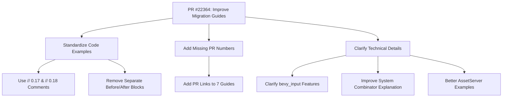

+++
title = "#22364 Improve code examples in 0.18 migration guides"
date = "2026-01-05T00:00:00"
draft = false
template = "pull_request_page.html"
in_search_index = true

[taxonomies]
list_display = ["show"]

[extra]
current_language = "en"
available_languages = {"en" = { name = "English", url = "/pull_request/bevy/2026-01/pr-22364-en-20260105" }, "zh-cn" = { name = "中文", url = "/pull_request/bevy/2026-01/pr-22364-zh-cn-20260105" }}
labels = ["C-Docs", "A-Cross-Cutting", "D-Straightforward"]
+++

# Title
Improve code examples in 0.18 migration guides

## Basic Information
- **Title**: Improve code examples in 0.18 migration guides
- **PR Link**: https://github.com/bevyengine/bevy/pull/22364
- **Author**: BD103
- **Status**: MERGED
- **Labels**: C-Docs, S-Ready-For-Final-Review, A-Cross-Cutting, D-Straightforward
- **Created**: 2026-01-03T19:11:13Z
- **Merged**: 2026-01-05T02:12:51Z
- **Merged By**: alice-i-cecile

## Description Translation
Note: Since the target language is English, including the original description exactly as-is.

> [!IMPORTANT]
> This PR targets the `release-0.18.0` branch, not `main`.
> 
> # Objective
> 
> - Bevy 0.18 is close to release! Let's do a review pass over the migration guides.
> 
> ## Solution
> 
> - Make code block examples consistent by [following the style guide](https://github.com/bevyengine/bevy/blob/e457025cc447a9c36ac452f89c3da9ef836cd0d5/release-content/migration_guides.md?plain=1#L75-L90).
> - Clarify that `bevy_input`'s input-type features (`keyboard`, `gamepad`, etc.) are also available on the main `bevy` crate.
> - Improve the system combinator migration guide, as I found it quite confusing.
> - Add PR numbers to migration guides that are missing them.
> 
> ## Testing
> 
> I tested that the system combinator migration guide code examples worked in the relevant versions, but didn't test any of the others because I didn't modify any of their actual code.

## The Story of This Pull Request

This PR addresses documentation quality issues in the Bevy 0.18 migration guides. As the Bevy engine approached its 0.18 release, the migration guides contained inconsistent formatting, unclear explanations, and missing attribution to the pull requests that introduced the changes. These issues could make it difficult for users to understand what changed between versions and how to update their code.

The primary problem was inconsistency in how code examples were presented. Different migration guides used different formats for showing "before" and "after" code snippets, making it harder for users to quickly identify what needed to change. Some guides used separate code blocks labeled "Before" and "After", while others used diff-style formatting or no clear separation at all.

The solution approach focused on standardizing all migration guides to follow the established style guide. The developer identified that having consistent examples would significantly improve the user experience when migrating code. Instead of creating new patterns, the PR enforces existing conventions, which is often more maintainable than inventing new ones.

The implementation involved systematically reviewing 25 migration guide files and applying three main types of changes. First, code examples were restructured to use inline comments (`// 0.17` and `// 0.18`) rather than separate labeled code blocks. This makes the examples more compact and easier to compare side-by-side. Second, technical clarifications were added where explanations were ambiguous or incomplete. Third, missing PR numbers were added to guide frontmatter to provide proper attribution and traceability.

One of the most significant improvements was to the system combinator migration guide. The original explanation was confusing and didn't clearly explain the behavior change. The updated guide provides a concrete example showing how `CombinatorSystem` behavior changed from propagating errors in 0.17 to treating failed systems as returning `false` in 0.18. This clarification is important because it affects how developers write conditional system logic and understand error handling in their applications.

Another important clarification was in the `bevy_input` features guide. The updated documentation explicitly states that input-type features like `keyboard` and `gamepad` are available on both the `bevy_input` crate and the main `bevy` crate. This helps users understand feature flag dependencies when building applications with different crate configurations.

The technical insight behind these changes is that migration guides serve a critical function in software libraries. They bridge the gap between API changes and user adoption. Clear, consistent documentation reduces friction during upgrades and helps users understand not just what changed, but why it changed and how to adapt their code. By standardizing the format and improving explanations, this PR reduces cognitive load for developers migrating their projects to Bevy 0.18.

The impact of these changes is primarily on developer experience and productivity. While the changes don't affect runtime behavior or performance, they significantly improve the quality of documentation that thousands of developers will reference when upgrading their Bevy projects. The consistent formatting makes it easier to scan multiple migration guides quickly, and the added PR numbers provide context for users who want to understand the rationale behind specific changes by examining the original pull requests.

## Visual Representation



## Key Files Changed

List the most significant files changed in this PR:
- `release-content/migration-guides/combinator_system.md` (+33/-22)
- `release-content/migration-guides/changed_asset_server_init.md` (+8/-29)
- `release-content/migration-guides/generalized_atmosphere.md` (+21/-11)
- `release-content/migration-guides/custom_asset_source_infallible.md` (+10/-15)
- `release-content/migration-guides/gltf-coordinate-conversion.md` (+13/-9)

For each important file, include:
1. A brief description of what changed and why
2. Code snippets showing the key modifications (both before and after if applicable). DO NOT translate any comments/code in Code snippets.
3. How these changes relate to the overall purpose of the PR

### `release-content/migration-guides/combinator_system.md`
1. This file was completely rewritten to provide a clearer explanation of how `CombinatorSystem` behavior changed in Bevy 0.18. The original guide was confusing and didn't clearly demonstrate the actual behavior change.
2. 
```rust
// 0.17
#[derive(Component)]
struct Foo;

// This run condition will fail validation because there is not an entity with `Foo` in the world.
fn fails_validation(_: Single<&Foo>) -> bool {
    // ...
}

fn always_true() -> bool {
    true
}

let mut world = World::new();

// Because `fails_validation` is invalid, trying to run this combinator system will return an
// error.
assert!(world.run_system_once(fails_validation.or(always_true)).is_err());
```

```rust
// 0.18
let mut world = World::new();

// `fails_validation` is invalid, but it is converted to `false`. Because `always_true` succeeds,
// the combinator returns `true`.
assert_eq!(matches!(world.run_system_once(fails_validation.or(always_true)), Ok(true)));
```
3. This change directly addresses the PR's goal of improving confusing migration guides by providing concrete examples that clearly show the behavior change.

### `release-content/migration-guides/changed_asset_server_init.md`
1. This guide was simplified and made more concise. The original had repetitive examples for different `AssetServer` constructors, while the updated version shows the core change more clearly.
2. 
```rust
// 0.17
AssetServer::new(
    sources,
    mode,
    watching_for_changes,
    unapproved_path_mode,
)

// 0.18
AssetServer::new(
    // Wrap the sources in an `Arc`.
    Arc::new(sources),
    mode,
    watching_for_changes,
    unapproved_path_mode,
)
```
3. This follows the style guide by using inline comments to show version differences and removes redundant examples.

### `release-content/migration-guides/generalized_atmosphere.md`
1. Changed from a diff-style presentation to side-by-side struct definitions for better clarity.
2. 
```rust
// 0.17
pub struct Atmosphere {
    pub bottom_radius: f32,
    pub top_radius: f32,
    pub ground_albedo: Vec3,
    // All of these fields have been removed.
    pub rayleigh_density_exp_scale: f32,
    pub rayleigh_scattering: Vec3,
    pub mie_density_exp_scale: f32,
    pub mie_scattering: f32,
    pub mie_absorption: f32,
    pub mie_asymmetry: f32,
    pub ozone_layer_altitude: f32,
    pub ozone_layer_width: f32,
    pub ozone_absorption: Vec3,
}

// 0.18
pub struct Atmosphere {
    pub bottom_radius: f32,
    pub top_radius: f32,
    pub ground_albedo: Vec3,
    // This replaces all of the old fields.
    pub medium: Handle<ScatteringMedium>,
}
```
3. This demonstrates the standardized format of using `// 0.17` and `// 0.18` comments instead of separate code blocks.

### `release-content/migration-guides/custom_asset_source_infallible.md`
1. Updated to show the API change from `AssetSource::build()` to `AssetSourceBuilder::new()` more clearly.
2. 
```rust
// 0.17
AssetSource::build()
    .with_reader(move || /* reader logic */)
    .with_writer(move || /* ... */)
    .with_processed_reader(move || /* ... */)
    .with_processed_writer(move || /* ... */);

// 0.18
AssetSourceBuilder::new(move || /* reader logic */)
    .with_writer(move || /* ... */)
    .with_processed_reader(move || /* ... */)
    .with_processed_writer(move || /* ... */;
```
3. Follows the consistent style guide format while showing a non-trivial API change.

### `release-content/migration-guides/gltf-coordinate-conversion.md`
1. Changed from diff-style to side-by-side struct definitions for the `GltfPlugin` configuration change.
2. 
```rust
// 0.17
pub struct GltfPlugin {
    use_model_forward_direction: bool,
    // ...
}

// 0.18
pub struct GltfPlugin {
    convert_coordinates: GltfConvertCoordinates,
    // ...
}

pub struct GltfConvertCoordinates {
    rotate_scene_entity: bool,
    rotate_meshes: bool,
}
```
3. Demonstrates the standardized format and provides clearer context for the structural change.

## Further Reading

1. [Bevy Migration Guide Style Guide](https://github.com/bevyengine/bevy/blob/e457025cc447a9c36ac452f89c3da9ef836cd0d5/release-content/migration_guides.md?plain=1#L75-L90) - The official style guide for migration guide formatting
2. [Bevy Documentation Guidelines](https://github.com/bevyengine/bevy/blob/main/docs/plugins_guidelines.md#documentation) - General documentation standards for Bevy
3. [Rust API Guidelines - Documentation](https://rust-lang.github.io/api-guidelines/documentation.html) - Broader Rust documentation best practices
4. [Semantic Versioning](https://semver.org/) - Understanding version numbering and breaking changes

# Full Code Diff
(See original PR for full diff)