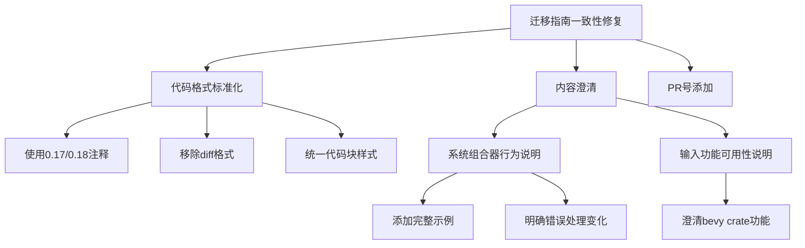

+++
title = "#22364 Improve code examples in 0.18 migration guides"
date = "2026-01-05T00:00:00"
draft = false
template = "pull_request_page.html"
in_search_index = false

[extra]
current_language = "zh-cn"
available_languages = {"en" = { name = "English", url = "/pull_request/bevy/2026-01/pr-22364-en-20260105" }, "zh-cn" = { name = "中文", url = "/pull_request/bevy/2026-01/pr-22364-zh-cn-20260105" }}
+++

# Improve code examples in 0.18 migration guides

## 基本信息
- **标题**: Improve code examples in 0.18 migration guides
- **PR链接**: https://github.com/bevyengine/bevy/pull/22364
- **作者**: BD103
- **状态**: 已合并
- **标签**: C-Docs, S-Ready-For-Final-Review, A-Cross-Cutting, D-Straightforward
- **创建时间**: 2026-01-03T19:11:13Z
- **合并时间**: 2026-01-05T02:12:51Z
- **合并者**: alice-i-cecile

## 描述翻译

> [!重要]
> 此PR针对`release-0.18.0`分支，而非`main`分支。

# 目标

- Bevy 0.18即将发布！让我们对迁移指南进行一次审查。

## 解决方案

- 通过[遵循样式指南](https://github.com/bevyengine/bevy/blob/e457025cc447a9c36ac452f89c3da9ef836cd0d5/release-content/migration_guides.md?plain=1#L75-L90)使代码块示例保持一致。
- 澄清`bevy_input`的输入类型功能（`keyboard`、`gamepad`等）在主`bevy`crate上也可用。
- 改进系统组合器迁移指南，因为我觉得它相当令人困惑。
- 为缺少PR号的迁移指南添加PR号。

## 测试

我测试了系统组合器迁移指南的代码示例在相关版本中有效，但没有测试其他指南，因为我没有修改它们的实际代码。

## 本次PR的故事

在Bevy 0.18发布前夕，开发者BD103注意到迁移指南存在几个问题：代码示例格式不一致，部分说明不够清晰，缺少必要的参考信息。这些问题如果不解决，会直接影响用户从0.17升级到0.18的体验。

**问题的核心是文档的一致性**。迁移指南作为版本升级的关键文档，需要清晰、准确地展示API变化。不一致的代码示例格式会增加用户的认知负担，特别是在需要对比新旧代码时。例如，有些指南使用"Before/After"注释，有些则没有；有些使用diff格式，有些使用完整代码块。

BD103的解决方案是系统性地应用现有的样式指南。他首先确定了一个统一的标准：使用`// 0.17`和`// 0.18`注释来标记新旧代码，而不是使用单独的"Before/After"代码块。这种格式让用户一眼就能看出哪个版本对应哪个实现，减少了上下文切换的需要。

```rust
// 统一前的格式（部分文件）
// Before:
app.insert_resource(AmbientLight {
    color: Color::WHITE,
    brightness: 2000.,
    ..default()
});

// After:
app.insert_resource(GlobalAmbientLight {
    color: Color::WHITE,
    brightness: 2000.,
    ..default()
});

// 统一后的格式
// 0.17
app.insert_resource(AmbientLight {
    color: Color::WHITE,
    brightness: 2000.,
    ..default()
});

// 0.18
app.insert_resource(GlobalAmbientLight {
    color: Color::WHITE,
    brightness: 2000.,
    ..default()
});
```

**技术实现上，这个PR主要涉及文档格式化**。虽然不涉及功能代码，但改动的范围很广——影响了25个迁移指南文件。每个文件的修改都需要仔细审查，确保修改后的代码在语法和语义上都正确，同时保持原有的技术准确性。

系统组合器迁移指南的改进是本次PR的一个重要技术点。原指南简单地说明行为变化，但缺乏具体示例说明变化的影响。BD103重写了这部分内容，添加了完整的代码示例来演示错误处理行为的变化：

```rust
// 0.17 - 系统验证失败会传播错误
#[derive(Component)]
struct Foo;

fn fails_validation(_: Single<&Foo>) -> bool {
    // ...
}

fn always_true() -> bool {
    true
}

let mut world = World::new();
assert!(world.run_system_once(fails_validation.or(always_true)).is_err());

// 0.18 - 验证失败的系统返回false，组合器继续执行
let mut world = World::new();
assert_eq!(matches!(world.run_system_once(fails_validation.or(always_true)), Ok(true)));
```

这个示例清楚地展示了从0.17到0.18的行为变化：原本会因为系统验证失败而返回错误的组合器，现在会将失败的系统视为返回`false`，继续执行组合逻辑。这种具体化的示例比抽象描述更有助于用户理解变化。

**另一个重要的澄清是关于`bevy_input`的功能可用性**。原指南只提到需要在`bevy_input`上启用输入类型功能，但实际使用中用户通常直接依赖主`bevy`crate。BD103更新了说明，明确指出这些功能在主`bevy`crate上也可用：

```toml
# 0.18 (启用你实际使用的输入源):
bevy = { version = "0.18", default-features = false, features = [
  "mouse",
  "keyboard",
  "gamepad",
]}
```

这种澄清非常重要，因为大多数用户不会直接依赖`bevy_input`crate，而是通过`bevy`crate使用输入功能。缺少这个说明可能导致用户错误地认为需要添加对`bevy_input`的显式依赖。

**添加PR号是一个小而重要的改进**。每个迁移指南现在都包含了相关PR的链接，为用户提供了追溯技术决策和详细讨论的途径。例如：

```markdown
---
title: AssetSources now give an `async_channel::Sender` instead of a `crossbeam_channel::Sender`
pull_requests: [21626]
---
```

**从工程角度看，这个PR体现了文档即代码的理念**。迁移指南需要像代码一样保持高质量和一致性。虽然这些改动看起来是表面的格式化问题，但它们直接影响了用户的学习成本和升级成功率。

技术实现上的一个关键决定是保持修改的保守性——只改文档格式，不改实际技术内容（除非原内容有误或不清楚）。这种保守性确保了PR的可靠性，减少了引入新错误的风险。

**这个PR的影响是多方面的**：
1. **提升用户体验**：一致的格式减少了认知负荷，让用户能专注于技术内容本身
2. **改善可维护性**：统一的样式让未来的贡献者更容易遵循标准
3. **增强可追溯性**：PR号链接提供了技术决策的上下文
4. **降低升级障碍**：清晰的示例和说明帮助用户更顺利地迁移代码

虽然这个PR不涉及引擎功能的修改，但它在Bevy 0.18发布过程中扮演了重要角色。好的文档是成功发布的关键组成部分，特别是对于像Bevy这样快速发展的游戏引擎。

**从这次改动中可以学到的工程经验**：
1. **一致性是良好文档的基础**：即使简单的格式统一也能显著提升文档质量
2. **具体示例胜过抽象描述**：代码示例应该展示实际使用场景，而不仅仅是API签名
3. **考虑用户的真实使用模式**：文档应该反映用户的实际工作方式，而不是理想化的假设
4. **版本迁移指南需要特殊关注**：这类文档对格式和清晰度的要求比普通文档更高

## 可视化表示



## 关键文件变更

### 1. `release-content/migration-guides/combinator_system.md` (+33/-22)
**变更说明**: 完全重写了系统组合器迁移指南，从简单的行为描述改为包含完整代码示例的详细说明，展示了错误处理行为的具体变化。

```markdown
<!-- 修改前 -->
The `CombinatorSystem`s can be used to combine multiple `SystemCondition`s with logical operators. Previously, the conditions would short circuit if the system failed to run, for example because it's query could not be filled by the world.

Now, the `CombinatorSystem`s will work as expected, following the semantics of rust's logical operators.
Namely, if a `SystemCondition` fails, it will be considered to have returned `false` and in combinators that don't short circuit the other condition will now be run.

<!-- 修改后 -->
`CombinatorSystem`s can be used to combine multiple `SystemCondition`s with logical operators (such as `and`, `or`, and `xor`). Previously, these combinators would propagate any errors made when running the combined systems:

// 0.17示例代码...

This behavior has been changed in Bevy 0.18. Now if one of the combined systems fails, it will be considered to have returned `false`. The error will not be propagated, and the combinator logic will continue:

// 0.18示例代码...
```

**与PR目标的关系**: 这是PR中提到的"改进系统组合器迁移指南"的具体实现，通过具体示例解决原指南令人困惑的问题。

### 2. `release-content/migration-guides/changed_asset_server_init.md` (+8/-29)
**变更说明**: 简化了AssetServer和AssetProcessor创建方法的说明，合并了重复的代码示例，使用0.17/0.18注释格式。

```rust
// 修改后格式
// 0.17
AssetServer::new(
    sources,
    mode,
    watching_for_changes,
    unapproved_path_mode,
)

// 0.18
AssetServer::new(
    // Wrap the sources in an `Arc`.
    Arc::new(sources),
    mode,
    watching_for_changes,
    unapproved_path_mode,
)
```

**与PR目标的关系**: 应用了统一的代码示例格式，使新旧API对比更清晰。

### 3. `release-content/migration-guides/generalized_atmosphere.md` (+21/-11)
**变更说明**: 将diff格式改为完整的结构体定义，更清晰地展示了Atmosphere结构体的字段变化。

```rust
// 修改前使用diff格式
-   pub rayleigh_density_exp_scale: f32,
-   pub rayleigh_scattering: Vec3,
+   pub medium: Handle<ScatteringMedium>,

// 修改后使用完整结构体
// 0.17
pub struct Atmosphere {
    pub bottom_radius: f32,
    pub top_radius: f32,
    pub ground_albedo: Vec3,
    pub rayleigh_density_exp_scale: f32,
    // ... 其他被移除的字段
}

// 0.18
pub struct Atmosphere {
    pub bottom_radius: f32,
    pub top_radius: f32,
    pub ground_albedo: Vec3,
    pub medium: Handle<ScatteringMedium>,
}
```

**与PR目标的关系**: 改进了代码示例的可读性，让用户更容易理解结构体的完整变化。

### 4. `release-content/migration-guides/custom_asset_source_infallible.md` (+10/-15)
**变更说明**: 简化了自定义资产源创建的说明，使用0.17/0.18注释格式展示API变化。

```rust
// 修改后格式
// 0.17
AssetSource::build()
    .with_reader(move || /* reader logic */)
    .with_writer(move || /* ... */)

// 0.18
AssetSourceBuilder::new(move || /* reader logic */)
    .with_writer(move || /* ... */)
```

**与PR目标的关系**: 应用统一的代码示例格式，使API迁移更清晰。

### 5. `release-content/migration-guides/gltf-coordinate-conversion.md` (+13/-9)
**变更说明**: 将插件配置的diff格式改为完整的结构体定义，更清晰地展示了GltfPlugin的配置变化。

```rust
// 修改后格式
// 0.17
pub struct GltfPlugin {
    use_model_forward_direction: bool,
    // ...
}

// 0.18
pub struct GltfPlugin {
    convert_coordinates: GltfConvertCoordinates,
    // ...
}
```

**与PR目标的关系**: 改进了配置API变化的展示方式，使迁移更直观。

## 进一步阅读

1. **Bevy迁移指南样式规范**: https://github.com/bevyengine/bevy/blob/main/release-content/migration_guides.md
2. **Rust文档最佳实践**: https://doc.rust-lang.org/rustdoc/how-to-write-documentation.html
3. **技术写作原则**: https://developers.google.com/tech-writing
4. **Bevy 0.17到0.18完整迁移指南**: https://bevyengine.org/learn/migration-guides/0.17-0.18/

# 完整代码差异
<details>
<summary>点击展开完整差异</summary>

```diff
diff --git a/release-content/migration-guides/ambient_light_split.md b/release-content/migration-guides/ambient_light_split.md
index ae974e835ea64..d0cde6b1673c5 100644
--- a/release-content/migration-guides/ambient_light_split.md
+++ b/release-content/migration-guides/ambient_light_split.md
@@ -9,19 +9,15 @@ The resource `GlobalAmbientLight` is the default ambient light for the entire wo
 Meanwhile, `AmbientLight` is a component that can be added to a `Camera` in order to override the default `GlobalAmbientLight`.
 When appropriate, rename `AmbientLight` to `GlobalAmbientLight`.
 
-Before:
-
 ```rust
+// 0.17
 app.insert_resource(AmbientLight {
     color: Color::WHITE,
     brightness: 2000.,
     ..default()
 });
-```
 
-After:
-
-```rust
+// 0.18
 app.insert_resource(GlobalAmbientLight {
     color: Color::WHITE,
     brightness: 2000.,
diff --git a/release-content/migration-guides/animation-target-refactor.md b/release-content/migration-guides/animation-target-refactor.md
index 1e1fc631ae3fd..00ebcbaa9e0ca 100644
--- a/release-content/migration-guides/animation-target-refactor.md
+++ b/release-content/migration-guides/animation-target-refactor.md
@@ -10,14 +10,10 @@ The `AnimationTarget` component has been split into two separate components.
 This change was made to add flexibility. It's now possible to calculate the
 `AnimationTargetId` first, but defer the choice of player until later.
 
-Before:
-
 ```rust
+// 0.17
 entity.insert(AnimationTarget { id: AnimationTargetId(id), player: player_entity });
-```
 
-After:
-
-```rust
+// 0.18
 entity.insert((AnimationTargetId(id), AnimatedBy(player_entity)));
 ```
diff --git a/release-content/migration-guides/archetype_query_data.md b/release-content/migration-guides/archetype_query_data.md
index 34967124901bb..18edea24be5c9 100644
--- a/release-content/migration-guides/archetype_query_data.md
+++ b/release-content/migration-guides/archetype_query_data.md
@@ -15,6 +15,7 @@ Code that requires queries to `impl ExactSizeIterator` may need to replace `Quer
 fn requires_exact_size<D: QueryData>(q: Query<D>) -> usize {
     q.into_iter().len()
 }
+
 // 0.18
 fn requires_exact_size<D: ArchetypeQueryData>(q: Query<D>) -> usize {
     q.into_iter().len()
diff --git a/release-content/migration-guides/asset_watcher_async_sender.md b/release-content/migration-guides/asset_watcher_async_sender.md
index 60b1383e5c23f..8d8e54088c5a0 100644
--- a/release-content/migration-guides/asset_watcher_async_sender.md
+++ b/release-content/migration-guides/asset_watcher_async_sender.md
@@ -1,6 +1,6 @@
 ---
 title: AssetSources now give an `async_channel::Sender` instead of a `crossbeam_channel::Sender`
-pull_requests: []
+pull_requests: [21626]
 ---
 
 Previously, when creating an asset source, `AssetSourceBuilder::with_watcher` would provide users
diff --git a/release-content/migration-guides/bevy_input_features.md b/release-content/migration-guides/bevy_input_features.md
index dbab8f69455e9..35c5f2fe707d7 100644
--- a/release-content/migration-guides/bevy_input_features.md
+++ b/release-content/migration-guides/bevy_input_features.md
@@ -11,12 +11,13 @@ If you use `bevy_window` or `bevy_gilrs`, they will automatically
 enable the necessary features on `bevy_input`. If you don't depend
 on them (for example, if you are developing for a platform that
 isn't supported by these crates), you need to enable the required
-input sources on `bevy_input` manually:
+input sources on the `bevy_input` / `bevy` crate manually:
 
 ```toml
-# Before:
+# 0.17
 bevy = { version = "0.17", default-features = false }
-# After (enable sources that you actually use):
+
+# 0.18 (enable sources that you actually use):
 bevy = { version = "0.18", default-features = false, features = [
   "mouse",
   "keyboard",
diff --git a/release-content/migration-guides/bindgroup-labels-mandatory.md b/release-content/migration-guides/bindgroup-labels-mandatory.md
index efe9667b14db7..1021f285992a0 100644
--- a/release-content/migration-guides/bindgroup-labels-mandatory.md
+++ b/release-content/migration-guides/bindgroup-labels-mandatory.md
@@ -8,7 +8,12 @@ In previous versions of Bevy, the `label` of a `BindGroupLayout` was optional. T
 If you were previously omitting the `label` implementation from a `impl AsBindGroup`, you now must implement it:
 
 ```rust
-fn label() -> &'static str {
-    "my label"
+impl AsBindGroup for CoolMaterial {
+    // ...
+
+    fn label() -> &'static str {
+        // It is customary to make the label the name of the type.
+        "CoolMaterial"
+    }
 }
 ```
diff --git a/release-content/migration-guides/bundle_component_ids.md b/release-content/migration-guides/bundle_component_ids.md
index 55c70331c45cd..e889a61c0b852 100644
--- a/release-content/migration-guides/bundle_component_ids.md
+++ b/release-content/migration-guides/bundle_component_ids.md
@@ -6,9 +6,10 @@ pull_requests: [14791, 15458, 15269]
 `Bundle::component_ids` and `Bundle::get_component_ids` were changed to return an iterator over
 `ComponentId` and `Option<ComponentId>` respectively. In some cases this can avoid allocating.
 
+For implementors:
+
 ```rust
-// For implementors
-// Before
+// 0.17
 unsafe impl<C: Component> Bundle for C {
     fn component_ids(components: &mut ComponentsRegistrator, ids: &mut impl FnMut(ComponentId)) {
         ids(components.register_component::<C>());
@@ -19,7 +20,7 @@ unsafe impl<C: Component> Bundle for C {
     }
 }
 
-// After
+// 0.18
 unsafe impl<C: Component> Bundle for C {
     fn component_ids<(
         components: &mut ComponentsRegistrator,
@@ -34,14 +35,15 @@ unsafe impl<C: Component> Bundle for C {
 }
 ```
 
+For consumers:
+
 ```rust
-// For Consumers
-// Before
+// 0.17
 let mut components = vec![];
 MyBundle::component_ids(&mut world.components_registrator(), &mut |id| {
     components.push(id);
 });
 
-// After
+// 0.18
 let components: Vec<_> = B::component_ids(&mut world.components_registrator()).collect();
 ```
diff --git a/release-content/migration-guides/changed_asset_server_init.md b/release-content/migration-guides/changed_asset_server_init.md
index ae0735c6c4d15..d09bd53a32f08 100644
--- a/release-content/migration-guides/changed_asset_server_init.md
+++ b/release-content/migration-guides/changed_asset_server_init.md
@@ -3,10 +3,11 @@ title: Changes to `AssetServer` and `AssetProcessor` creation.
 pull_requests: [21763]
 ---
 
-Previously `AssetServer`s `new` methods would take `AssetSources`. Now, these methods take
-`Arc<AssetSources>`. So if you previously had:
+Previously `AssetServer`s `new` and `new_with_method_check` methods would take `AssetSources`. Now, these methods take
+`Arc<AssetSources>`.
 
 ```rust
+// 0.17
 AssetServer::new(
     sources,
     mode,
@@ -14,46 +15,24 @@ AssetServer::new(
     unapproved_path_mode,
 )
 
-// OR:
-AssetServer::new_with_meta_check(
-    sources,
-    mode,
-    meta_check,
-    watching_for_changes,
-    unapproved_path_mode,
-)
-```
-
-Now you need to do:
-
-```rust
+// 0.18
 AssetServer::new(
+    // Wrap the sources in an `Arc`.
     Arc::new(sources),
     mode,
     watching_for_changes,
     unapproved_path_mode,
 )
-
-// OR:
-AssetServer::new_with_meta_check(
-    Arc::new(sources),
-    mode,
-    meta_check,
-    watching_for_changes,
-    unapproved_path_mode,
-)
 ```
 
 `AssetProcessor::new` has also changed. It now returns to you the `Arc<AssetSources>` which can (and
-should) be shared with the `AssetServer`. So if you previously had:
+should) be shared with the `AssetServer`.
 
 ```rust
+// 0.17
 let processor = AssetProcessor::new(sources);
-```
 
-Now you need:
-
-```rust
+// 0.18
 let (processor, sources_arc) = AssetProcessor::new(
     sources,
     // A bool whether the returned sources should listen for changes as asset processing completes.
diff --git a/release-content/migration-guides/combinator_system.md b/release-content/migration-guides/combinator_system.md
index 7af01c344e41c..e62e7b33f9e76 100644
--- a/release-content/migration-guides/combinator_system.md
+++ b/release-content/migration-guides/combinator_system.md
@@ -3,12 +3,41 @@ title: System Combinators
 pull_requests: [20671]
 ---
 
-The `CombinatorSystem`s can be used to combine multiple `SystemCondition`s with logical operators. Previously, the conditions would short circuit if the system failed to run, for example because it's query could not be filled by the world.
+`CombinatorSystem`s can be used to combine multiple `SystemCondition`s with logical operators (such as `and`, `or`, and `xor`). Previously, these combinators would propagate any errors made when running the combined systems:
 
-Now, the `CombinatorSystem`s will work as expected, following the semantics of rust's logical operators.
-Namely, if a `SystemCondition` fails, it will be considered to have returned `false` and in combinators that don't short circuit the other condition will now be run.
+```rust
+// 0.17
+#[derive(Component)]
+struct Foo;
+
+// This run condition will fail validation because there is not an entity with `Foo` in the world.
+fn fails_validation(_: Single<&Foo>) -> bool {
+    // ...
+}
+
+fn always_true() -> bool {
+    true
+}
+
+let mut world = World::new();
 
-Specifically, the combinators act as follows:
+// Because `fails_validation` is invalid, trying to run this combinator system will return an
+// error.
+assert!(world.run_system_once(fails_validation.or(always_true)).is_err());
+```
+
+This behavior has been changed in Bevy 0.18. Now if one of the combined systems fails, it will be considered to have returned `false`. The error will not be propagated, and the combinator logic will continue:
+
+```rust
+// 0.18
+let mut world = World::new();
+
+// `fails_validation` is invalid, but it is converted to `false`. Because `always_true` succeeds,
+// the combinator returns `true`.
+assert_eq!(matches!(world.run_system_once(fails_validation.or(always_true)), Ok(true)));
+```
+
+This affects the following combinators:
 
 | Combinator | Rust Equivalent |
 |:----------:|:---------------:|
@@ -18,21 +47,3 @@ Specifically, the combinators act as follows:
 | `nand`     | `!(a && b)`     |
 | `nor`      | `!(a \|\| b)`   |
 | `xnor`     | `!(a ^ b)`      |
-
-```rust
-fn vacant(_: crate::system::Single<&Vacant>) -> bool {
-    true
-}
-
-fn is_true() -> bool {
-    true
-}
-
-assert!(world.query::<&Vacant>().iter(&world).next().is_none());
-
-// previously:
-assert!(world.run_system_once(is_true.or(vacant)).is_err());
-
-// now:
-assert!(matches!(world.run_system_once(is_true.or(vacant)), Ok(true)));
-```
diff --git a/release-content/migration-guides/custom_asset_source_infallible.md b/release-content/migration-guides/custom_asset_source_infallible.md
index 4a921982525ff..f283dfbc3e79b 100644
--- a/release-content/migration-guides/custom_asset_source_infallible.md
+++ b/release-content/migration-guides/custom_asset_source_infallible.md
@@ -7,22 +7,17 @@ Previously, it was possible to create asset sources with no reader, resulting in
 silently being skipped. This is no longer possible, since `AssetSourceBuilder` must now be given a
 reader to start. We also slightly changed how sources are expected to be built.
 
-In previous versions, creating a custom source would look like:
-
 ```rust
+// 0.17
 AssetSource::build()
-    .with_reader(move || todo!("the reader!"))
-    .with_writer(move || todo!())
-    .with_processed_reader(move || todo!())
-    .with_processed_writer(move || todo!())
-```
+    .with_reader(move || /* reader logic */)
+    .with_writer(move || /* ... */)
+    .with_processed_reader(move || /* ... */)
+    .with_processed_writer(move || /* ... */);
 
-In Bevy 0.18, this now looks like:
-
-```rust
-// You may need to import AssetSourceBuilder.
-AssetSourceBuilder::new(move || todo!("the reader!"))
-    .with_writer(move || todo!())
-    .with_processed_reader(move || todo!())
-    .with_processed_writer(move || todo!())
+// 0.18
+AssetSourceBuilder::new(move || /* reader logic */)
+    .with_writer(move || /* ... */)
+    .with_processed_reader(move || /* ... */)
+    .with_processed_writer(move || /* ... */;
 ```
diff --git a/release-content/migration-guides/derive_compile_error_for_non_static_resource.md b/release-content/migration-guides/derive_compile_error_for_non_static_resource.md
index 45e4b57419623..24a2a79fecbda 100644
--- a/release-content/migration-guides/derive_compile_error_for_non_static_resource.md
+++ b/release-content/migration-guides/derive_compile_error_for_non_static_resource.md
@@ -6,8 +6,7 @@ pull_requests: [21385]
 Any type with `#[derive(Resource)]` that uses non-static lifetime will no longer compile.
 
 ```rust
-// Will no longer compile in 0.18,
-// 'a should be 'static
+// Will no longer compile in 0.18, `'a` should be `'static`.
 #[derive(Resource)]
 struct Foo<'a> {
    bar: &'a str
diff --git a/release-content/migration-guides/enable_prepass.md b/release-content/migration-guides/enable_prepass.md
index 32ea69d646bed..640cdf792eed9 100644
--- a/release-content/migration-guides/enable_prepass.md
+++ b/release-content/migration-guides/enable_prepass.md
@@ -9,13 +9,13 @@ been replaced by the `Material` methods `enable_prepass` and `enable_shadows`.
 Analogous methods have also been added to `MaterialExtension`
 
 ```rust
-/// before
+// 0.17
 MaterialPlugin::<MyMaterial> {
     prepass_enabled: false,
     shadows_enabled: false,
 }
 
-/// after
+// 0.18
 impl Material for MyMaterial {
     /// ...
 
diff --git a/release-content/migration-guides/generalized_atmosphere.md b/release-content/migration-guides/generalized_atmosphere.md
index 14bcd8a621997..f93645b9c9a72 100644
--- a/release-content/migration-guides/generalized_atmosphere.md
+++ b/release-content/migration-guides/generalized_atmosphere.md
@@ -7,21 +7,31 @@ pull_requests: [20838]
 Most of the fields on `Atmosphere` have been removed in favor of a handle
 to the new