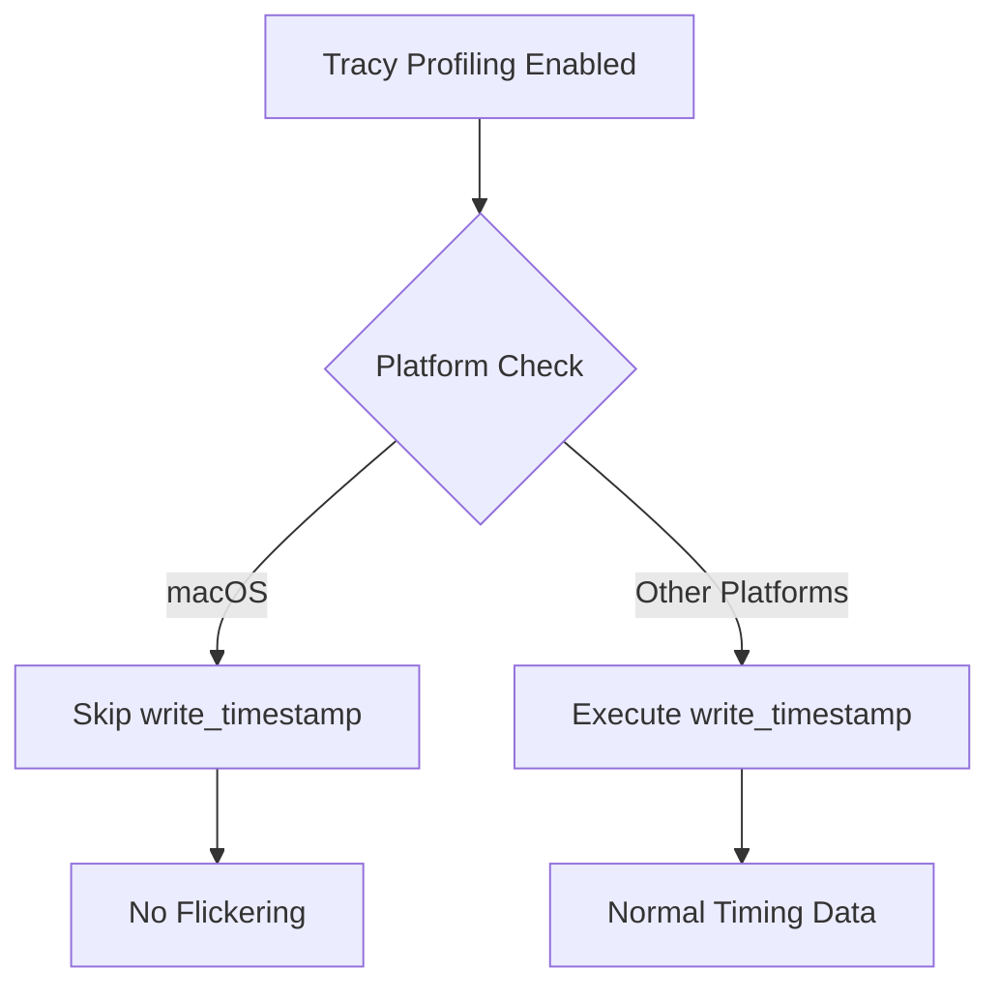

+++
title = "#22365 Fix flickering on macOS 26 when tracy is enabled"
date = "2026-01-03T00:00:00"
draft = false
template = "pull_request_page.html"
in_search_index = true

[taxonomies]
list_display = ["show"]

[extra]
current_language = "en"
available_languages = {"en" = { name = "English", url = "/pull_request/bevy/2026-01/pr-22365-en-20260103" }, "zh-cn" = { name = "中文", url = "/pull_request/bevy/2026-01/pr-22365-zh-cn-20260103" }}
labels = ["C-Bug", "A-Rendering", "O-MacOS", "A-Accessibility", "S-Needs-Testing"]
+++

# Title
## Basic Information
- **Title**: Fix flickering on macOS 26 when tracy is enabled
- **PR Link**: https://github.com/bevyengine/bevy/pull/22365
- **Author**: aevyrie
- **Status**: MERGED
- **Labels**: C-Bug, A-Rendering, O-MacOS, A-Accessibility, S-Needs-Testing
- **Created**: 2026-01-03T20:04:21Z
- **Merged**: 2026-01-03T22:37:03Z
- **Merged By**: mockersf

## Description Translation
# Objective

- Fix flickering/strobing when using tracy.
- Close #22257 

## Solution

- Disable writing timestamps in command encoders on macOS.

## Testing

- Can no longer repro with `cargo run --example bloom_3d --features=trace_tracy`
- `bevy_bistro_scene` also no longer exhibits the flickering

## The Story of This Pull Request

This pull request addresses a specific rendering issue on macOS that occurs when Tracy profiling is enabled. The problem manifested as noticeable flickering or strobing artifacts during rendering, which was tracked in GitHub issue #22257.

The core issue relates to the interaction between Tracy's timing instrumentation and macOS's graphics pipeline. When Tracy is enabled, it instruments the code to collect detailed timing information for performance analysis. This includes calling the `write_timestamp` method on command encoders to record precise timing points in the GPU command stream. However, on macOS (specifically macOS Tahoe), calling `write_timestamp` very close to frame presentation appears to interfere with the rendering pipeline, causing visible flickering.

The solution implemented in this PR is straightforward but targeted. Instead of attempting to work around the issue at a higher level or making complex changes to the timing logic, the fix directly addresses the problematic operation on the affected platform. The implementation adds a conditional check in the `WriteTimestamp` trait implementation for `CommandEncoder` that simply returns early without performing any operation when running on macOS.

Here's the technical reasoning behind this approach:

1. **Platform-specific behavior**: The issue is specific to macOS, so the fix uses conditional compilation (`cfg!(target_os = "macos")`) to apply only where needed. This avoids affecting other platforms where the `write_timestamp` functionality works correctly.

2. **Minimal impact on profiling**: While this disables timestamp writing on macOS when Tracy is enabled, it represents an acceptable trade-off. The alternative would be to leave users with broken rendering when using Tracy for profiling. For most profiling scenarios, the loss of these specific GPU timestamps on macOS is preferable to unusable rendering output.

3. **Clear documentation**: The code includes a comment explaining why this workaround is necessary, referencing the original GitHub issue. This helps future maintainers understand the context if they need to revisit this decision or if Apple fixes the underlying driver issue.

From an architectural perspective, this change is minimal and localized. It affects only the timing instrumentation code path when Tracy is enabled on macOS. The rendering pipeline itself remains unchanged, and all other profiling functionality continues to work. The fix demonstrates a pragmatic approach to platform-specific issues: when a particular operation causes problems on a specific platform, it's sometimes best to simply disable that operation rather than attempting complex workarounds.

The testing methodology was appropriate for this type of fix. The developer verified that the flickering no longer occurs in specific examples (`bloom_3d` and `bevy_bistro_scene`) that previously exhibited the issue when running with Tracy enabled. This targeted testing confirms that the fix resolves the reported problem without introducing regressions for those use cases.

## Visual Representation



## Key Files Changed

### `crates/bevy_render/src/diagnostic/internal.rs`

This file contains the `WriteTimestamp` trait implementation for `CommandEncoder`. The change adds a platform-specific early return to prevent calling `write_timestamp` on macOS, which was causing rendering flickering when Tracy profiling is enabled.

**Key Modification:**
```rust
// File: crates/bevy_render/src/diagnostic/internal.rs
// Before:
impl WriteTimestamp for CommandEncoder {
    fn write_timestamp(&mut self, query_set: &QuerySet, index: u32) {
        CommandEncoder::write_timestamp(self, query_set, index);
    }
}

// After:
impl WriteTimestamp for CommandEncoder {
    fn write_timestamp(&mut self, query_set: &QuerySet, index: u32) {
        if cfg!(target_os = "macos") {
            // When using tracy (and thus this function), rendering was flickering on macOS Tahoe.
            // See: https://github.com/bevyengine/bevy/issues/22257
            // The issue seems to be triggered when `write_timestamp` is called very close to frame
            // presentation.
            return;
        }
        CommandEncoder::write_timestamp(self, query_set, index);
    }
}
```

**Explanation:**
The change adds a conditional check at the beginning of the `write_timestamp` method. When the target operating system is macOS, the method returns immediately without executing the actual `write_timestamp` operation. This prevents the flickering issue that occurs due to the interaction between timestamp writing and frame presentation on macOS. The comment provides context by linking to the original issue and explaining the suspected cause.

## Further Reading

1. **Tracy Profiler**: The official Tracy documentation provides details about the profiling system and its instrumentation capabilities: https://github.com/wolfpld/tracy
2. **WebGPU CommandEncoder**: The WebGPU specification includes details about command encoders and timestamp queries: https://www.w3.org/TR/webgpu/#command-encoder
3. **Bevy Rendering Architecture**: The Bevy engine's rendering architecture documentation explains how command encoding and timing work within the engine's structure.
4. **Platform-Specific Graphics Issues**: For understanding common cross-platform graphics challenges, the GPUOpen blog often covers platform-specific rendering issues and workarounds: https://gpuopen.com/