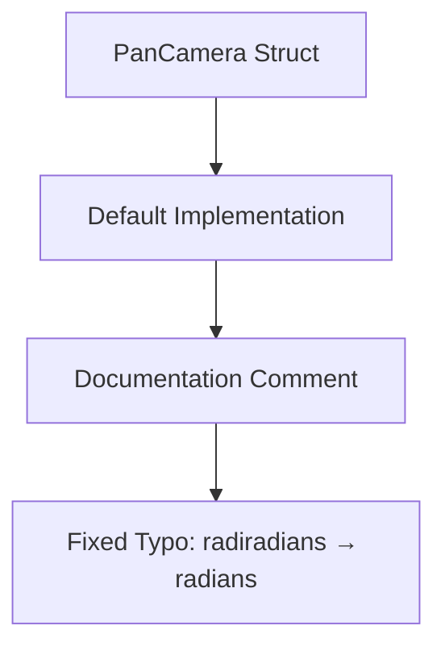

+++
title = "#22367 Fix typo in doc comment [minor]"
date = "2026-01-03T00:00:00"
draft = false
template = "pull_request_page.html"
in_search_index = true

[taxonomies]
list_display = ["show"]

[extra]
current_language = "en"
available_languages = {"en" = { name = "English", url = "/pull_request/bevy/2026-01/pr-22367-en-20260103" }, "zh-cn" = { name = "中文", url = "/pull_request/bevy/2026-01/pr-22367-zh-cn-20260103" }}
labels = ["C-Docs", "D-Trivial"]
+++

# Fix typo in doc comment [minor]

## Basic Information
- **Title**: Fix typo in doc comment [minor]
- **PR Link**: https://github.com/bevyengine/bevy/pull/22367
- **Author**: HQ2000-Rust
- **Status**: MERGED
- **Labels**: C-Docs, D-Trivial
- **Created**: 2026-01-03T20:52:22Z
- **Merged**: 2026-01-03T22:40:10Z
- **Merged By**: mockersf

## Description Translation

# Objective

- typo: "radiradians" instead of "radians"

## Solution

- Describe the solution used to achieve the objective above.

## Testing

- no testing needed, just a modified doc comment

## The Story of This Pull Request

This PR addresses a straightforward typographical error in the Bevy game engine's documentation. The issue was found in the doc comment for the `PanCamera` struct's `Default` implementation within the camera controller module.

The problem was a simple but noticeable typo: the word "radiradians" appeared where "radians" should have been. While this doesn't affect the code's functionality, it creates confusion for developers reading the documentation and detracts from the professionalism of the codebase. Documentation typos can be particularly problematic in open-source projects where clear communication is essential for contributors and users alike.

The author identified this issue through what appears to be routine code review or usage of the camera controller module. The fix approach was minimal and targeted: directly replace the incorrect string with the correct one. No alternatives were considered because the solution was unambiguous - there's only one correct spelling for "radians" in this context.

The implementation consists of a single-character change in a documentation string. The typo "radiradians" likely originated from a keyboard slip where the 'r' key was pressed twice ("radir") followed by the intended "radians", creating a duplication error. This kind of typo is common in documentation where automated tools don't typically catch spelling errors in comments.

From a technical perspective, this change demonstrates the importance of maintaining documentation quality alongside code quality. While the PR is categorized as trivial (D-Trivial) and documentation-focused (C-Docs), it contributes to the overall readability and usability of the Bevy engine. Well-documented code with accurate terminology reduces cognitive load for developers trying to understand the system.

The impact of this change is limited to documentation clarity - it doesn't affect compilation, runtime behavior, or API compatibility. However, it improves the developer experience for anyone reading the `PanCamera` documentation, ensuring they understand that rotation speed is measured in radians per second rather than being confused by the nonsensical "radiradians" unit.

This PR also highlights the value of having documentation that includes actual units of measurement. The comment specifies "PI (radians per second)" which gives developers concrete information about the scale of rotation, with PI radians being equivalent to 180 degrees per second.

## Visual Representation



## Key Files Changed

### `crates/bevy_camera_controller/src/pan_camera.rs` (+1/-1)

This file contains the `PanCamera` struct and its associated implementations. The change fixes a typo in the documentation comment for the `Default` implementation.

**What changed**: A documentation comment was corrected from "radiradians" to "radians" in the description of rotation speed.

**Code diff**:
```rust
// File: crates/bevy_camera_controller/src/pan_camera.rs
// Before:
/// - Rotation speed: PI (radiradians per second)

// After:
/// - Rotation speed: PI (radians per second)
```

**How it relates to the PR**: This is the entire scope of the PR - fixing a single typo in documentation to improve clarity and professionalism.

## Further Reading

1. [Bevy Camera Controller Documentation](https://docs.rs/bevy_camera_controller/latest/bevy_camera_controller/) - Official documentation for the camera controller module
2. [Rust Documentation Comments Guide](https://doc.rust-lang.org/rustdoc/how-to-write-documentation.html) - Best practices for writing documentation in Rust
3. [Radians vs Degrees in Game Development](https://en.wikipedia.org/wiki/Radian) - Understanding why radians are commonly used in game development and mathematics

# Full Code Diff
diff --git a/crates/bevy_camera_controller/src/pan_camera.rs b/crates/bevy_camera_controller/src/pan_camera.rs
index 283bd10562a50..f2319bba93b91 100644
--- a/crates/bevy_camera_controller/src/pan_camera.rs
+++ b/crates/bevy_camera_controller/src/pan_camera.rs
@@ -81,7 +81,7 @@ pub struct PanCamera {
 /// - Pan speed: 500.0
 /// - Move up/down: W/S
 /// - Move left/right: A/D
-/// - Rotation speed: PI (radiradians per second)
+/// - Rotation speed: PI (radians per second)
 /// - Rotation ccw/cw: Q/E
 impl Default for PanCamera {
     /// Provides the default values for the `PanCamera` controller.