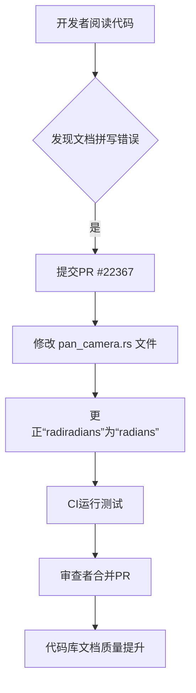

+++
title = "#22367 Fix typo in doc comment [minor]"
date = "2026-01-03T00:00:00"
draft = false
template = "pull_request_page.html"
in_search_index = false

[extra]
current_language = "zh-cn"
available_languages = {"en" = { name = "English", url = "/pull_request/bevy/2026-01/pr-22367-en-20260103" }, "zh-cn" = { name = "中文", url = "/pull_request/bevy/2026-01/pr-22367-zh-cn-20260103" }}
+++

# Title
Fix typo in doc comment [minor]

## 基本信信息
- **标题**: Fix typo in doc comment [minor]
- **PR链接**: https://github.combevyengine/bevy/pull/22367
- **作者**: HQ2000-Rust
- **状态**: 已合并
- **标签**: C-Docs, D-Trivial
- **创建时间**: 2026-01-03T20:52:22Z
- **合并时间**: 2026-01-03T22:40:10Z
- **合并者**: mockersf

## 描述翻译
### 目标
- 修复拼写错误：将 "radiradians" 修正为 "radians"。

### 解决方案
- 描述为实现上述目标所采用的解决方案。

### 测试
- 无需测试，仅修改了文档注释。

## 这个Pull Request的故事

这个故事始于一次对Bevy引擎代码库的日常代码审查或探索。开发者`HQ2000-Rust`在`bevy_camera_controller`模块中浏览用于摄像机控制的`PanCamera`组件的默认实现时，发现了一处文档注释中的拼写错误。

**问题与背景**
问题本身很直接：在`PanCamera`结构体的`Default`实现的文档注释中，描述旋转速度的单位时出现了笔误，写成了`radiradians per second`。正确的单位应该是`radians per second`（弧度每秒）。`radians`是角度的一种标准国际单位制(SI)单位，广泛用于数学和图形编程中描述旋转。这个拼写错误是一个典型的`typo`（笔误），它不会影响代码的编译或运行时行为，因为注释（`doc comment`）是供开发者阅读的元数据。

那么，为什么需要修复它？在软件工程中，文档的质量直接影响着代码的可读性、可维护性以及新手开发者的上手体验。一个开源项目（如Bevy）的专业形象部分体现在其代码细节上，包括准确的注释。拼写错误会分散读者的注意力，有时甚至会引起误解，尽管在这个例子中“radiradians”可能被识别为一个明显的错误。更重要的是，Bevy是一个游戏引擎，其用户（开发者）会频繁查阅这些API文档来理解如何控制摄像机。清晰的文档能减少困惑，提升开发效率。因此，即使是这样一个小修改，也是维护代码库健康度和专业性的一部分。

**解决方案与实现**
解决方案极其简单明了：定位到错误所在的行，将`radiradians`更正为`radians`。开发者没有选择复杂的重构或功能添加，而是直接提交了一个最小化的修复。这种做法符合“童子军规则”（Boy Scout Rule）：让营地（代码库）比你发现时更干净。

我们来看一下具体的实现。修改只涉及一个文件中的一行代码。下面是相关的上下文和更改：

在文件`crates/bevy_camera_controller/src/pan_camera.rs`中，`PanCamera`结构体的`Default`实现包含一个详尽的文档注释块，用于描述该控制器的默认键位绑定和参数。错误就出现在描述旋转速度的那一行。

```rust
// 修改前：
/// - Rotation speed: PI (radiradians per second)
// 修改后：
/// - Rotation speed: PI (radians per second)
```

这个修复展示了典型的文档维护工作流：
1.  **识别问题**：在阅读或编写代码时发现不准确之处。
2.  **最小化修改**：只改动有问题的部分，不引入无关变更。
3.  **提交说明**：在PR描述中清晰说明目标（Fix typo）和变更内容。
4.  **快速审查与合并**：由于变更无害且显而易见（`D-Trivial`标签），合并流程迅速。

**技术洞察**
虽然这个PR本身不包含复杂的技术逻辑，但它触及了软件开发中的几个重要方面：
*   **文档即代码**：在Rust中，文档注释（以`///`或`//!`开头）是首选的API文档编写方式。工具如`rustdoc`会解析这些注释生成漂亮的HTML文档。因此，注释的准确性直接决定了自动生成的官方文档的质量。
*   **贡献者体验**：一个对拼写错误这类小问题也持欢迎态度的项目，能降低新贡献者的心理门槛，鼓励更多人参与进来。这是一个积极的社区信号。
*   **持续集成(CI)的作用**：对于此类PR，通常不需要人工进行复杂的测试。Bevy的CI流水线会自动运行现有的测试套件，以确保这个单行修改没有意外破坏任何功能。这是现代软件开发中保障代码质量的关键安全网。

**影响**
此次修改的影响是细微但积极的：
1.  **提升文档清晰度**：所有阅读`PanCamera`默认设置文档的开发者现在都会看到正确的单位术语。
2.  **维护专业标准**：它有助于保持Bevy作为一个大型、专业开源项目的代码质量基准。
3.  **无副作用**：由于只修改了注释，对引擎的功能、性能或API没有任何影响。

从这个简单的PR中，我们可以学到：对细节的关注是构建和维护高质量软件的重要习惯。即使是看似微不足道的修正，也是集体所有权和持续改进文化的体现。

## 视觉表示


## 关键文件更改
- `crates/bevy_camera_controller/src/pan_camera.rs` (+1/-1)

**描述**：此文件包含了`PanCamera`摄像机控制器的实现。本次修改仅修复了其`Default`实现中文档注释的一处拼写错误。

**代码变更**：
```rust
// File: crates/bevy_camera_controller/src/pan_camera.rs
// 上下文：在 PanCamera 的 Default 实现 impl 块中
/// - Rotation speed: PI (radiradians per second) // 修改前
/// - Rotation speed: PI (radians per second)     // 修改后
```

**与PR目的的关系**：这是本次PR唯一且全部的修改内容，直接实现了修复文档拼写错误的目标。

## 延伸阅读
- **[Rust文档注释指南](https://doc.rust-lang.org/rustdoc/how-to-write-documentation.html)**：了解如何编写有效的Rust文档注释，这是Rust生态系统的重要组成部分。
- **[Bevy Camera Controller 模块](https://docs.rs/bevy_camera_controller/latest/bevy_camera_controller/)**：查看`bevy_camera_controller`模块的完整文档，了解其提供的各种摄像机控制功能。
- **[《代码整洁之道》](https://book.douban.com/subject/4199741/)**：虽然不是直接关于拼写错误，但这本书阐述了为什么代码（包括注释）的清晰度和细节至关重要。