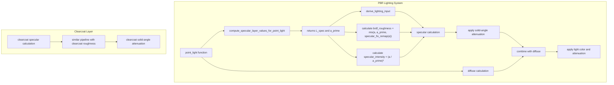

+++
title = "#22372 Fix Area Light Specular Over-Brightness"
date = "2026-01-06T00:00:00"
draft = false
template = "pull_request_page.html"
in_search_index = true

[taxonomies]
list_display = ["show"]

[extra]
current_language = "en"
available_languages = {"en" = { name = "English", url = "/pull_request/bevy/2026-01/pr-22372-en-20260106" }, "zh-cn" = { name = "中文", url = "/pull_request/bevy/2026-01/pr-22372-zh-cn-20260106" }}
labels = ["C-Bug", "A-Rendering", "M-Deliberate-Rendering-Change", "C-Refinement"]
+++

# Fix Area Light Specular Over-Brightness

## Basic Information
- **Title**: Fix Area Light Specular Over-Brightness
- **PR Link**: https://github.com/bevyengine/bevy/pull/22372
- **Author**: aevyrie
- **Status**: MERGED
- **Labels**: C-Bug, A-Rendering, S-Ready-For-Final-Review, X-Uncontroversial, M-Deliberate-Rendering-Change, C-Refinement
- **Created**: 2026-01-04T07:09:49Z
- **Merged**: 2026-01-06T01:54:06Z
- **Merged By**: alice-i-cecile

## Description Translation
**Objective**
- Fix the over bright specular in our area (point) light implementation.
- Close https://github.com/bevyengine/bevy/issues/13327

**Solution**
- Apply the modified (`a_prime`) specular roughness instead of the *base* roughness. This allows specular to correctly broaden and fade with distance per Karis 2013.
- The only downside of this approach is that specular reflections on smooth materials are over-attenuated. This is a known issue of Karis 2013, and the solution is to implement a popular solution like Linearly Transformed Cosines to handle area lights more correctly.
- In the meantime, I've applied a correction that lerps between the base roughness and the modified area light roughness, to retain sharpness and brightness for glossy materials. This was tuned from the reference renders.

**Testing**

**Reference (Blender)**


**Before**


**After**


**Sharp Reference (Blender)**


**Sharp Before**


**Sharp After**


---

**Showcase**


## The Story of This Pull Request

This PR addresses a specific rendering artifact in Bevy's physically-based rendering (PBR) pipeline where area lights (implemented as point lights with non-zero radius) produced specular highlights that were too bright and didn't fade correctly with distance. The issue was tracked in GitHub issue #13327 and stemmed from an incorrect implementation of area light specular handling.

The problem was in how Bevy handled roughness calculations for area lights. In PBR rendering, when dealing with point lights that have a physical size (radius > 0), you can't treat them as perfect infinitesimal points. The light's physical size affects how specular reflections appear - larger light sources should produce broader, softer specular highlights that change appearance based on distance.

The existing implementation was calculating a specular intensity value directly, but this approach didn't properly account for how roughness should change based on the light's size and distance. According to the Karis 2013 paper ("Real Shading in Unreal Engine 4"), the correct approach is to modify the material's roughness value based on the light's radius and distance from the surface, creating what's called `a_prime` (modified roughness).

The key technical insight here is that for area lights, the perceived roughness increases with both the light's physical size and its distance from the surface. The formula `a_prime = saturate(a + light_radius / (2.0 * distance))` captures this relationship, where `a` is the base material roughness, `light_radius` is the light's physical radius, and `distance` is the distance from the surface to the light.

However, directly applying this Karis 2013 approach has a known limitation: it over-attenuates specular reflections on smooth materials (low roughness). To work around this while maintaining physical accuracy for rough materials, the PR introduces a clever interpolation. Instead of using `a_prime` directly for all materials, it lerps between the base roughness `a` and `a_prime` using a remapping function:

```rust
fn specular_fix_remap(a: f32) -> f32 {
    let inv_a_sq = (1.0 - a) * (1.0 - a);
    return 1.0 - inv_a_sq * inv_a_sq;
}
```

This function produces a lerp factor that approaches 1.0 for smooth materials (low roughness) and 0.0 for rough materials. The result is that smooth materials retain their sharp, bright specular highlights while rough materials correctly use the physically-based `a_prime` value. This remapping function was empirically tuned by comparing against reference renders from Blender.

Another important change is the addition of solid-angle attenuation for sphere area lights. When a light has physical size, its apparent brightness decreases as you move farther away, even beyond simple inverse-square falloff. The solid angle the light subtends affects visibility, and this is now accounted for with: `specular_light *= saturate(NdotL / max(NdotL + solid_angle, 1e-4))` where `solid_angle = light_radius * light_radius / (distance * distance)`.

The implementation required restructuring several parts of the lighting calculation. The `compute_specular_layer_values_for_point_light` function was changed to return the modified roughness (`a_prime`) in its `w` component instead of the specular intensity. This change cascaded through the codebase, requiring updates to how specular intensity is calculated and how roughness values are passed to the various specular BRDF functions (`specular`, `specular_clearcoat`, and `specular_anisotropy`).

The PR also fixes an architectural issue where NdotL (the cosine of the angle between surface normal and light direction) was being applied inconsistently. Previously, it was multiplied at the end of the lighting calculation. Now, diffuse and specular components track their own NdotL values separately, which is necessary because area lights can have different light directions for diffuse and specular calculations.

From an engineering perspective, this PR demonstrates a common pattern in graphics programming: implementing a physically-based solution (Karis 2013), identifying its practical limitations (over-attenuation on smooth materials), and applying an empirically-tuned correction that preserves the benefits while mitigating the downsides. The author explicitly acknowledges that a more complete solution would be to implement Linearly Transformed Cosines (LTC), a popular technique for accurate area light rendering, but provides this intermediate fix that significantly improves visual quality without requiring a major rendering system overhaul.

## Visual Representation



## Key Files Changed

**crates/bevy_pbr/src/render/pbr_lighting.wgsl** (+74/-27)

This is the main shader file where all the lighting calculations happen. The changes are extensive but focused on fixing the area light specular calculation.

Key changes:

1. **Modified function signature and return value**:
```rust
// Before: Returns L in the `xyz` components and the specular intensity in the `w` component.
fn compute_specular_layer_values_for_point_light(
    input: ptr<function, LightingInput>,
    layer: u32,
    V: vec3<f32>,
    light_to_frag: vec3<f32>,
    light_position_radius: f32,
) -> vec4<f32>

// After: Returns L in the `xyz` components and the modified roughness in the `w` component.
fn compute_specular_layer_values_for_point_light(
    input: ptr<function, LightingInput>,
    layer: u32,
    V: vec3<f32>,
    light_to_frag: vec3<f32>,
    light_radius: f32,
    distance: f32,
) -> vec4<f32>
```

2. **Changed roughness calculation**:
```rust
// Before (old intensity calculation):
let normalizationFactor = a / saturate(a + (light_position_radius * 0.5 * LspecLengthInverse));
let intensity = normalizationFactor * normalizationFactor;

// After (Karis 2013 a_prime calculation):
let a_prime = saturate(a + light_radius / (2.0 * distance));
```

3. **Added specular fix remapping function**:
```rust
fn specular_fix_remap(a: f32) -> f32 {
    let inv_a_sq = (1.0 - a) * (1.0 - a);
    return 1.0 - inv_a_sq * inv_a_sq;
}
```

4. **Updated specular function signatures to accept explicit roughness parameter**:
```rust
// Before:
fn specular(
    input: ptr<function, LightingInput>,
    derived_input: ptr<function, DerivedLightingInput>,
    specular_intensity: f32,
) -> vec3<f32>

// After:
fn specular(
    input: ptr<function, LightingInput>,
    derived_input: ptr<function, DerivedLightingInput>,
    roughness: f32,
    specular_intensity: f32,
) -> vec3<f32>
```

5. **Added solid-angle attenuation for sphere lights**:
```rust
// Sphere area light visibility (solid-angle attenuation)
let light_radius = (*light).position_radius.w;
if light_radius > 0.0 {
    let solid_angle = light_radius * light_radius / (distance * distance);
    specular_light *= saturate(specular_derived_input.NdotL / max(specular_derived_input.NdotL + solid_angle, 1e-4));
}
```

6. **Fixed NdotL handling in final color calculation**:
```rust
// Before (combined at the end):
return color * (*light).color_inverse_square_range.rgb *
    (rangeAttenuation * derived_input.NdotL) * texture_sample;

// After (separate NdotL for diffuse and specular):
return color_times_NdotL * (*light).color_inverse_square_range.rgb *
    rangeAttenuation * texture_sample;
```

## Further Reading

1. **Karis 2013 - "Real Shading in Unreal Engine 4"**: The original paper that introduces the `a_prime` concept for area lights. Available at: https://cdn2.unrealengine.com/Resources/files/2013SiggraphPresentationsNotes-26915738.pdf

2. **Filament PBR Documentation**: Comprehensive documentation on physically-based rendering concepts, including area lights. Available at: https://google.github.io/filament/Filament.html

3. **Linearly Transformed Cosines (LTC)**: The more advanced technique mentioned as a future improvement. Original paper: "Real-Time Polygonal-Light Shading with Linearly Transformed Cosines" by Eric Heitz et al.

4. **Bevy PBR Rendering Documentation**: For understanding how Bevy implements PBR rendering. Available in the Bevy repository at: https://github.com/bevyengine/bevy/tree/main/crates/bevy_pbr

5. **Physically Based Rendering: From Theory to Implementation**: The classic textbook that covers fundamental PBR concepts, including light transport and BRDFs.