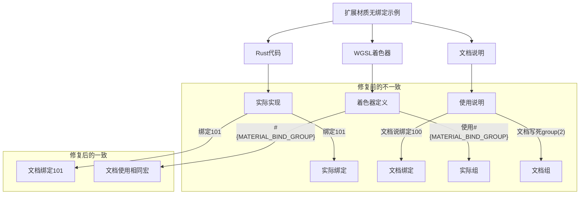

+++
title = "#22373 修复扩展材质无绑定示例中的复制粘贴错误"
date = "2026-01-05T00:00:00"
draft = false
template = "pull_request_page.html"
in_search_index = false

[extra]
current_language = "zh-cn"
available_languages = {"en" = { name = "English", url = "/pull_request/bevy/2026-01/pr-22373-en-20260105" }, "zh-cn" = { name = "中文", url = "/pull_request/bevy/2026-01/pr-22373-zh-cn-20260105" }}
+++

# Title: 修复扩展材质无绑定示例中的复制粘贴错误

## 基本信息
- **标题**: Fix copy-pasting mistake in extended material bindless example
- **PR链接**: https://github.com/bevyengine/bevy/pull/22373
- **作者**: janhohenheim
- **状态**: 已合并
- **标签**: C-Docs, A-Rendering, C-Examples, S-Ready-For-Final-Review, D-Straightforward
- **创建时间**: 2026-01-04T07:24:01Z
- **合并时间**: 2026-01-05T02:31:22Z
- **合并者**: alice-i-cecile

## 描述翻译
### 目标
- 文档内容有些奇怪，可能是因为有人在某个时候不小心复制粘贴了WGSL对应代码

### 解决方案
- 编写实际的代码
- 在文档中使用我们花哨的 `#{MATERIAL_BIND_GROUP}`，因为它也在着色器中使用了 :)
- 稍微不同地分割行

### 测试
- 没有测试，只是文档。不过，我确实确保了文档中的内容与着色器中的内容一致！

## 这个PR的故事

这是一个典型的文档修复PR，核心问题是示例代码的文档描述与实际实现不一致。问题源于复制粘贴错误，导致文档中的WGSL着色器代码与实际使用的代码不匹配。

问题的发现很直接：开发者在查看扩展材质（extended material）的无绑定（bindless）示例时，注意到文档描述有些奇怪。经过检查，发现文档中关于绑定（binding）和组的描述与实际着色器代码不一致。具体来说，文档中提到的绑定索引和变量名与实际的WGSL着色器不匹配。

解决方案采取了三个步骤。首先，修正了文档中的WGSL代码示例，使其与实际着色器中的声明一致。其次，统一使用了`#{MATERIAL_BIND_GROUP}`宏，这个宏在着色器代码中实际使用，但在文档中之前没有体现。最后，对文档的格式进行了微调，使代码块的行分割更加清晰。

这个修复的重要性在于保持示例代码的准确性和一致性。Bevy的扩展材质系统是一个相对高级的特性，主要用于实现自定义材质扩展。无绑定渲染则是现代图形API中的一个重要概念，它允许更灵活的纹理和缓冲区访问。如果示例文档与实际代码不一致，开发者在使用这些高级特性时会遇到困惑。

从实现细节来看，这个修复涉及对`#[data]`和`#[bindless]`属性宏的文档说明的修正。这两个宏用于配置扩展材质的uniform数据和索引表。修正后的文档现在准确地反映了：
1. `binding_array(101)`对应的确实是绑定101，而不是100
2. 索引存储在`ExampleBindlessExtendedMaterialIndices`结构的第50个槽位
3. 使用了正确的变量名`example_extended_material`而不是`example_extended_material_indices`

此外，注释中的一个细节也被修正：将"red-tinted Bevy logo"改为"red-tinted checkerboard pattern"，这反映了示例中实际使用的纹理是棋盘格图案，而不是Bevy logo。

这个PR展示了良好开发实践的几个方面：及时修复文档错误、保持代码与文档同步、注意细节一致性。虽然这个修复本身很小，但它对维护代码库的可读性和可维护性很重要，特别是对于像扩展材质这样的高级特性，准确的文档至关重要。

## 视觉表示



## 关键文件变更

### `examples/shader/extended_material_bindless.rs` (+6/-7)

这个文件是扩展材质无绑定示例的主要实现文件。变更包括文档注释的修正和一行代码注释的更新。

**主要变更：**
1. 修正了`#[data]`属性宏的文档，使其与实际着色器代码一致
2. 修正了`#[bindless]`属性宏的文档，统一使用`#{MATERIAL_BIND_GROUP}`宏
3. 更新了示例中的注释，准确描述使用的纹理

```rust
// 修复前：
/// @group(2) @binding(100) var<storage> example_extended_material_indices:
///     array<ExampleBindlessExtendedMaterialIndices>;

// 修复后：
/// @group(#{MATERIAL_BIND_GROUP}) @binding(101)
/// var<storage> example_extended_material: array<ExampleBindlessExtendedMaterial>;
```

```rust
// 修复前：
/// @group(2) @binding(100) var<storage> example_extended_material_indices:
///     array<ExampleBindlessExtendedMaterialIndices>;

// 修复后：
/// @group(#{MATERIAL_BIND_GROUP}) @binding(100)
/// var<storage> example_extended_material_indices: array<ExampleBindlessExtendedMaterialIndices>;
```

```rust
// 修复前：
    // Create a gray sphere, modulated with a red-tinted Bevy logo.

// 修复后：
    // Create a gray sphere, modulated with a red-tinted checkerboard pattern.
```

## 延伸阅读

- [Bevy 材质系统文档](https://bevyengine.org/learn/book/3d-rendering/materials/)
- [WGSL 着色语言规范](https://www.w3.org/TR/WGSL/)
- [无绑定渲染技术介绍](https://therealmjp.github.io/posts/bindless-texturing-for-deferred-rendering-and-decals/)
- [Bevy 扩展材质系统示例](https://github.com/bevyengine/bevy/blob/main/examples/shader/extended_material.rs)