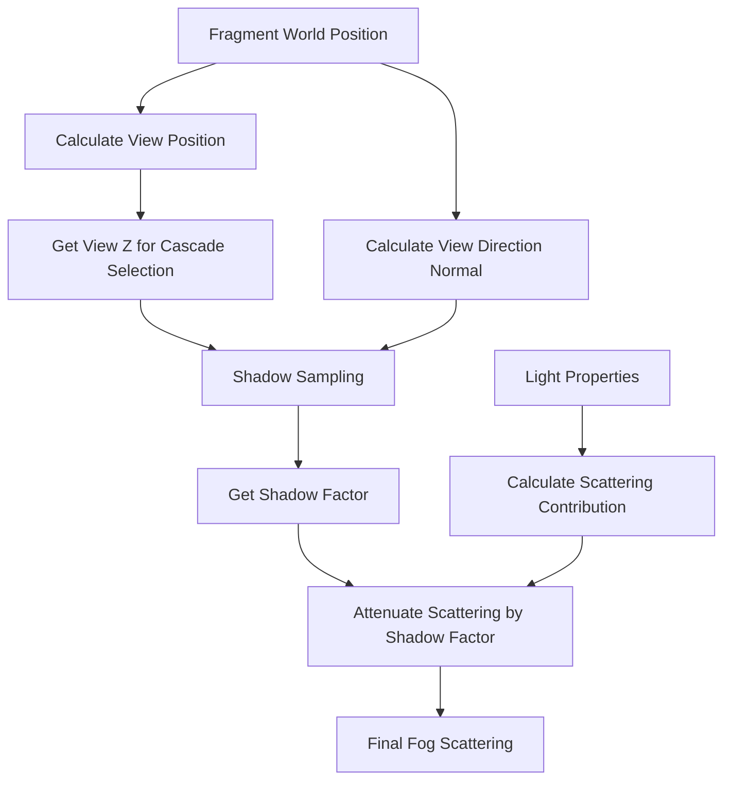

+++
title = "#22377 Shadow mapping in distance fog"
date = "2026-01-04T00:00:00"
draft = false
template = "pull_request_page.html"
in_search_index = true

[taxonomies]
list_display = ["show"]

[extra]
current_language = "en"
available_languages = {"en" = { name = "English", url = "/pull_request/bevy/2026-01/pr-22377-en-20260104" }, "zh-cn" = { name = "中文", url = "/pull_request/bevy/2026-01/pr-22377-zh-cn-20260104" }}
labels = ["C-Bug", "A-Rendering", "D-Straightforward", "M-Deliberate-Rendering-Change"]
+++

# Title
Shadow mapping in distance fog

## Basic Information
- **Title**: Shadow mapping in distance fog
- **PR Link**: https://github.com/bevyengine/bevy/pull/22377
- **Author**: mate-h
- **Status**: MERGED
- **Labels**: C-Bug, A-Rendering, S-Ready-For-Final-Review, D-Straightforward, M-Deliberate-Rendering-Change
- **Created**: 2026-01-04T20:41:23Z
- **Merged**: 2026-01-04T21:48:51Z
- **Merged By**: alice-i-cecile

## Description Translation
**Objective**
- Fixes https://github.com/bevyengine/bevy/issues/22375

**Solution**
- For each directional light with shadows enabled, we sample the shadow map at the fragment's world position. The shadow factor (0.0 = fully shadowed, 1.0 = fully lit) attenuates the inscattering contribution for the mie scattering component.

**Testing**
- Ran the `atmospheric_fog` example with and without the shadows_enabled flag

---
**Showcase**

before


after


## The Story of This Pull Request

This PR addresses a visual inconsistency in Bevy's atmospheric fog rendering. The issue was straightforward: when directional lights cast shadows, the fog scattering calculation didn't account for those shadows, resulting in unrealistic lighting where shadowed areas still appeared to have full fog illumination.

The problem originated in the shader code for fog calculations. Atmospheric fog in Bevy uses a mie scattering model that simulates how light scatters through particles in the atmosphere. This scattering is directional and depends on the angle between the view direction and light direction. However, the original implementation didn't check whether a fragment was in shadow when calculating this scattering contribution.

The solution implemented is direct and practical. For each directional light with shadows enabled, the shader now samples the shadow map at the fragment's world position. The shadow factor (ranging from 0.0 for fully shadowed to 1.0 for fully lit) is then used to attenuate the inscattering contribution. This means that areas in shadow receive less fog scattering, which matches physical reality and creates more convincing atmospheric effects.

From an implementation perspective, the changes are minimal and focused. The main modification happens in the `apply_fog` function within the WGSL shader code. The developer added three key calculations:
1. Computing the view-space Z coordinate for shadow cascade selection
2. Calculating a view direction normal for shadow sampling
3. Sampling the shadow map for each directional light with shadows enabled

The approach uses existing infrastructure - the `shadows::fetch_directional_shadow` function was already available in Bevy's shader modules. This function handles the complexity of cascade shadow mapping, selecting the appropriate shadow map cascade based on the fragment's view-space depth and sampling the shadow map with proper bias and filtering.

One important consideration in this implementation is the use of the view direction as an approximation for surface normal during shadow sampling. Since fog is a volumetric effect that doesn't have a true surface normal, using the view direction (the normalized vector from the fragment to the camera) provides a reasonable approximation for shadow cascade selection. This is a practical trade-off that works well for atmospheric effects.

The impact of this change is purely visual but significant for scene realism. Before the fix, shadowed areas would have the same fog scattering as lit areas, which broke the illusion of light interacting with atmospheric particles. After the fix, fog correctly darkens in shadowed regions, creating more believable outdoor scenes with proper depth cues and atmospheric perspective.

From a performance standpoint, the change adds shadow map sampling for each directional light with shadows enabled during fog calculations. This is a reasonable cost given that fog is typically applied to many fragments in a scene, and shadow sampling is already a common operation in deferred rendering pipelines. The implementation is efficient because it reuses existing shadow sampling infrastructure and only performs the additional work when lights have shadows enabled.

## Visual Representation



## Key Files Changed

### `crates/bevy_pbr/src/render/pbr_functions.wgsl`

**What changed and why**: Modified the `apply_fog` function to incorporate shadow mapping for directional lights when calculating fog scattering. This fixes the visual issue where fog appeared equally bright in shadowed and lit areas.

**Key modifications**:

The changes add shadow map sampling for directional lights in the fog scattering calculation:

```wgsl
// Before:
scattering += pow(
    max(
        dot(view_to_world_normalized, light.direction_to_light),
        0.0
    ),
    fog_params.directional_light_exponent
) * light.color.rgb * view_bindings::view.exposure;

// After:
let scattering_contribution = pow(
    max(
        dot(view_to_world_normalized, light.direction_to_light),
        0.0
    ),
    fog_params.directional_light_exponent
) * light.color.rgb * view_bindings::view.exposure;

// Sample shadow map to attenuate inscattering in shadowed areas
var shadow: f32 = 1.0;
if ((light.flags & mesh_view_types::DIRECTIONAL_LIGHT_FLAGS_SHADOWS_ENABLED_BIT) != 0u) {
    shadow = shadows::fetch_directional_shadow(i, fragment_world_position_vec4, view_direction_normal, view_z);
}
scattering += scattering_contribution * shadow;
```

**Additional setup code added**:
```wgsl
// Calculate view_z for shadow cascade selection
let view_pos = view_transformations::position_world_to_view(fragment_world_position);
let view_z = view_pos.z;

// Approximate surface normal using view direction for shadow sampling
let view_direction_normal = normalize(-view_to_world);
let fragment_world_position_vec4 = vec4<f32>(fragment_world_position, 1.0);
```

**How these changes relate to the overall purpose**: These modifications enable the fog scattering calculation to respect shadows cast by directional lights, making atmospheric effects more physically accurate and visually consistent with the scene lighting.

## Further Reading

For more information on the concepts and techniques used in this PR:

1. **Atmospheric Scattering Models**: Learn about mie scattering and rayleigh scattering models used in real-time atmospheric rendering
2. **Cascade Shadow Mapping**: Understand how shadow maps are organized into cascades for efficient rendering at different distances
3. **WGSL Shader Programming**: Bevy uses WebGPU Shader Language (WGSL) for its shaders
4. **Volumetric Fog Techniques**: Various approaches to rendering convincing atmospheric effects in real-time graphics

Relevant Bevy documentation:
- Bevy's PBR rendering pipeline
- Shadow mapping implementation in Bevy
- Atmospheric fog features in the Bevy renderer