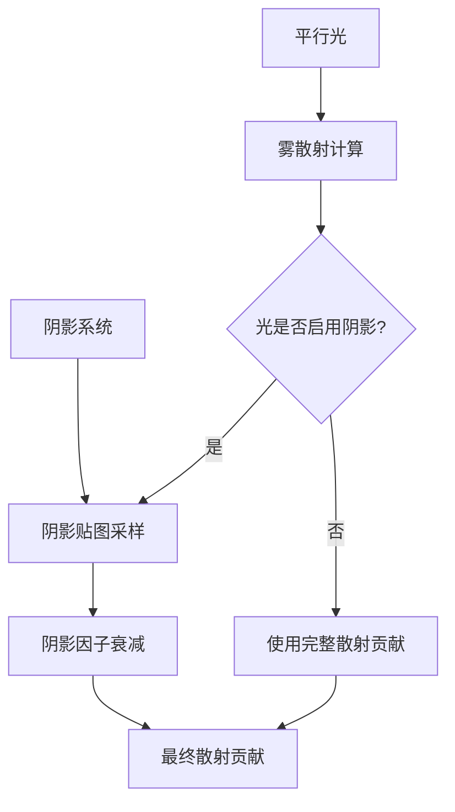

+++
title = "#22377 Shadow mapping in distance fog"
date = "2026-01-04T00:00:00"
draft = false
template = "pull_request_page.html"
in_search_index = false

[extra]
current_language = "zh-cn"
available_languages = {"en" = { name = "English", url = "/pull_request/bevy/2026-01/pr-22377-en-20260104" }, "zh-cn" = { name = "中文", url = "/pull_request/bevy/2026-01/pr-22377-zh-cn-20260104" }}
+++

# Title
## Shadow mapping in distance fog

## 基本信息
- **标题**: Shadow mapping in distance fog
- **PR链接**: https://github.com/bevyengine/bevy/pull/22377
- **作者**: mate-h
- **状态**: 已合并
- **标签**: C-Bug, A-Rendering, S-Ready-For-Final-Review, D-Straightforward, M-Deliberate-Rendering-Change
- **创建时间**: 2026-01-04T20:41:23Z
- **合并时间**: 2026-01-04T21:48:51Z
- **合并者**: alice-i-cecile

## 描述翻译
### 目标
- 修复 https://github.com/bevyengine/bevy/issues/22375

### 解决方案
- 对于每个启用了阴影的平行光，我们在片段的世界坐标位置采样阴影贴图。阴影因子（0.0 = 完全阴影，1.0 = 完全照亮）会衰减米氏散射（mie scattering）分量的入射散射贡献。

### 测试
- 运行了`atmospheric_fog`示例，分别开启和关闭shadows_enabled标志。

---
### 效果展示

之前


之后


## 这个Pull Request的故事

这个PR修复了一个渲染问题：在Bevy引擎的距离雾（distance fog）计算中，没有考虑阴影的影响。具体来说，当场景中有平行光投射阴影时，雾的散射效果（尤其是米氏散射）在阴影区域仍然表现得像被完全照亮一样，这导致了视觉上的不一致。

问题的核心在于雾的散射计算与阴影系统是分离的。在雾的渲染管线中，计算每个平行光对雾的散射贡献时，没有检查该光线是否被遮挡。这导致了即使物体处于阴影中，雾仍然会沿着光线方向产生散射效果，这在物理上是不正确的，因为阴影区域接收到的直接光照应该减少。

开发者mate-h通过修改雾的着色器函数`apply_fog`来解决这个问题。解决方案的技术路径很直接：在计算每个平行光的散射贡献后，检查该平行光是否启用了阴影。如果启用了，就采样阴影贴图，获取当前片段位置的阴影因子，然后用这个因子来衰减散射贡献。

实现上的关键点包括：

1. **必要的预处理数据**：为了采样阴影贴图，需要计算几个额外参数。首先，需要将片段的世界坐标转换为视图空间坐标，以获取`view_z`（视图空间深度），这个值用于阴影级联选择（cascade selection）。其次，需要一个近似的表面法线用于阴影采样，这里使用了视线方向的负方向作为近似。

2. **阴影采样集成**：在原有的平行光循环中，为每个平行光添加阴影采样逻辑。如果平行光启用了阴影（通过检查`DIRECTIONAL_LIGHT_FLAGS_SHADOWS_ENABLED_BIT`标志），就调用`shadows::fetch_directional_shadow`函数获取阴影因子。这个函数会返回一个0.0到1.0之间的值，表示光照的可见程度。

3. **散射贡献调制**：将计算出的原始散射贡献乘以阴影因子，这样在阴影区域，雾的散射效果就会相应减弱。

这个修改在架构上是合理的，因为它将阴影计算与雾计算解耦，同时保持了代码的模块化。雾函数不需要知道阴影如何计算的具体细节，只需要调用阴影模块提供的接口。这种设计符合Bevy的渲染架构，其中各个渲染特性（如阴影、雾、光照）都是通过可组合的模块实现的。

从性能角度来看，这个修改增加了每片段每平行光的阴影采样操作。对于启用了阴影的平行光，现在需要额外的纹理采样和阴影计算。考虑到距离雾通常用于远景，并且平行光的数量通常很少（通常1-4个），这个性能开销是可控的。开发者通过条件判断（只对启用了阴影的平行光采样）来最小化性能影响。

值得注意的是，这个解决方案使用视线方向作为表面法线的近似。这是一个合理的简化，因为对于距离雾，我们通常处理的是远处的体积效应，而不是具体的表面几何。这种近似在大多数情况下都能提供可接受的结果，同时避免了需要传递实际表面法线到雾计算中。

这个PR展示了如何在渲染系统中集成多个特性，同时保持物理准确性。修复后，雾的渲染现在正确地反映了场景中的阴影，使整体视觉效果更加真实和一致。

## 视觉表示



## 关键文件更改

### `crates/bevy_pbr/src/render/pbr_functions.wgsl` (+18/-2)

这个文件包含了PBR渲染的核心着色器函数。修改的是`apply_fog`函数，该函数负责计算和应用距离雾效果。

#### 关键修改：

1. **新增导入**：添加了`view_transformations`模块导入，用于世界坐标到视图坐标的转换。

2. **新增预处理计算**：在散射计算之前，添加了三个新的计算：
   - 计算视图空间位置和深度（`view_z`），用于阴影级联选择
   - 计算视线方向法线，作为表面法线的近似
   - 将世界坐标转换为齐次坐标，供阴影采样函数使用

3. **修改散射计算逻辑**：将原来的直接累加散射贡献改为先计算贡献值，然后采样阴影贴图，最后用阴影因子调制贡献值。

#### 代码变化：

```wgsl
// 之前：
var scattering = vec3<f32>(0.0);
if fog_params.directional_light_color.a > 0.0 {
    let view_to_world_normalized = view_to_world / distance;
    let n_directional_lights = view_bindings::lights.n_directional_lights;
    for (var i: u32 = 0u; i < n_directional_lights; i = i + 1u) {
        let light = view_bindings::lights.directional_lights[i];
        scattering += pow(
            max(
                dot(view_to_world_normalized, light.direction_to_light),
                0.0
            ),
            fog_params.directional_light_exponent
        ) * light.color.rgb * view_bindings::view.exposure;
    }
}

// 之后：
var scattering = vec3<f32>(0.0);
if fog_params.directional_light_color.a > 0.0 {
    let view_to_world_normalized = view_to_world / distance;
    let n_directional_lights = view_bindings::lights.n_directional_lights;
    for (var i: u32 = 0u; i < n_directional_lights; i = i + 1u) {
        let light = view_bindings::lights.directional_lights[i];            
        let scattering_contribution = pow(
            max(
                dot(view_to_world_normalized, light.direction_to_light),
                0.0
            ),
            fog_params.directional_light_exponent
        ) * light.color.rgb * view_bindings::view.exposure;

        // Sample shadow map to attenuate inscattering in shadowed areas
        var shadow: f32 = 1.0;
        if ((light.flags & mesh_view_types::DIRECTIONAL_LIGHT_FLAGS_SHADOWS_ENABLED_BIT) != 0u) {
            shadow = shadows::fetch_directional_shadow(i, fragment_world_position_vec4, view_direction_normal, view_z);
        }
        scattering += scattering_contribution * shadow;
    }
}
```

## 进一步阅读

1. **Bevy渲染管线文档**：了解Bevy的PBR渲染系统如何工作
   - https://bevyengine.org/learn/books/rendering-in-bevy

2. **阴影映射技术**：深入了解阴影贴图的工作原理和实现
   - 《Real-Time Shadows》 by Elmar Eisemann et al.
   - 级联阴影贴图（Cascaded Shadow Maps）技术

3. **体积渲染与雾效**：学习体积散射和雾效的物理基础
   - 《Physically Based Rendering》第11章：体积散射

4. **WGSL着色语言**：了解WebGPU Shading Language的语法和特性
   - https://www.w3.org/TR/WGSL/

5. **Bevy GitHub Issues**：相关问题讨论和后续改进
   - 原始问题报告：https://github.com/bevyengine/bevy/issues/22375