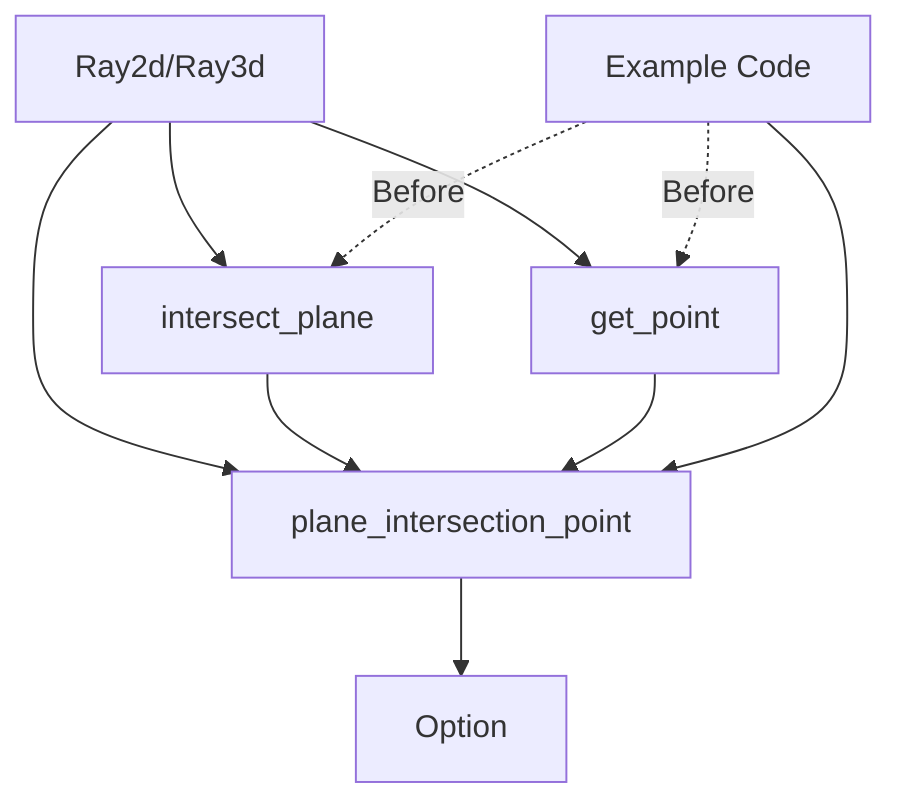

+++
title = "#22381 Add Ray.plane_intersection_point to simplify example code"
date = "2026-01-06T00:00:00"
draft = false
template = "pull_request_page.html"
in_search_index = true

[taxonomies]
list_display = ["show"]

[extra]
current_language = "en"
available_languages = {"en" = { name = "English", url = "/pull_request/bevy/2026-01/pr-22381-en-20260106" }, "zh-cn" = { name = "中文", url = "/pull_request/bevy/2026-01/pr-22381-zh-cn-20260106" }}
labels = ["C-Usability", "A-Math", "D-Straightforward"]
+++

# Title

## Basic Information
- **Title**: Add Ray.plane_intersection_point to simplify example code
- **PR Link**: https://github.com/bevyengine/bevy/pull/22381
- **Author**: nicebenny23
- **Status**: MERGED
- **Labels**: C-Usability, S-Ready-For-Final-Review, A-Math, X-Uncontroversial, D-Straightforward
- **Created**: 2026-01-05T00:51:17Z
- **Merged**: 2026-01-06T20:45:00Z
- **Merged By**: alice-i-cecile

## Description Translation

# Objective
- Simplify the usage of ray2d and ray3d in example/user code.

## Solution
-Added a plane_intersection_point method, making the usage of rays more intuitive.
-This method simplifies 2 out of 4 examples that previously had to manually calculate intersection points using intersect_plane + get_point.

## The Story of This Pull Request

This PR addresses a minor but consistent usability issue in the Bevy math API. When working with ray-plane intersections, developers commonly need the actual intersection point in world space, not just the distance along the ray. The existing API required a two-step process: first calling `intersect_plane()` to get the distance, then calling `get_point()` with that distance to obtain the actual 3D point.

The problem manifested clearly in two existing examples (`3d_viewport_to_world.rs` and `irradiance_volumes.rs`), where developers had to write this two-step calculation manually each time they needed a ray-plane intersection point. This pattern added unnecessary verbosity and cognitive overhead to common operations like determining where a ray hits the ground plane.

The solution approach was straightforward: add a convenience method that combines these two operations. The PR adds `plane_intersection_point()` methods to both `Ray2d` and `Ray3d` structs in the `bevy_math` crate. This method internally calls `intersect_plane()` and then maps the result through `get_point()`, providing a cleaner, more intuitive API.

From an implementation perspective, the changes are minimal and non-breaking. The new methods are simple wrappers that don't change any existing behavior or performance characteristics. The `intersect_plane()` method still exists for cases where only the distance is needed, and its documentation was updated to reference the new convenience method.

The technical implementation follows Rust best practices:
1. The method returns `Option<Vec3>` (or `Option<Vec2>` for 2D) to handle cases where the ray doesn't intersect the plane
2. It uses `map()` to transform the optional distance into an optional point
3. Both methods are marked with `#[inline]` for potential performance optimization
4. Documentation comments explain the relationship between methods

The impact is primarily on developer experience rather than runtime performance. Code that uses ray-plane intersections becomes more readable and less error-prone. Instead of manually chaining two method calls and handling intermediate values, developers can now use a single, semantically clear method call. This reduces boilerplate and makes the intent of the code more obvious.

The changes also demonstrate good API design principles: when a pattern appears repeatedly in user code (as evidenced by the examples), it's worth considering whether the API should provide a dedicated method for that pattern. This improves the ergonomics of the library and reduces the cognitive load on developers.

## Visual Representation



## Key Files Changed

### `crates/bevy_math/src/ray.rs` (+32/-6)

This file contains the core implementation of the ray-plane intersection convenience methods. The changes add `plane_intersection_point()` to both `Ray2d` and `Ray3d` structs.

**Key modifications:**

```rust
// File: crates/bevy_math/src/ray.rs
// Before (Ray2d):
// Only had intersect_plane() method returning distance
// Users had to manually call get_point() with the distance

// After (Ray2d):
/// Returns the intersection point with a plane, if it exists.
///
/// Calls [`Ray2d::get_point`] on the result of [`Ray2d::intersect_plane`].
#[inline]
pub fn plane_intersection_point(&self, plane_origin: Vec2, plane: Plane2d) -> Option<Vec2> {
    self.intersect_plane(plane_origin, plane)
        .map(|distance| self.get_point(distance))
}

// Before (Ray3d):
// Only had intersect_plane() method returning distance
// Users had to manually call get_point() with the distance

// After (Ray3d):
/// Returns the intersection point of the ray with a plane, if it exists.
///
/// Calls [`Ray3d::get_point`] on the result of [`Ray3d::intersect_plane`].
#[inline]
pub fn plane_intersection_point(
    &self,
    plane_origin: Vec3,
    plane: InfinitePlane3d,
) -> Option<Vec3> {
    self.intersect_plane(plane_origin, plane)
        .map(|distance| self.get_point(distance))
}
```

### `examples/3d/3d_viewport_to_world.rs` (+2/-5)

This example was updated to use the new convenience method, simplifying the ray-ground intersection logic.

**Key modifications:**

```rust
// File: examples/3d/3d_viewport_to_world.rs
// Before:
// && let Some(distance) =
//     ray.intersect_plane(ground.translation(), InfinitePlane3d::new(ground.up()))
// {
//     let point = ray.get_point(distance);

// After:
// && let Some(point) = ray.plane_intersection_point(ground.translation(), InfinitePlane3d::new(ground.up()))
// {
```

### `examples/3d/irradiance_volumes.rs` (+3/-3)

This example was similarly updated to use the new method, cleaning up the ray-plane intersection code.

**Key modifications:**

```rust
// File: examples/3d/irradiance_volumes.rs
// Before:
// let Some(ray_distance) = ray.intersect_plane(Vec3::ZERO, InfinitePlane3d::new(Vec3::Y)) else {
//     return;
// };
// let plane_intersection = ray.origin + ray.direction.normalize() * ray_distance;

// After:
// let Some(plane_intersection) =
//     ray.plane_intersection_point(Vec3::ZERO, InfinitePlane3d::new(Vec3::Y))
// else {
//     return;
// };
```

## Further Reading

1. **Bevo Documentation**: The [Bevo Math API documentation](https://docs.rs/bevy_math/latest/bevy_math/) provides comprehensive details on the ray structs and their methods.
2. **Ray-Plane Intersection**: For the mathematical foundations, see [Ray-Plane Intersection](https://en.wikipedia.org/wiki/Line%E2%80%93plane_intersection) on Wikipedia.
3. **Rust Option and Map**: The Rust [Option](https://doc.rust-lang.org/std/option/enum.Option.html) type and its [map](https://doc.rust-lang.org/std/option/enum.Option.html#method.map) method are key to understanding the implementation pattern used here.
4. **API Design Principles**: Martin Fowler's [article on fluent interfaces](https://martinfowler.com/bliki/FluentInterface.html) discusses similar patterns for creating more readable APIs.

# Full Code Diff
*(Included as provided in the original request)*