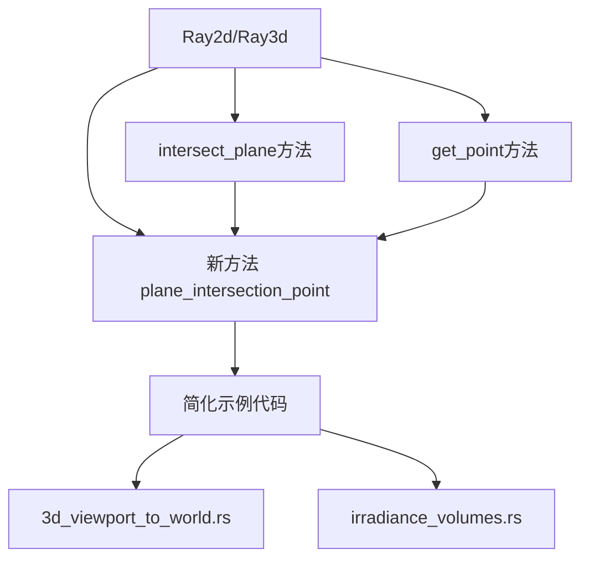

+++
title = "#22381 Add Ray.plane_intersection_point to simplify example code"
date = "2026-01-06T00:00:00"
draft = false
template = "pull_request_page.html"
in_search_index = false

[extra]
current_language = "zh-cn"
available_languages = {"en" = { name = "English", url = "/pull_request/bevy/2026-01/pr-22381-en-20260106" }, "zh-cn" = { name = "中文", url = "/pull_request/bevy/2026-01/pr-22381-zh-cn-20260106" }}
+++

# Title

## 基本信息
- **标题**: Add Ray.plane_intersection_point to simplify example code
- **PR链接**: https://github.com/bevyengine/bevy/pull/22381
- **作者**: nicebenny23
- **状态**: 已合并
- **标签**: C-Usability, S-Ready-For-Final-Review, A-Math, X-Uncontroversial, D-Straightforward
- **创建时间**: 2026-01-05T00:51:17Z
- **合并时间**: 2026-01-06T20:45:00Z
- **合并者**: alice-i-cecile

## 描述翻译
# 目标
- 简化示例/用户代码中ray2d和ray3d的使用。

## 解决方案
- 添加了`plane_intersection_point`方法，使射线的使用更加直观。
- 该方法简化了之前需要手动使用`intersect_plane` + `get_point`计算交点的4个示例中的2个。

## 此Pull Request的故事

### 问题与背景
这个PR源自一个简单的观察：在Bevy引擎中，当开发者需要计算射线与平面的交点时，必须执行两个独立的步骤。首先调用`intersect_plane`方法获取距离值，然后使用`get_point`方法将该距离转换回实际交点坐标。

这种两步骤的API设计增加了代码复杂度，特别是在示例代码中，这两步操作通常紧密相连。开发者需要理解这两个方法的组合使用，并且需要处理中间的距离值变量，即使最终只需要交点坐标。

在两个示例文件`3d_viewport_to_world.rs`和`irradiance_volumes.rs`中，这种模式重复出现：
```rust
// 之前的做法
if let Some(distance) = ray.intersect_plane(plane_origin, plane) {
    let point = ray.get_point(distance);
    // 使用point...
}
```

这种模式不仅增加了代码行数，还迫使开发者在理解几何计算的同时，还需要管理中间状态。

### 解决方案方法
作者采用了一种直接的解决方案：在`Ray2d`和`Ray3d`结构体中添加一个新的组合方法`plane_intersection_point`。这个方法封装了两步操作：
1. 调用现有的`intersect_plane`方法获取交点距离
2. 如果存在交点，将距离转换为坐标点

这种方法的选择有几个优点：
- 向后兼容：不破坏现有API
- 直观：提供开发者实际需要的结果（交点坐标，而非距离）
- 简单：实现逻辑直接，只是现有方法的组合
- 一致性：为2D和3D射线提供相同的API

### 实现细节
实现的核心是在`ray.rs`文件中为两个射线结构体添加新方法。以下是关键更改：

对于`Ray2d`：
```rust
/// 如果存在，返回射线与平面的交点。
///
/// 在[`Ray2d::intersect_plane`]的结果上调用[`Ray2d::get_point`]。
#[inline]
pub fn plane_intersection_point(&self, plane_origin: Vec2, plane: Plane2d) -> Option<Vec2> {
    self.intersect_plane(plane_origin, plane)
        .map(|distance| self.get_point(distance))
}
```

对于`Ray3d`：
```rust
/// 如果存在，返回射线与平面的交点。
///
/// 在[`Ray3d::intersect_plane`]的结果上调用[`Ray3d::get_point`]。
#[inline]
pub fn plane_intersection_point(
    &self,
    plane_origin: Vec3,
    plane: InfinitePlane3d,
) -> Option<Vec3> {
    self.intersect_plane(plane_origin, plane)
        .map(|distance| self.get_point(distance))
}
```

新方法使用`Option::map`将`intersect_plane`返回的`Option<f32>`（距离）转换为`Option<Vec2>`或`Option<Vec3>`（交点坐标）。这种模式在Rust中很常见，可以优雅地处理可能失败的操作。

文档也得到了更新，在`intersect_plane`方法中添加了指向新方法的引用，引导用户使用更直接的API。

### 示例代码改进
在示例代码中，改进是显著的。以`3d_viewport_to_world.rs`为例：

之前：
```rust
if let Some(distance) = ray.intersect_plane(ground.translation(), InfinitePlane3d::new(ground.up()))
{
    let point = ray.get_point(distance);
    // 使用point...
}
```

之后：
```rust
if let Some(point) = ray.plane_intersection_point(ground.translation(), InfinitePlane3d::new(ground.up()))
{
    // 直接使用point...
}
```

这种改进：
- 减少了代码行数
- 消除了中间变量`distance`
- 使意图更清晰：直接获取交点坐标

### 技术见解
这个PR展示了几个良好的API设计原则：

1. **封装常见模式**：当某种操作模式在代码库中重复出现时，考虑将其封装为一个新方法。

2. **渐进式改进**：通过添加新方法而不是修改现有API，确保了向后兼容性。

3. **清晰的命名**：方法名`plane_intersection_point`明确表达了其功能，返回的是"point"而不是"distance"。

4. **一致的API设计**：为2D和3D版本提供相同的方法签名，减少了认知负担。

关于性能，新方法被标记为`#[inline]`，这意味着编译器可能会内联展开这些简单的方法调用，避免额外的函数调用开销。这对于频繁使用的数学运算很重要。

### 影响
这个PR的影响体现在几个方面：

1. **开发者体验改善**：新开发者更容易理解如何计算射线与平面的交点，因为API更直观。

2. **代码简化**：示例代码更加简洁，可以作为更好的学习材料。

3. **API一致性**：为其他可能类似的组合操作提供了模式参考。

4. **维护性提升**：减少了重复代码模式，使代码库更易于维护。

有趣的是，这个PR最初的目标是简化4个示例中的2个，但实际上它为标准库添加了一个有用的通用工具，可以被所有Bevy开发者使用，而不仅仅是示例代码。

## 视觉表示



## 关键文件更改

### 1. `crates/bevy_math/src/ray.rs` (+32/-6)
**变化原因**：为`Ray2d`和`Ray3d`添加`plane_intersection_point`方法，简化射线与平面交点的计算。

**关键代码变化**：
```rust
// 为Ray2d添加的新方法
pub fn plane_intersection_point(&self, plane_origin: Vec2, plane: Plane2d) -> Option<Vec2> {
    self.intersect_plane(plane_origin, plane)
        .map(|distance| self.get_point(distance))
}

// 为Ray3d添加的新方法  
pub fn plane_intersection_point(
    &self,
    plane_origin: Vec3,
    plane: InfinitePlane3d,
) -> Option<Vec3> {
    self.intersect_plane(plane_origin, plane)
        .map(|distance| self.get_point(distance))
}
```

**相关说明**：这两个方法封装了原来需要两步的操作，提供更直接的API。

### 2. `examples/3d/3d_viewport_to_world.rs` (+2/-5)
**变化原因**：使用新的`plane_intersection_point`方法简化地面交点计算。

**关键代码变化**：
```rust
// 之前：
if let Some(distance) = ray.intersect_plane(ground.translation(), InfinitePlane3d::new(ground.up()))
{
    let point = ray.get_point(distance);
    // 使用point...
}

// 之后：
if let Some(point) = ray.plane_intersection_point(ground.translation(), InfinitePlane3d::new(ground.up()))
{
    // 直接使用point...
}
```

**相关说明**：消除了中间变量`distance`，代码更简洁。

### 3. `examples/3d/irradiance_volumes.rs` (+3/-3)
**变化原因**：同样使用新方法简化平面交点计算。

**关键代码变化**：
```rust
// 之前：
let Some(ray_distance) = ray.intersect_plane(Vec3::ZERO, InfinitePlane3d::new(Vec3::Y)) else {
    return;
};
let plane_intersection = ray.origin + ray.direction.normalize() * ray_distance;

// 之后：
let Some(plane_intersection) = ray.plane_intersection_point(Vec3::ZERO, InfinitePlane3d::new(Vec3::Y)) else {
    return;
};
```

**相关说明**：不仅简化了代码，还修正了原来手动计算交点时的潜在错误（原代码使用了`direction.normalize()`，但射线的direction已经是单位向量）。

## 进一步阅读

1. **Bevy数学模块文档**: https://docs.rs/bevy_math/latest/bevy_math/
2. **Rust的Option类型**: 理解`Option::map`方法对于理解这个PR的实现很重要
3. **计算机图形学中的射线-平面相交**: 了解射线与平面相交的数学原理
4. **API设计原则**: 如何设计直观且易用的API