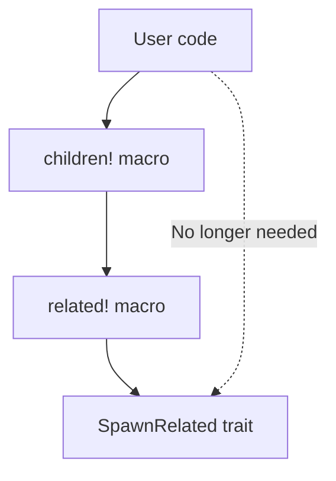

+++
title = "#22384 Improve macro hygiene of `children!` by re-defining it in terms of `related!`"
date = "2026-01-05T00:00:00"
draft = false
template = "pull_request_page.html"
in_search_index = true

[taxonomies]
list_display = ["show"]

[extra]
current_language = "en"
available_languages = {"en" = { name = "English", url = "/pull_request/bevy/2026-01/pr-22384-en-20260105" }, "zh-cn" = { name = "中文", url = "/pull_request/bevy/2026-01/pr-22384-zh-cn-20260105" }}
labels = ["C-Bug", "D-Trivial", "A-ECS", "C-Usability", "D-Domain-Agnostic", "D-Macros"]
+++

# Title

## Basic Information
- **Title**: Improve macro hygiene of `children!` by re-defining it in terms of `related!`
- **PR Link**: https://github.com/bevyengine/bevy/pull/22384
- **Author**: ItsDoot
- **Status**: MERGED
- **Labels**: C-Bug, D-Trivial, A-ECS, C-Usability, S-Ready-For-Final-Review, D-Domain-Agnostic, D-Macros
- **Created**: 2026-01-05T08:54:04Z
- **Merged**: 2026-01-05T23:32:23Z
- **Merged By**: alice-i-cecile

## Description Translation
### Objective
Same deal as #22331 but for the `children!` macro.

### Solution
Make `children!` delegate to `related!` in order to:
- Remove the need to import `SpawnRelated` when using it.
- Reduce code duplication.
- Make `children!` look less special-cased (it's just `related!` with a bevy-provided relation type).

### Testing
Removed imports of `SpawnRelated` where it's no longer needed, to prove it works.

## The Story of This Pull Request

This PR addresses a subtle macro hygiene issue in Bevy's ECS system. The `children!` macro, which is used to spawn child entities in a hierarchy, had a dependency that wasn't immediately obvious to developers: it required the `SpawnRelated` trait to be in scope. This created friction for developers because the macro's implementation details were leaking into user code.

The problem stems from how the `children!` macro was originally implemented. It used internal helper macros like `recursive_spawn!` and called `Children::spawn()`, which internally required the `SpawnRelated` trait. This meant developers had to remember to import `SpawnRelated` even though they were just using the `children!` macro.

The solution follows the same pattern as PR #22331, which fixed a similar issue with other macros. By redefining `children!` in terms of the `related!` macro, the implementation becomes cleaner and more maintainable. The `related!` macro already handles the spawning of related entities and doesn't require the user to import `SpawnRelated` because it brings the necessary traits into scope internally.

Here's what changed in the implementation. The original `children!` macro looked like this:

```rust
macro_rules! children {
    [$($child:expr),*$(,)?] => {
       $crate::hierarchy::Children::spawn($crate::recursive_spawn!($($child),*))
    };
}
```

The new implementation is much simpler:

```rust
macro_rules! children {
    [$($child:expr),*$(,)?] => {
        $crate::related!($crate::hierarchy::Children [$($child),*])
    };
}
```

The key insight here is that `children!` is essentially just a specialized version of `related!` that uses the `Children` relation type. By delegating to `related!`, we get several benefits:

1. **Better macro hygiene**: Users no longer need to import `SpawnRelated` because `related!` handles this internally.
2. **Reduced code duplication**: The `children!` macro no longer needs its own implementation of entity spawning logic.
3. **Consistent API**: The `children!` macro now follows the same pattern as other relation-based macros in the codebase.

The testing approach was straightforward: the author removed all unnecessary imports of `SpawnRelated` from files that use the `children!` macro. This proves the fix works because the code still compiles without those imports. This is a common pattern in Rust macro hygiene fixes—removing previously required imports demonstrates that the macro is now self-contained.

The changes are minimal but impactful. Only six lines were removed across five files in the `bevy_feathers` crate, all of them `use bevy_ecs::spawn::SpawnRelated;` statements. These imports were only needed for the `children!` macro, and with the fix, they become unnecessary.

This fix also makes the codebase more maintainable. If there are future changes to how relations are spawned, they only need to be made in the `related!` macro, and all macros that delegate to it (including `children!`) will automatically inherit those improvements.

The PR was labeled as "D-Trivial" which is accurate—the changes are simple and focused. However, the impact on developer experience is significant. Developers no longer need to understand the internal implementation details of the `children!` macro to use it correctly. The macro "just works" without requiring extra imports, which is how well-designed macros should behave.

## Visual Representation



## Key Files Changed

### `crates/bevy_ecs/src/hierarchy.rs` (+1/-2)

**What changed**: The implementation of the `children!` macro was simplified to delegate to the `related!` macro instead of using `recursive_spawn!` and `Children::spawn()`.

**Code snippets**:

Before:
```rust
macro_rules! children {
    [$($child:expr),*$(,)?] => {
       $crate::hierarchy::Children::spawn($crate::recursive_spawn!($($child),*))
    };
}
```

After:
```rust
macro_rules! children {
    [$($child:expr),*$(,)?] => {
        $crate::related!($crate::hierarchy::Children [$($child),*])
    };
}
```

**Why it matters**: This change eliminates the need for users to import `SpawnRelated` when using the `children!` macro, improving macro hygiene and developer experience.

### `crates/bevy_feathers/src/controls/color_plane.rs` (+0/-1)

**What changed**: Removed the import of `SpawnRelated` since it's no longer needed when using the `children!` macro.

**Code snippets**:

Removed line:
```rust
use bevy_ecs::spawn::SpawnRelated;
```

### `crates/bevy_feathers/src/controls/color_slider.rs` (+0/-1)

**What changed**: Removed the import of `SpawnRelated` since it's no longer needed when using the `children!` macro.

**Code snippets**:

Removed line:
```rust
use bevy_ecs::spawn::SpawnRelated;
```

### `crates/bevy_feathers/src/controls/color_swatch.rs` (+0/-1)

**What changed**: Removed the import of `SpawnRelated` since it's no longer needed when using the `children!` macro.

**Code snippets**:

Removed line:
```rust
use bevy_ecs::spawn::SpawnRelated;
```

### `crates/bevy_feathers/src/controls/slider.rs` (+0/-1)

**What changed**: Removed the import of `SpawnRelated` since it's no longer needed when using the `children!` macro.

**Code snippets**:

Removed line:
```rust
use bevy_ecs::spawn::SpawnRelated;
```

### `crates/bevy_feathers/src/controls/toggle_switch.rs` (+0/-1)

**What changed**: Removed the import of `SpawnRelated` since it's no longer needed when using the `children!` macro.

**Code snippets**:

Removed line:
```rust
use bevy_ecs::spawn::SpawnRelated;
```

## Further Reading

1. [Rust Book: Macros](https://doc.rust-lang.org/book/ch19-06-macros.html) - Understanding Rust macros and hygiene
2. [The Little Book of Rust Macros](https://veykril.github.io/tlborm/) - In-depth guide to Rust macros
3. [Bevy ECS: Relations](https://bevyengine.org/learn/quick-start/ecs/relations/) - Bevy's relation system documentation
4. [PR #22331](https://github.com/bevyengine/bevy/pull/22331) - The previous PR that fixed similar macro hygiene issues
5. [Rust Reference: Macro Hygiene](https://doc.rust-lang.org/reference/macros.html#hygiene) - Technical details about macro hygiene in Rust

## Full Code Diff

```diff
diff --git a/crates/bevy_ecs/src/hierarchy.rs b/crates/bevy_ecs/src/hierarchy.rs
index bde9526d72136..7abf918201e4b 100644
--- a/crates/bevy_ecs/src/hierarchy.rs
+++ b/crates/bevy_ecs/src/hierarchy.rs
@@ -537,7 +537,6 @@ pub fn validate_parent_has_component<C: Component>(
 /// # use bevy_ecs::name::Name;
 /// # use bevy_ecs::world::World;
 /// # use bevy_ecs::children;
-/// # use bevy_ecs::spawn::{Spawn, SpawnRelated};
 /// let mut world = World::new();
 /// world.spawn((
 ///     Name::new("Root"),
@@ -557,7 +556,7 @@ pub fn validate_parent_has_component<C: Component>(
 #[macro_export]
 macro_rules! children {
     [$($child:expr),*$(,)?] => {
-       $crate::hierarchy::Children::spawn($crate::recursive_spawn!($($child),*))
+        $crate::related!($crate::hierarchy::Children [$($child),*])
     };
 }
 
diff --git a/crates/bevy_feathers/src/controls/color_plane.rs b/crates/bevy_feathers/src/controls/color_plane.rs
index c39c5432c8d65..c0398fe8b47cb 100644
--- a/crates/bevy_feathers/src/controls/color_plane.rs
+++ b/crates/bevy_feathers/src/controls/color_plane.rs
@@ -9,7 +9,6 @@ use bevy_ecs::{
     observer::On,
     query::{Changed, Has, Or, With},
     reflect::ReflectComponent,
-    spawn::SpawnRelated,
     system::{Commands, Query, Res, ResMut},
 };
 use bevy_math::{Vec2, Vec3};
diff --git a/crates/bevy_feathers/src/controls/color_slider.rs b/crates/bevy_feathers/src/controls/color_slider.rs
index 348bd0d50c18c..8626223821355 100644
--- a/crates/bevy_feathers/src/controls/color_slider.rs
+++ b/crates/bevy_feathers/src/controls/color_slider.rs
@@ -11,7 +11,6 @@ use bevy_ecs::{
     hierarchy::Children,
     query::{Changed, Or, With},
     schedule::IntoScheduleConfigs,
-    spawn::SpawnRelated,
     system::Query,
 };
 use bevy_input_focus::tab_navigation::TabIndex;
diff --git a/crates/bevy_feathers/src/controls/color_swatch.rs b/crates/bevy_feathers/src/controls/color_swatch.rs
index 0214aa90be4a9..fcc8b1386fb33 100644
--- a/crates/bevy_feathers/src/controls/color_swatch.rs
+++ b/crates/bevy_feathers/src/controls/color_swatch.rs
@@ -8,7 +8,6 @@ use bevy_ecs::{
     hierarchy::Children,
     query::Changed,
     reflect::ReflectComponent,
-    spawn::SpawnRelated,
     system::{Commands, Query},
 };
 use bevy_reflect::{prelude::ReflectDefault, Reflect};
diff --git a/crates/bevy_feathers/src/controls/slider.rs b/crates/bevy_feathers/src/controls/slider.rs
index 00724843f1bcc..7008e632f1f33 100644
--- a/crates/bevy_feathers/src/controls/slider.rs
+++ b/crates/bevy_feathers/src/controls/slider.rs
@@ -12,7 +12,6 @@ use bevy_ecs::{
     query::{Added, Changed, Has, Or, Spawned, With},
     reflect::ReflectComponent,
     schedule::IntoScheduleConfigs,
-    spawn::SpawnRelated,
     system::{Commands, Query, Res},
 };
 use bevy_input_focus::tab_navigation::TabIndex;
diff --git a/crates/bevy_feathers/src/controls/toggle_switch.rs b/crates/bevy_feathers/src/controls/toggle_switch.rs
index 2d338fb668227..c55ec725bcc14 100644
--- a/crates/bevy_feathers/src/controls/toggle_switch.rs
+++ b/crates/bevy_feathers/src/controls/toggle_switch.rs
@@ -11,7 +11,6 @@ use bevy_ecs::{
     query::{Added, Changed, Has, Or, With},
     reflect::ReflectComponent,
     schedule::IntoScheduleConfigs,
-    spawn::SpawnRelated,
     system::{Commands, Query},
     world::Mut,
 };
```