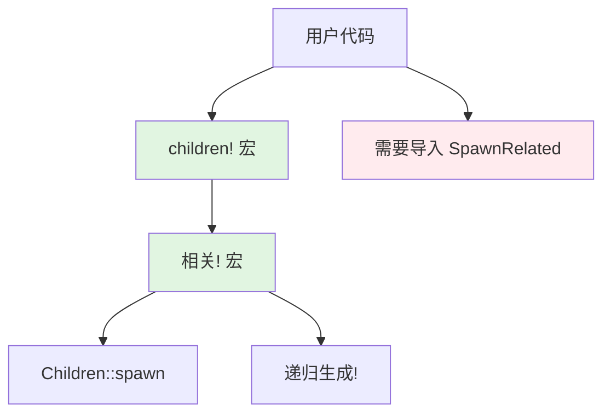

+++
title = "#22384 Improve macro hygiene of `children!` by re-defining it in terms of `related!"
date = "2026-01-05T00:00:00"
draft = false
template = "pull_request_page.html"
in_search_index = false

[extra]
current_language = "zh-cn"
available_languages = {"en" = { name = "English", url = "/pull_request/bevy/2026-01/pr-22384-en-20260105" }, "zh-cn" = { name = "中文", url = "/pull_request/bevy/2026-01/pr-22384-zh-cn-20260105" }}
+++

# Improve macro hygiene of `children!` by re-defining it in terms of `related!`

## 基本信息
- **标题**: Improve macro hygiene of `children!` by re-defining it in terms of `related!`
- **PR链接**: https://github.com/bevyengine/bevy/pull/22384
- **作者**: ItsDoot
- **状态**: 已合并
- **标签**: C-Bug, D-Trivial, A-ECS, C-Usability, S-Ready-For-Final-Review, D-Domain-Agnostic, D-Macros
- **创建时间**: 2026-01-05T08:54:04Z
- **合并时间**: 2026-01-05T23:32:23Z
- **合并人**: alice-i-cecile

## 描述翻译

### 目标

与 #22331 相同的问题，但针对 `children!` 宏。

### 解决方案

使 `children!` 委托给 `related!`，以便：
- 移除使用它时需要导入 `SpawnRelated` 的依赖。
- 减少代码重复。
- 使 `children!` 看起来不那么特殊化（它只是 `related!` 的一个 bevy 提供的关系类型）。

### 测试

移除了不再需要的 `SpawnRelated` 导入，以证明其有效。

## PR 的故事

这个 PR 解决了 Bevy 代码库中一个关于宏卫生（macro hygiene）的具体问题。在 Bevy 的 ECS 系统中，`children!` 宏是一个用于构建父子关系的便利工具，但它的实现方式导致了一个不必要的依赖：用户在使用 `children!` 时必须显式导入 `SpawnRelated` trait。

从技术角度来看，这属于宏卫生问题。宏卫生指的是宏在展开时能否正确解析其引用的标识符，而不依赖于宏调用处的上下文。理想的宏应该自包含，不强制用户导入不必要的依赖。

在 #22331 中，类似的问题已经在其他宏上得到解决，现在这个 PR 将相同的修复应用到 `children!` 宏。解决方案很直接：将 `children!` 的实现从直接调用 `Children::spawn` 改为委托给现有的 `related!` 宏。`related!` 宏是 Bevy 中用于处理组件间关系的一个更通用的宏，它本身已经具有良好的宏卫生特性。

查看修改前后的代码差异：

**修改前：**
```rust
macro_rules! children {
    [$($child:expr),*$(,)?] => {
       $crate::hierarchy::Children::spawn($crate::recursive_spawn!($($child),*))
    };
}
```

**修改后：**
```rust
macro_rules! children {
    [$($child:expr),*$(,)?] => {
        $crate::related!($crate::hierarchy::Children [$($child),*])
    };
}
```

这个改变有多个好处。首先，它移除了对 `SpawnRelated` 的隐式依赖，因为 `related!` 宏内部已经处理了这个依赖关系。其次，它减少了代码重复，因为 `related!` 宏已经包含了 `children!` 所需的所有逻辑。最后，它使 `children!` 看起来不那么特殊化，用户现在可以理解它只是 `related!` 宏的一个特定实例，用于 `Children` 关系类型。

为了验证这个修改有效，PR 作者移除了多个文件中不再需要的 `SpawnRelated` 导入。这些修改都在 `bevy_feathers` crate 中，这是一个 UI 相关的模块，使用了 `children!` 宏来构建 UI 组件的层次结构。例如：

在 `color_plane.rs` 中：
```rust
// 修改前
use bevy_ecs::{
    // ... 其他导入
    spawn::SpawnRelated,
    // ... 其他导入
};

// 修改后
use bevy_ecs::{
    // ... 其他导入
    // SpawnRelated 导入被移除
    // ... 其他导入
};
```

类似的修改也在 `color_slider.rs`、`color_swatch.rs`、`slider.rs` 和 `toggle_switch.rs` 中进行了。这些移除证明了 `children!` 宏现在确实不再需要 `SpawnRelated` 导入。

从技术实现的角度看，这个修改是安全的，因为 `related!` 宏已经存在并被广泛使用。通过将 `children!` 定义为 `related!` 的别名，我们确保了行为的一致性。实际上，`related!` 宏的内部实现可能已经包含了与原来 `children!` 类似的逻辑，所以这更像是一个重构而不是功能变更。

值得注意的是，这个 PR 被标记为 "D-Trivial"（微不足道的更改），因为它只修改了宏的实现和移除了一些导入语句，没有改变任何公共 API 或运行时行为。同时，它也标记为 "C-Usability"（可用性改进），因为它减少了用户需要记住的导入项。

总之，这个 PR 延续了 #22331 开始的工作，改善了 Bevy 宏的卫生状况，使得 API 更加整洁，减少了用户需要处理的样板代码。

## 可视化表示



## 关键文件变更

### 1. `crates/bevy_ecs/src/hierarchy.rs` (+1/-2)
这是本次修改的核心文件。`children!` 宏的实现被修改为委托给 `related!` 宏。

**修改前:**
```rust
#[macro_export]
macro_rules! children {
    [$($child:expr),*$(,)?] => {
       $crate::hierarchy::Children::spawn($crate::recursive_spawn!($($child),*))
    };
}
```

**修改后:**
```rust
#[macro_export]
macro_rules! children {
    [$($child:expr),*$(,)?] => {
        $crate::related!($crate::hierarchy::Children [$($child),*])
    };
}
```

这个修改使得 `children!` 宏的展开不再依赖于 `SpawnRelated` trait，因为 `related!` 宏内部已经处理了这些依赖。

### 2. `crates/bevy_feathers/src/controls/color_plane.rs` (+0/-1)
移除了不再需要的 `SpawnRelated` 导入。

**修改前:**
```rust
use bevy_ecs::{
    // 其他导入...
    spawn::SpawnRelated,
    system::{Commands, Query, Res, ResMut},
};
```

**修改后:**
```rust
use bevy_ecs::{
    // 其他导入...
    // SpawnRelated 导入被移除
    system::{Commands, Query, Res, ResMut},
};
```

### 3. `crates/bevy_feathers/src/controls/color_slider.rs` (+0/-1)
同样移除了 `SpawnRelated` 导入。

### 4. `crates/bevy_feathers/src/controls/color_swatch.rs` (+0/-1)
同样移除了 `SpawnRelated` 导入。

### 5. `crates/bevy_feathers/src/controls/slider.rs` (+0/-1)
同样移除了 `SpawnRelated` 导入。

### 6. `crates/bevy_feathers/src/controls/toggle_switch.rs` (+0/-1)
同样移除了 `SpawnRelated` 导入。

这些文件中的修改都是相同的模式：移除了 `spawn::SpawnRelated` 的导入，因为这些文件中的代码使用了 `children!` 宏，而修改后的 `children!` 宏不再需要这个导入。

## 进一步阅读

1. **Rust 宏卫生**:
   - [Rust 参考手册：宏卫生](https://doc.rust-lang.org/reference/macros.html#hygiene)
   - [The Little Book of Rust Macros - Hygiene](https://veykril.github.io/tlborm/decl-macros/minutiae/hygiene.html)

2. **Bevy ECS 和关系**:
   - [Bevy 官方文档：ECS](https://docs.rs/bevy_ecs/latest/bevy_ecs/)
   - [相关 PR #22331](https://github.com/bevyengine/bevy/pull/22331) - 类似的宏卫生修复

3. **宏设计模式**:
   - [Rust 宏小册](https://danielkeep.github.io/tlborm/book/index.html)
   - [通过示例学习 Rust 宏](https://doc.rust-lang.org/rust-by-example/macros.html)

# 完整代码差异

```diff
diff --git a/crates/bevy_ecs/src/hierarchy.rs b/crates/bevy_ecs/src/hierarchy.rs
index bde9526d72136..7abf918201e4b 100644
--- a/crates/bevy_ecs/src/hierarchy.rs
+++ b/crates/bevy_ecs/src/hierarchy.rs
@@ -537,7 +537,6 @@ pub fn validate_parent_has_component<C: Component>(
 /// # use bevy_ecs::name::Name;
 /// # use bevy_ecs::world::World;
 /// # use bevy_ecs::children;
-/// # use bevy_ecs::spawn::{Spawn, SpawnRelated};
 /// let mut world = World::new();
 /// world.spawn((
 ///     Name::new("Root"),
@@ -557,7 +556,7 @@ pub fn validate_parent_has_component<C: Component>(
 #[macro_export]
 macro_rules! children {
     [$($child:expr),*$(,)?] => {
-       $crate::hierarchy::Children::spawn($crate::recursive_spawn!($($child),*))
+        $crate::related!($crate::hierarchy::Children [$($child),*])
     };
 }
 
diff --git a/crates/bevy_feathers/src/controls/color_plane.rs b/crates/bevy_feathers/src/controls/color_plane.rs
index c39c5432c8d65..c0398fe8b47cb 100644
--- a/crates/bevy_feathers/src/controls/color_plane.rs
+++ b/crates/bevy_feathers/src/controls/color_plane.rs
@@ -9,7 +9,6 @@ use bevy_ecs::{
     observer::On,
     query::{Changed, Has, Or, With},
     reflect::ReflectComponent,
-    spawn::SpawnRelated,
     system::{Commands, Query, Res, ResMut},
 };
 use bevy_math::{Vec2, Vec3};
diff --git a/crates/bevy_feathers/src/controls/color_slider.rs b/crates/bevy_feathers/src/controls/color_slider.rs
index 348bd0d50c18c..8626223821355 100644
--- a/crates/bevy_feathers/src/controls/color_slider.rs
+++ b/crates/bevy_feathers/src/controls/color_slider.rs
@@ -11,7 +11,6 @@ use bevy_ecs::{
     hierarchy::Children,
     query::{Changed, Or, With},
     schedule::IntoScheduleConfigs,
-    spawn::SpawnRelated,
     system::Query,
 };
 use bevy_input_focus::tab_navigation::TabIndex;
diff --git a/crates/bevy_feathers/src/controls/color_swatch.rs b/crates/bevy_feathers/src/controls/color_swatch.rs
index 0214aa90be4a9..fcc8b1386fb33 100644
--- a/crates/bevy_feathers/src/controls/color_swatch.rs
+++ b/crates/bevy_feathers/src/controls/color_swatch.rs
@@ -8,7 +8,6 @@ use bevy_ecs::{
     hierarchy::Children,
     query::Changed,
     reflect::ReflectComponent,
-    spawn::SpawnRelated,
     system::{Commands, Query},
 };
 use bevy_reflect::{prelude::ReflectDefault, Reflect};
diff --git a/crates/bevy_feathers/src/controls/slider.rs b/crates/bevy_feathers/src/controls/slider.rs
index 00724843f1fcc..7008e632f1f33 100644
--- a/crates/bevy_feathers/src/controls/slider.rs
+++ b/crates/bevy_feathers/src/controls/slider.rs
@@ -12,7 +12,6 @@ use bevy_ecs::{
     query::{Added, Changed, Has, Or, Spawned, With},
     reflect::ReflectComponent,
     schedule::IntoScheduleConfigs,
-    spawn::SpawnRelated,
     system::{Commands, Query, Res},
 };
 use bevy_input_focus::tab_navigation::TabIndex;
diff --git a/crates/bevy_feathers/src/controls/toggle_switch.rs b/crates/bevy_feathers/src/controls/toggle_switch.rs
index 2d338fb668227..c55ec725bcc14 100644
--- a/crates/bevy_feathers/src/controls/toggle_switch.rs
+++ b/crates/bevy_feathers/src/controls/toggle_switch.rs
@@ -11,7 +11,6 @@ use bevy_ecs::{
     query::{Added, Changed, Has, Or, With},
     reflect::ReflectComponent,
     schedule::IntoScheduleConfigs,
-    spawn::SpawnRelated,
     system::{Commands, Query},
     world::Mut,
 };
```