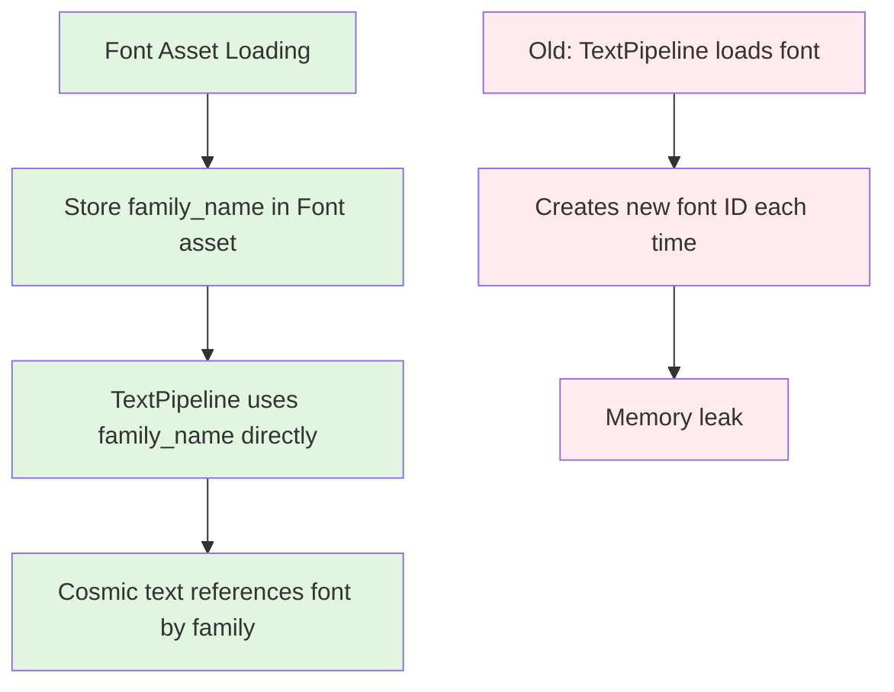

+++
title = "#22386 Fix font ID leak in `TextPipeline`"
date = "2026-01-07T00:00:00"
draft = false
template = "pull_request_page.html"
in_search_index = true

[taxonomies]
list_display = ["show"]

[extra]
current_language = "en"
available_languages = {"en" = { name = "English", url = "/pull_request/bevy/2026-01/pr-22386-en-20260107" }, "zh-cn" = { name = "中文", url = "/pull_request/bevy/2026-01/pr-22386-zh-cn-20260107" }}
labels = ["C-Bug", "P-Regression", "P-Critical", "M-Migration-Guide", "A-Text", "D-Straightforward"]
+++

# Title

## Basic Information
- **Title**: Fix font ID leak in `TextPipeline`
- **PR Link**: https://github.com/bevyengine/bevy/pull/22386
- **Author**: ickshonpe
- **Status**: MERGED
- **Labels**: C-Bug, S-Ready-For-Final-Review, P-Regression, P-Critical, M-Migration-Guide, A-Text, D-Straightforward
- **Created**: 2026-01-05T12:52:31Z
- **Merged**: 2026-01-07T23:09:55Z
- **Merged By**: alice-i-cecile

## Description Translation

# Objective

#22156 introduced a leak 😓 . Every time a text section with a font handle font source is updated in `TextPipeLine::update_buffer`, a new font with a new font ID is added to cosmic text's FontDb.

Fixes #22419

## Solution

Remove font loading and asset-ID association from TextPipeline. Instead, add the font family name to the `Font` asset after loading. Then `update_buffer` can just use the family name from the asset.

## Testing

Add this system to the `text` example (or any bevy app with updating text):
```rust
            .add_systems(Update, |font_system: Res<CosmicFontSystem>| {
                println!("fonts: {}", font_system.db().len());
            })
```
You should observe the count increasing with every text update on main. The count should be stable with this PR.

## The Story of This Pull Request

The issue started with PR #22156 which introduced a regression where font IDs were leaking in the text rendering system. Every time text with a font handle was updated, the system would load the font again into cosmic text's FontDb, creating new font IDs that were never cleaned up. This led to unbounded memory growth in applications that updated text frequently.

The core problem was in how `TextPipeline` handled font loading. When `update_buffer` was called for text using a font handle, it would load the font into cosmic text's database each time. The system maintained a mapping from `AssetId<Font>` to cosmic text font IDs in `TextPipeline::map_handle_to_font_id`, but this approach had a critical flaw: it didn't prevent duplicate loading of the same font asset.

The solution involved a significant architectural change. Instead of having `TextPipeline` responsible for loading fonts and maintaining the ID mapping, the loading was moved to the asset system. The `Font` asset was enhanced to store its family name after loading, and `TextPipeline` was simplified to just use that family name directly.

Here's how the implementation works: when a `Font` asset is loaded by the asset system, the `load_font_assets_into_fontdb_system` system loads it into cosmic text's font database and extracts the font family name from the loaded font data. This family name is stored in the `Font` asset's new `family_name` field.

```rust
// In load_font_assets_into_fontdb_system
font.family_name = font_system
    .db()
    .face(*font.ids.last().unwrap())
    .unwrap()
    .families[0]
    .0
    .as_str()
    .into();
```

When `TextPipeline::update_buffer` needs to render text, it now simply retrieves the family name from the `Font` asset instead of loading the font again:

```rust
let family_name: SmolStr = match &text_font.font {
    FontSource::Handle(handle) => {
        fonts
            .get(handle.id())
            .ok_or(TextError::NoSuchFont)?
            .family_name
            .clone()
    }
    FontSource::Family(family) => family.clone(),
};
```

This change eliminated the need for the `map_handle_to_font_id` hash map entirely, which was removed along with the `get_font_id` method. The approach is cleaner because it leverages the existing asset system for loading and caching, rather than duplicating that logic in `TextPipeline`.

The fix required updates to the test infrastructure as well. Tests needed to manually set the `family_name` on font assets since they don't run the full asset loading pipeline. This demonstrates an important consideration when refactoring asset loading logic: tests that bypass the normal asset pipeline need explicit setup.

The migration guide was added to document the removal of `map_handle_to_font_id` and `get_font_id` from `TextPipeline`. Developers who were using these methods to retrieve font IDs now need to access the information directly from the `Font` asset, which actually provides a cleaner API.

This fix is a good example of addressing a memory leak by reevaluating responsibility boundaries. Instead of trying to patch the leak in the existing approach, the solution restructured where and how font loading happens, resulting in both simpler code and better performance.

## Visual Representation



## Key Files Changed

1. **`crates/bevy_text/src/font.rs`** (+14/-0)
   - Added `family_name: SmolStr` field to the `Font` struct to store the font family name after loading
   - Updated `load_font_assets_into_fontdb_system` to extract and store the family name when loading fonts

2. **`crates/bevy_text/src/pipeline.rs`** (+7/-30)
   - Removed `map_handle_to_font_id: HashMap<AssetId<Font>, (ID, Arc<str>)>` field from `TextPipeline`
   - Removed `get_font_id` method from `TextPipeline`
   - Simplified `update_buffer` to use `family_name` from `Font` asset instead of loading fonts
   - Cleaned up imports that were no longer needed

3. **`crates/bevy_sprite/src/text2d.rs`** (+13/-0)
   - Updated test setup to manually set `family_name` and load font data since tests don't run the asset loading system
   
   ```rust
   let font = fonts.get_mut(bevy_asset::AssetId::default()).unwrap();
   font.family_name = "Fira Mono".into();
   let data = font.data.as_ref().clone();
   
   app.world_mut()
       .resource_mut::<CosmicFontSystem>()
       .db_mut()
       .load_font_data(data);
   ```

4. **`release-content/migration-guides/map_handle_to_font_id-and-get_font_id-removed-from-TextPipeline.md`** (+8/-0)
   - Created migration guide documenting the removal of `map_handle_to_font_id` and `get_font_id` from `TextPipeline`
   - Noted that font ID and family name can now be retrieved from the `Font` asset itself

## Further Reading

- [cosmic-text](https://github.com/pop-os/cosmic-text) - The text layout library used by Bevy
- [Bevy Asset System](https://bevyengine.org/learn/book/getting-started/assets/) - How Bevy handles asset loading and management
- [Memory Leak Patterns in Rust](https://rust-lang.github.io/rust-clippy/master/index.html#/mem_leak) - Common patterns that can cause memory leaks in Rust