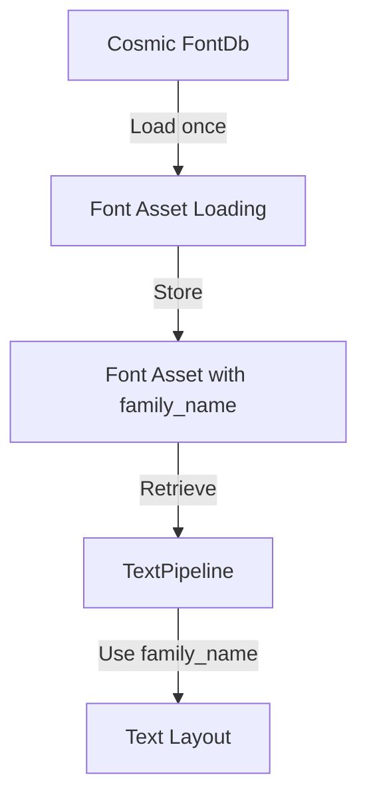

+++
title = "#22386 Fix font ID leak in `TextPipeline"
date = "2026-01-07T00:00:00"
draft = false
template = "pull_request_page.html"
in_search_index = false

[extra]
current_language = "zh-cn"
available_languages = {"en" = { name = "English", url = "/pull_request/bevy/2026-01/pr-22386-en-20260107" }, "zh-cn" = { name = "中文", url = "/pull_request/bevy/2026-01/pr-22386-zh-cn-20260107" }}
+++

# Fix font ID leak in `TextPipeline`

## 基本信息
- **标题**: Fix font ID leak in `TextPipeline`
- **PR链接**: https://github.com/bevyengine/bevy/pull/22386
- **作者**: ickshonpe
- **状态**: MERGED
- **标签**: C-Bug, S-Ready-For-Final-Review, P-Regression, P-Critical, M-Migration-Guide, A-Text, D-Straightforward
- **创建时间**: 2026-01-05T12:52:31Z
- **合并时间**: 2026-01-07T23:09:55Z
- **合并者**: alice-i-cecile

## 描述翻译
### 目标
#22156 引入了一个内存泄漏 😓。每次在 `TextPipeline::update_buffer` 中更新带有字体句柄字体源的文本段时，都会在cosmic text的FontDb中添加一个具有新字体ID的新字体。

修复 #22419

### 解决方案
从TextPipeline中移除字体加载和资产ID关联。相反，在加载后将字体系列名称添加到`Font`资产中。然后`update_buffer`就可以直接使用资产中的系列名称。

### 测试
将此系统添加到`text`示例（或任何具有更新文本的bevy应用程序）中：
```rust
            .add_systems(Update, |font_system: Res<CosmicFontSystem>| {
                println!("fonts: {}", font_system.db().len());
            })
```
你应该会观察到计数随着每次文本更新而增加。使用此PR后，计数应该保持稳定。

## 这个PR的故事

### 问题和背景
这个PR解决了一个由#22156引入的严重回归错误——内存泄漏。问题的核心在于文本管道的字体ID管理。在之前的实现中，每当使用字体句柄更新文本时，`TextPipeline::update_buffer`都会向cosmic text的FontDb添加新的字体ID，而之前的字体ID没有被移除。这导致FontDb中的字体数量持续增长，最终可能导致内存耗尽。

这个问题被标记为P-Critical（严重）和P-Regression（回归），因为它是一个新引入的错误且影响严重。作者ickshonpe发现了这个问题，并提供了修复方案。

### 解决方案方法
原来的设计存在一个架构问题：`TextPipeline`负责管理字体ID的映射和字体的重复加载。每次文本更新时，如果使用字体句柄，系统都会：
1. 从字体资产加载字体数据
2. 将字体添加到FontDb（生成新的ID）
3. 记录资产ID到字体ID的映射

这种方法导致了重复的字体加载和ID分配。新的方案重新设计了责任分配：
- **字体加载**：移到字体资产加载时执行
- **字体信息存储**：将字体系列名称存储在字体资产中
- **文本布局**：直接从字体资产获取系列名称，不再重复加载字体

这种分离使得字体管理更加清晰，避免了重复操作。

### 实现细节
实现的关键修改包括三个部分：

**1. 扩展Font结构体**
在`Font`资产中添加`family_name`字段，用于存储从字体文件中提取的字体系列名称。这个字段在字体加载到FontDb时被填充。

**2. 重构字体加载系统**
在`load_font_assets_into_fontdb_system`中，当字体资产被加载时，我们将其添加到cosmic text的FontDb中，同时从加载的字体中提取系列名称：

```rust
font.family_name = font_system
    .db()
    .face(*font.ids.last().unwrap())
    .unwrap()
    .families[0]
    .0
    .as_str()
    .into();
```

**3. 简化TextPipeline**
`TextPipeline`移除了管理字体ID映射的复杂逻辑，`update_buffer`方法现在直接使用字体资产中的系列名称：

```rust
let family_name: SmolStr = match &text_font.font {
    FontSource::Handle(handle) => {
        fonts
            .get(handle.id())
            .ok_or(TextError::NoSuchFont)?
            .family_name
            .clone()
    }
    FontSource::Family(family) => family.clone(),
};
```

### 技术洞察
这个修复展示了几个重要的软件工程原则：

1. **关注点分离**：将字体加载的责任从文本布局中分离出来。字体加载现在是资产管理的一部分，而文本布局只关心如何使用已加载的字体。

2. **避免重复工作**：之前的实现在每次文本更新时都重新加载字体，这是低效且容易出错的。新的设计确保字体只加载一次。

3. **正确使用资产系统**：Bevy的资产系统设计用于管理资源的生命周期，将字体信息存储在资产中让系统能够正确地管理这些资源。

4. **向后兼容性**：虽然移除了公共API（`map_handle_to_font_id`和`get_font_id`），但提供了迁移指南，指导用户如何通过字体资产获取相同的信息。

### 影响
这个修复带来了以下具体改进：

1. **内存泄漏修复**：FontDb中的字体数量不再无限制增长，解决了内存泄漏问题。

2. **性能提升**：避免了每次文本更新时的字体重复加载。

3. **代码简化**：移除了`TextPipeline`中复杂的映射管理逻辑，使代码更容易理解和维护。

4. **架构改进**：更清晰地分离了字体加载和文本布局的责任。

测试系统显示了修复的效果：在修复前，每次文本更新都会增加FontDb中的字体数量；修复后，字体数量保持稳定。

## 可视化表示


## 关键文件更改

### 1. `crates/bevy_text/src/font.rs`
- **更改描述**：在`Font`结构体中添加`family_name`字段，并在字体加载时从cosmic text的FontDb中提取字体系列名称。
- **代码片段**：
```rust
// 添加的字段
pub struct Font {
    pub data: Arc<Vec<u8>>,
    pub ids: SmallVec<[ID; 8]>,
    pub family_name: SmolStr,  // 新增字段
}

// 在加载系统���设置family_name
font.family_name = font_system
    .db()
    .face(*font.ids.last().unwrap())
    .unwrap()
    .families[0]
    .0
    .as_str()
    .into();
```

### 2. `crates/bevy_text/src/pipeline.rs`
- **更改描述**：移除`map_handle_to_font_id`字段和`get_font_id`方法，简化`update_buffer`方法。
- **代码片段**：
```rust
// 之前：维护复杂的映射
pub map_handle_to_font_id: HashMap<AssetId<Font>, (ID, Arc<str>)>,

// 之后：直接使用字体资产中的family_name
let family_name: SmolStr = match &text_font.font {
    FontSource::Handle(handle) => {
        fonts
            .get(handle.id())
            .ok_or(TextError::NoSuchFont)?
            .family_name
            .clone()
    }
    FontSource::Family(family) => family.clone(),
};
```

### 3. `crates/bevy_sprite/src/text2d.rs`
- **更改描述**：更新测试代码以适配新的设计，手动设置字体家族名称。
- **代码片段**：
```rust
let font = fonts.get_mut(bevy_asset::AssetId::default()).unwrap();
font.family_name = "Fira Mono".into();
let data = font.data.as_ref().clone();

app.world_mut()
    .resource_mut::<CosmicFontSystem>()
    .db_mut()
    .load_font_data(data);
```

### 4. `release-content/migration-guides/map_handle_to_font_id-and-get_font_id-removed-from-TextPipeline.md`
- **更改描述**：新增迁移指南，说明移除的API和替代方案。
- **内容**：
```markdown
---
title: "`map_handle_to_font_id` and `get_font_id` have been removed from `TextPipeline`"
pull_requests: [22385]
---

`map_handle_to_font_id`和`get_font_id`已从`TextPipeline`中移除。

可以从`Font`资产本身检索其`ID`和系列名称。
```

## 进一步阅读
- [cosmic_text crate](https://crates.io/crates/cosmic-text)：Bevy使用的文本布局引擎
- [Bevy Assets 系统](https://bevyengine.org/learn/book/features/assets/)：了解Bevy的资产管理机制
- [内存泄漏检测模式](https://en.wikipedia.org/wiki/Memory_leak)：学习如何识别和修复内存泄漏
- [关注点分离原则](https://en.wikipedia.org/wiki/Separation_of_concerns)：软件架构中的重要设计原则