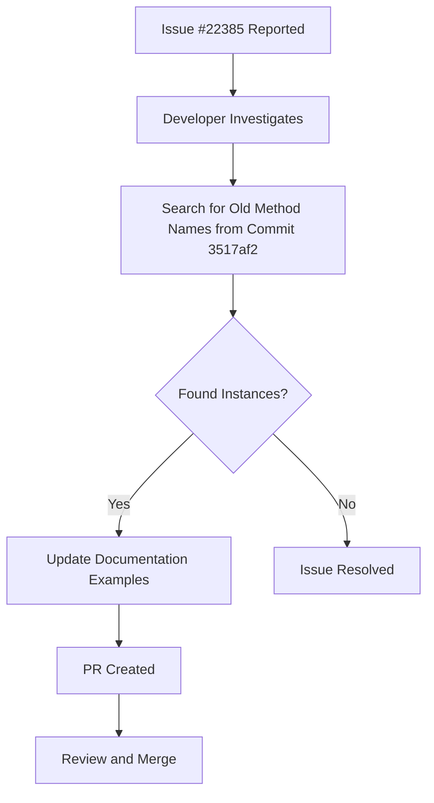

+++
title = "#22387 Update BRP method names in code examples"
date = "2026-01-05T00:00:00"
draft = false
template = "pull_request_page.html"
in_search_index = true

[taxonomies]
list_display = ["show"]

[extra]
current_language = "en"
available_languages = {"en" = { name = "English", url = "/pull_request/bevy/2026-01/pr-22387-en-20260105" }, "zh-cn" = { name = "中文", url = "/pull_request/bevy/2026-01/pr-22387-zh-cn-20260105" }}
labels = ["C-Docs", "D-Trivial", "A-Dev-Tools"]
+++

# Title

## Basic Information
- **Title**: Update BRP method names in code examples
- **PR Link**: https://github.com/bevyengine/bevy/pull/22387
- **Author**: Nilirad
- **Status**: MERGED
- **Labels**: C-Docs, D-Trivial, S-Ready-For-Final-Review, A-Dev-Tools
- **Created**: 2026-01-05T15:15:26Z
- **Merged**: 2026-01-05T23:20:00Z
- **Merged By**: alice-i-cecile

## Description Translation
Fixes #22385

I searched for all the old methods listed in commit 3517af235ab1b132b4a63e0a4ce024cfe377a123. The `bevy/query` method was still being used in two JSON example blocks, while it was updated to `world.query`. This PR fixes that. I found no instances of the other old methods being used.

## The Story of This Pull Request

This PR addresses a documentation consistency issue in the Bevy remote crate. The problem was straightforward: during a previous refactoring of JSON-RPC method names in commit 3517af235ab1b132b4a63e0a4ce024cfe377a123, the method name for query operations was changed from `bevy/query` to `world.query`. However, this change wasn't fully propagated to all documentation examples.

When the author investigated issue #22385, they performed a systematic search for all the old method names referenced in that commit. They discovered that while most instances had been updated, two JSON example blocks in the documentation still referenced the old `bevy/query` method name. This created inconsistency where the documentation didn't match the actual implementation, which could confuse developers trying to use the remote API.

The solution approach was simple and direct: locate all remaining instances of the outdated method name and update them to match the current convention. The author found exactly two occurrences in JSON-RPC example blocks within the `crates/bevy_remote/src/lib.rs` file. Both examples showed how to structure JSON-RPC requests for querying the Bevy world remotely.

From an engineering perspective, this fix maintains documentation accuracy, which is critical for API usability. When documentation examples don't match the actual API, developers waste time debugging what appears to be a correct implementation. The JSON-RPC method names serve as identifiers that must match exactly between client requests and server-side routing, so even minor discrepancies can break functionality.

The implementation involved minimal changes—just two lines modified in the entire codebase. Each change replaced the string `"bevy/query"` with `"world.query"` in JSON method fields. While trivial in scope, the fix is important because it ensures that developers copying these examples will have working code without needing to cross-reference other documentation or source code.

The technical insight here relates to API evolution and maintenance. When an API undergoes breaking changes or refactoring, it's easy to overlook documentation examples. This PR demonstrates the value of thorough consistency checking after such changes. The author's approach of searching for all method names from the original commit shows a systematic method for identifying similar issues that could be applied to other refactoring tasks.

The impact is primarily on developer experience rather than runtime behavior. By ensuring documentation examples reflect the current API, this reduces friction for developers using the remote crate and prevents potential support requests from users who might encounter errors when trying the documented examples.

## Visual Representation



## Key Files Changed

**crates/bevy_remote/src/lib.rs** (+2/-2)

This file contains documentation for the Bevy remote crate, which provides JSON-RPC functionality for interacting with Bevy applications remotely. The changes update two JSON-RPC example blocks to use the current method naming convention.

The modifications fix documentation inconsistencies by updating outdated method references:

```rust
// File: crates/bevy_remote/src/lib.rs
// Before:
{
    "jsonrpc": "2.0",
    "method": "bevy/query",
    "id": 0,
    "params": {
        "data": {
            // ... parameters
        }
    }
}

// After:
{
    "jsonrpc": "2.0",
    "method": "world.query",
    "id": 0,
    "params": {
        "data": {
            // ... parameters
        }
    }
}
```

These changes ensure that developers using the documentation examples will have working code that matches the actual API endpoints. The update affects both example blocks identically, changing only the method name field in the JSON structure.

## Further Reading

- [JSON-RPC 2.0 Specification](https://www.jsonrpc.org/specification) - For understanding the JSON-RPC protocol used by Bevy Remote
- [Bevy Remote Documentation](https://docs.rs/bevy_remote) - For details on the remote crate's API
- [API Design Guidelines](https://rust-lang.github.io/api-guidelines/) - For best practices in maintaining consistent APIs and documentation