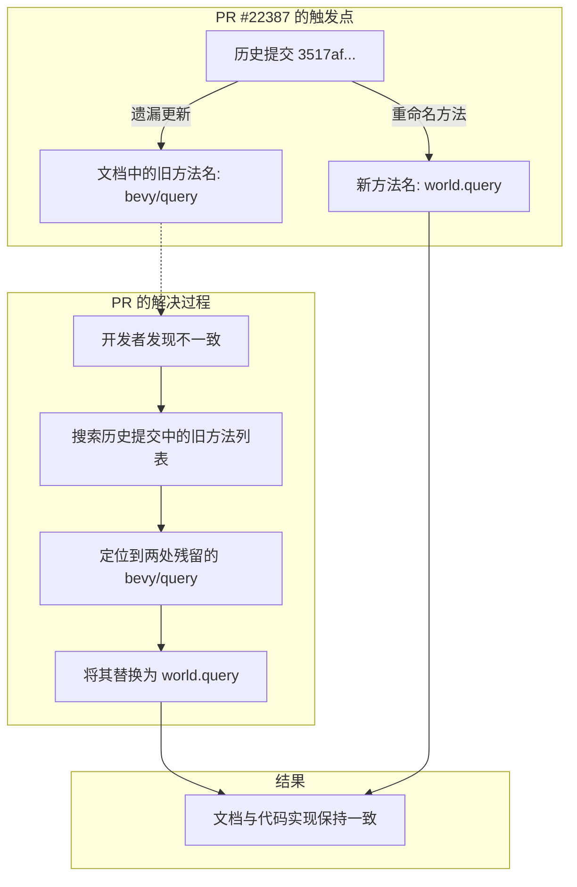

+++
title = "#22387 Update BRP method names in code examples"
date = "2026-01-05T00:00:00"
draft = false
template = "pull_request_page.html"
in_search_index = false

[extra]
current_language = "zh-cn"
available_languages = {"en" = { name = "English", url = "/pull_request/bevy/2026-01/pr-22387-en-20260105" }, "zh-cn" = { name = "中文", url = "/pull_request/bevy/2026-01/pr-22387-zh-cn-20260105" }}
labels = ["C-Docs", "D-Trivial", "A-Dev-Tools"]
+++

# Title
Update BRP method names in code examples

## Basic Information
- **Title**: Update BRP method names in code examples
- **PR Link**: https://github.com/bevyengine/bevy/pull/22387
- **Author**: Nilirad
- **Status**: MERGED
- **Labels**: C-Docs, D-Trivial, S-Ready-For-Final-Review, A-Dev-Tools
- **Created**: 2026-01-05T15:15:26Z
- **Merged**: 2026-01-05T23:20:00Z
- **Merged By**: alice-i-cecile

## Description Translation
修复 #22385

我在代码库中搜索了提交 3517af235ab1b132b4a63e0a4ce024cfe377a123 中列出的所有旧方法。`bevy/query` 方法仍然在两个JSON示例块中使用，而它应该被更新为 `world.query`。这个PR修复了这个问题。我没有发现其他旧方法还在使用的实例。

## The Story of This Pull Request

这个PR的故事始于一次代码库的清理工作。提交 3517af235ab1b132b4a63e0a4ce024cfe377a123 中对`bevy_remote`模块进行了一次重构，其中一部分工作是更新JSON-RPC（Remote Procedure Call，远程过程调用）方法名。具体来说，是将方法命名方案从`"bevy/query"`这样的格式更新为`"world.query"`。这种变更并非功能性的，而是一个命名规范（naming convention）的演进，可能是为了使API更加清晰或者与其他部分保持一致。

然而，在大型代码库中，这种重命名操作很容易出现遗漏。尤其是文档（documentation）和代码示例（code examples）中的引用，因为它们通常不会像核心代码那样被编译器或测试（tests）直接检查。这就是问题所在：之前的重命名提交漏掉了两个位于JSON代码块中的示例。

PR作者Nilirad注意到了这个问题（具体是通过issue #22385，或者可能是通过代码审查发现了不一致）。他采取的解决方法是系统性的：他直接去搜索了提交3517af235ab1b132b4a63e0a4ce024cfe377a123中列出的所有旧方法名。这是一种非常高效和可靠的问题定位方法，因为它直接追踪了引入不一致性的源头变更（source change）。通过搜索确认，只有两个JSON示例块中仍然使用了旧的`"bevy/query"`方法名，而其他旧方法名已经不存在了。这说明了之前的重构在核心代码中是完整的，但文档部分被遗漏了。

解决方案本身非常简单直接：找到那两个地方，把`"bevy/query"`改成`"world.query"`。从技术角度看，这个修改没有任何风险，它不涉及任何运行时代码逻辑，只修改了注释（comments）中的示例。但是，它的重要性在于维护了代码库的准确性（accuracy）和一致性（consistency）。不正确的文档会误导开发者，尤其是那些正在学习如何使用`bevy_remote` JSON-RPC接口的用户。

这个PR的类型标签表明它是一个文档修复（C-Docs），且改动很小（D-Trivial）。它的评审流程很快，因为改动明确且无争议。维护者alice-i-cecile在同一天就将其合并。这体现了对代码库卫生（code hygiene）和细节的关注，即使是很小的文档错误也应该被修复，以确保开发者体验（developer experience）的质量。

从这个PR中，我们可以学到两个工程实践：
1.  **系统性的问题排查**：当修复由某个历史提交引入的问题时，直接根据该提交的变更列表进行搜索，是最彻底的排查方法。
2.  **文档与代码同等重要**：代码示例是文档的一部分，它们必须与实际的API保持同步。在重构或重命名时，需要有意识地将文档更新纳入变更范围，或者建立机制（如测试）来确保文档的准确性。

## Visual Representation



## Key Files Changed

只有一个文件被修改，这也是本次PR的核心。

- `crates/bevy_remote/src/lib.rs` (+2/-2)

这个文件包含了 `bevy_remote` 模块的库代码和文档注释。PR修改了该文件中的两个JSON代码示例块，将其中使用的旧RPC方法名更新为新名称。

**变更详情：**

本次修改纯粹是字符串替换，将文档注释中JSON示例的`"method"`字段值从`"bevy/query"`更新为`"world.query"`。所有代码和注释格式均保持原样。

```rust
// File: crates/bevy_remote/src/lib.rs
// Before (第一个示例块):
//!     "jsonrpc": "2.0",
//!     "method": "bevy/query",
//!     "id": 0,

// After:
//!     "jsonrpc": "2.0",
//!     "method": "world.query",
//!     "id": 0,
```

```rust
// File: crates/bevy_remote/src/lib.rs
// Before (第二个示例块):
//!     "jsonrpc": "2.0",
//!     "method": "bevy/query",
//!     "id": 0,

// After:
//!     "jsonrpc": "2.0",
//!     "method": "world.query",
//!     "id": 0,
```

**关系说明：**
这些修改直接对应了PR描述中提到的修复。它们更新了`bevy_remote`模块的公开文档，确保了示例代码与实际API接口（interface）的一致性。这对于任何通过JSON-RPC与Bevy引擎远程交互的开发者来说，是一个重要的参考修正。

## Further Reading

1.  **Bevy Engine 官方文档**: 对于想了解Bevy引擎及其`bevy_remote`模块更多信息的开发者，可以查阅 [Bevy官方手册](https://bevyengine.org/learn/)。

2.  **JSON-RPC 2.0 规范**: `bevy_remote` 模块使用了JSON-RPC协议。关于该协议的详细规范，可以参考 [JSON-RPC 2.0 Specification](https://www.jsonrpc.org/specification)。

3.  **代码重构与命名规范**: 关于代码重构（refactoring）和保持良好命名规范的重要性，Martin Fowler的经典著作《重构：改善既有代码的设计》（*Refactoring: Improving the Design of Existing Code*）是很好的学习资源。

4.  **Git 历史搜索技巧**: 这个PR展示了如何利用Git历史记录来定位问题。Git命令如 `git log`, `git show`, 和 `git grep` 是进行此类调查的强大工具。可以参考 [Pro Git 书籍](https://git-scm.com/book/en/v2) 来深入学习。

# Full Code Diff
diff --git a/crates/bevy_remote/src/lib.rs b/crates/bevy_remote/src/lib.rs
index c30a8594900bd..91a9a81d11409 100644
--- a/crates/bevy_remote/src/lib.rs
+++ b/crates/bevy_remote/src/lib.rs
@@ -160,7 +160,7 @@
 //! ```json
 //! {
 //!     "jsonrpc": "2.0",
-//!     "method": "bevy/query",
+//!     "method": "world.query",
 //!     "id": 0,
 //!     "params": {
 //!         "data": {
@@ -182,7 +182,7 @@
 //! ```json
 //! {
 //!     "jsonrpc": "2.0",
-//!     "method": "bevy/query",
+//!     "method": "world.query",
 //!     "id": 0,
 //!     "params": {
 //!         "data": {