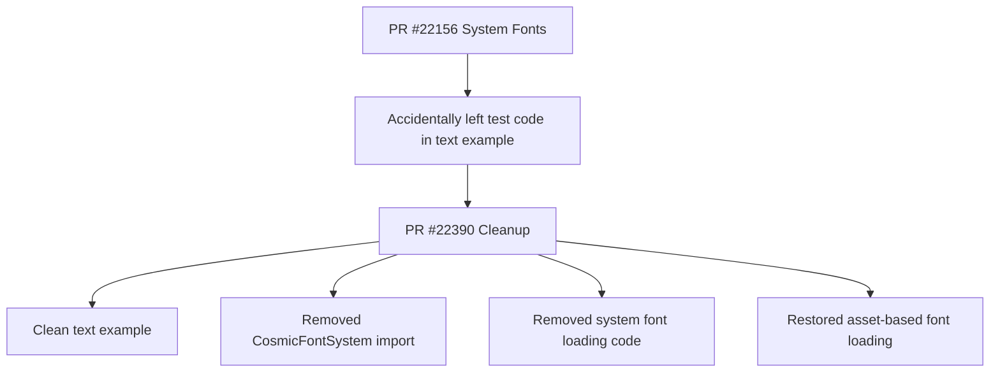

+++
title = "#22390 Remove system fonts test code from the `text` example."
date = "2026-01-05T00:00:00"
draft = false
template = "pull_request_page.html"
in_search_index = true

[taxonomies]
list_display = ["show"]

[extra]
current_language = "en"
available_languages = {"en" = { name = "English", url = "/pull_request/bevy/2026-01/pr-22390-en-20260105" }, "zh-cn" = { name = "中文", url = "/pull_request/bevy/2026-01/pr-22390-zh-cn-20260105" }}
labels = ["D-Trivial", "C-Examples", "A-Text"]
+++

# Title

## Basic Information
- **Title**: Remove system fonts test code from the `text` example.
- **PR Link**: https://github.com/bevyengine/bevy/pull/22390
- **Author**: ickshonpe
- **Status**: MERGED
- **Labels**: D-Trivial, C-Examples, S-Ready-For-Final-Review, A-Text
- **Created**: 2026-01-05T18:15:35Z
- **Merged**: 2026-01-05T23:20:00Z
- **Merged By**: alice-i-cecile

## Description Translation
# Objective

Included some naive test code for system fonts in the `text` example in #22156 by mistake.

## Solution

Revert the changes to the example.

## The Story of This Pull Request

This pull request represents a straightforward cleanup operation to remove accidental test code that was inadvertently merged into a core Bevy example. The author, ickshonpe, had previously contributed system fonts support in PR #22156, but during that work, some experimental test code remained embedded in the main text example.

The problem was that the `text.rs` example in the UI examples directory contained code that was meant for testing system font loading functionality during development. This code wasn't intended to be part of the final example, as examples in a game engine like Bevy serve as educational resources and reference implementations for users. Having test code mixed with production examples creates confusion and doesn't represent best practices for using the engine's APIs.

Looking at the changes, the implementation approach was simple and direct: revert the example file back to its original, cleaner state. The developer removed three key elements that were added for testing purposes. First, the import of `CosmicFontSystem` was removed since it was no longer needed. Second, two lines of code in the `main()` function that accessed the world to load system fonts were deleted. Third, the font specification in the example setup was changed from using the system font "Comic Sans MS" back to the standard asset-based font loading approach.

This cleanup is important because examples in a game engine serve multiple purposes. They need to demonstrate proper API usage, provide working reference code that users can copy and adapt, and maintain consistency across the codebase. The accidental inclusion of system font test code created an example that didn't follow the standard Bevy patterns for font loading, which could mislead users about the recommended way to handle fonts in their applications.

The technical insight here is about the separation between experimental development code and production examples. When working on new features like system font support, it's common to use existing examples as test beds, but it's crucial to ensure these modifications don't get committed to the main codebase. The reversion maintains the example's educational value while ensuring it demonstrates the established, stable API patterns that users should follow.

The impact of this change is minimal in terms of functionality but significant for code quality and developer experience. Users studying the text example will now see the proper way to load fonts using Bevy's asset system, rather than seeing a hybrid approach that mixes experimental system font loading with standard asset loading. This maintains consistency with other examples in the codebase and provides clearer documentation through code.

## Visual Representation



## Key Files Changed

### `examples/ui/text.rs` (+2/-6)

This is the only file modified in this PR. The changes revert accidental test code that was left in the text example from a previous system fonts implementation.

**Key Changes:**

1. **Removed unnecessary import**: The `CosmicFontSystem` import was removed since it was only used for the test code.

```rust
// Before:
use bevy::text::{CosmicFontSystem, FontFeatureTag, FontFeatures, Underline};

// After:
use bevy::text::{FontFeatureTag, FontFeatures, Underline};
```

2. **Removed system font loading code from main()**: Two lines that accessed the world to load system fonts were removed.

```rust
// Before:
    app.add_plugins((DefaultPlugins, FrameTimeDiagnosticsPlugin::default()))
        .add_systems(Startup, setup)
        .add_systems(Update, (text_update_system, text_color_system));

    let mut f = app.world_mut().resource_mut::<CosmicFontSystem>();
    f.db_mut().load_system_fonts();

    app.run();

// After:
    app.add_plugins((DefaultPlugins, FrameTimeDiagnosticsPlugin::default()))
        .add_systems(Startup, setup)
        .add_systems(Update, (text_update_system, text_color_system));
    app.run();
```

3. **Restored asset-based font loading**: Changed from using a system font name directly to loading a font asset.

```rust
// Before:
        TextFont {
            // This font is loaded and will be used instead of the default font.
            font: "Comic Sans MS".into(),
            font_size: 67.0,
            ..default()
        },

// After:
        TextFont {
            // This font is loaded and will be used instead of the default font.
            font: asset_server.load("fonts/FiraSans-Bold.ttf").into(),
            font_size: 67.0,
            ..default()
        },
```

These changes ensure the example follows Bevy's standard patterns for asset loading and provides a clean, educational reference for users learning how to work with text in the engine.

## Further Reading

- [Bevy Asset System Documentation](https://docs.rs/bevy/latest/bevy/asset/index.html)
- [Bevy Text and UI Examples](https://github.com/bevyengine/bevy/tree/main/examples/ui)
- [Original System Fonts PR #22156](https://github.com/bevyengine/bevy/pull/22156)
- [Bevy Examples as Documentation](https://bevyengine.org/learn/quick-start/getting-started/examples/)

# Full Code Diff
```
diff --git a/examples/ui/text.rs b/examples/ui/text.rs
index 87f235b5eb588..65f525994594d 100644
--- a/examples/ui/text.rs
+++ b/examples/ui/text.rs
@@ -7,7 +7,7 @@ use bevy::{
     color::palettes::css::GOLD,
     diagnostic::{DiagnosticsStore, FrameTimeDiagnosticsPlugin},
     prelude::*,
-    text::{CosmicFontSystem, FontFeatureTag, FontFeatures, Underline},
+    text::{FontFeatureTag, FontFeatures, Underline},
 };
 
 fn main() {
@@ -15,10 +15,6 @@ fn main() {
     app.add_plugins((DefaultPlugins, FrameTimeDiagnosticsPlugin::default()))
         .add_systems(Startup, setup)
         .add_systems(Update, (text_update_system, text_color_system));
-
-    let mut f = app.world_mut().resource_mut::<CosmicFontSystem>();
-    f.db_mut().load_system_fonts();
-
     app.run();
 }
 
@@ -40,7 +36,7 @@ fn setup(mut commands: Commands, asset_server: Res<AssetServer>) {
         Underline,
         TextFont {
             // This font is loaded and will be used instead of the default font.
-            font: "Comic Sans MS".into(),
+            font: asset_server.load("fonts/FiraSans-Bold.ttf").into(),
             font_size: 67.0,
             ..default()
         },
```