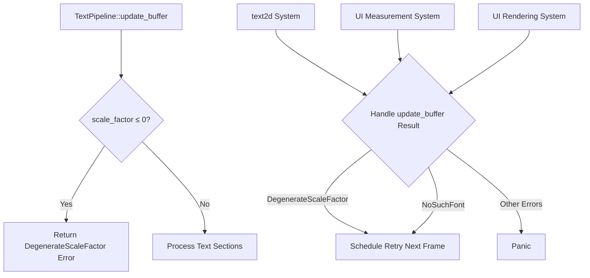

+++
title = "#22392 `TextPipeline::update_buffer` return with early error on degenerate scale factor"
date = "2026-01-07T00:00:00"
draft = false
template = "pull_request_page.html"
in_search_index = true

[taxonomies]
list_display = ["show"]

[extra]
current_language = "en"
available_languages = {"en" = { name = "English", url = "/pull_request/bevy/2026-01/pr-22392-en-20260107" }, "zh-cn" = { name = "中文", url = "/pull_request/bevy/2026-01/pr-22392-zh-cn-20260107" }}
labels = ["C-Code-Quality", "A-Text", "D-Straightforward"]
+++

# TextPipeline::update_buffer Return with Early Error on Degenerate Scale Factor

## Basic Information
- **Title**: `TextPipeline::update_buffer` return with early error on degenerate scale factor
- **PR Link**: https://github.com/bevyengine/bevy/pull/22392
- **Author**: ickshonpe
- **Status**: MERGED
- **Labels**: C-Code-Quality, S-Ready-For-Final-Review, A-Text, D-Straightforward
- **Created**: 2026-01-05T19:37:04Z
- **Merged**: 2026-01-07T06:19:09Z
- **Merged By**: alice-i-cecile

## Description Translation
`TextPipeline::update_buffer` checks per text section if the scale factor is <= 0 but if the scale factor is degenerate none of the text sections will be rendered. It would make more sense to perform the check once, at the start of the function, and return with an early error if it fails.

## Solution
Add a new variant to `TextError` called `DegenerateScaleFactor`.

At the start of the `update_buffer` function, return with an early `DegenerateScaleFactor` error if the scale factor is <= 0.

## The Story of This Pull Request

This PR addresses a straightforward but important optimization in Bevy's text rendering system. The core issue was that when text rendering encountered a degenerate scale factor (≤ 0), the error handling occurred inefficiently - checking each text section individually rather than failing early.

### The Problem and Context

In Bevy's text rendering pipeline, the `TextPipeline::update_buffer` method processes text sections to prepare them for rendering. The method takes a `scale_factor` parameter that determines how text should be scaled. When this factor is ≤ 0, text cannot be rendered meaningfully - it's either invisible or mathematically undefined.

The original implementation had two related issues:

1. **Inefficient error checking**: The scale factor validation happened inside a loop that iterated over each text section
2. **Redundant warnings**: Each text section would generate its own warning about the invalid scale factor

This approach was suboptimal because once the scale factor is invalid, no text sections can be rendered regardless of their individual properties. Continuing to process each section wasted CPU cycles and generated redundant log messages.

### The Solution Approach

The author took a practical approach: move the scale factor validation to the beginning of the function where it can fail fast. This required:

1. Adding a new error variant to clearly communicate what went wrong
2. Updating error handling in all consumers of `TextPipeline::update_buffer`
3. Removing the per-section scale factor check since it's now redundant

This is a classic "fail fast" pattern that improves both performance and code clarity. When an operation cannot succeed due to invalid input, it's better to detect this early rather than performing partial work.

### The Implementation

The implementation consisted of four main changes across the codebase:

First, a new error variant was added to the `TextError` enum to clearly indicate when scale factor issues occur:

```rust
// File: crates/bevy_text/src/error.rs
#[error("scale factor <= 0")]
/// Text cannot be rendered for a scale factor <= zero.
DegenerateScaleFactor,
```

Next, the core `update_buffer` method was modified to check the scale factor immediately and return early if invalid:

```rust
// File: crates/bevy_text/src/pipeline.rs
computed.entities.clear();
computed.needs_rerender = false;

if scale_factor <= 0.0 {
    once!(warn!(
        "Text scale factor is <= 0.0. No text will be displayed.",
    ));

    return Err(TextError::DegenerateScaleFactor);
}

// ... rest of the function

// Inside the loop, the scale factor check was removed:
if text_font.font_size <= 0.0 {
    once!(warn!(
        "Text span {entity} has a font size <= 0.0. Nothing will be displayed.",
    ));
    continue;
}
```

The key insight here is that after moving the scale factor check outside the loop, we only need to check for invalid font sizes inside the loop. This eliminates redundant condition checks.

Finally, all systems that call `update_buffer` needed to be updated to handle the new error variant. This involved three systems across different rendering contexts:

1. **2D Sprite text system** (`text2d.rs`): Handles text rendering for 2D sprites
2. **UI text measurement system** (`measure_text_system` in `text.rs`): Measures text for layout calculations
3. **UI text rendering system** (`text_system` in `text.rs`): Renders text in UI elements

Each system was updated to treat `DegenerateScaleFactor` similarly to existing transient errors like `NoSuchFont` - by scheduling retry in the next frame rather than panicking immediately.

### Technical Insights

This PR demonstrates several important software engineering principles:

1. **Fail-fast pattern**: By validating preconditions early, we avoid unnecessary computation and provide clearer error paths
2. **Error type design**: Adding a specific error variant (`DegenerateScaleFactor`) makes error handling more precise than using a generic error or boolean flag
3. **Cross-cutting changes**: The fix required updating multiple systems that depend on the text pipeline, showing how error handling needs to be consistent across an API's consumers

The use of `once!` macro for warnings is also noteworthy - it ensures the warning about degenerate scale factor appears only once per occurrence, preventing log spam while still alerting developers to the issue.

### The Impact

The changes provide three concrete improvements:

1. **Performance**: Eliminates redundant scale factor checks for each text section when the scale factor is invalid
2. **Code clarity**: The early return makes it immediately clear that a degenerate scale factor prevents any text rendering
3. **Error handling**: Provides a specific error type that callers can handle appropriately

The performance impact is most noticeable when rendering text with many sections and a degenerate scale factor. Previously, the system would iterate through all sections, generating warnings for each. Now it returns immediately after the first check.

## Visual Representation



## Key Files Changed

### `crates/bevy_text/src/error.rs` (+3/-0)
Added a new error variant to represent degenerate scale factor conditions.

```rust
// Before: No DegenerateScaleFactor variant
pub enum TextError {
    // ... existing variants
}

// After: Added new variant
pub enum TextError {
    // ... existing variants
    #[error("scale factor <= 0")]
    /// Text cannot be rendered for a scale factor <= zero.
    DegenerateScaleFactor,
}
```

### `crates/bevy_text/src/pipeline.rs` (+10/-3)
Moved scale factor check to the beginning of `update_buffer` method and removed redundant checks.

```rust
// Before: Check inside loop for each text section
if scale_factor <= 0.0 || text_font.font_size <= 0.0 {
    once!(warn!(
        "Text span {entity} has a font size <= 0.0. Nothing will be displayed.",
    ));
    continue;
}

// After: Early check at function start
if scale_factor <= 0.0 {
    once!(warn!(
        "Text scale factor is <= 0.0. No text will be displayed.",
    ));
    return Err(TextError::DegenerateScaleFactor);
}

// Then inside loop, only check font size
if text_font.font_size <= 0.0 {
    once!(warn!(
        "Text span {entity} has a font size <= 0.0. Nothing will be displayed.",
    ));
    continue;
}
```

### `crates/bevy_sprite/src/text2d.rs` (+3/-2)
Updated error handling to include the new `DegenerateScaleFactor` variant in both retry and panic paths.

```rust
// Before: Only handled NoSuchFont for retry
Err(TextError::NoSuchFont) => {
    reprocess_queue.insert(entity);
}

// After: Also handles DegenerateScaleFactor
Err(TextError::NoSuchFont | TextError::DegenerateScaleFactor) => {
    reprocess_queue.insert(entity);
}

// Before: Pattern match for panic
| TextError::InconsistentAtlasState),

// After: Added DegenerateScaleFactor to panic pattern
| TextError::InconsistentAtlasState
| TextError::DegenerateScaleFactor),
```

### `crates/bevy_ui/src/widget/text.rs` (+2/-2)
Updated both UI text systems to handle the new error variant similarly to `NoSuchFont`.

```rust
// Before: Specific error handling
Err(TextError::NoSuchFont) => {
    // Try again next frame
    text_flags.needs_measure_fn = true;
}

// After: Expanded pattern matching
Err(TextError::NoSuchFont | TextError::DegenerateScaleFactor) => {
    // Try again next frame
    text_flags.needs_measure_fn = true;
}
```

## Further Reading

1. **Fail-fast Principle**: Martin Fowler's article on "Fail Fast" pattern for understanding why early validation improves system robustness
2. **Rust Error Handling**: The Rust Book chapter on error handling for best practices in designing error types
3. **Bevy Text Rendering**: Bevy's official documentation on text rendering to understand the broader context of these changes
4. **Pattern Matching in Rust**: Rust by Example section on pattern matching for understanding the `|` operator in match arms
5. **Early Returns**: Clean Code principles about using early returns to reduce nesting and improve code readability