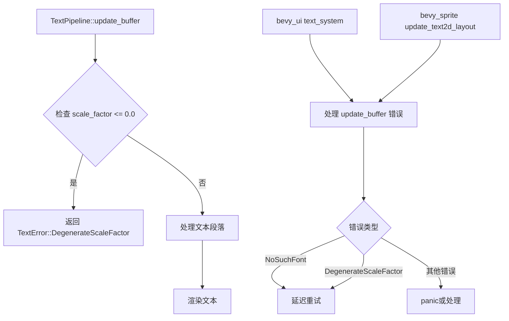

+++
title = "#22392 TextPipeline::update_buffer` return with early error on degenerate scale factor"
date = "2026-01-07T00:00:00"
draft = false
template = "pull_request_page.html"
in_search_index = false

[extra]
current_language = "zh-cn"
available_languages = {"en" = { name = "English", url = "/pull_request/bevy/2026-01/pr-22392-en-20260107" }, "zh-cn" = { name = "中文", url = "/pull_request/bevy/2026-01/pr-22392-zh-cn-20260107" }}
+++

# Title

## 基本信息
- **标题**: `TextPipeline::update_buffer` return with early error on degenerate scale factor
- **PR链接**: https://github.com/bevyengine/bevy/pull/22392
- **作者**: ickshonpe
- **状态**: 已合并
- **标签**: C-代码质量, S-准备最终评审, A-文本, D-简单直接
- **创建时间**: 2026-01-05T19:37:04Z
- **合并时间**: 2026-01-07T06:19:09Z
- **合并者**: alice-i-cecile

## 描述翻译
### 目标
`TextPipeline::update_buffer` 函数原本会为每个文本段落检查缩放因子是否小于等于0，但如果缩放因子是退化的（degenerate），那么所有文本段落都不会被渲染。更合理的做法是在函数开始时就进行一次检查，如果失败则提前返回错误。

### 解决方案
在 `TextError` 枚举中添加一个名为 `DegenerateScaleFactor` 的新变体。

在 `update_buffer` 函数开始时，如果缩放因子小于等于0，则提前返回 `DegenerateScaleFactor` 错误。

## 这个PR的故事

这个PR解决的问题是Bevy引擎中文本渲染管道的优化。在原始实现中，`TextPipeline::update_buffer` 函数在遍历每个文本段落时，都会检查当前缩放因子是否小于等于0。这种重复检查在逻辑上不够高效，因为如果整个渲染操作的缩放因子本身就是无效的（小于等于0），那么每个文本段落实际上都不会被渲染，完全不需要进入后续的处理流程。

从工程角度看，这属于一种代码优化：将重复的逻辑判断提前到函数开始处，避免不必要的循环迭代。这种优化不仅减少了CPU开销，更重要的是使代码逻辑更加清晰——缩放因子作为整个文本渲染操作的基本参数，其有效性应该在整个渲染开始前就被验证。

开发者的解决方案很直接：首先在 `TextError` 枚举中添加了一个新的错误变体 `DegenerateScaleFactor`，专门用来表示缩放因子无效的错误状态。然后在 `update_buffer` 函数的最开始处添加了检查逻辑：

```rust
if scale_factor <= 0.0 {
    once!(warn!(
        "Text scale factor is <= 0.0. No text will be displayed.",
    ));

    return Err(TextError::DegenerateScaleFactor);
}
```

值得注意的是，这个修改还包括了一个日志警告，这有助于开发者调试时发现问题。同时，原始代码中在每个文本段落循环内的缩放因子检查被移除了，因为现在的早期返回已经确保了缩放因子总是有效的。

这种修改模式在软件工程中是典型的"早期失败"（fail fast）原则的应用。与其让无效的状态在整个系统中传播并可能导致更复杂的错误，不如在最早可能的时候检测并报告问题。这不仅简化了错误处理逻辑，也使得系统的行为更加可预测。

修改还涉及到几个其他文件，这是因为错误处理需要在整个文本渲染管道中保持一致。在 `bevy_sprite` 和 `bevy_ui` 模块中，相关的错误处理代码需要更新以识别新的 `DegenerateScaleFactor` 错误变体。这种修改确保了错误处理逻辑在整个系统中的一致性——所有使用文本渲染的组件都能正确响应缩放因子无效的情况。

从架构角度看，这个PR展示了Bevy引擎如何通过清晰的错误枚举和集中的错误处理来管理渲染管道的异常状态。新的错误变体被设计为与现有的错误类型保持一致性，这使得错误处理逻辑可以轻松地扩展到新的错误情况。

这个修改的影响是积极的：代码更简洁、更高效，错误处理更一致。对于开发者来说，调试文本渲染问题时，如果遇到缩放因子无效的情况，会立即收到清晰的警告信息，而不是需要追踪为什么文本没有渲染但也没有明显的错误信息。

## 视觉表示



## 关键文件变更

### 1. `crates/bevy_text/src/error.rs`
**变更说明**: 添加了新的错误变体 `DegenerateScaleFactor`，用于表示缩放因子无效的错误情况。

**代码片段**:
```rust
// 添加的新代码
#[error("scale factor <= 0")]
/// Text cannot be rendered for a scale factor <= zero.
DegenerateScaleFactor,
```

### 2. `crates/bevy_text/src/pipeline.rs`
**变更说明**: 在 `update_buffer` 函数开始时添加了缩放因子检查，如果无效则提前返回错误。同时移除了循环内重复的检查。

**代码片段**:
```rust
// 关键变更：在函数开始时添加检查
if scale_factor <= 0.0 {
    once!(warn!(
        "Text scale factor is <= 0.0. No text will be displayed.",
    ));

    return Err(TextError::DegenerateScaleFactor);
}

// ... 后续代码

// 移除了原有的检查（原来在第155行左右）
// if scale_factor <= 0.0 || text_font.font_size <= 0.0 {
// 修改为：
if text_font.font_size <= 0.0 {
    // 只检查字体大小
}
```

### 3. `crates/bevy_sprite/src/text2d.rs`
**变更说明**: 更新错误处理逻辑，添加对 `DegenerateScaleFactor` 错误变体的处理，使其与其他可恢复错误（如 `NoSuchFont`）有相同的处理方式。

**代码片段**:
```rust
// 第253行：添加对新错误变体的模式匹配
Err(TextError::NoSuchFont | TextError::DegenerateScaleFactor) => {
    // 延迟重试
    reprocess_queue.insert(entity);
}

// 第294行：在panic处理的匹配中也添加新变体
| TextError::DegenerateScaleFactor),
```

### 4. `crates/bevy_ui/src/widget/text.rs`
**变更说明**: 类似地，更新UI文本系统的错误处理，添加对 `DegenerateScaleFactor` 的支持。

**代码片段**:
```rust
// 第298行和第364行：在两个不同的错误处理点都添加了新变体
Err(TextError::NoSuchFont | TextError::DegenerateScaleFactor) => {
    // 设置标志以便下一帧重试
    text_flags.needs_measure_fn = true;
}
```

## 扩展阅读

1. **Bevy文本渲染文档**: [Bevy Text Rendering](https://bevyengine.org/learn/books/getting-started/rendering/text/)
2. **Rust错误处理最佳实践**: [Rust Error Handling](https://doc.rust-lang.org/book/ch09-00-error-handling.html)
3. **早期失败（Fail Fast）原则**: [Fail Fast Principle](https://en.wikipedia.org/wiki/Fail-fast)
4. **Bevy ECS系统与组件**: [Bevy ECS](https://bevyengine.org/learn/books/getting-started/ecs/)