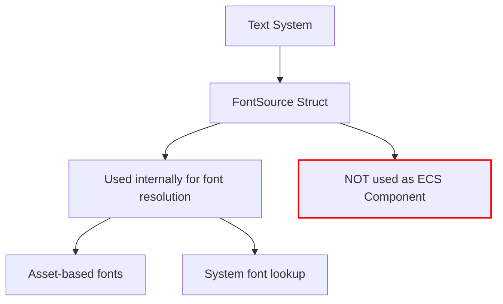

+++
title = "#22397 Remove the `Component` derive from `FontSource`."
date = "2026-01-05T00:00:00"
draft = false
template = "pull_request_page.html"
in_search_index = true

[taxonomies]
list_display = ["show"]

[extra]
current_language = "en"
available_languages = {"en" = { name = "English", url = "/pull_request/bevy/2026-01/pr-22397-en-20260105" }, "zh-cn" = { name = "中文", url = "/pull_request/bevy/2026-01/pr-22397-zh-cn-20260105" }}
labels = ["C-Bug", "D-Trivial", "A-Text"]
+++

# Title

## Basic Information
- **Title**: Remove the `Component` derive from `FontSource`.
- **PR Link**: https://github.com/bevyengine/bevy/pull/22397
- **Author**: ickshonpe
- **Status**: MERGED
- **Labels**: C-Bug, D-Trivial, S-Ready-For-Final-Review, A-Text
- **Created**: 2026-01-05T21:51:28Z
- **Merged**: 2026-01-05T23:05:36Z
- **Merged By**: alice-i-cecile

## Description Translation

# Objective

`FontSource` is not a `Component`, the derive is misleading.

## Solution

Remove the `Component` derive from `FontSource`.

## The Story of This Pull Request

This pull request addresses a straightforward but important issue in Bevy's text system. The problem was that the `FontSource` struct in the text module had an incorrect `Component` derive macro attached to it. This was misleading because `FontSource` is not actually used as a component in Bevy's Entity Component System (ECS).

The issue represents a form of technical debt that can cause confusion for developers working with the codebase. When a struct is marked as a `Component`, developers reasonably expect it to be usable in ECS queries, to be attachable to entities, and to follow the patterns established for other components in the system. However, `FontSource` doesn't serve this purpose - it's a data structure used internally within the text system to specify how fonts are sourced, either by referencing a font asset or by family name for system font lookup.

Looking at the code context, `FontSource` appears in text-related structures but isn't registered or used as a component in Bevy's ECS. The derive macro being present created a false signal about the type's intended usage. This kind of discrepancy, while small, can lead to wasted time for developers who might try to use it as a component, only to find it doesn't work as expected.

The solution was minimal and surgical: simply removing `Component` from the derive attributes list. This correction aligns the code's representation with its actual usage. The other derives - `Clone`, `Debug`, `Reflect`, and `PartialEq` - remain appropriate for the type's actual role in the system.

From an engineering perspective, this change improves code clarity and reduces cognitive overhead. Developers reading the `FontSource` definition now see an accurate representation of what the type is and how it should be used. This aligns with good software engineering practices where code should communicate intent clearly and avoid misleading signals.

The PR also demonstrates the value of small, focused improvements in maintaining a codebase. While this change doesn't affect runtime behavior or add features, it reduces technical debt and improves developer experience. These kinds of maintenance tasks are important for keeping a codebase clean and understandable over time.

## Visual Representation



## Key Files Changed

**crates/bevy_text/src/text.rs** (+1/-1)
This file contains the definition of the `FontSource` struct and related text system functionality. The change removes the misleading `Component` derive attribute.

```rust
// File: crates/bevy_text/src/text.rs
// Before:
#[derive(Component, Clone, Debug, Reflect, PartialEq)]
/// Specifies how the font face for a text span is sourced.
///
/// A `FontSource` can either reference a font asset or identify a font by family name to be
/// sourced from the operating system.
pub enum FontSource {
    /// References a font asset (handled via `Assets<Font>`).
    Asset(Handle<Font>),
    /// Identifies a font by family name to be sourced from the operating system.
    System(String),
}

// After:
#[derive(Clone, Debug, Reflect, PartialEq)]
/// Specifies how the font face for a text span is sourced.
///
/// A `FontSource` can either reference a font asset or identify a font by family name to be
/// sourced from the operating system.
pub enum FontSource {
    /// References a font asset (handled via `Assets<Font>`).
    Asset(Handle<Font>),
    /// Identifies a font by family name to be sourced from the operating system.
    System(String),
}
```

The change removes `Component` from the derive macro, correcting the inaccurate representation that `FontSource` is meant to be used as an ECS component. The struct's purpose and functionality remain unchanged - it's still used to specify font sources within the text system, but now its definition accurately reflects that it's not a component type.

## Further Reading

1. **Bevy ECS Components Documentation**: Understanding how components work in Bevy's Entity Component System
2. **Rust Derive Macros**: Documentation on how derive macros work in Rust and what each common derive (Clone, Debug, etc.) provides
3. **Bevy Text System**: Documentation on Bevy's text rendering system and how fonts are managed
4. **Technical Debt in Software Engineering**: Resources on identifying and addressing technical debt in codebases
5. **Code Clarity Principles**: Best practices for writing code that clearly communicates intent and reduces cognitive load for developers