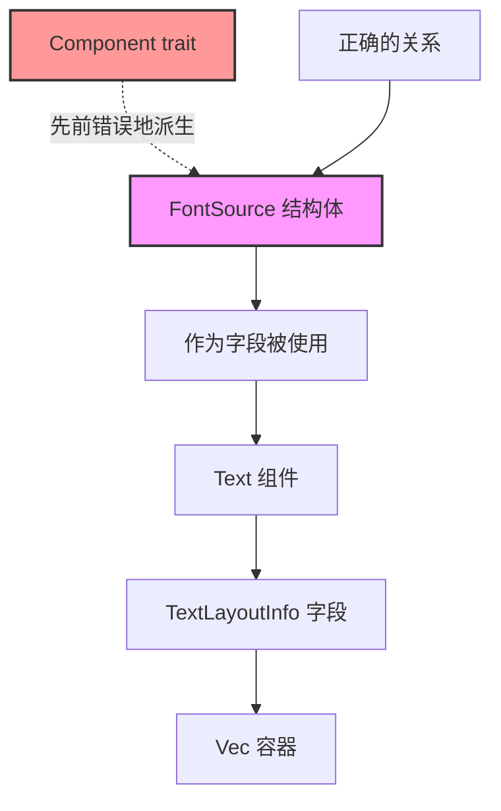

+++
title = "#22397 Remove the `Component` derive from `FontSource`."
date = "2026-01-05T00:00:00"
draft = false
template = "pull_request_page.html"
in_search_index = false

[extra]
current_language = "zh-cn"
available_languages = {"en" = { name = "English", url = "/pull_request/bevy/2026-01/pr-22397-en-20260105" }, "zh-cn" = { name = "中文", url = "/pull_request/bevy/2026-01/pr-22397-zh-cn-20260105" }}
+++

# 移除 `FontSource` 的 `Component` 派生

## 基本信息
- **标题**: Remove the `Component` derive from `FontSource`.
- **PR链接**: https://github.com/bevyengine/bevy/pull/22397
- **作者**: ickshonpe
- **状态**: 已合并
- **标签**: C-Bug, D-Trivial, S-Ready-For-Final-Review, A-Text
- **创建时间**: 2026-01-05T21:51:28Z
- **合并时间**: 2026-01-05T23:05:36Z
- **合并者**: alice-i-cecile

## 描述翻译

### 目标

`FontSource` 不是一个 `Component`，当前的派生注解具有误导性。

### 解决方案

从 `FontSource` 中移除 `Component` 派生。

## 这个Pull Request的故事

这是一个关于代码整洁性和API设计一致性的简单修复。在Bevy引擎中，`Component` 是一个核心的ECS（Entity Component System，实体组件系统）特性标记。任何被标记为 `Component` 的类型都可以作为独立的组件附加到实体上。然而，`FontSource` 类型的实际用途与这一设计意图不符。

`FontSource` 结构体定义在文本模块中，用于指定文本跨度（text span）的字体来源。它有两个变体：要么引用字体资源（`Font` 类型），要么通过字体族名称来标识系统中安装的字体。但关键问题在于，`FontSource` 并不是设计为可以直接附加到实体上的独立组件。

查看代码结构可以发现，`FontSource` 实际上是作为 `Text` 组件内部结构的一部分被使用。具体来说，`Text` 组件包含一个 `TextLayoutInfo` 字段，而该字段中又包含 `Vec<FontSource>`。这意味着 `FontSource` 是作为 `Text` 组件内部数据的组成部分存在的，而不是一个独立的ECS组件。

保留 `Component` 派生会产生几个问题。首先，它会误导其他开发者，让他们认为可以合法地将 `FontSource` 作为独立组件使用。其次，它可能导致不必要的运行时开销，因为Bevy的ECS系统会为每个 `Component` 类型维护额外的元数据。最重要的是，这种不一致性破坏了API的清晰性和可预测性。

修复方案很简单：直接从 `FontSource` 的派生属性列表中移除 `Component`。这不会影响现有功能，因为 `FontSource` 从未被设计或用作独立组件。但这一改动显著提高了代码的清晰度，移除了潜在的误导信息，并确保了类型系统与实际使用模式保持一致。

从更广泛的角度看，这类修复体现了良好的代码维护实践。它关注的是代码库的长期健康和可维护性，而不仅仅是修复明显的功能错误。通过确保每个类型都准确地反映其设计意图，开发者可以减少认知负荷，避免未来的误用，并保持代码库的整洁。

## 视觉表示



## 关键文件更改

### `crates/bevy_text/src/text.rs` (+1/-1)

**变化说明**：
此文件中 `FontSource` 结构体的派生属性被修改，移除了 `Component` trait 的派生。这个改动修复了类型系统与实际使用模式之间的不一致性。

**代码片段**：
```rust
// 文件：crates/bevy_text/src/text.rs
// 修改前：
#[derive(Component, Clone, Debug, Reflect, PartialEq)]
/// Specifies how the font face for a text span is sourced.
///
/// A `FontSource` can either reference a font asset or identify a font by family name to be
/// sourced from the system fonts installed on the user's device.
pub enum FontSource {
    // 变体定义...
}

// 修改后：
#[derive(Clone, Debug, Reflect, PartialEq)]
/// Specifies how the font face for a text span is sourced.
///
/// A `FontSource` can either reference a font asset or identify a font by family name to be
/// sourced from the system fonts installed on the user's device.
pub enum FontSource {
    // 变体定义保持不变...
}
```

**与PR目标的关系**：
这个文件是此PR唯一修改的文件。移除 `Component` 派生直接解决了PR描述中指出的问题：消除了 `FontSource` 类型上具有误导性的 `Component` 标记，使其派生属性与实际用途保持一致。

## 延伸阅读

1. **Bevy ECS组件系统**：
   - [Bevy官方文档：组件](https://bevyengine.org/learn/book/ecs/components/)
   - 了解Bevy中`Component` trait的作用和正确使用方式

2. **Rust派生属性**：
   - [Rust参考：派生属性](https://doc.rust-lang.org/reference/attributes/derive.html)
   - 理解`#[derive(...)]`属性如何自动为类型实现特定trait

3. **API设计原则**：
   - [Rust API设计指南](https://rust-lang.github.io/api-guidelines/)
   - 学习如何设计清晰、一致且不易误用的API

4. **Bevy文本渲染系统**：
   - [Bevy文本模块源代码](https://github.com/bevyengine/bevy/tree/main/crates/bevy_text)
   - 深入了解Bevy中文本渲染的实现细节

# 完整代码差异
```diff
diff --git a/crates/bevy_text/src/text.rs b/crates/bevy_text/src/text.rs
index 0ec97b0a00d79..12d4bbf143dec 100644
--- a/crates/bevy_text/src/text.rs
+++ b/crates/bevy_text/src/text.rs
@@ -246,7 +246,7 @@ impl From<Justify> for cosmic_text::Align {
     }
 }
 
-#[derive(Component, Clone, Debug, Reflect, PartialEq)]
+#[derive(Clone, Debug, Reflect, PartialEq)]
 /// Specifies how the font face for a text span is sourced.
 ///
 /// A `FontSource` can either reference a font asset or identify a font by family name to be
```